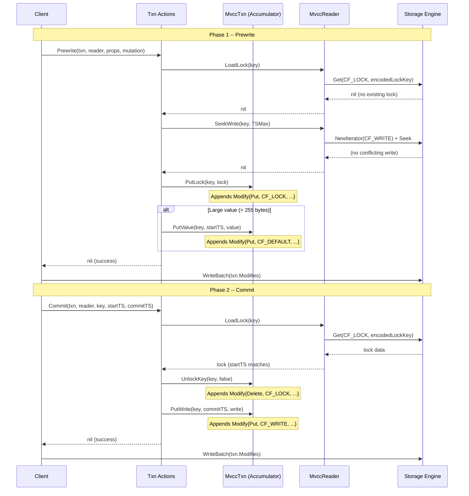
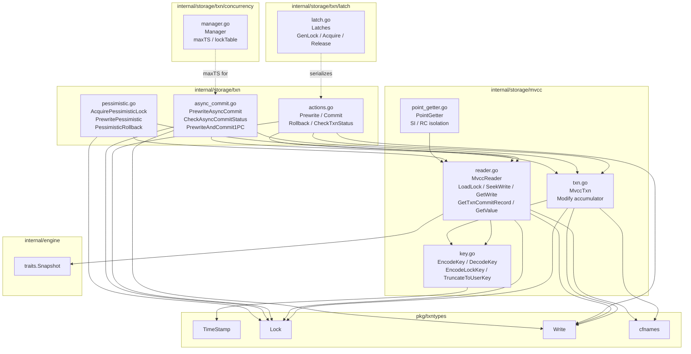
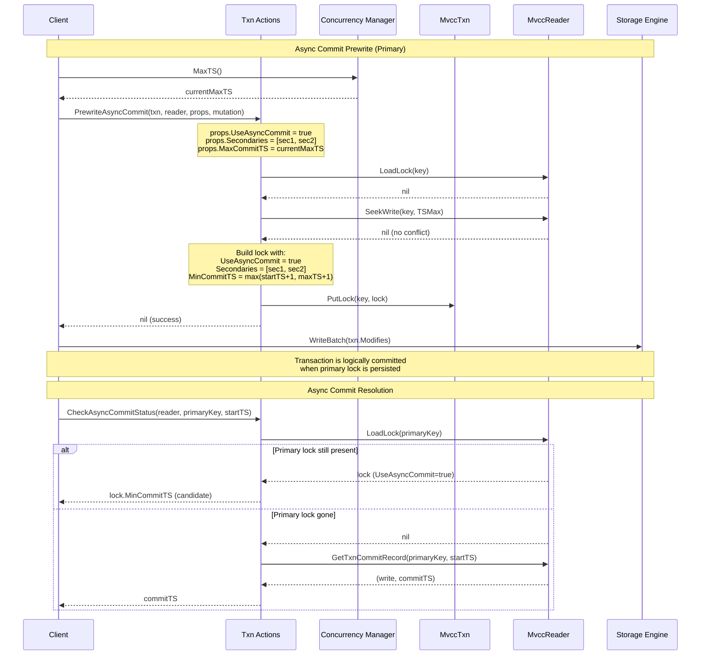

# Transaction Processing Layer

## 1. Overview

The gookvs transaction layer implements Percolator-style two-phase commit (2PC) with multi-version concurrency control (MVCC). The design stores multiple versions of each key across three column families -- CF_DEFAULT (large values), CF_LOCK (active transaction locks), and CF_WRITE (commit/rollback metadata) -- and uses timestamp-based visibility to provide snapshot isolation and read-committed isolation levels.

The layer is organized into the following components:

- **MVCC Key Encoding** (`internal/storage/mvcc/key.go`): Encodes user keys with descending timestamps so that newer versions sort first in the storage engine.
- **MvccTxn** (`internal/storage/mvcc/txn.go`): A write-only accumulator that collects all column-family modifications during a single transaction action and flushes them as one atomic batch.
- **MvccReader** (`internal/storage/mvcc/reader.go`): Provides MVCC-aware reads across all column families, backed by a storage engine snapshot.
- **PointGetter** (`internal/storage/mvcc/point_getter.go`): An optimized single-key reader supporting SI and RC isolation levels.
- **2PC Actions** (`internal/storage/txn/actions.go`): Prewrite, Commit, Rollback, and CheckTxnStatus -- the four core Percolator protocol operations.
- **Async Commit and 1PC** (`internal/storage/txn/async_commit.go`): Optimizations that reduce latency for eligible transactions.
- **Pessimistic Locking** (`internal/storage/txn/pessimistic.go`): Lock-before-write support for interactive transactions.
- **Latches** (`internal/storage/txn/latch/latch.go`): Hash-based slot array providing deadlock-free command serialization.
- **Concurrency Manager** (`internal/storage/txn/concurrency/manager.go`): Tracks max_ts (atomically) and an in-memory lock table (sync.Map) for async commit correctness.

There is no Scanner implementation yet; `internal/storage/mvcc/` contains only PointGetter for single-key reads.

### Column Families

Defined in `pkg/cfnames/cfnames.go`:

| Constant    | Value       | Purpose                                |
|-------------|-------------|----------------------------------------|
| `CFDefault` | `"default"` | Large values (> 255 bytes)             |
| `CFLock`    | `"lock"`    | Active transaction locks               |
| `CFWrite`   | `"write"`   | Commit / rollback metadata             |
| `CFRaft`    | `"raft"`    | Raft state (not used by txn layer)     |

### Timestamp Model

Defined in `pkg/txntypes/timestamp.go`. `TimeStamp` is a `uint64` hybrid logical clock value from PD's TSO. The upper 46 bits hold a physical millisecond component; the lower 18 bits (`TSLogicalBits = 18`) hold a logical sequence number. Key constants: `TSMax = math.MaxUint64`, `TSZero = 0`. Helper methods: `Physical()`, `Logical()`, `Prev()`, `Next()`, `IsZero()`, and `ComposeTS(physical, logical)`.

---

## 2. MVCC Key Encoding

**File:** `internal/storage/mvcc/key.go`

### EncodeKey / DecodeKey

`EncodeKey(userKey, ts)` produces the encoded key used in CF_WRITE and CF_DEFAULT:

```
[codec.EncodeBytes(userKey)] [codec.EncodeUint64Desc(ts)]
```

The timestamp is encoded in **descending** order (`EncodeUint64Desc`) so that newer versions sort before older versions in the storage engine's lexicographic ordering. This means a simple forward seek finds the newest version first.

`DecodeKey(encodedKey)` reverses the process, returning the user key and the timestamp. If the encoded key has fewer than 8 bytes after the user-key portion, the timestamp is returned as 0 (this is the case for CF_LOCK keys).

### EncodeLockKey / DecodeLockKey

Lock keys in CF_LOCK carry **no timestamp**:

```go
func EncodeLockKey(key Key) []byte {
    return codec.EncodeBytes(nil, key)
}
```

`DecodeLockKey` simply calls `codec.DecodeBytes` to extract the user key.

### TruncateToUserKey

Strips the last 8 bytes (the timestamp suffix) from an encoded MVCC key, returning only the encoded user-key portion. Used by `MvccReader.SeekWrite` to verify that a found key belongs to the expected user key.

### SeekBound

```go
const SeekBound = 32
```

When `GetWrite` encounters more than `SeekBound` consecutive non-data-changing write versions (Lock or Rollback records), it switches to the `LastChange` optimization -- jumping directly to the timestamp of the last known data-changing version instead of scanning one-by-one.

---

## 3. MvccTxn (Write Accumulator)

**File:** `internal/storage/mvcc/txn.go`

`MvccTxn` is a pure accumulator: it collects modifications during a single transaction action (prewrite, commit, rollback) and does not perform any reads. All collected modifications are later flushed to the storage engine as one atomic batch write.

### Struct

```go
type MvccTxn struct {
    StartTS   txntypes.TimeStamp
    Modifies  []Modify
    WriteSize int
}
```

### Modify

```go
type Modify struct {
    Type  ModifyType   // ModifyTypePut or ModifyTypeDelete
    CF    string       // Column family name
    Key   []byte       // Encoded key
    Value []byte       // Value (nil for deletes)
}
```

### ReleasedLock

Returned by `UnlockKey` to carry information about the released lock for lock-manager wake-up notifications:

```go
type ReleasedLock struct {
    Key           Key
    StartTS       txntypes.TimeStamp
    IsPessimistic bool
}
```

### Methods

| Method | Description |
|--------|-------------|
| `PutLock(key, lock)` | Marshals the lock and appends a Put to CF_LOCK with `EncodeLockKey(key)`. |
| `UnlockKey(key, isPessimistic)` | Appends a Delete to CF_LOCK. Returns a `*ReleasedLock`. |
| `PutValue(key, startTS, value)` | Appends a Put to CF_DEFAULT with `EncodeKey(key, startTS)`. Used for large values (> `ShortValueMaxLen`). |
| `DeleteValue(key, startTS)` | Appends a Delete to CF_DEFAULT. Used during rollback to clean up written values. |
| `PutWrite(key, commitTS, write)` | Marshals the write record and appends a Put to CF_WRITE with `EncodeKey(key, commitTS)`. |
| `DeleteWrite(key, commitTS)` | Appends a Delete to CF_WRITE. |
| `ModifyCount()` | Returns `len(Modifies)`. |

All methods update `WriteSize` to track the approximate byte cost of the accumulated batch.

---

## 4. MvccReader

**File:** `internal/storage/mvcc/reader.go`

`MvccReader` wraps a `traits.Snapshot` (a read-only point-in-time view of the storage engine) and provides MVCC-aware read operations.

### Struct

```go
type MvccReader struct {
    snapshot traits.Snapshot
}
```

### LoadLock

```go
func (r *MvccReader) LoadLock(key Key) (*txntypes.Lock, error)
```

Reads the lock for `key` from CF_LOCK. Returns `(nil, nil)` if no lock exists (distinguishes "not found" via `traits.ErrNotFound`). Calls `txntypes.UnmarshalLock` to deserialize the binary lock data.

### SeekWrite

```go
func (r *MvccReader) SeekWrite(key Key, ts TimeStamp) (*txntypes.Write, TimeStamp, error)
```

Finds the first write record for `key` with `commitTS <= ts`. Creates an iterator on CF_WRITE, seeks to `EncodeKey(key, ts)`, and checks that the found key's encoded user-key prefix matches. Returns `(nil, 0, nil)` if no matching write exists.

### GetWrite

```go
func (r *MvccReader) GetWrite(key Key, ts TimeStamp) (*txntypes.Write, TimeStamp, error)
```

Finds the latest **data-changing** write (Put or Delete) visible at `ts`. Internally calls `SeekWrite` in a loop, skipping Lock and Rollback records. Two skip strategies:

1. **LastChange optimization**: If `write.LastChange.EstimatedVersions >= SeekBound` and the LastChange timestamp is non-zero, jump directly to `write.LastChange.TS`.
2. **Sequential scan**: Otherwise, seek to `commitTS.Prev()` and continue.

The loop is bounded to `SeekBound * 2` iterations as a safety limit.

When a `WriteTypeDelete` is found, returns `(nil, 0, nil)` -- the key is considered deleted at that version.

### GetTxnCommitRecord

```go
func (r *MvccReader) GetTxnCommitRecord(key Key, startTS TimeStamp) (*txntypes.Write, TimeStamp, error)
```

Scans CF_WRITE from `TSMax` downward to find the write record whose `StartTS` matches the given `startTS`. Stops scanning when `commitTS < startTS` (the record cannot exist below that point). Used by Rollback and CheckTxnStatus to determine whether a transaction has already been committed or rolled back.

### GetValue

```go
func (r *MvccReader) GetValue(key Key, startTS TimeStamp) ([]byte, error)
```

Point-reads from CF_DEFAULT using `EncodeKey(key, startTS)`. Returns `(nil, nil)` on `ErrNotFound`.

### Close

Releases the underlying snapshot.

---

## 5. PointGetter

**File:** `internal/storage/mvcc/point_getter.go`

`PointGetter` performs optimized single-key MVCC reads, supporting two isolation levels.

### Isolation Levels

```go
const (
    IsolationLevelSI IsolationLevel = iota   // Snapshot Isolation (default)
    IsolationLevelRC                          // Read Committed
)
```

### Struct

```go
type PointGetter struct {
    reader         *MvccReader
    ts             txntypes.TimeStamp
    isolationLevel IsolationLevel
    bypassLocks    map[txntypes.TimeStamp]bool
}
```

`bypassLocks` allows specific lock timestamps to be skipped (e.g., the transaction's own locks).

### Get Algorithm

`Get(key)` proceeds in three steps:

1. **Lock check (SI only):** Calls `reader.LoadLock(key)`. If a lock exists with `StartTS <= ts` and is not in `bypassLocks`, returns `ErrKeyIsLocked`. Under RC isolation, this step is skipped entirely.

2. **Find visible write:** Calls `reader.GetWrite(key, ts)` to find the latest data-changing write (Put) visible at `ts`. If no write is found (or it was a Delete), returns `(nil, nil)`.

3. **Value retrieval:** If the write record contains a `ShortValue` (inlined, <= 255 bytes), returns it directly. Otherwise, calls `reader.GetValue(key, write.StartTS)` to fetch the large value from CF_DEFAULT.

---

## 6. Scanner

No Scanner implementation exists yet. The `internal/storage/mvcc/` package contains only `PointGetter` for single-key reads. There is no `scanner.go` or equivalent file. Range scans are not yet supported at the MVCC layer.

---

## 7. 2PC Actions

**File:** `internal/storage/txn/actions.go`

This file implements the four core Percolator protocol operations as stateless functions that operate on an `MvccTxn` (write accumulator) and `MvccReader` (snapshot reader).

### Error Types

```go
var (
    ErrWriteConflict    = errors.New("txn: write conflict")
    ErrKeyIsLocked      = errors.New("txn: key is locked")
    ErrTxnLockNotFound  = errors.New("txn: lock not found")
    ErrAlreadyCommitted = errors.New("txn: already committed")
)
```

### Supporting Types

```go
type PrewriteProps struct {
    StartTS   txntypes.TimeStamp
    Primary   []byte
    LockTTL   uint64
    IsPrimary bool
}

type Mutation struct {
    Op    MutationOp    // MutationOpPut, MutationOpDelete, MutationOpLock
    Key   mvcc.Key
    Value []byte
}
```

### Prewrite

```go
func Prewrite(txn *MvccTxn, reader *MvccReader, props PrewriteProps, mutation Mutation) error
```

Phase 1 of 2PC for a single key:

1. **Lock check:** Load existing lock. If a lock exists with the same `StartTS`, treat as idempotent (return nil). If a lock exists with a different `StartTS`, return `ErrKeyIsLocked`.
2. **Write conflict check:** `SeekWrite(key, TSMax)` to find the newest write. If `commitTS > StartTS` and the write is a data-changing type (not Rollback/Lock), return `ErrWriteConflict`.
3. **Write lock:** Create a `Lock` with the appropriate `LockType` (derived from `MutationOp`). If the value is <= `ShortValueMaxLen` (255 bytes), inline it in the lock's `ShortValue` field. Call `txn.PutLock(key, lock)`.
4. **Write value:** If the mutation is a Put with a large value, call `txn.PutValue(key, startTS, value)` to store in CF_DEFAULT.

### Commit

```go
func Commit(txn *MvccTxn, reader *MvccReader, key Key, startTS, commitTS TimeStamp) error
```

Phase 2 of 2PC for a single key:

1. **Load and validate lock:** The lock must exist and have the matching `StartTS`. Otherwise return `ErrTxnLockNotFound`.
2. **MinCommitTS constraint:** `commitTS` must be >= `lock.MinCommitTS`.
3. **Pessimistic lock handling:** If the lock is `LockTypePessimistic`, simply unlock the key (the pessimistic lock was never prewrote) and return.
4. **Remove lock:** `txn.UnlockKey(key, false)`.
5. **Write commit record:** Convert lock type to write type, create a `Write` record carrying the `StartTS` and any `ShortValue`, and call `txn.PutWrite(key, commitTS, write)`.

### Rollback

```go
func Rollback(txn *MvccTxn, reader *MvccReader, key Key, startTS TimeStamp) error
```

1. **Check if committed:** `GetTxnCommitRecord(key, startTS)`. If a non-rollback write record exists, return `ErrAlreadyCommitted`. If a rollback record exists, return nil (idempotent).
2. **Remove lock:** If a lock exists with the matching `StartTS`, remove it. If the lock had a large value in CF_DEFAULT (no ShortValue and LockTypePut), delete it with `txn.DeleteValue(key, startTS)`.
3. **Write rollback record:** `PutWrite(key, startTS, rollbackWrite)` with `WriteTypeRollback`. Note: the rollback record's commit timestamp equals the start timestamp.

### CheckTxnStatus

```go
func CheckTxnStatus(reader *MvccReader, primaryKey Key, startTS TimeStamp) (*TxnStatus, error)
```

Returns a `TxnStatus` struct:

```go
type TxnStatus struct {
    IsLocked     bool
    Lock         *txntypes.Lock
    CommitTS     txntypes.TimeStamp
    IsRolledBack bool
}
```

1. **Check lock:** If a lock exists with the matching `StartTS`, return `{IsLocked: true, Lock: lock}`.
2. **Check write record:** `GetTxnCommitRecord(primaryKey, startTS)`. If it is a Rollback, return `{IsRolledBack: true}`. Otherwise return `{CommitTS: commitTS}`.
3. **Not found:** Return an empty `TxnStatus` (lock expired or transaction never existed).

### Helper Functions

- `mutationOpToLockType(op)`: Maps `MutationOpPut -> LockTypePut`, `MutationOpDelete -> LockTypeDelete`, `MutationOpLock -> LockTypeLock`.
- `lockTypeToWriteType(lt)`: Maps `LockTypePut -> WriteTypePut`, `LockTypeDelete -> WriteTypeDelete`, `LockTypeLock -> WriteTypeLock`.

---

## 8. Async Commit and 1PC

**File:** `internal/storage/txn/async_commit.go`

### Async Commit

Async commit reduces commit latency by making the transaction logically committed as soon as the primary key's lock is persisted. The primary lock stores all secondary keys; readers can determine commit status by inspecting the primary lock.

#### AsyncCommitPrewriteProps

```go
type AsyncCommitPrewriteProps struct {
    PrewriteProps
    UseAsyncCommit bool
    Secondaries    [][]byte
    MaxCommitTS    txntypes.TimeStamp
}
```

#### PrewriteAsyncCommit

```go
func PrewriteAsyncCommit(txn, reader, props, mutation) error
```

Follows the same conflict-check logic as regular `Prewrite`, then adds async-commit-specific fields to the lock:

- `lock.UseAsyncCommit = true`
- `lock.Secondaries = props.Secondaries` (only on the primary key)
- `lock.MinCommitTS = max(startTS + 1, MaxCommitTS + 1)` -- ensures the commit timestamp respects the concurrency manager's observed max_ts for linearizability.

#### CheckAsyncCommitStatus

```go
func CheckAsyncCommitStatus(reader, primaryKey, startTS) (TimeStamp, error)
```

1. If the primary lock is still present with `UseAsyncCommit = true`, returns `lock.MinCommitTS` as the candidate commit timestamp (transaction still in progress).
2. If the primary lock is gone, checks the commit record via `GetTxnCommitRecord`. Returns the `commitTS` if committed, or 0 if rolled back / not found.

### 1PC Optimization

For small, single-region transactions, 1PC skips CF_LOCK entirely and writes commit records directly to CF_WRITE in one batch.

#### OnePCProps

```go
type OnePCProps struct {
    StartTS  txntypes.TimeStamp
    CommitTS txntypes.TimeStamp
    Primary  []byte
    LockTTL  uint64
}
```

#### PrewriteAndCommit1PC

```go
func PrewriteAndCommit1PC(txn, reader, props, mutations) []error
```

Two-pass algorithm:

1. **Conflict check pass:** For every mutation, check for existing locks and write conflicts (same logic as Prewrite). If any error is found, return all errors without writing anything.
2. **Write pass:** For each mutation, build a `Write` record directly (no lock). Short values are inlined; large values go to CF_DEFAULT. Calls `txn.PutWrite(key, commitTS, write)`.

#### Eligibility Checks

```go
func Is1PCEligible(mutations []Mutation, maxSize int) bool
```

- Mutation count must be <= `maxSize` (default 64).
- Total key+value size must be < 256 KB.
- Empty mutation sets are ineligible.

```go
func IsAsyncCommitEligible(mutations []Mutation, maxKeys int) bool
```

- Mutation count must be <= `maxKeys` (default 256).
- Empty mutation sets are ineligible.

---

## 9. Pessimistic Locking

**File:** `internal/storage/txn/pessimistic.go`

Pessimistic locking allows clients to acquire locks before prewrite, preventing write conflicts during interactive transactions. The flow is: `AcquirePessimisticLock` -> `PrewritePessimistic` (upgrade) -> `Commit`.

Key semantics:
- Pessimistic locks use `LockTypePessimistic` (`'S'`).
- Pessimistic locks are invisible to readers (readers skip them).
- Write conflicts are checked against `ForUpdateTS` (not `StartTS`).
- Pessimistic rollback removes only pessimistic locks; no rollback record is written.

### AcquirePessimisticLock

```go
func AcquirePessimisticLock(txn, reader, props PessimisticLockProps, key) error
```

1. **Lock check:** If our own pessimistic lock exists, update `ForUpdateTS` if the new value is larger (idempotent). If our own normal lock exists, return nil. If another transaction's lock exists, return `ErrKeyIsLocked`.
2. **Write conflict check:** `SeekWrite(key, TSMax)`. Conflicts are tested against `ForUpdateTS` (not `StartTS`): if `commitTS > ForUpdateTS` and the write is data-changing, return `ErrWriteConflict`.
3. **Write lock:** Create a `Lock` with `LockTypePessimistic`, `ForUpdateTS`, and the usual primary/TTL fields. No value is written.

### PrewritePessimistic

```go
func PrewritePessimistic(txn, reader, props PessimisticPrewriteProps, mutation) error
```

Upgrades a pessimistic lock to a normal lock during the prewrite phase:

1. If a lock exists with matching `StartTS` and `LockTypePessimistic`, remove the old pessimistic lock (`UnlockKey` with `isPessimistic=true`) and write a new normal lock.
2. If a lock exists with matching `StartTS` but is already a normal lock, return nil (idempotent).
3. If `props.IsPessimistic` is true but no lock is found, return `ErrTxnLockNotFound` (lock expired and was cleaned up).
4. If not pessimistic and no lock exists, perform a standard write-conflict check before writing the lock.

### PessimisticRollback

```go
func PessimisticRollback(txn, reader, keys, startTS, forUpdateTS) []error
```

Removes pessimistic locks only (no rollback record). For each key:
- Skip if no lock, wrong `StartTS`, or not `LockTypePessimistic`.
- Skip if `forUpdateTS != 0` and `lock.ForUpdateTS != forUpdateTS`.
- Call `txn.UnlockKey(key, true)`.

---

## 10. Latches

**File:** `internal/storage/txn/latch/latch.go`

The latch subsystem provides deadlock-free key serialization. Commands that touch overlapping keys are serialized through latches to prevent concurrent modification.

### Latches Struct

```go
type Latches struct {
    slots []latchSlot
    size  int          // Always a power of 2
}
```

The slot count is rounded up to the nearest power of 2. Each slot contains:

```go
type latchSlot struct {
    mu        sync.Mutex
    owner     uint64       // Command ID (0 = free)
    waitQueue []uint64     // Waiting command IDs
    wakeCh    chan uint64   // Buffered channel (cap 64) for signaling
}
```

### Lock Struct

```go
type Lock struct {
    RequiredHashes []uint64   // Sorted, deduplicated slot indices
    OwnedCount     int        // Number of latches acquired so far
}
```

### GenLock

```go
func (l *Latches) GenLock(keys [][]byte) *Lock
```

1. Hash each key with FNV-1a (`hash/fnv.New64a()`).
2. Map each hash to a slot index via `h & (size - 1)`.
3. Deduplicate slot indices (using a `map[uint64]bool`).
4. Sort the indices in ascending order.

Sorted acquisition is the deadlock-prevention mechanism: all commands acquire latches in the same global order, so circular waits cannot form.

### Acquire

```go
func (l *Latches) Acquire(lock *Lock, commandID uint64) bool
```

Iterates from `lock.OwnedCount` through `RequiredHashes`. For each slot:
- If the slot is free (`owner == 0`) or already owned by this command, take ownership and increment `OwnedCount`.
- If owned by another command, append `commandID` to the slot's `waitQueue` and return `false`.

Returns `true` only if all required latches are acquired.

### Release

```go
func (l *Latches) Release(lock *Lock, commandID uint64) []uint64
```

Releases all owned latches. For each slot owned by this command:
- Set `owner = 0`.
- If the wait queue is non-empty, dequeue the first waiter and add it to the returned wake-up list.

Resets `OwnedCount` to 0.

---

## 11. Concurrency Manager

**File:** `internal/storage/txn/concurrency/manager.go`

The concurrency manager provides two services: max_ts tracking (for async commit correctness) and an in-memory lock table (for quick lock lookups without hitting the storage engine).

### Manager Struct

```go
type Manager struct {
    maxTS     atomic.Uint64
    lockTable sync.Map       // key (string) -> *LockHandle
}
```

### Max Timestamp Tracking

- `UpdateMaxTS(ts)`: Atomically updates `maxTS` using a CAS loop. Only updates if `ts > current`. This ensures that async commit's `MinCommitTS` correctly accounts for all observed read timestamps.
- `MaxTS()`: Returns the current maximum observed timestamp.

### In-Memory Lock Table

- `LockKey(key, startTS)`: Stores a `LockHandle{Key, StartTS}` in the lock table. Returns a `KeyHandleGuard` whose `Release()` method deletes the entry.
- `IsKeyLocked(key)`: Checks if a key has an in-memory lock. Returns `(*LockHandle, bool)`.
- `GlobalMinLock()`: Iterates all entries via `lockTable.Range` and returns a pointer to the minimum `StartTS` across all locks. Returns `nil` if no locks exist. This is O(n).
- `LockCount()`: Returns the number of entries (O(n), intended for testing only).

### KeyHandleGuard

```go
type KeyHandleGuard struct {
    mgr *Manager
    key string
}
func (g *KeyHandleGuard) Release() { g.mgr.lockTable.Delete(g.key) }
```

RAII-style guard: the caller must call `Release()` when the lock is removed from the storage engine.

---

## 12. Diagrams

### 2PC Flow (Prewrite -> Commit)



### MVCC / Txn Layer Component Dependencies



### Async Commit Flow


