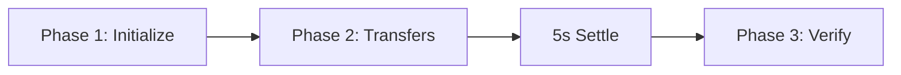
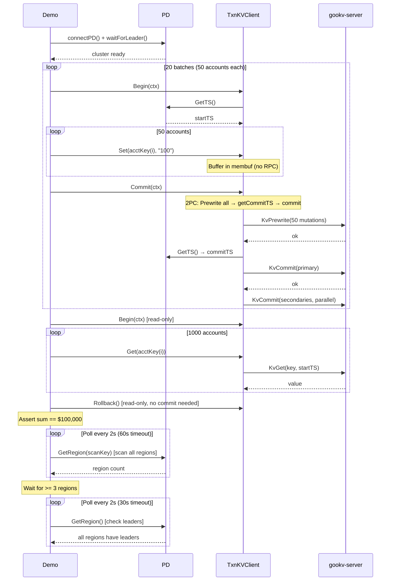
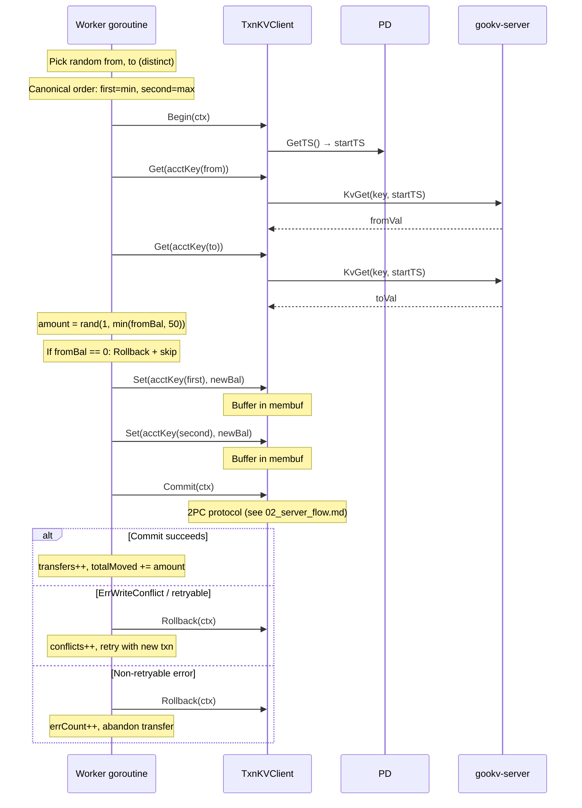
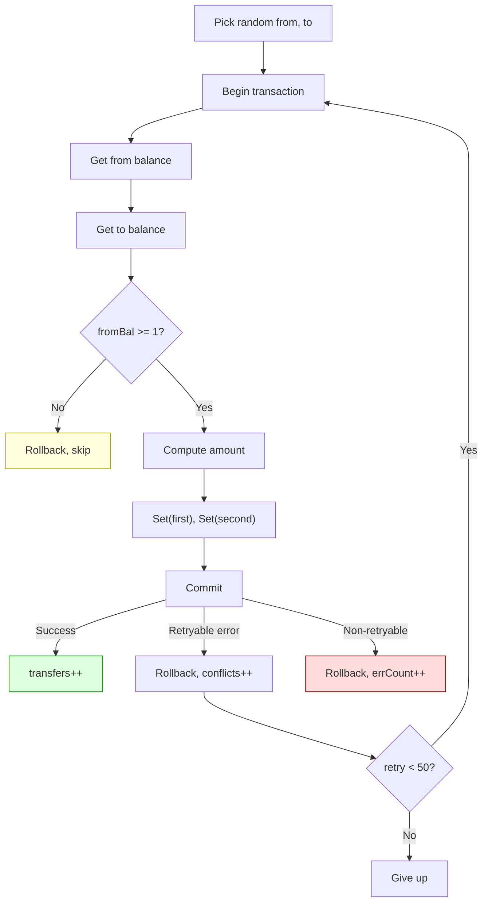
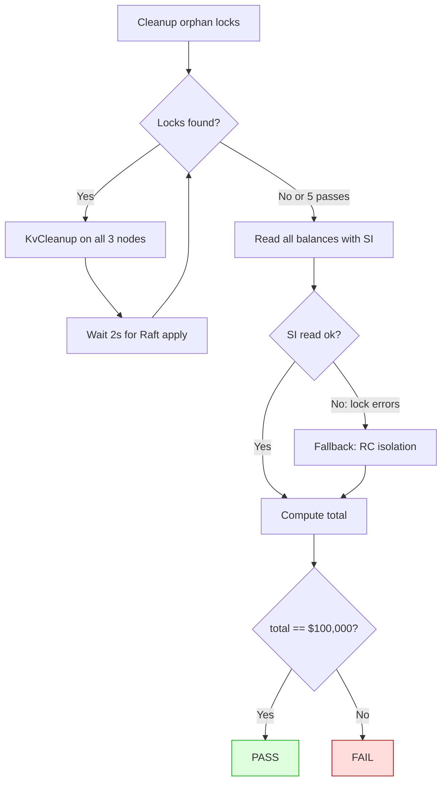
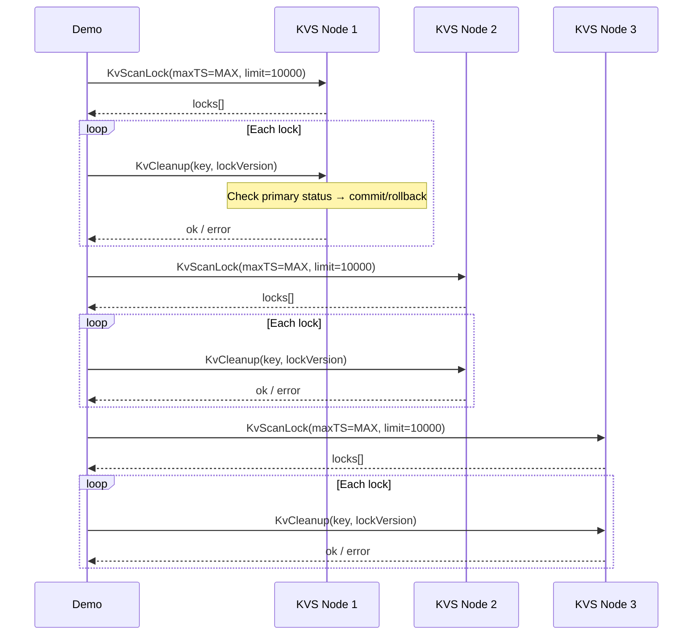
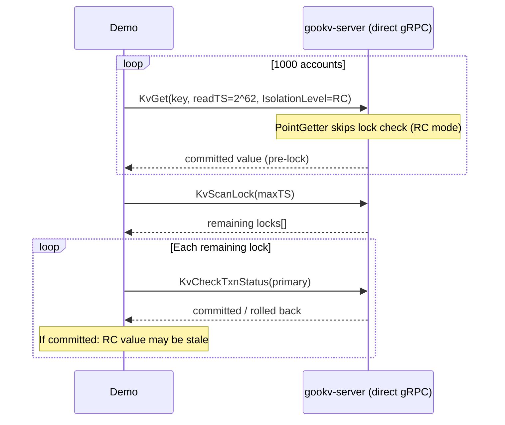

# Client-Side Transaction Flow

## Overview

The transaction integrity demo (`scripts/txn-integrity-demo-verify/main.go`) runs three phases against a 3-node gookv cluster with 1 PD server:

## Constants

| Constant | Value | Purpose |
|----------|-------|---------|
| `numAccounts` | 1000 | Bank accounts to create |
| `initialBalance` | 100 | Starting balance per account ($100) |
| `expectedTotal` | 100,000 | Invariant: sum of all balances |
| `numWorkers` | 32 | Concurrent transfer goroutines |
| `duration` | 30s | Phase 2 runtime |
| `transferMax` | 50 | Max transfer amount |
| `initBatchSize` | 50 | Accounts per seeding transaction |
| `maxTxnRetries` | 50 | Retries per transfer attempt |

Key format: `acct:0000` through `acct:0999` (4-digit zero-padded).
Value format: decimal string (e.g., `"100"`, `"73"`).

---

## Phase 1: Initialize 1000 Accounts

---

## Phase 2: Concurrent Random Transfers

### Transfer Retry Logic

### Retryable Errors

| Type | Source | Retried? |
|------|--------|----------|
| `ErrWriteConflict` | Prewrite found newer committed write | Yes |
| `ErrDeadlock` | Pessimistic lock deadlock | Yes |
| `ErrTxnLockNotFound` | Lock disappeared during commit | Yes |
| "key locked" | Prewrite found another txn's lock | Yes |
| "max retries" | SendToRegion exhausted retries | Yes |
| "region error" | Not leader, epoch mismatch | Yes |
| Other errors | gRPC failures, internal errors | No |

---

## Phase 3: Verify Conservation

### Cleanup Flow (per pass)

### RC Fallback Read

When SI reads fail due to unresolvable locks, the demo falls back to RC (Read Committed) isolation which skips lock checks entirely:

**Problem with RC fallback**: RC reads the last *committed* write record, which does not include values from prewrite locks whose transactions were committed (primary committed but secondary lock not yet resolved). This causes balance discrepancies.
