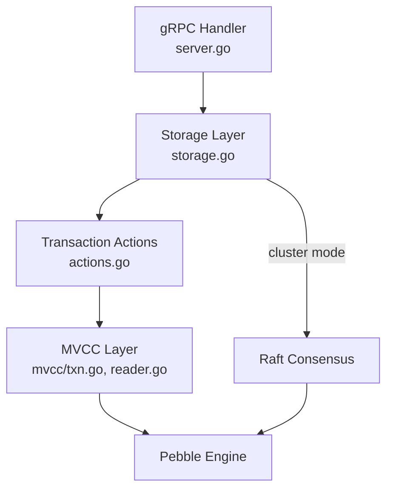
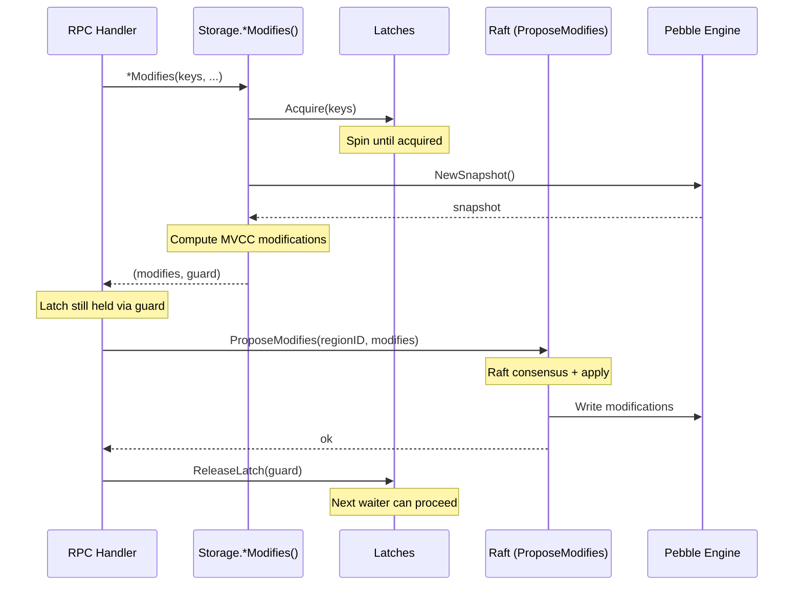
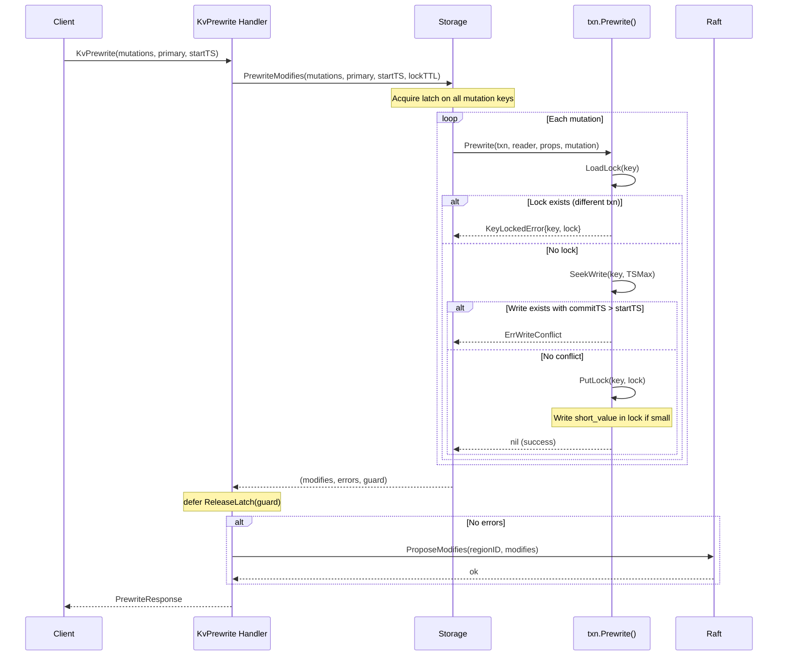
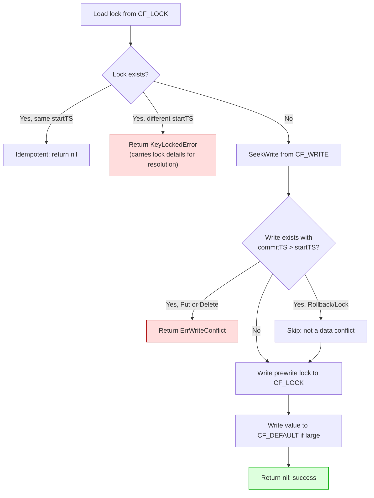
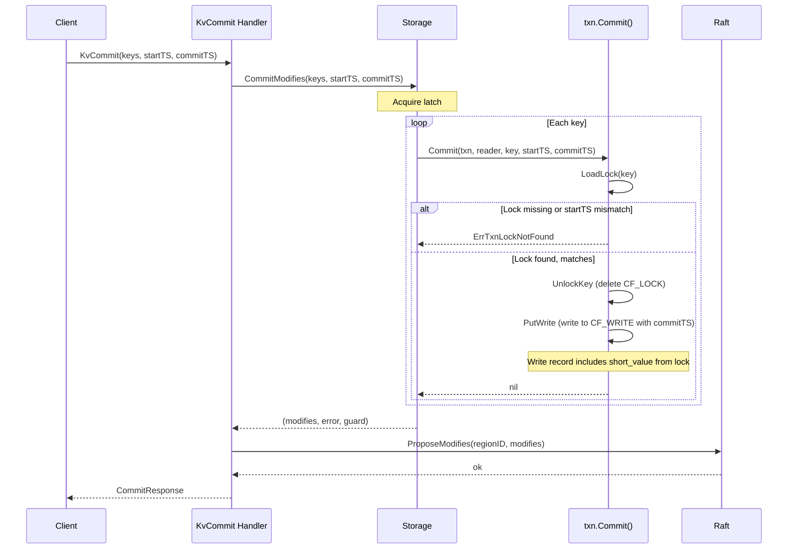
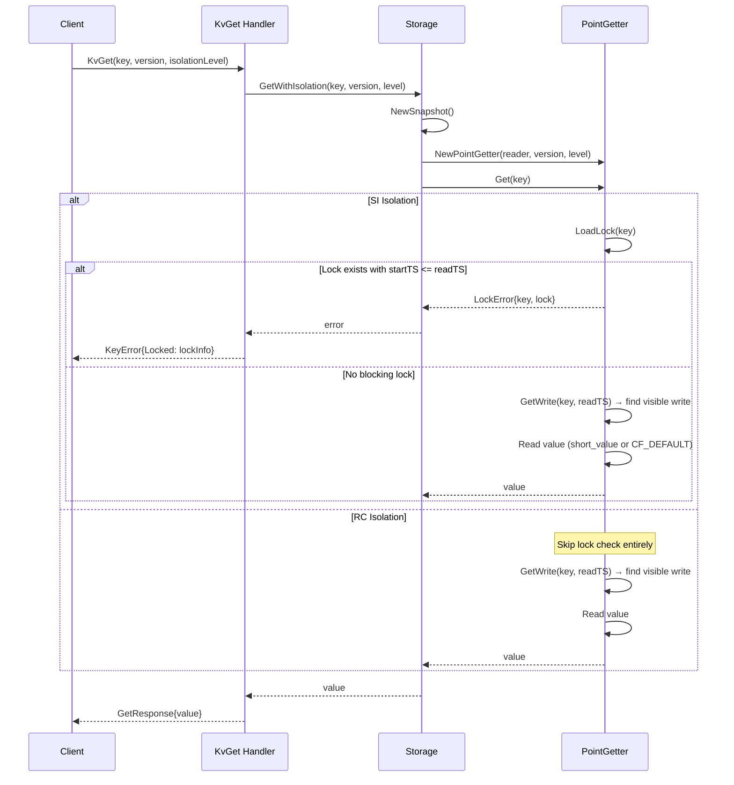
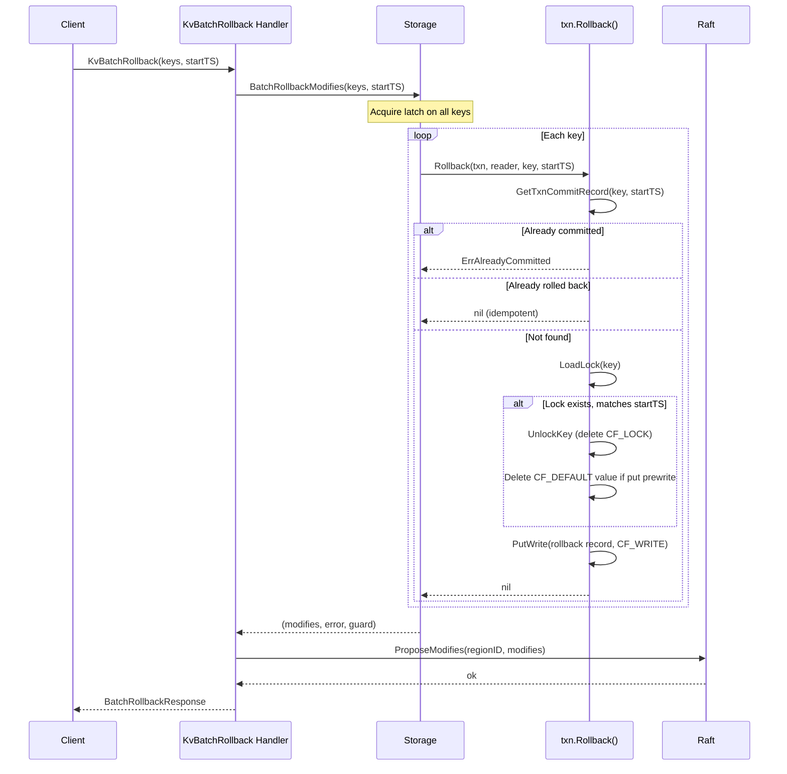
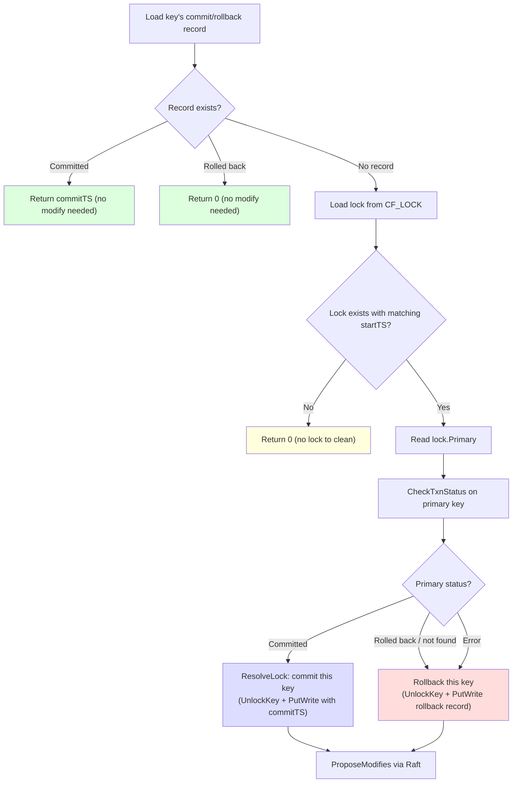
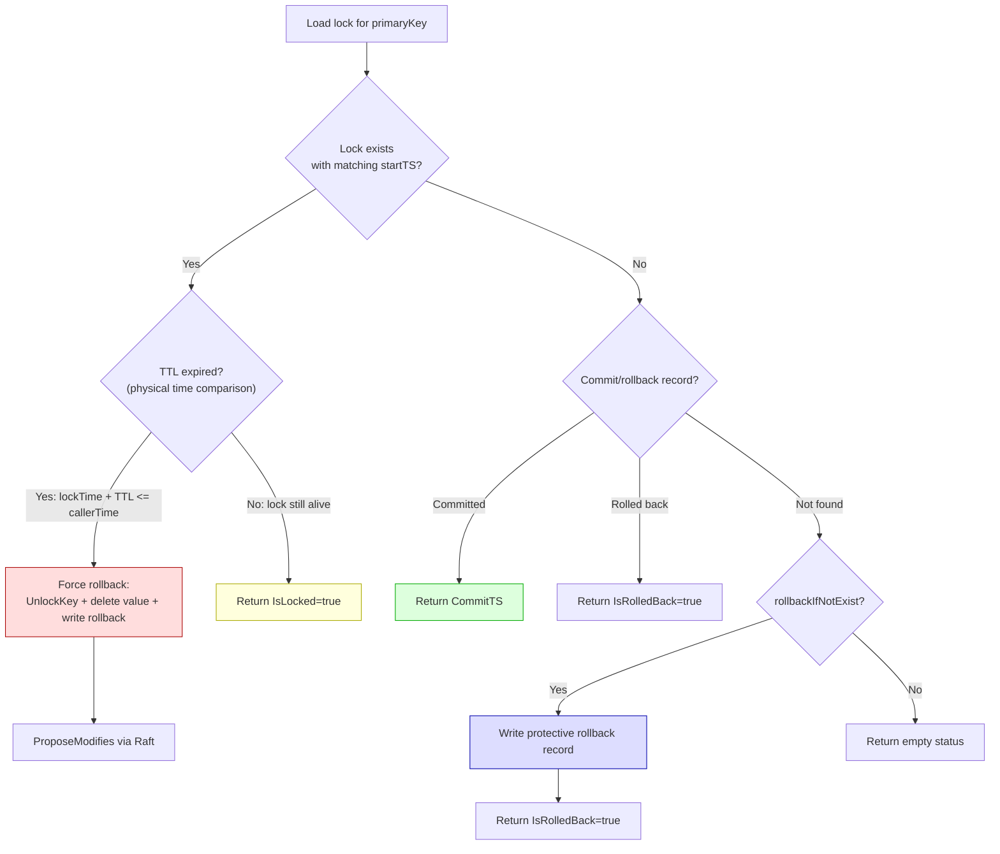
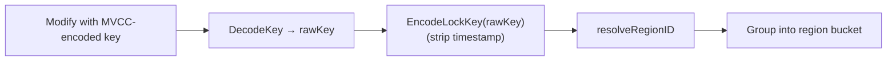

# Server-Side Transaction Processing

## Overview

Each client RPC goes through three layers on the server:



## LatchGuard Pattern

All write operations in cluster mode use the LatchGuard pattern to prevent the latch-Raft race condition:



**Key invariant**: The latch is held from snapshot creation through Raft apply completion. This ensures a concurrent transaction on the same keys will see the applied modifications in its snapshot.

---

## KvPrewrite (2PC Phase 1)



### Prewrite Conflict Detection



---

## KvCommit (2PC Phase 2)



---

## KvGet (Transactional Read)



---

## KvBatchRollback



---

## KvCleanup

Single-key lock cleanup that checks the **primary key's status** to determine commit vs rollback:



---

## KvCheckTxnStatus (with Cleanup)



---

## Region Routing

### resolveRegionID

When `req.GetContext().GetRegionId()` is 0 (no region context from client), the server resolves the region by encoding the raw user key:

```go
func resolveRegionID(key []byte) uint64 {
    encodedKey := mvcc.EncodeLockKey(key)  // codec.EncodeBytes(nil, key)
    return coord.ResolveRegionForKey(encodedKey)
}
```

### ResolveRegionForKey

Iterates all local peers, compares key against each region's `[startKey, endKey)` boundaries, and selects the narrowest match (largest startKey).

### groupModifiesByRegion

Used by `proposeModifiesToRegionsWithRegionError` for multi-region operations:



This ensures CF_LOCK keys (no timestamp) and CF_WRITE keys (with timestamp) for the same user key route to the same region.
