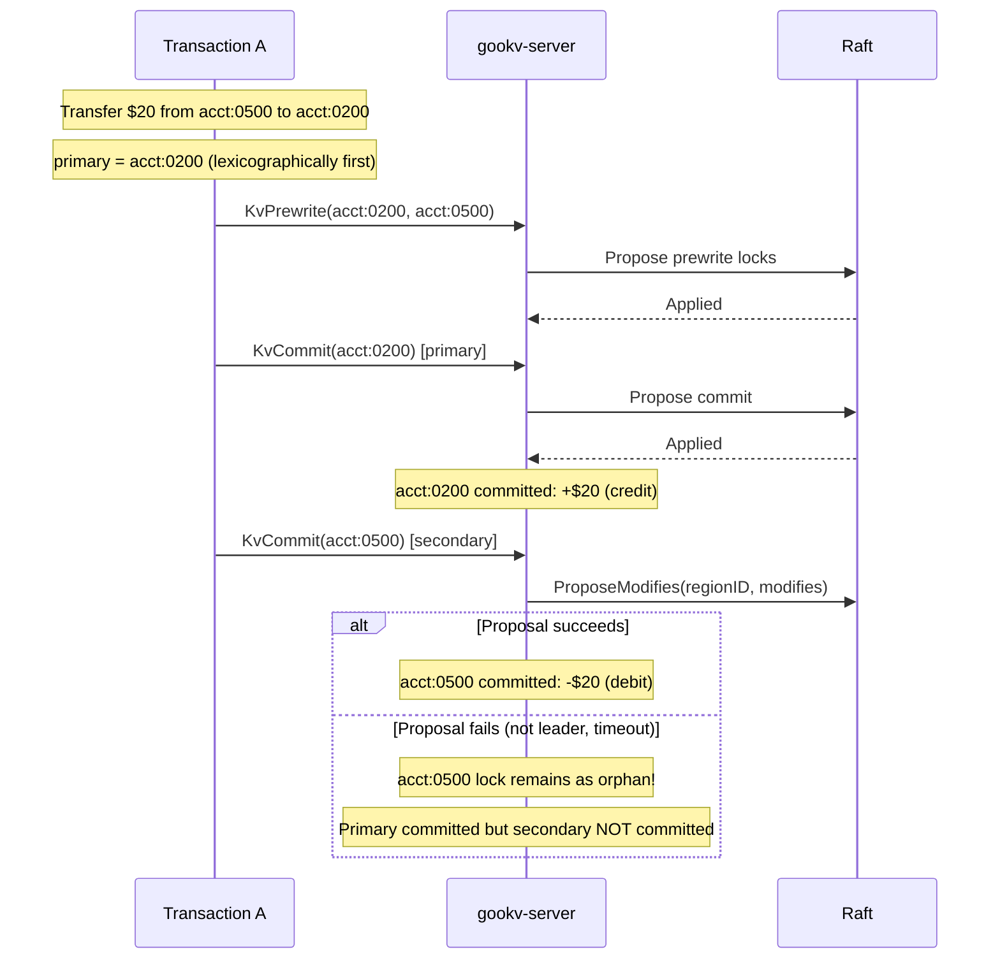
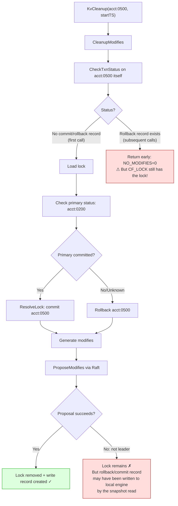
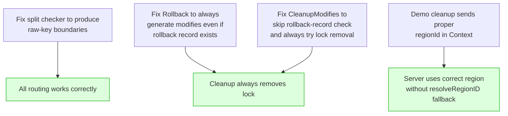
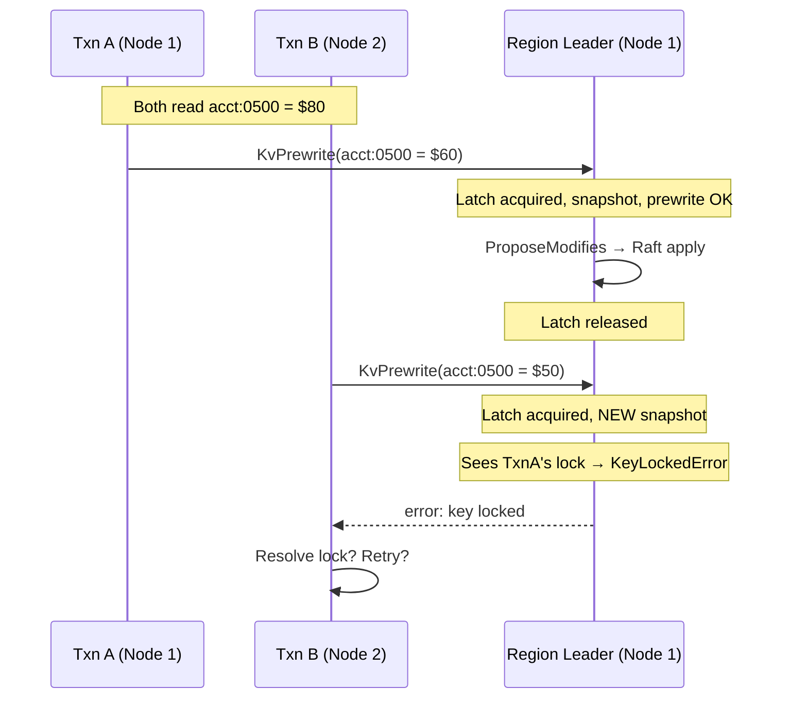
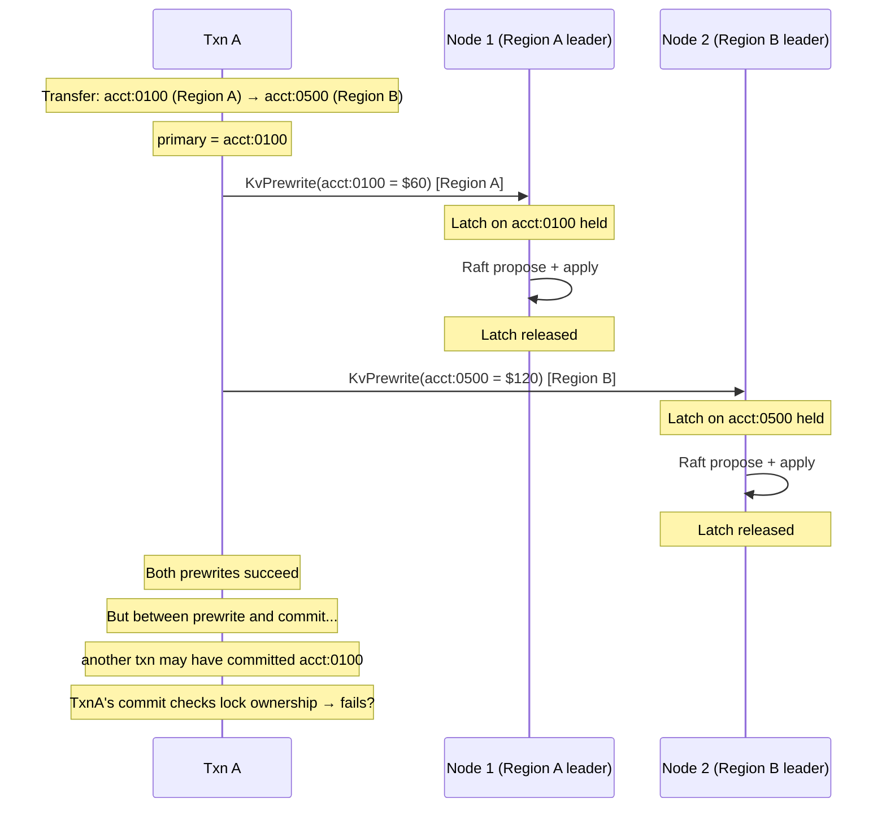

# Current Issues and Debugging Status

## Problem Statement

`make txn-integrity-demo-verify` fails: the final total balance diverges from $100,000 after concurrent transfers with 32 workers. The deviation is typically $10–$500.

## Fixes Applied So Far

| # | Fix | File(s) | Status |
|---|-----|---------|--------|
| 1 | LatchGuard: hold latch across Raft proposal | `storage.go`, `server.go` | Applied |
| 2 | Lock retryability: prewrite "key locked" → ErrWriteConflict | `actions.go`, `committer.go` | Applied |
| 3 | groupModifiesByRegion: decode→re-encode for consistent routing | `server.go` | Applied |
| 4 | resolveRegionID: encode raw key before region comparison | `server.go` | Applied |
| 5 | Direct proposal: KvBatchRollback/ResolveLock/Cleanup/CheckTxnStatus use regionId from context | `server.go` | Applied |
| 6 | proposeModifiesToRegionsWithRegionError: best-effort continuation | `server.go` | Applied |
| 7 | KvCleanup through Raft: CleanupModifies + ProposeModifies | `storage.go`, `server.go` | Applied |
| 8 | numWorkers=32 restored | `main.go` | Applied |
| 9 | isRetryable: added "key locked" pattern | `main.go` | Applied |
| 10 | Prewrite returns KeyLockedError with lock details | `actions.go`, `server.go` | Applied |

## Improvements Observed

| Metric | Before fixes | After fixes |
|--------|-------------|-------------|
| Transfers (30s, 32 workers) | 40–60 | 287–302 |
| Phase 2 completion time | 60s+ (timeout) | 30s (on time) |
| Conflict handling | Broken (errors) | Working (retries) |
| Balance deviation | $50–$500 | $10–$150 |

## Remaining Issue: Orphan Locks Not Cleaned

### Symptom

Phase 3 cleanup finds orphan locks but cannot remove them:

```
Pass 1: cleaned 51 lock(s).
Pass 2: cleaned 40 lock(s).     ← same locks found again
Pass 3: cleaned 40 lock(s).
Pass 4: cleaned 40 lock(s).
Pass 5: cleaned 40 lock(s).
```

SI read fails → RC fallback gives wrong total (pre-lock values for committed secondaries).

### Root Cause Analysis



When the secondary commit fails:
- **acct:0200** (receiver/primary): committed → balance increased by $20
- **acct:0500** (sender/secondary): prewrite lock remains → RC reads OLD balance (not debited)
- **Net effect**: $20 appears "created" (total > $100,000)

### Why Cleanup Fails



#### The Critical Race in Rollback

The `Rollback` function in `actions.go` is **idempotent** by design:

```go
func Rollback(txn, reader, key, startTS) error {
    // 1. Check if already rolled back
    existingWrite, _, _ := reader.GetTxnCommitRecord(key, startTS)
    if existingWrite != nil {
        if existingWrite.WriteType == WriteTypeRollback {
            return nil  // ← Already rolled back, generate NO modifies
        }
    }
    // 2. Remove lock + write rollback record
    ...
}
```

**Problem scenario**:
1. First `KvBatchRollback` during Phase 2: generates modifies (lock delete + rollback record write)
2. `ProposeModifies` routes to Raft → **partial failure**: CF_WRITE rollback record is applied to one region, but CF_LOCK delete fails for another region
3. Subsequent `KvCleanup` in Phase 3: `Rollback` finds the rollback record → returns nil → **generates zero modifies** → lock stays

This happens because the rollback record (CF_WRITE) and lock deletion (CF_LOCK) for the same key can end up being proposed to **different regions** when `groupModifiesByRegion` routes them based on encoded key format.

### Remaining Questions

1. **Why do CF_LOCK and CF_WRITE for the same key route to different regions?**
   - Region boundaries include timestamps (from split checker). A CF_LOCK key (no timestamp) and a CF_WRITE key (with timestamp) may compare differently against a boundary that falls between them.
   - `groupModifiesByRegion` decodes both to raw key then re-encodes as `EncodeLockKey` (no timestamp), which should produce consistent routing. But the re-encoded key may still compare differently against the boundary's timestamp suffix.

2. **Should the split checker produce boundaries without timestamps?**
   - In TiKV, region boundaries are raw user keys. In gookv, the split checker picks engine keys (which include MVCC encoding + timestamp). This is a deeper architectural issue.

3. **Can KvBatchRollback/KvResolveLock/KvCleanup avoid `groupModifiesByRegion` entirely?**
   - These handlers now use direct proposal with `req.GetContext().GetRegionId()`. But when `regionId == 0` (e.g., demo cleanup sends empty context), they fall back to `resolveRegionID(key)` which may still misroute.

### Potential Fix Directions



**Option A+E applied** (commit `452017305`): Both the split checker fix and CleanupModifies fix were implemented. See results below.

---

## Status After Split Checker + CleanupModifies Fix

### What was fixed

1. **Split checker** (`internal/raftstore/split/checker.go`): `scanRegionSize` now decodes the MVCC-encoded key from the engine iterator to a raw user key, then re-encodes as `EncodeLockKey` (memcomparable, no timestamp). Region boundaries now use a consistent format.

2. **CleanupModifies** (`internal/server/storage.go`): No longer checks rollback records first. Instead, checks CF_LOCK for the lock directly. If a lock exists, always generates lock-removal modifies regardless of whether a rollback record already exists.

### What improved

| Metric | Before | After |
|--------|--------|-------|
| Orphan lock cleanup | Loops forever (same locks each pass) | Completes in 1 pass |
| SI read in Phase 3 | Fails (lock resolution exhausted) | Succeeds |
| RC fallback needed | Always | Never |
| Region boundary format | `EncodeLockKey + timestamp` | `EncodeLockKey` (no timestamp) |

### What still fails

**Balance diverges by $100–$200 in both directions** (sometimes over, sometimes under $100,000):

```
Run 1: Total = $100,018 (+$18)
Run 2: Total = $99,844  (-$156)
```

This is NOT a lock/cleanup issue (those are resolved). The divergence indicates a **write conflict detection or atomicity failure** during Phase 2 concurrent transfers.

---

## Remaining Issue: Write Conflict Detection Under Concurrency

### Symptom

With 32 workers performing ~300 transfers in 30 seconds, the final balance is off by $18–$200. The direction (over/under) varies between runs.

### Hypothesis: Latch-Raft Window Allows Lost Updates

The LatchGuard fix holds the latch from snapshot creation through Raft proposal completion. However, there may still be a window where two transactions on **different nodes** (different region leaders) can both read the same stale value and produce conflicting writes.



In this scenario, the latch correctly serializes access. TxnB sees TxnA's lock and gets `KeyLockedError`. The client retries with `ErrWriteConflict`.

**But what if TxnA's prewrite lock is on a DIFFERENT region's leader?**



The Prewrite conflict check (`SeekWrite` for commitTS > startTS) relies on the **snapshot** taken at prewrite time. If the snapshot is stale (doesn't include a concurrent commit), the prewrite succeeds but produces an incorrect value.

### Investigation needed

1. **Is the Prewrite write-conflict check correct?** Compare `SeekWrite(key, TSMax)` logic with TiKV's implementation.
2. **Can two transactions both prewrite the same key?** The latch prevents this on the same node/region, but what about across regions for different keys in the same transaction?
3. **Is the read value used for balance computation stale?** The `Get()` reads at `startTS`, and `Set()` uses the computed balance. If another transaction commits between the read and the prewrite, the prewrite's conflict check should catch it. But does it?

### Next steps

- Add per-transaction logging in Phase 2 to capture: startTS, keys, read values, computed amounts, commit result
- Cross-reference with the actual final balances to identify which transaction(s) caused the discrepancy
- Compare `Prewrite` conflict detection with TiKV's `check_for_newer_version` implementation
