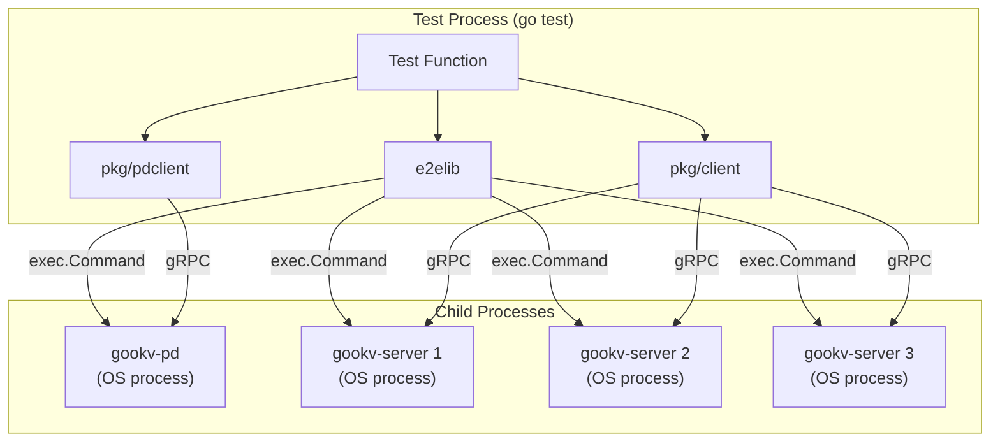
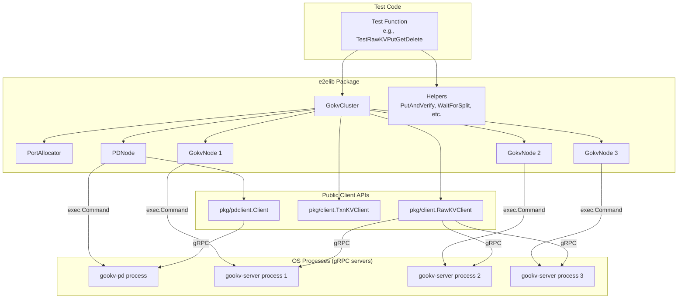
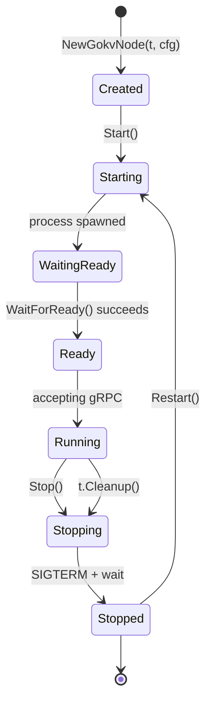
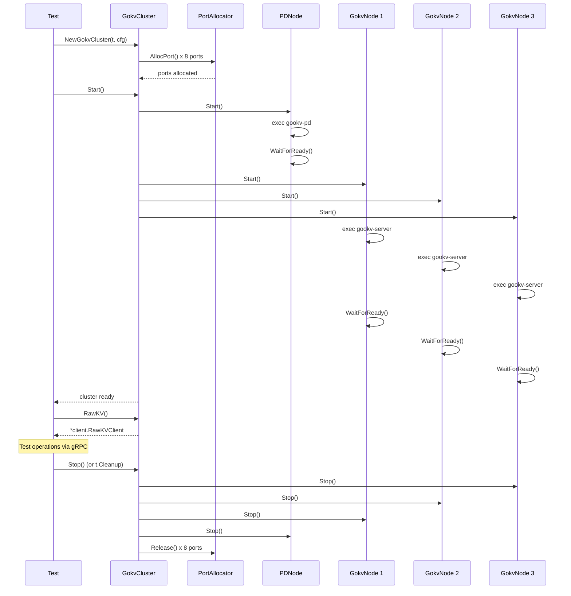

# E2E Test Library for gookv: Overview

## 1. Motivation

### 1.1 The Problem with In-Process E2E Tests

gookv's current e2e test suite (18 files, ~70 test functions under `e2e/`) imports internal packages directly:

```go
import (
    "github.com/ryogrid/gookv/internal/engine/rocks"
    "github.com/ryogrid/gookv/internal/server"
    "github.com/ryogrid/gookv/internal/raftstore"
    "github.com/ryogrid/gookv/internal/server/transport"
    // ...
)
```

This creates several problems:

| Problem | Description |
|---------|-------------|
| **Internal coupling** | Tests depend on internal APIs (`server.NewServer`, `server.NewStorage`, `rocks.Open`, etc.) that may change without notice |
| **Not testing real deployment** | Tests bypass the binary entry point (`cmd/gookv-server/main.go`), missing config parsing, flag handling, signal handling, and startup/shutdown sequencing |
| **Missing infrastructure bugs** | Port binding, data directory creation, PD endpoint resolution, Raft initial-cluster parsing -- none of these are exercised |
| **Fragile cluster setup** | Each multi-node test reinvents cluster bootstrapping (e.g., `newTestServerCluster`, `newAddNodeCluster`, `newMultiRegionCluster`) with 50-200 lines of boilerplate |
| **No process isolation** | A panic in one component crashes the entire test process, making failure diagnosis harder |
| **Cannot test binary CLI** | The `gookv-ctl` tool is never exercised programmatically |

### 1.2 Why External-Binary-Only Testing Matters

An external-binary e2e test library treats `gookv-server` and `gookv-pd` as opaque executables, just like a real deployment:

1. **Tests actual deployment behavior**: The binary goes through `flag.Parse()`, config loading, engine initialization, PD client creation, Raft bootstrap, and gRPC server startup -- exactly as it does in production.

2. **Catches config/startup bugs**: Incorrect flag defaults, TOML parsing errors, port binding failures, and data directory permission issues are caught.

3. **No internal coupling**: Tests depend only on the public Go APIs (`pkg/client`, `pkg/pdclient`) and the binary CLI interface. Internal refactoring cannot break these tests.

4. **Process isolation**: Each gookv-server node runs in its own OS process. A crash in one node does not crash the test harness.

5. **Reusable across environments**: The same test library works for CI, local development, and manual verification scripts.

### 1.3 PostgreSQL TAP Test Analogy

PostgreSQL's Test Anything Protocol (TAP) test library (`PostgreSQL::Test::Cluster.pm`) is the gold standard for database e2e testing. Here is how it maps to gookv:

```
PostgreSQL TAP                          gookv E2E Library
------------------------------------------------------
PostgreSQL::Test::Cluster               GokvCluster
  ->new("node_name")                    NewGokvCluster(t, cfg)
  ->init()                              (implicit in Start)
  ->start()                             cluster.Start()
  ->stop()                              cluster.Stop()
  ->safe_psql("SELECT 1")              cluster.RawKV().Put(...)
  ->poll_query_until(...)               WaitForSplit(...)

PostgreSQL::Test::Utils                 helpers.go
  get_free_port()                       PortAllocator.AllocPort()
  temp data dir                         t.TempDir() per node

Node lifecycle:                         Node lifecycle:
  init -> start -> operate -> stop      NewGokvNode -> Start -> WaitForReady -> operate -> Stop
```

Key patterns borrowed from PostgreSQL TAP:

- **Port allocation with file-based locking**: PostgreSQL uses lock files in a temp directory to prevent port collisions between parallel test runs. gookv's library does the same.
- **Automatic cleanup on test end**: PostgreSQL cleans up temp dirs and kills processes when the test exits. gookv uses `t.Cleanup()`.
- **Log capture**: PostgreSQL redirects node output to log files for post-mortem analysis. gookv does the same.
- **Wait-for-ready polling**: PostgreSQL polls `pg_isready` after starting a node. gookv polls the gRPC health endpoint.

---

## 2. Design Principles

### Principle 1: Binary as System Under Test

The library starts `gookv-server` and `gookv-pd` as child processes using `os/exec`. It never imports `internal/` packages.



### Principle 2: External Interfaces Only

Tests communicate with nodes exclusively through:

- **gRPC** (via `pkg/client.RawKVClient`, `pkg/client.TxnKVClient`)
- **PD protocol** (via `pkg/pdclient.Client`)
- **CLI** (via `gookv-ctl` subprocess)
- **HTTP status endpoint** (via `net/http`)

No internal Go interfaces, no in-memory function calls to the server.

### Principle 3: Process Isolation

Each node is a separate OS process with its own:

- **Data directory** (`t.TempDir()`)
- **Log file** (in the temp dir)
- **gRPC port** (allocated by `PortAllocator`)
- **Status HTTP port** (allocated by `PortAllocator`)

A crash, panic, or deadlock in one node does not affect the test harness or other nodes.

### Principle 4: Automatic Cleanup

The library registers cleanup functions with `t.Cleanup()` to ensure:

1. All child processes are killed (SIGTERM, then SIGKILL after timeout)
2. All temp directories are removed
3. All allocated ports are released
4. All gRPC connections are closed

This happens even if the test panics or fails.

### Principle 5: Port Safety

Parallel test runs (via `go test -parallel`) must not collide on ports. The library uses a `PortAllocator` that:

1. Picks ports from a configurable range (default: 10200-32767)
2. Creates a lock file per port in a shared temp directory
3. Uses `flock()` for inter-process safety
4. Verifies the port is actually available by attempting to bind before returning it

---

## 3. Architecture

### 3.1 High-Level Architecture



### 3.2 Node Lifecycle



### 3.3 Cluster Startup Sequence



---

## 4. Comparison: Current vs. New Approach

| Aspect | Current e2e Tests | New e2elib Tests |
|--------|-------------------|------------------|
| **Server creation** | `server.NewServer(cfg, storage)` (in-process) | `exec.Command("gookv-server", ...)` (child process) |
| **Engine setup** | `rocks.Open(dir)` directly | Binary handles engine setup |
| **Raft bootstrap** | `coord.BootstrapRegion(region, raftPeers)` | Binary handles bootstrap via `--initial-cluster` |
| **PD setup** | `pd.NewPDServer(cfg)` directly | `exec.Command("gookv-pd", ...)` |
| **Client** | Raw gRPC `tikvpb.TikvClient` | `pkg/client.RawKVClient`, `pkg/client.TxnKVClient` |
| **Port allocation** | `"127.0.0.1:0"` (OS picks) | `PortAllocator` with lock files |
| **Crash isolation** | Crashes test process | Crashes only the child process |
| **Cleanup** | Manual `t.Cleanup()` per component | Automatic via `GokvCluster.Stop()` |
| **Replication wait** | `time.Sleep(500ms)` | `WaitForReady()` + polling helpers |
| **Internal imports** | `internal/server`, `internal/raftstore`, etc. | None -- only `pkg/client`, `pkg/pdclient` |
| **Config testing** | Not tested (hardcoded `ServerConfig`) | Full TOML config file testing |
| **Binary CLI testing** | Not tested | Via `gookv-ctl` subprocess |

---

## 5. Scope and Non-Goals

### In Scope

- Library for starting/stopping PD and gookv-server nodes as OS processes
- Port allocation with inter-process safety
- Client helper functions for common patterns (put-and-verify, wait-for-split, etc.)
- Assertion helpers for common checks (balance conservation, region count, etc.)
- Migration of existing e2e tests that can be expressed through external interfaces
- Makefile target for running external e2e tests

### Not In Scope

- Tests that require access to internal Raft state (e.g., `raft_cluster_test.go`)
- Tests that need to manipulate individual Raft peers (e.g., `Campaign()`, `Propose()`)
- Performance benchmarking (separate concern)
- Chaos testing / fault injection beyond simple process kill
- Multi-machine deployment testing

---

## 6. Dependencies

The library depends only on public packages:

| Dependency | Purpose |
|-----------|---------|
| `testing` | Go test framework integration |
| `os/exec` | Process management |
| `net` | Port availability checking |
| `syscall` | File locking (`flock`), process signals |
| `pkg/client` | RawKVClient, TxnKVClient |
| `pkg/pdclient` | PD client for metadata operations |
| `github.com/stretchr/testify` | Assertions |

No `internal/` packages are imported.

---

## 7. Terminology

| Term | Definition |
|------|-----------|
| **PDNode** | A `gookv-pd` process managed by the library |
| **GokvNode** | A `gookv-server` process managed by the library |
| **GokvCluster** | A collection of one PDNode + N GokvNodes |
| **PortAllocator** | Manages port allocation with file-based locking |
| **Join mode** | Starting a GokvNode without `--initial-cluster` to join an existing cluster |
| **WaitForReady** | Polling until a node accepts gRPC connections |
