# E2E Test Library for gookv: Library Design

## 1. Package Structure

```
pkg/e2elib/
    port.go          # PortAllocator
    pdnode.go        # PDNode
    gokvnode.go      # GokvNode
    cluster.go       # GokvCluster
    helpers.go       # Client/assertion helpers
    port_test.go     # Unit tests for PortAllocator
    e2elib_test.go   # Integration test (starts real cluster)
```

Module path: `github.com/ryogrid/gookv/pkg/e2elib`

---

## 2. PortAllocator

### 2.1 Design

The PortAllocator prevents port collisions between parallel test runs. It uses file-based locking (following the PostgreSQL TAP pattern) with an additional bind-check to handle stale lock files.

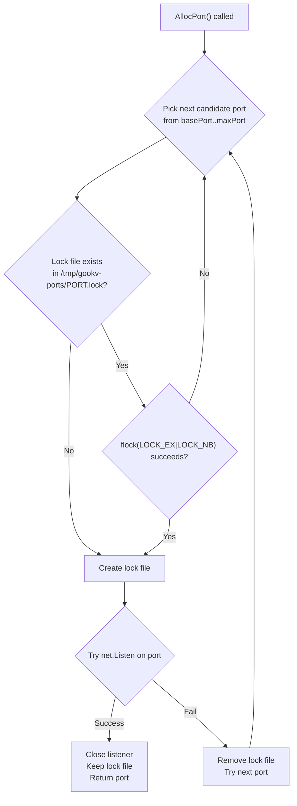

### 2.2 API

```go
// PortAllocator manages port allocation with file-based locking for
// inter-process safety. It prevents collisions between parallel test runs.
type PortAllocator struct {
    basePort int
    maxPort  int
    lockDir  string
    mu       sync.Mutex
    next     int
    held     map[int]*os.File // port -> lock file handle
}

// NewPortAllocator creates a PortAllocator that allocates ports in
// the range [basePort, maxPort]. Lock files are stored in lockDir.
// If lockDir is empty, defaults to /tmp/gookv-e2e-ports.
func NewPortAllocator(basePort, maxPort int) *PortAllocator

// AllocPort allocates a free port with file-based locking.
// Returns an error if no ports are available in the range.
func (pa *PortAllocator) AllocPort() (int, error)

// Release releases a previously allocated port, removing the lock file.
func (pa *PortAllocator) Release(port int)

// ReleaseAll releases all held ports. Called during cleanup.
func (pa *PortAllocator) ReleaseAll()
```

### 2.3 Lock File Protocol

```
/tmp/gookv-e2e-ports/
    10200.lock
    10201.lock
    10202.lock
    ...
```

Each lock file is held open with `flock(LOCK_EX|LOCK_NB)` for the duration of the test. When the test process exits (even via crash), the OS automatically releases the flock, allowing other test processes to reuse the port.

### 2.4 Internal Implementation Notes

```go
// Pseudocode for AllocPort:
func (pa *PortAllocator) AllocPort() (int, error) {
    pa.mu.Lock()
    defer pa.mu.Unlock()

    for attempts := 0; attempts < pa.maxPort-pa.basePort; attempts++ {
        port := pa.basePort + ((pa.next + attempts) % (pa.maxPort - pa.basePort))

        // 1. Try to create/open lock file
        lockPath := filepath.Join(pa.lockDir, fmt.Sprintf("%d.lock", port))
        f, err := os.OpenFile(lockPath, os.O_CREATE|os.O_WRONLY, 0600)
        if err != nil {
            continue
        }

        // 2. Try non-blocking exclusive flock
        err = syscall.Flock(int(f.Fd()), syscall.LOCK_EX|syscall.LOCK_NB)
        if err != nil {
            f.Close()
            continue
        }

        // 3. Verify port is bindable
        ln, err := net.Listen("tcp", fmt.Sprintf("127.0.0.1:%d", port))
        if err != nil {
            syscall.Flock(int(f.Fd()), syscall.LOCK_UN)
            f.Close()
            os.Remove(lockPath)
            continue
        }
        ln.Close()

        // 4. Success
        pa.held[port] = f
        pa.next = port - pa.basePort + 1
        return port, nil
    }

    return 0, fmt.Errorf("e2elib: no free ports in range %d-%d", pa.basePort, pa.maxPort)
}
```

---

## 3. PDNode

### 3.1 Design

PDNode manages a single `gookv-pd` process. It handles:

- Temp directory creation for data
- Port allocation for the client listener
- Process start/stop with log capture
- PD client creation for metadata operations

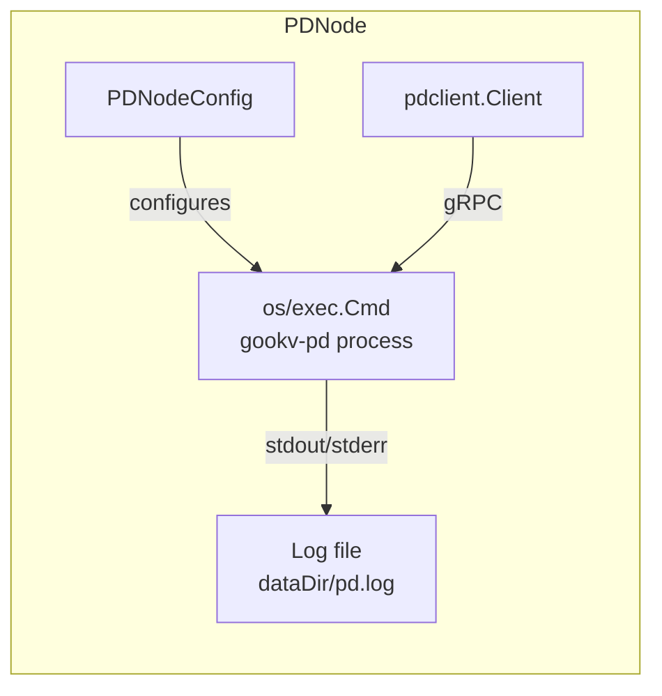

### 3.2 API

```go
// PDNodeConfig configures a PDNode.
type PDNodeConfig struct {
    BinaryPath string   // path to gookv-pd binary; default: auto-detect
    ClusterID  uint64   // cluster ID; default: 1
    LogLevel   string   // log level: debug, info, warn, error; default: "warn"
}

// PDNode manages a gookv-pd process.
type PDNode struct {
    t         *testing.T
    cfg       PDNodeConfig
    port      int
    dataDir   string
    logPath   string
    cmd       *exec.Cmd
    alloc     *PortAllocator
    pdClient  pdclient.Client
    running   bool
}

// NewPDNode creates a PDNode. Does not start the process.
// The PDNode allocates a port and creates a temp data directory.
func NewPDNode(t *testing.T, alloc *PortAllocator, cfg PDNodeConfig) *PDNode

// Start starts the gookv-pd process and waits until it is ready.
// Ready means the PD gRPC endpoint accepts connections.
func (n *PDNode) Start() error

// Stop sends SIGTERM to the process and waits for it to exit.
// If the process does not exit within 10 seconds, sends SIGKILL.
func (n *PDNode) Stop() error

// Addr returns the PD listen address (host:port).
func (n *PDNode) Addr() string

// Client returns a pdclient.Client connected to this PD node.
// The client is created lazily on first call and cached.
func (n *PDNode) Client() pdclient.Client

// LogFile returns the path to the PD log file.
func (n *PDNode) LogFile() string

// DataDir returns the path to the PD data directory.
func (n *PDNode) DataDir() string
```

### 3.3 Process Startup

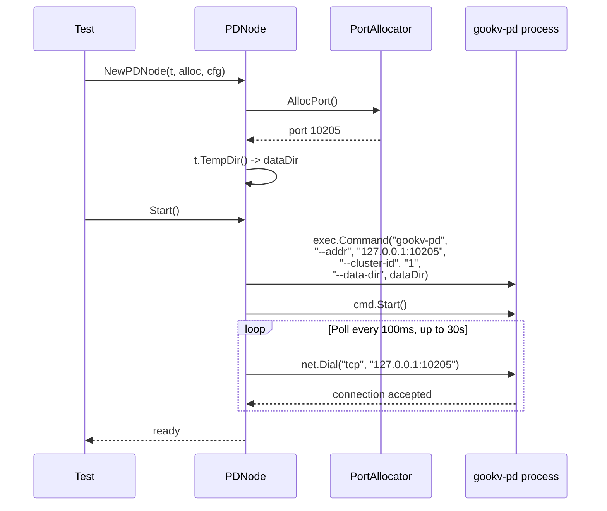

### 3.4 Command-Line Construction

The `gookv-pd` binary is invoked with these flags:

```
gookv-pd \
  --addr 127.0.0.1:<port> \
  --cluster-id <clusterID> \
  --data-dir <dataDir> \
  [--log-level <logLevel>]
```

For multi-PD Raft mode (future), additional flags would be:

```
  --pd-id <pdID> \
  --initial-cluster "1=addr1,2=addr2,3=addr3" \
  --peer-port 127.0.0.1:<peerPort> \
  --client-cluster "1=addr1,2=addr2,3=addr3"
```

---

## 4. GokvNode

### 4.1 Design

GokvNode manages a single `gookv-server` process. It handles:

- Port allocation for gRPC and HTTP status endpoints
- Temp directory for data and optional config file
- Process lifecycle with log capture
- Client creation (RawKV, TxnKV) connected through PD

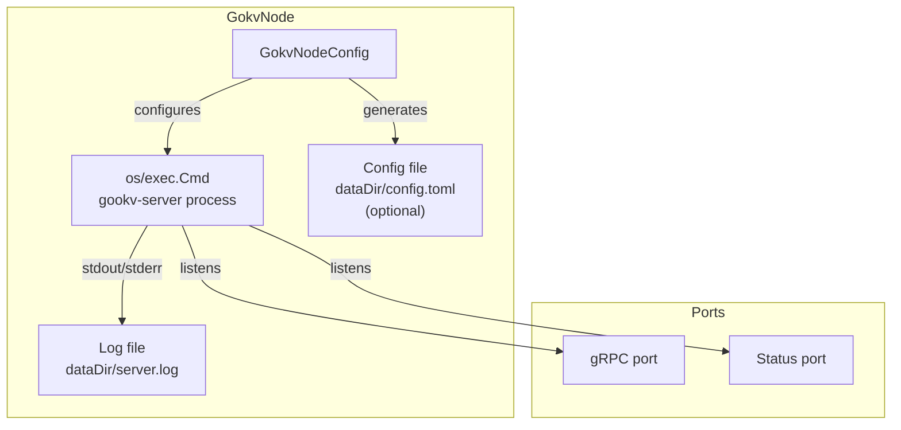

### 4.2 API

```go
// GokvNodeConfig configures a GokvNode.
type GokvNodeConfig struct {
    BinaryPath     string   // path to gookv-server binary; default: auto-detect
    StoreID        uint64   // store ID for this node (required for cluster mode)
    PDEndpoints    []string // PD endpoints for cluster mode
    InitialCluster string   // "1=addr1,2=addr2,..." for Raft bootstrap
    ConfigFile     string   // optional path to existing TOML config
    LogLevel       string   // log level; default: "warn"
    ExtraFlags     []string // additional flags passed to the binary
}

// GokvNode manages a gookv-server process.
type GokvNode struct {
    t          *testing.T
    cfg        GokvNodeConfig
    grpcPort   int
    statusPort int
    dataDir    string
    logPath    string
    configPath string
    cmd        *exec.Cmd
    alloc      *PortAllocator
    rawKV      *client.RawKVClient
    txnKV      *client.TxnKVClient
    topClient  *client.Client
    running    bool
}

// NewGokvNode creates a GokvNode. Does not start the process.
func NewGokvNode(t *testing.T, alloc *PortAllocator, cfg GokvNodeConfig) *GokvNode

// Start starts the gookv-server process and waits until it is ready.
// Ready means the gRPC endpoint accepts connections.
func (n *GokvNode) Start() error

// Stop sends SIGTERM and waits for process exit.
// Falls back to SIGKILL after 10 seconds.
func (n *GokvNode) Stop() error

// Restart stops and then starts the node, preserving data directory.
func (n *GokvNode) Restart() error

// IsRunning returns true if the process is currently running.
func (n *GokvNode) IsRunning() bool

// WaitForReady polls until the gRPC endpoint accepts connections
// or the timeout expires. Called automatically by Start().
func (n *GokvNode) WaitForReady(timeout time.Duration) error

// Addr returns the gRPC listen address (host:port).
func (n *GokvNode) Addr() string

// StatusAddr returns the HTTP status listen address (host:port).
func (n *GokvNode) StatusAddr() string

// RawKV returns a RawKVClient connected through PD to the cluster.
// The client is created lazily on first call and cached.
// Requires PDEndpoints to be configured.
func (n *GokvNode) RawKV() *client.RawKVClient

// TxnKV returns a TxnKVClient connected through PD to the cluster.
// The client is created lazily on first call and cached.
// Requires PDEndpoints to be configured.
func (n *GokvNode) TxnKV() *client.TxnKVClient

// LogFile returns the path to the server log file.
func (n *GokvNode) LogFile() string

// DataDir returns the path to the server data directory.
func (n *GokvNode) DataDir() string

// WriteConfig writes custom TOML configuration content to a config file
// in the data directory. Must be called before Start().
func (n *GokvNode) WriteConfig(content string)

// GRPCPort returns the allocated gRPC port number.
func (n *GokvNode) GRPCPort() int

// StatusPort returns the allocated HTTP status port number.
func (n *GokvNode) StatusPort() int
```

### 4.3 Command-Line Construction

```
gookv-server \
  --store-id <storeID> \
  --addr 127.0.0.1:<grpcPort> \
  --status-addr 127.0.0.1:<statusPort> \
  --data-dir <dataDir> \
  --pd-endpoints <pdEndpoint1>,<pdEndpoint2> \
  --initial-cluster <initialCluster> \
  [--config <configPath>] \
  [--log-level <logLevel>]
```

### 4.4 Ready Detection

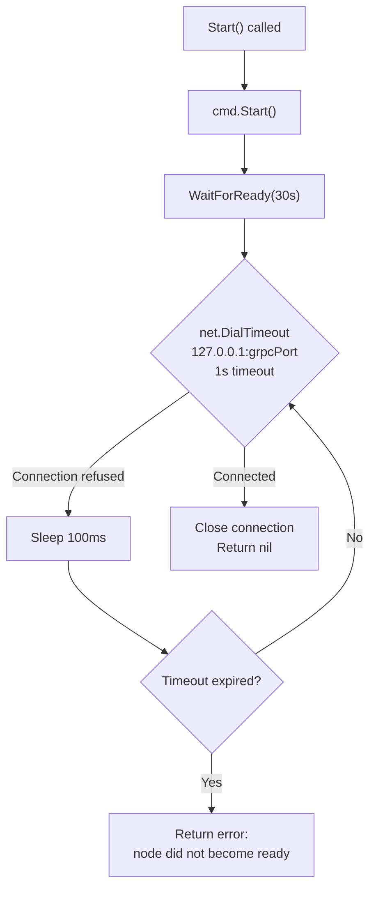

### 4.5 Process Stop Sequence

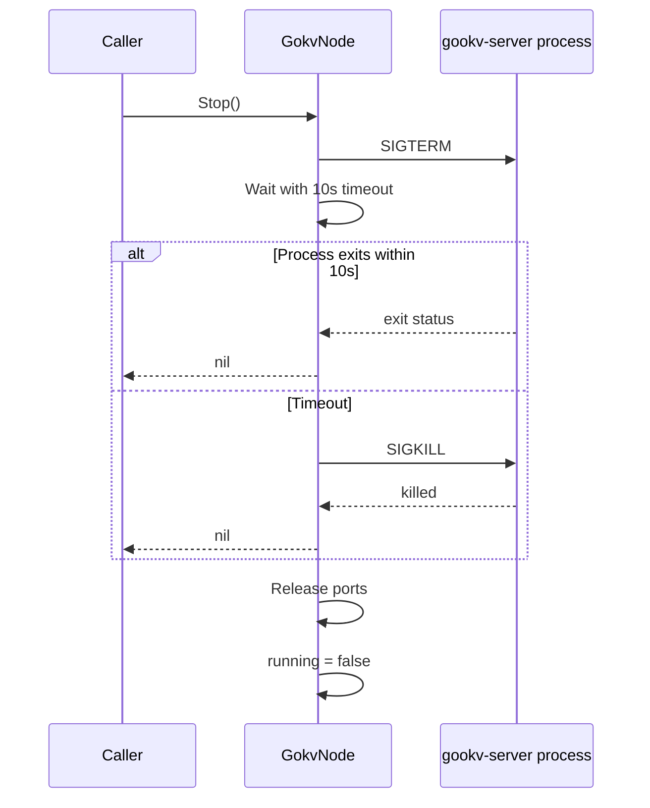

---

## 5. GokvCluster

### 5.1 Design

GokvCluster is the primary entry point for most tests. It manages one PDNode and N GokvNodes, handling:

- Coordinated startup (PD first, then nodes)
- Initial cluster topology string generation
- Store ID assignment
- Shared client creation (connected through PD)
- Node addition (join mode) and removal

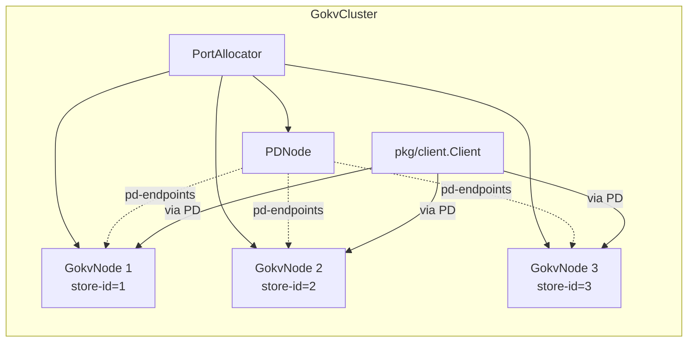

### 5.2 API

```go
// GokvClusterConfig configures a GokvCluster.
type GokvClusterConfig struct {
    NumNodes           int              // number of gookv-server nodes; default: 1
    PDConfig           PDNodeConfig     // PD node configuration
    NodeConfigs        []GokvNodeConfig // optional per-node overrides (len must be 0 or NumNodes)
    SplitSize          string           // region split size, e.g., "20KB"; written to config.toml
    SplitCheckInterval string           // split check interval, e.g., "5s"; written to config.toml
    ServerBinaryPath   string           // path to gookv-server binary; default: auto-detect
    PDBinaryPath       string           // path to gookv-pd binary; default: auto-detect
    BasePort           int              // base port for PortAllocator; default: 10200
}

// GokvCluster manages a complete gookv cluster (PD + N server nodes).
type GokvCluster struct {
    t       *testing.T
    cfg     GokvClusterConfig
    alloc   *PortAllocator
    pd      *PDNode
    nodes   []*GokvNode
    client  *client.Client
    started bool
}

// NewGokvCluster creates a GokvCluster but does not start it.
// It allocates all ports and creates temp directories.
func NewGokvCluster(t *testing.T, cfg GokvClusterConfig) *GokvCluster

// Start starts the PD node, then all server nodes in order.
// Blocks until all nodes are ready (accepting gRPC connections).
func (c *GokvCluster) Start() error

// Stop stops all server nodes (in reverse order), then the PD node.
// Releases all allocated ports.
func (c *GokvCluster) Stop() error

// PD returns the PDNode.
func (c *GokvCluster) PD() *PDNode

// Node returns the GokvNode at the given index (0-based).
func (c *GokvCluster) Node(idx int) *GokvNode

// Nodes returns all GokvNodes.
func (c *GokvCluster) Nodes() []*GokvNode

// AddNode creates and starts a new GokvNode in join mode
// (no --initial-cluster flag). Returns the new node.
func (c *GokvCluster) AddNode() (*GokvNode, error)

// StopNode stops the node at the given index without removing it.
// The node can be restarted with RestartNode.
func (c *GokvCluster) StopNode(idx int) error

// RestartNode restarts the node at the given index, preserving its data.
func (c *GokvCluster) RestartNode(idx int) error

// Client returns a pkg/client.Client connected to PD.
// Created lazily on first call.
func (c *GokvCluster) Client() *client.Client

// RawKV returns a RawKVClient connected through PD.
func (c *GokvCluster) RawKV() *client.RawKVClient

// TxnKV returns a TxnKVClient connected through PD.
func (c *GokvCluster) TxnKV() *client.TxnKVClient
```

### 5.3 Cluster Startup Flow

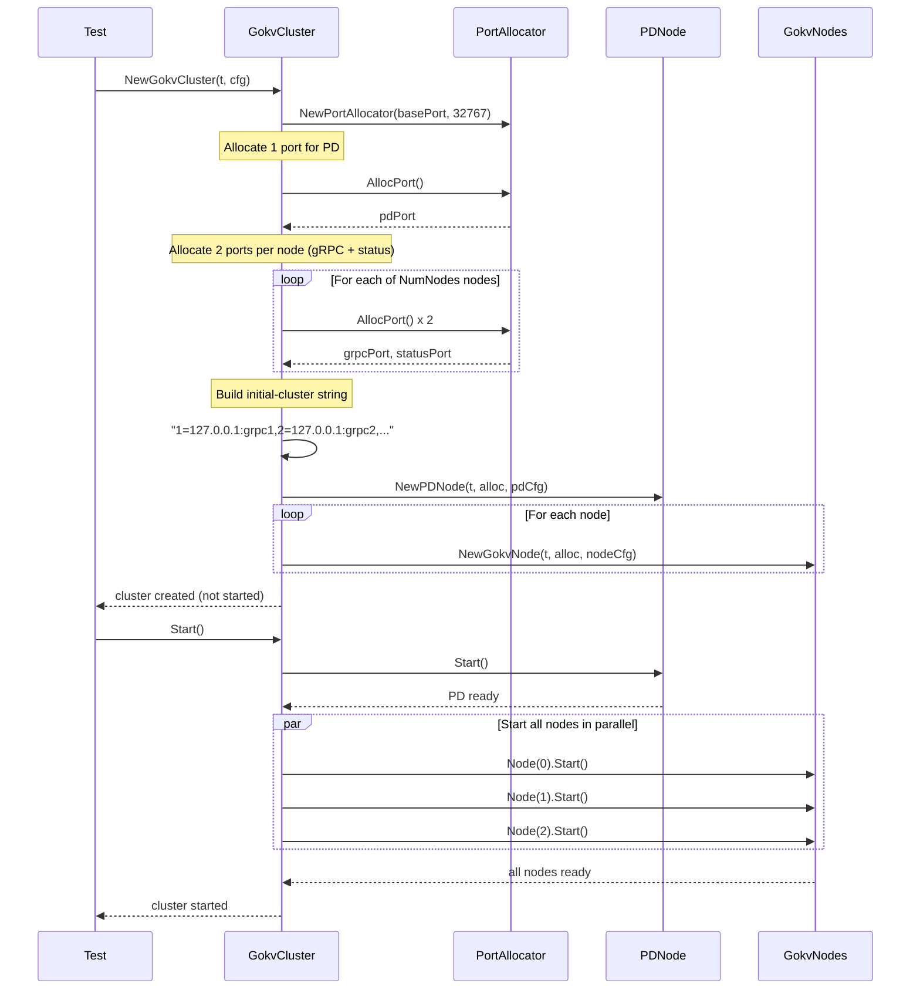

### 5.4 Initial Cluster Topology

The cluster generates the `--initial-cluster` flag automatically:

```go
// buildInitialCluster generates the initial-cluster topology string.
// Format: "1=127.0.0.1:20160,2=127.0.0.1:20161,3=127.0.0.1:20162"
func (c *GokvCluster) buildInitialCluster() string {
    var parts []string
    for i, node := range c.nodes {
        storeID := uint64(i + 1)
        parts = append(parts, fmt.Sprintf("%d=127.0.0.1:%d", storeID, node.GRPCPort()))
    }
    return strings.Join(parts, ",")
}
```

### 5.5 TOML Config Generation

When `SplitSize` or `SplitCheckInterval` is specified in `GokvClusterConfig`, the cluster generates a TOML config file for each node:

```toml
[raftstore]
region-split-size = "20KB"
split-check-tick-interval = "5s"
```

This is written to `<dataDir>/config.toml` via `GokvNode.WriteConfig()` before starting each node.

### 5.6 Join Mode (AddNode)

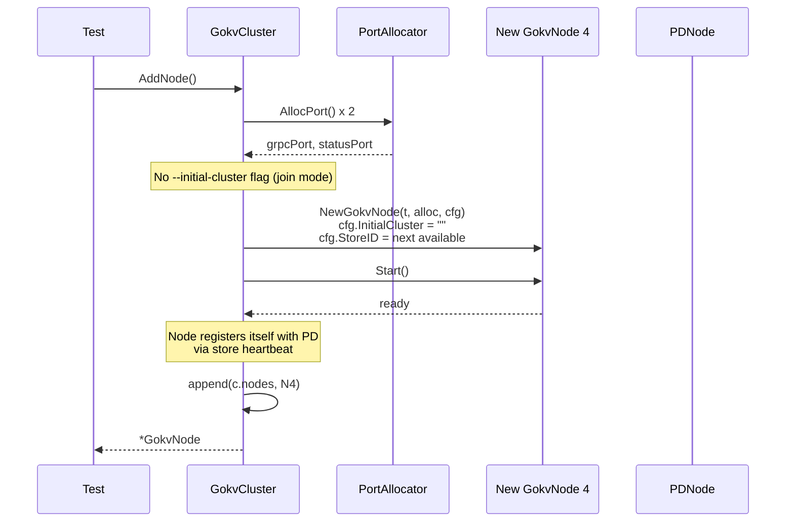

---

## 6. Client Helpers

### 6.1 Common Operation Helpers

```go
// PutAndVerify puts a key-value pair and immediately reads it back
// to verify the write succeeded. Fails the test if the value does
// not match.
func PutAndVerify(t *testing.T, rawKV *client.RawKVClient, key, value []byte)

// GetAndAssert reads a key and asserts the value matches expected.
// Fails the test if the key is not found or the value differs.
func GetAndAssert(t *testing.T, rawKV *client.RawKVClient, key, expected []byte)

// GetAndAssertNotFound reads a key and asserts it does not exist.
func GetAndAssertNotFound(t *testing.T, rawKV *client.RawKVClient, key []byte)

// PutMany writes count key-value pairs with the given prefix.
// Keys are formatted as "<prefix>-<index>" (zero-padded to 5 digits).
// Values are formatted as "val-<prefix>-<index>".
func PutMany(t *testing.T, rawKV *client.RawKVClient, prefix string, count int)

// ScanAll scans the entire key space and returns all key-value pairs.
func ScanAll(t *testing.T, rawKV *client.RawKVClient) []client.KvPair
```

### 6.2 Polling Helpers

```go
// WaitForRegionCount polls PD until the cluster has at least minCount regions.
// Returns the actual region count. Fails the test on timeout.
func WaitForRegionCount(t *testing.T, pd pdclient.Client, minCount int, timeout time.Duration) int

// WaitForSplit is a convenience wrapper around WaitForRegionCount
// that waits for the region count to exceed 1 (i.e., at least one split
// has occurred). Returns the region count.
func WaitForSplit(t *testing.T, pd pdclient.Client, timeout time.Duration) int

// WaitForCondition polls fn every 200ms until it returns true or
// the timeout expires. Fails the test on timeout with the given message.
func WaitForCondition(t *testing.T, timeout time.Duration, msg string, fn func() bool)
```

### 6.3 Transaction Test Helpers

```go
// SeedAccounts creates numAccounts accounts with initialBalance each,
// using a transaction. Account keys are formatted as "acct-<index>".
// Values are the balance as a decimal string.
func SeedAccounts(t *testing.T, txnKV *client.TxnKVClient, numAccounts, initialBalance int)

// ReadAllBalances reads all account balances and returns the total
// and individual balances. Account keys must be "acct-0" through
// "acct-<numAccounts-1>".
func ReadAllBalances(t *testing.T, txnKV *client.TxnKVClient, numAccounts int) (total int, balances []int)

// TransferBalance performs a single balance transfer between two
// accounts within a transaction. Returns nil on success, an error
// on transaction conflict (caller should retry).
func TransferBalance(t *testing.T, txnKV *client.TxnKVClient, from, to int, amount int) error
```

### 6.4 Assertion Helpers

```go
// AssertBalanceConservation reads all account balances and asserts
// the total matches expectedTotal. Fails the test with a detailed
// message showing all individual balances if the assertion fails.
func AssertBalanceConservation(t *testing.T, txnKV *client.TxnKVClient, numAccounts, expectedTotal int)

// AssertRegionCount queries PD and asserts the region count is
// between min and max (inclusive).
func AssertRegionCount(t *testing.T, pd pdclient.Client, min, max int)

// AssertKeyValue reads a key via RawKV and asserts the value matches.
func AssertKeyValue(t *testing.T, rawKV *client.RawKVClient, key, expected []byte)

// AssertKeyNotFound reads a key via RawKV and asserts it does not exist.
func AssertKeyNotFound(t *testing.T, rawKV *client.RawKVClient, key []byte)

// AssertScanCount scans a key range and asserts the number of results.
func AssertScanCount(t *testing.T, rawKV *client.RawKVClient, startKey, endKey []byte, expectedCount int)
```

---

## 7. Binary Path Resolution

The library resolves binary paths in this order:

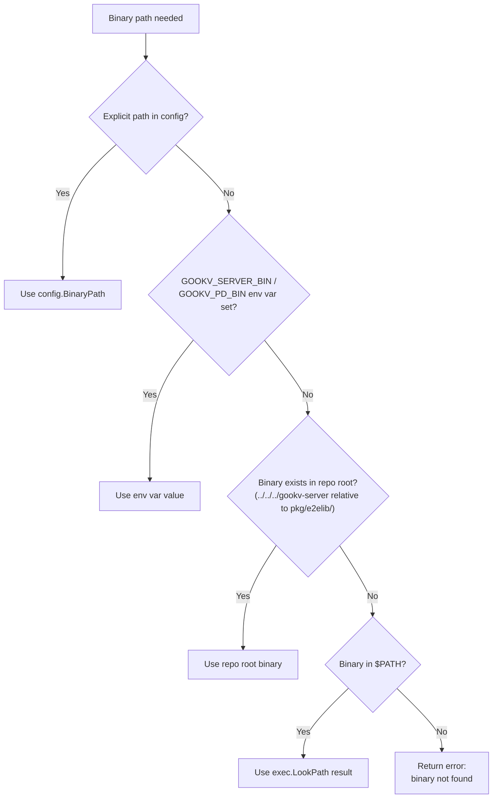

```go
// resolveBinary finds the binary path for the given name (e.g., "gookv-server").
// Resolution order: explicit path > env var > repo root > $PATH.
func resolveBinary(name, explicitPath, envVar string) (string, error)
```

The environment variables are:
- `GOOKV_SERVER_BIN`: path to `gookv-server`
- `GOOKV_PD_BIN`: path to `gookv-pd`
- `GOOKV_CTL_BIN`: path to `gookv-ctl`

---

## 8. Complete Example: Single-Node Raw KV Test

This shows the simplest possible test using the library:

```go
package e2e_external_test

import (
    "context"
    "testing"

    "github.com/ryogrid/gookv/pkg/e2elib"
    "github.com/stretchr/testify/assert"
    "github.com/stretchr/testify/require"
)

func TestRawKVPutGetDelete(t *testing.T) {
    // Create a 1-node cluster (PD + 1 gookv-server).
    cluster := e2elib.NewGokvCluster(t, e2elib.GokvClusterConfig{
        NumNodes: 1,
    })
    defer cluster.Stop()
    require.NoError(t, cluster.Start())

    // Get a RawKV client (connected through PD).
    rawKV := cluster.RawKV()
    ctx := context.Background()

    // Put a key.
    err := rawKV.Put(ctx, []byte("key1"), []byte("val1"))
    require.NoError(t, err)

    // Get the key.
    val, notFound, err := rawKV.Get(ctx, []byte("key1"))
    require.NoError(t, err)
    assert.False(t, notFound)
    assert.Equal(t, []byte("val1"), val)

    // Delete the key.
    err = rawKV.Delete(ctx, []byte("key1"))
    require.NoError(t, err)

    // Verify deletion.
    _, notFound, err = rawKV.Get(ctx, []byte("key1"))
    require.NoError(t, err)
    assert.True(t, notFound)
}
```

Using the helper functions:

```go
func TestRawKVPutGetDeleteWithHelpers(t *testing.T) {
    cluster := e2elib.NewGokvCluster(t, e2elib.GokvClusterConfig{
        NumNodes: 1,
    })
    defer cluster.Stop()
    require.NoError(t, cluster.Start())

    rawKV := cluster.RawKV()

    // PutAndVerify handles put + read-back assertion.
    e2elib.PutAndVerify(t, rawKV, []byte("key1"), []byte("val1"))

    // GetAndAssert handles get + value assertion.
    e2elib.GetAndAssert(t, rawKV, []byte("key1"), []byte("val1"))
}
```

---

## 9. Complete Example: Multi-Node Transaction Integrity Test

This demonstrates a more complex test with multiple nodes, region splits, and concurrent transactions:

```go
func TestTransactionIntegrity(t *testing.T) {
    // Create a 3-node cluster with aggressive split settings.
    cluster := e2elib.NewGokvCluster(t, e2elib.GokvClusterConfig{
        NumNodes:           3,
        SplitSize:          "20KB",
        SplitCheckInterval: "5s",
    })
    defer cluster.Stop()
    require.NoError(t, cluster.Start())

    txnKV := cluster.TxnKV()
    pdClient := cluster.PD().Client()

    // Seed 100 accounts with balance 100 each (total = 10,000).
    const numAccounts = 100
    const initialBalance = 100
    const expectedTotal = numAccounts * initialBalance

    e2elib.SeedAccounts(t, txnKV, numAccounts, initialBalance)

    // Verify initial state.
    e2elib.AssertBalanceConservation(t, txnKV, numAccounts, expectedTotal)

    // Write enough data to trigger auto-split.
    rawKV := cluster.RawKV()
    e2elib.PutMany(t, rawKV, "padding", 200)

    // Wait for at least one split to occur.
    regionCount := e2elib.WaitForSplit(t, pdClient, 30*time.Second)
    t.Logf("Cluster has %d regions after split", regionCount)

    // Run concurrent transfers.
    const numTransfers = 50
    var wg sync.WaitGroup
    for i := 0; i < numTransfers; i++ {
        wg.Add(1)
        go func(i int) {
            defer wg.Done()
            from := i % numAccounts
            to := (i + 1) % numAccounts
            for attempt := 0; attempt < 5; attempt++ {
                err := e2elib.TransferBalance(t, txnKV, from, to, 1)
                if err == nil {
                    break
                }
                // Retry on conflict.
            }
        }(i)
    }
    wg.Wait()

    // Verify total balance is conserved after concurrent transfers.
    e2elib.AssertBalanceConservation(t, txnKV, numAccounts, expectedTotal)
}
```

---

## 10. Complete Example: Node Addition Test

This demonstrates testing dynamic node addition:

```go
func TestAddNodeJoin(t *testing.T) {
    cluster := e2elib.NewGokvCluster(t, e2elib.GokvClusterConfig{
        NumNodes: 3,
    })
    defer cluster.Stop()
    require.NoError(t, cluster.Start())

    rawKV := cluster.RawKV()

    // Write some data.
    e2elib.PutAndVerify(t, rawKV, []byte("before-join"), []byte("val"))

    // Add a 4th node in join mode.
    newNode, err := cluster.AddNode()
    require.NoError(t, err)
    t.Logf("Added node 4 at %s", newNode.Addr())

    // Verify the cluster still works.
    e2elib.PutAndVerify(t, rawKV, []byte("after-join"), []byte("val"))

    // Verify PD knows about all 4 stores.
    pdClient := cluster.PD().Client()
    ctx := context.Background()
    for i := 0; i < 4; i++ {
        storeID := uint64(i + 1)
        store, err := pdClient.GetStore(ctx, storeID)
        require.NoError(t, err)
        assert.NotNil(t, store, "store %d should be registered with PD", storeID)
    }
}
```

---

## 11. Complete Example: PD Failover Test

```go
func TestPDFailover(t *testing.T) {
    // Single-PD cluster (PD failover requires multi-PD, which is future work).
    // For now, test node failure and recovery.
    cluster := e2elib.NewGokvCluster(t, e2elib.GokvClusterConfig{
        NumNodes: 3,
    })
    defer cluster.Stop()
    require.NoError(t, cluster.Start())

    rawKV := cluster.RawKV()

    // Write data.
    e2elib.PutAndVerify(t, rawKV, []byte("before-stop"), []byte("val"))

    // Stop node 1.
    require.NoError(t, cluster.StopNode(0))
    t.Log("Node 1 stopped")

    // Cluster should still be operational (2 of 3 nodes up).
    e2elib.PutAndVerify(t, rawKV, []byte("after-stop"), []byte("val"))

    // Restart node 1.
    require.NoError(t, cluster.RestartNode(0))
    t.Log("Node 1 restarted")

    // Verify data written while node was down is accessible.
    e2elib.GetAndAssert(t, rawKV, []byte("after-stop"), []byte("val"))
}
```

---

## 12. Error Handling Strategy

### 12.1 Start Failures

If a node fails to start (process exits immediately, or WaitForReady times out), the library:

1. Captures the last 50 lines of the log file
2. Includes them in the error message
3. Kills the process if still running
4. Releases allocated ports

```go
func (n *GokvNode) Start() error {
    // ... start process ...

    if err := n.WaitForReady(30 * time.Second); err != nil {
        // Capture log tail for diagnostics.
        logTail := readLastLines(n.logPath, 50)
        n.cmd.Process.Kill()
        return fmt.Errorf("e2elib: node (store %d) failed to start: %w\n--- log tail ---\n%s",
            n.cfg.StoreID, err, logTail)
    }
    return nil
}
```

### 12.2 Stop Failures

If SIGTERM does not cause the process to exit within 10 seconds, SIGKILL is used. The library never leaves orphan processes.

### 12.3 Port Allocation Failures

If all ports in the range are exhausted, `AllocPort()` returns an error. The test should be restructured to use fewer ports, or the range should be widened.

---

## 13. Concurrency Model

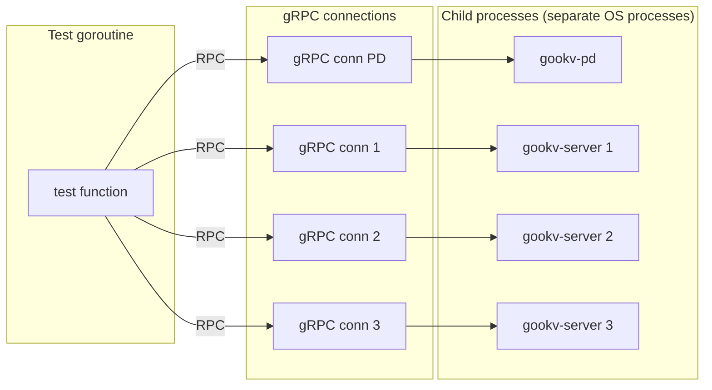

The library itself is not safe for concurrent use from multiple goroutines. Each test should create its own `GokvCluster`. However, the cluster's clients (RawKV, TxnKV, pdclient) are safe for concurrent use, as they are backed by gRPC connections which are thread-safe.

---

## 14. Logging and Diagnostics

### 14.1 Process Logs

Each process redirects stdout and stderr to a log file:

```
<dataDir>/pd.log          # PDNode log
<dataDir>/server.log      # GokvNode log
```

### 14.2 Test Failure Diagnostics

On test failure, the library logs:

1. The log file path for each node
2. The last N lines of each log file
3. The allocated ports and addresses

```go
// DumpLogs writes the last 100 lines of all node logs to t.Log().
// Call this in a deferred function for failed test diagnostics.
func (c *GokvCluster) DumpLogs() {
    c.t.Log("=== Cluster Log Dump ===")
    c.t.Logf("PD log: %s", c.pd.LogFile())
    c.t.Log(readLastLines(c.pd.LogFile(), 100))
    for i, node := range c.nodes {
        c.t.Logf("Node %d log: %s", i, node.LogFile())
        c.t.Log(readLastLines(node.LogFile(), 100))
    }
}
```

---

## 15. Interface Summary Diagram

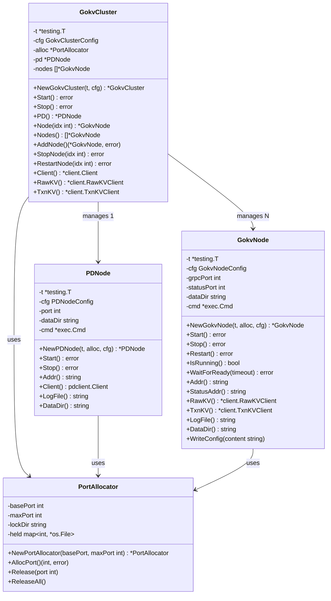
