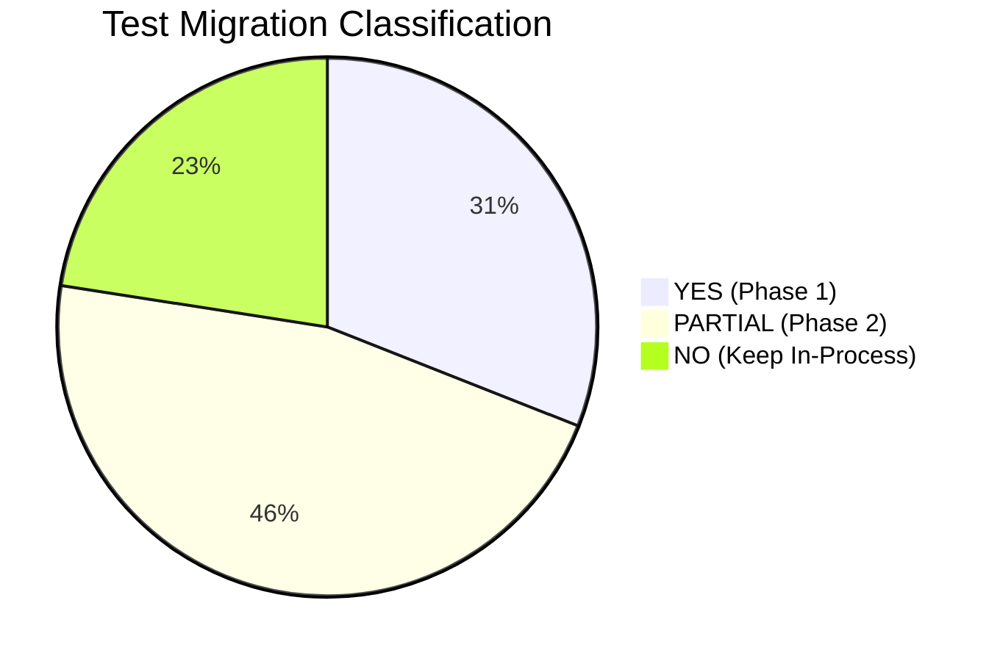
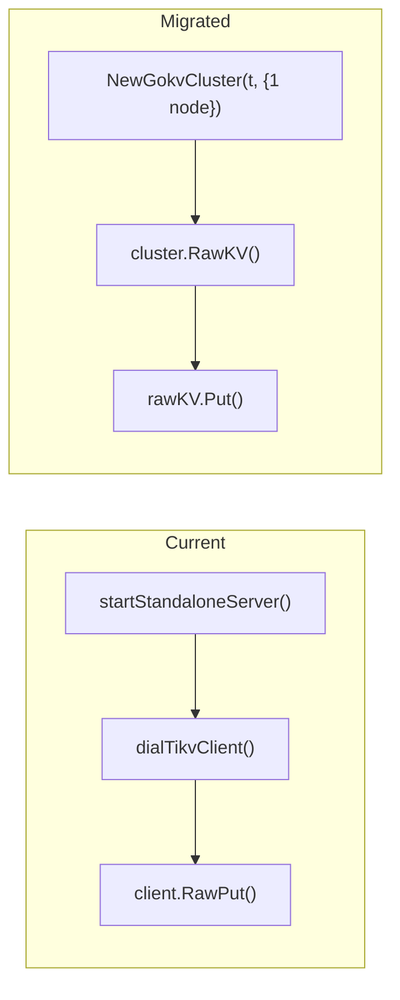

# E2E Test Library for gookv: Migration Plan

## 1. Migration Analysis Overview

The current e2e test suite has **18 test files** (plus 1 helper file) under `e2e/`. This document analyzes every test function and classifies it as **YES** (fully migratable to external-binary testing), **PARTIAL** (migratable with additional library features), or **NO** (must remain as in-process tests).

### Classification Criteria

| Classification | Meaning |
|---------------|---------|
| **YES** | Test uses only gRPC RPCs and/or PD client APIs. Can be fully rewritten to use external binaries. |
| **PARTIAL** | Test logic is migratable but requires either (a) features not yet in the library, (b) raw gRPC calls instead of the client library, or (c) internal API calls that could be replaced with polling/observation. |
| **NO** | Test directly manipulates internal Raft state, engine internals, or other components that have no external interface equivalent. Must remain as in-process tests. |

### Summary



| Phase | Files | Test Functions | Description |
|-------|-------|---------------|-------------|
| Phase 1 (YES) | 5 | 22 | Fully migratable, all operations via gRPC/PD client |
| Phase 2 (PARTIAL) | 7 | 33 | Needs raw gRPC, multi-PD support, or observation-based verification |
| Phase 3 (NO) | 6 | 16 | Internal API tests, keep as-is |

---

## 2. Complete Migration Analysis Table

### 2.1 File-Level Summary

| # | File | Test Count | Phase | Reason | Required Library Features |
|---|------|-----------|-------|--------|--------------------------|
| 1 | `raw_kv_test.go` | 3 | YES | All tests use gRPC RawPut/RawGet/RawDelete | GokvNode, gRPC client |
| 2 | `raw_kv_extended_test.go` | 4 | YES | All tests use gRPC Raw RPCs | GokvNode, gRPC client |
| 3 | `gc_worker_test.go` | 2 | PARTIAL | Uses internal `gc.GCWorker` to schedule GC | GokvNode + GC trigger via gRPC or gookv-ctl |
| 4 | `pd_server_test.go` | 4 | YES | All tests use PD client API | PDNode, pdclient |
| 5 | `client_lib_test.go` | 9 | YES | All tests use `pkg/client` APIs | GokvCluster (multi-region) |
| 6 | `add_node_test.go` | 4 | PARTIAL | Uses internal `coord.GetPeer()`, `coord.RegionCount()` | GokvCluster + AddNode + PD-based observation |
| 7 | `pd_replication_test.go` | 14 | PARTIAL | Uses internal `srv.IsRaftLeader()`, `srv.DataDir()` | Multi-PD cluster support |
| 8 | `txn_rpc_test.go` | 5 | YES | All tests use gRPC KvPrewrite/KvCommit etc. | GokvNode, raw gRPC |
| 9 | `async_commit_test.go` | 4 | YES | All tests use gRPC KvPrewrite with async commit flags | GokvNode, raw gRPC |
| 10 | `cluster_raw_kv_test.go` | 2 | PARTIAL | Uses internal `coord.GetPeer()`, `tsc.findLeaderIdx()` | GokvCluster + client-based verification |
| 11 | `cluster_server_test.go` | 5 | PARTIAL | Uses internal `coord.GetPeer()`, `coord.Stop()` | GokvCluster + client-based verification |
| 12 | `raft_cluster_test.go` | 5 | NO | Tests internal `raftstore.Peer` API directly | Cannot migrate |
| 13 | `multi_region_test.go` | 3 | PARTIAL | Uses internal `coord.ResolveRegionForKey()`, `campaignIfNeeded()` | GokvCluster (multi-region) + PD region queries |
| 14 | `multi_region_routing_test.go` | 6 | PARTIAL | Uses internal cluster bootstrap, manual split, raw gRPC | GokvCluster + PD-based verification |
| 15 | `region_split_merge_test.go` | 4 | PARTIAL | Uses internal `raftstore.ExecPrepareMerge()`, `split.ExecBatchSplit()` | Partially: split tests via PD; merge logic tests stay internal |
| 16 | `cleanup_region_data_test.go` | 1 | NO | Tests internal `raftstore.CleanupRegionData()` on raw engine | Cannot migrate |
| 17 | `pd_cluster_integration_test.go` | 3 | PARTIAL | Uses internal `pd.PDServer`, `server.PDWorker` directly | PDNode + GokvCluster + heartbeat polling |
| 18 | `pd_leader_discovery_test.go` | 3 | PARTIAL | Uses internal `coord.GetPeer()`, stops internal components | GokvCluster + PD leader observation |

### 2.2 Per-Function Analysis

---

#### File 1: `raw_kv_test.go` -- Phase 1 (YES)

| Test Function | Migratable | Reason | Migration Strategy |
|---------------|-----------|--------|-------------------|
| `TestRawKVPutGetDelete` | YES | Uses gRPC RawPut/RawGet/RawDelete | Start 1-node cluster, use raw gRPC or `pkg/client.RawKVClient` |
| `TestRawKVBatchOperations` | YES | Uses gRPC RawBatchPut/RawBatchGet/RawScan | Same as above |
| `TestRawKVDeleteRange` | YES | Uses gRPC RawPut/RawDeleteRange/RawGet | Same as above |

**Internal imports used**: `internal/engine/rocks`, `internal/server` (via `startStandaloneServer`)

**Migration**: Replace `startStandaloneServer()` with `e2elib.NewGokvCluster(t, {NumNodes: 1})`. Replace `dialTikvClient` with `cluster.RawKV()`.



---

#### File 2: `raw_kv_extended_test.go` -- Phase 1 (YES)

| Test Function | Migratable | Reason | Migration Strategy |
|---------------|-----------|--------|-------------------|
| `TestRawBatchScan` | YES | gRPC RawBatchScan | 1-node cluster + raw gRPC |
| `TestRawGetKeyTTL` | YES | gRPC RawGetKeyTTL | 1-node cluster + raw gRPC |
| `TestRawCompareAndSwap` | YES | gRPC RawCompareAndSwap | 1-node cluster + `rawKV.CompareAndSwap()` |
| `TestRawChecksum` | YES | gRPC RawChecksum | 1-node cluster + `rawKV.Checksum()` |

**Internal imports used**: None beyond `startStandaloneServer` from `raw_kv_test.go`

**Migration**: Same as File 1. For `RawBatchScan` and `RawGetKeyTTL`, use raw gRPC `tikvpb.TikvClient` since `pkg/client` does not expose these RPCs directly.

---

#### File 3: `gc_worker_test.go` -- Phase 2 (PARTIAL)

| Test Function | Migratable | Reason | Migration Strategy |
|---------------|-----------|--------|-------------------|
| `TestGCWorkerCleansOldVersions` | PARTIAL | Creates internal `gc.GCWorker` and calls `gcWorker.Schedule()` | Need external GC trigger (gookv-ctl or config-based auto-GC) |
| `TestGCWorkerMultipleKeys` | PARTIAL | Same as above | Same as above |

**Internal imports used**: `internal/engine/rocks`, `internal/server`, `internal/storage/gc`

**Migration**: These tests need an external way to trigger GC. Options:
1. Add a `gookv-ctl gc run --safe-point=35` subcommand
2. Configure the server with auto-GC enabled and a short interval, then wait

If neither is available, these tests stay as in-process tests until the external GC trigger is implemented.

---

#### File 4: `pd_server_test.go` -- Phase 1 (YES)

| Test Function | Migratable | Reason | Migration Strategy |
|---------------|-----------|--------|-------------------|
| `TestPDServerBootstrapAndTSO` | YES | Uses `pdclient.Client` API entirely | Start PDNode, use `pdclient.Client` |
| `TestPDServerStoreAndRegionMetadata` | YES | Uses `pdclient.Client.PutStore/GetStore/GetRegion` | Same |
| `TestPDAskBatchSplitAndReport` | YES | Uses `pdclient.Client.AskBatchSplit/ReportBatchSplit` | Same |
| `TestPDStoreHeartbeat` | YES | Uses `pdclient.Client.StoreHeartbeat` | Same |

**Internal imports used**: `internal/pd` (via `startPDServer`)

**Migration**: Replace `startPDServer()` with `e2elib.NewPDNode(t, alloc, cfg)` + `pd.Start()`. All test logic uses `pdclient.Client` which is already public.

---

#### File 5: `client_lib_test.go` -- Phase 1 (YES)

| Test Function | Migratable | Reason | Migration Strategy |
|---------------|-----------|--------|-------------------|
| `TestClientRegionCacheMiss` | YES | Uses `pkg/client.RawKVClient.Put/Get` | GokvCluster (1 region) |
| `TestClientRegionCacheHit` | YES | Same | Same |
| `TestClientStoreResolution` | YES | Same | Same |
| `TestClientBatchGetAcrossRegions` | YES | Uses `pkg/client.RawKVClient.BatchGet` | GokvCluster (2 regions) |
| `TestClientBatchPutAcrossRegions` | YES | Uses `pkg/client.RawKVClient.BatchPut` | Same |
| `TestClientScanAcrossRegions` | YES | Uses `pkg/client.RawKVClient.Scan` | Same |
| `TestClientScanWithLimit` | YES | Same | Same |
| `TestClientCompareAndSwap` | YES | Uses `pkg/client.RawKVClient.CompareAndSwap` | Same |
| `TestClientBatchDeleteAcrossRegions` | YES | Uses `pkg/client.RawKVClient.BatchDelete` | Same |

**Internal imports used**: `internal/pd`, `internal/server`, `internal/raftstore`, etc. (via `newMultiRegionCluster`)

**Migration**: Replace `newMultiRegionCluster()` with `e2elib.NewGokvCluster(t, {NumNodes: 3})`. The existing tests already use `pkg/client` for the actual test logic -- only the cluster setup uses internal APIs.

**Important note**: The current tests pre-define region boundaries (`startKey: nil, endKey: []byte("m")`). With external binaries, region boundaries are determined by the cluster (either a single initial region or auto-split). Tests that need specific region boundaries should either:
1. Write enough data to trigger auto-split, then verify via PD
2. Use a very small `SplitSize` config to force splits early

---

#### File 6: `add_node_test.go` -- Phase 2 (PARTIAL)

| Test Function | Migratable | Reason | Migration Strategy |
|---------------|-----------|--------|-------------------|
| `TestAddNode_JoinRegistersWithPD` | PARTIAL | Uses `coord.RegionCount()` to verify | Replace with PD store list query |
| `TestAddNode_PDSchedulesRegionToNewStore` | PARTIAL | Uses `coord.GetPeer()`, `pdClient.ReportRegionHeartbeat()` | Replace leader detection with PD queries |
| `TestAddNode_FullMoveLifecycle` | PARTIAL | Uses `pdWorker.ScheduleTask()`, `coord.RegionCount()` | Replace with PD polling + wait for region count |
| `TestAddNode_MultipleJoinNodes` | PARTIAL | Uses `coord.RegionCount()` | Replace with PD store list query |

**Internal imports used**: `internal/engine/rocks`, `internal/pd`, `internal/raftstore`, `internal/server`, `internal/server/transport`

**Migration**: Replace `createJoinNode()` with `cluster.AddNode()`. Replace `coord.RegionCount()` with PD region queries. Replace `coord.GetPeer().IsLeader()` with PD leader observation. The core test logic (verify PD knows about new store, verify scheduling) can be done entirely through the PD client.

---

#### File 7: `pd_replication_test.go` -- Phase 2 (PARTIAL)

| Test Function | Migratable | Reason | Migration Strategy |
|---------------|-----------|--------|-------------------|
| `TestPDReplication_LeaderElection` | PARTIAL | Uses `srv.IsRaftLeader()` | Replace with PD GetMembers RPC |
| `TestPDReplication_WriteForwarding` | PARTIAL | Uses `findLeaderIndex()` via internal API | Replace with GetMembers-based leader detection |
| `TestPDReplication_Bootstrap` | YES | Uses `pdclient.Client.IsBootstrapped` | Multi-PD cluster |
| `TestPDReplication_TSOMonotonicity` | YES | Uses `pdclient.Client.GetTS` | Multi-PD cluster |
| `TestPDReplication_LeaderFailover` | PARTIAL | Stops internal `srv`, needs DataDir from internal | Stop PD process via PDNode.Stop() |
| `TestPDReplication_SingleNodeCompat` | YES | Uses `pdclient.Client` | Single PDNode |
| `TestPDReplication_IDAllocMonotonicity` | YES | Uses `pdclient.Client.AllocID` | Multi-PD cluster |
| `TestPDReplication_GCSafePoint` | YES | Uses `pdclient.Client.UpdateGCSafePoint/GetGCSafePoint` | Multi-PD cluster |
| `TestPDReplication_RegionHeartbeat` | YES | Uses `pdclient.Client.ReportRegionHeartbeat` | Multi-PD cluster |
| `TestPDReplication_AskBatchSplit` | YES | Uses `pdclient.Client.AskBatchSplit` | Multi-PD cluster |
| `TestPDReplication_ConcurrentWritesFromMultipleClients` | YES | Uses `pdclient.Client.AllocID` | Multi-PD cluster |
| `TestPDReplication_TSOViaFollower` | PARTIAL | Uses `findLeaderIndex()` via internal API | Multi-PD + GetMembers |
| `TestPDReplication_TSOViaFollowerForwarding` | PARTIAL | Same | Same |
| `TestPDReplication_RegionHeartbeatViaFollower` | PARTIAL | Same | Same |

**Internal imports used**: `internal/pd`

**Migration**: Requires multi-PD cluster support in the library (multiple PDNode instances with `--initial-cluster`). Most tests can be migrated once multi-PD is available. Leader detection via `IsRaftLeader()` can be replaced with PD `GetMembers` RPC.

---

#### File 8: `txn_rpc_test.go` -- Phase 1 (YES)

| Test Function | Migratable | Reason | Migration Strategy |
|---------------|-----------|--------|-------------------|
| `TestTxnPessimisticLockAcquire` | YES | gRPC KvPessimisticLock | 1-node cluster + raw gRPC |
| `TestTxnPessimisticRollback` | YES | gRPC KVPessimisticRollback | Same |
| `TestTxnHeartBeat` | YES | gRPC KvPrewrite + KvTxnHeartBeat | Same |
| `TestTxnResolveLock` | YES | gRPC KvPrewrite + KvResolveLock + KvGet | Same |
| `TestTxnScanWithVersionVisibility` | YES | gRPC KvPrewrite + KvCommit + KvScan | Same |

**Internal imports used**: Only `startStandaloneServer` from `raw_kv_test.go`

**Migration**: Same pattern as raw_kv tests. These tests use raw `tikvpb.TikvClient` gRPC calls, which can be done by `dialTikvClient` on the GokvNode's address.

---

#### File 9: `async_commit_test.go` -- Phase 1 (YES)

| Test Function | Migratable | Reason | Migration Strategy |
|---------------|-----------|--------|-------------------|
| `TestAsyncCommit1PCPrewrite` | YES | gRPC KvPrewrite (TryOnePc) + KvGet | 1-node cluster + raw gRPC |
| `TestAsyncCommitPrewrite` | YES | gRPC KvPrewrite (UseAsyncCommit) | Same |
| `TestCheckSecondaryLocks` | YES | gRPC KvPrewrite + KvCheckSecondaryLocks + KvCommit | Same |
| `TestScanLock` | YES | gRPC KvPrewrite + KvScanLock + KvBatchRollback | Same |

**Internal imports used**: Only `startStandaloneServer` from `raw_kv_test.go`

**Migration**: Same as txn_rpc tests.

---

#### File 10: `cluster_raw_kv_test.go` -- Phase 2 (PARTIAL)

| Test Function | Migratable | Reason | Migration Strategy |
|---------------|-----------|--------|-------------------|
| `TestClusterRawKVOperations` | PARTIAL | Uses `coord.GetPeer()` for leader finding, `tsc.findLeaderIdx()` | Replace with client-based put/get (auto-routes to leader) |
| `TestClusterRawKVBatchPutAndScan` | PARTIAL | Same | Same |

**Internal imports used**: Full server/raftstore stack via `newTestServerCluster`

**Migration**: The actual test operations (RawPut, RawGet, RawScan) are all gRPC. The internal APIs are only used for cluster setup and leader finding. With `GokvCluster`, setup is automatic. Leader finding is unnecessary when using `pkg/client` which auto-routes to the leader.

---

#### File 11: `cluster_server_test.go` -- Phase 2 (PARTIAL)

| Test Function | Migratable | Reason | Migration Strategy |
|---------------|-----------|--------|-------------------|
| `TestClusterServerLeaderElection` | PARTIAL | Verifies exactly 1 leader via `coord.GetPeer()` | Replace with PD leader observation |
| `TestClusterServerKvOperations` | PARTIAL | Uses `coord.GetPeer()` for leader, gRPC for KV ops | Use `pkg/client` (auto-routes) |
| `TestClusterServerCrossNodeReplication` | PARTIAL | Writes via leader gRPC, reads from follower gRPC | Use `pkg/client`, verify via reads |
| `TestClusterServerNodeFailure` | PARTIAL | Stops internal nodes, verifies reads still work | Use `cluster.StopNode()` + reads |
| `TestClusterServerLeaderFailover` | PARTIAL | Stops leader, waits for re-election, verifies KV ops | Use `cluster.StopNode()` + polling + KV ops |

**Internal imports used**: Full server/raftstore stack via `newTestServerCluster`

**Migration**: All test logic can be expressed through the library. Leader detection is replaced by PD queries or simply trying operations (which auto-route). Node stop/restart is handled by `StopNode`/`RestartNode`.

---

#### File 12: `raft_cluster_test.go` -- Phase 3 (NO)

| Test Function | Migratable | Reason |
|---------------|-----------|--------|
| `TestClusterLeaderElection` | NO | Directly calls `raftstore.Peer.Campaign()`, `peer.IsLeader()` |
| `TestClusterProposalReplication` | NO | Calls `peer.Propose([]byte("key1=value1"))` and checks applied entries |
| `TestClusterMinorityFailure` | NO | Manipulates in-memory Raft peer `sendFunc`/`applyFunc` |
| `TestClusterMajorityFailure` | NO | Verifies proposal NOT committed (negative assertion on internal state) |
| `TestClusterLeaderFailureAndReelection` | NO | Re-wires `sendFunc` and checks `findLeader()` on internal peers |
| `TestClusterNodeRecovery` | NO | Re-creates `raftstore.Peer` with same engine, re-wires callbacks |

**Why these cannot migrate**: These tests exercise the Raft consensus algorithm at the `raftstore.Peer` level. They:
- Directly propose entries and verify they appear in an applied entry log
- Manipulate the message routing function (`SetSendFunc`) to simulate network partitions
- Check internal leader state on specific peers
- Verify entries are NOT committed (negative internal state assertion)

None of these operations have an external interface equivalent. These tests validate the correctness of the Raft implementation itself and must remain as in-process unit/integration tests.

---

#### File 13: `multi_region_test.go` -- Phase 2 (PARTIAL)

| Test Function | Migratable | Reason | Migration Strategy |
|---------------|-----------|--------|-------------------|
| `TestMultiRegionKeyRouting` | PARTIAL | Uses `coord.ResolveRegionForKey()` | Replace with PD `GetRegion(key)` |
| `TestMultiRegionIndependentLeaders` | PARTIAL | Uses `coord.GetPeer().IsLeader()` per region | Replace with PD region leader queries |
| `TestMultiRegionRawKV` | PARTIAL | Uses internal cluster, but test ops are RawPut/RawGet | Replace with `pkg/client.RawKVClient` |

**Internal imports used**: Full stack via `newMultiRegionCluster`

**Migration**: Replace pre-defined regions with auto-split (write enough data with small `SplitSize`). Key routing can be verified by writing keys in different ranges and reading them back. Leader tracking is done via PD.

---

#### File 14: `multi_region_routing_test.go` -- Phase 2 (PARTIAL)

| Test Function | Migratable | Reason | Migration Strategy |
|---------------|-----------|--------|-------------------|
| `TestMultiRegionTransactions` | PARTIAL | Uses internal cluster setup, but ops are gRPC KvPrewrite/KvCommit/KvGet | GokvCluster + raw gRPC or `pkg/client.TxnKVClient` |
| `TestMultiRegionRawKVBatchScan` | PARTIAL | Internal cluster, ops are gRPC RawBatchScan | GokvCluster + raw gRPC |
| `TestMultiRegionSplitWithLiveTraffic` | PARTIAL | Uses internal `split.ExecBatchSplit()`, `coord.BootstrapRegion()` | Replace with auto-split (small SplitSize config) |
| `TestMultiRegionPDCoordinatedSplit` | PARTIAL | Uses internal split config, but already tests auto-split | GokvCluster with SplitSize config |
| `TestMultiRegionAsyncCommit` | PARTIAL | Internal cluster, ops are gRPC async commit prewrite | GokvCluster + raw gRPC |
| `TestMultiRegionScanLock` | PARTIAL | Internal cluster, ops are gRPC ScanLock | GokvCluster + raw gRPC |

**Internal imports used**: Full stack via `newMultiRegionCluster`, `split.ExecBatchSplit`

**Migration**: Most test logic is already expressed through gRPC. The main challenge is replacing pre-defined multi-region setup with auto-split. `TestMultiRegionPDCoordinatedSplit` is the closest to the migrated form already -- it sets SplitSize and waits for auto-split.

---

#### File 15: `region_split_merge_test.go` -- Phase 2 (PARTIAL)

| Test Function | Migratable | Reason | Migration Strategy |
|---------------|-----------|--------|-------------------|
| `TestRegionSplitWithPD` | YES | Uses PD client API entirely | PDNode + pdclient (already external) |
| `TestRegionMergeLogic` | NO | Calls `raftstore.ExecPrepareMerge()`, `ExecCommitMerge()` directly | Internal logic test |
| `TestRegionMergeRollback` | NO | Calls `raftstore.ExecRollbackMerge()` directly | Internal logic test |
| `TestRegionSplitAndMergeRoundTrip` | PARTIAL | Split part uses PD, merge part calls internal `ExecCommitMerge()` | Split part: YES; Merge part: NO |

**Internal imports used**: `internal/pd`, `internal/raftstore`

**Migration**: `TestRegionSplitWithPD` is already essentially an external test. The merge tests call internal merge functions and must stay as in-process tests.

---

#### File 16: `cleanup_region_data_test.go` -- Phase 3 (NO)

| Test Function | Migratable | Reason |
|---------------|-----------|--------|
| `TestCleanupRegionDataE2E` | NO | Directly manipulates RocksDB engine via `engine.Put(cfnames.CFRaft, ...)` and calls `raftstore.CleanupRegionData()` |

**Why**: This tests internal data cleanup at the storage engine level. There is no external interface to verify that specific Raft CF keys have been deleted.

---

#### File 17: `pd_cluster_integration_test.go` -- Phase 2 (PARTIAL)

| Test Function | Migratable | Reason | Migration Strategy |
|---------------|-----------|--------|-------------------|
| `TestPDClusterStoreAndRegionHeartbeat` | PARTIAL | Creates `server.PDWorker` directly | Use GokvCluster (heartbeats sent automatically by gookv-server) |
| `TestPDClusterTSOForTransactions` | YES | Uses `pdclient.Client.GetTS` | PDNode + pdclient |
| `TestPDClusterGCSafePoint` | PARTIAL | Calls `pdSrv.GetGCSafePoint()` directly on internal server | Replace with `pdclient.Client.GetGCSafePoint` |

**Internal imports used**: `internal/pd`, `internal/server`

**Migration**: `TestPDClusterTSOForTransactions` is trivially migratable. The heartbeat test can be replaced by starting a real cluster and verifying PD has store info. The GC safe point test can use `pdclient.Client.GetGCSafePoint/UpdateGCSafePoint`.

---

#### File 18: `pd_leader_discovery_test.go` -- Phase 2 (PARTIAL)

| Test Function | Migratable | Reason | Migration Strategy |
|---------------|-----------|--------|-------------------|
| `TestPDStoreRegistration` | PARTIAL | Uses internal cluster setup, but verification uses pdclient | GokvCluster + pdclient verification |
| `TestPDRegionLeaderTracking` | PARTIAL | Uses internal `waitForPDLeader()` which polls pdclient | GokvCluster + PD region queries |
| `TestPDLeaderFailover` | PARTIAL | Stops internal server components individually | GokvCluster + StopNode + PD polling |

**Internal imports used**: Full stack via `newPDIntegratedCluster`

**Migration**: All verification logic uses `pdclient.Client`. Only the cluster setup and node stop uses internal APIs, both of which are handled by the library.

---

## 3. Migration Phases

### Phase 1: Fully Migratable Tests (5 files, 22 functions)

```mermaid
gantt
    title Phase 1: Fully Migratable Tests
    dateFormat X
    axisFormat %s

    section Library
    PortAllocator           :a1, 0, 2
    PDNode                  :a2, 2, 4
    GokvNode                :a3, 4, 6
    GokvCluster             :a4, 6, 8
    Helpers                 :a5, 8, 9

    section Tests
    raw_kv_test.go (3)      :b1, 9, 10
    raw_kv_extended_test.go (4) :b2, 10, 11
    pd_server_test.go (4)   :b3, 11, 12
    txn_rpc_test.go (5)     :b4, 12, 13
    async_commit_test.go (4):b5, 13, 14
    client_lib_test.go (9)  :b6, 14, 16
```



**Prerequisites**: Core library (PortAllocator, PDNode, GokvNode, GokvCluster, helpers)

**Files and approach**:

1. **`raw_kv_test.go`** (3 tests): `GokvCluster{NumNodes:1}` + raw gRPC client
2. **`raw_kv_extended_test.go`** (4 tests): Same, with raw gRPC for `RawBatchScan`, `RawGetKeyTTL`
3. **`pd_server_test.go`** (4 tests): `PDNode` + `pdclient.Client`
4. **`txn_rpc_test.go`** (5 tests): `GokvCluster{NumNodes:1}` + raw gRPC `tikvpb.TikvClient`
5. **`async_commit_test.go`** (4 tests): Same
6. **`client_lib_test.go`** (9 tests): `GokvCluster{NumNodes:3}` + `pkg/client.RawKVClient`

**Key decisions**:
- For `client_lib_test.go`, the current tests pre-configure multi-region boundaries. The migrated version should either (a) use auto-split with small SplitSize to get multiple regions naturally, or (b) start with a single region and verify client operations work across a single region (which still tests the client library's region cache, store resolution, etc.).
- For tests using raw gRPC (`txn_rpc_test.go`, `async_commit_test.go`, `raw_kv_extended_test.go`), provide a helper that returns a `tikvpb.TikvClient` connected to the first node.

### Phase 2: Partially Migratable Tests (7 files, 33 functions)

**Prerequisites**: Phase 1 complete, plus:
- `GokvCluster.AddNode()` (join mode)
- `GokvCluster.StopNode()`  / `RestartNode()`
- Multi-PD cluster support (multiple PDNodes with Raft)
- PD-based observation helpers (`WaitForRegionCount`, `WaitForStoreCount`)

**Files and approach**:

1. **`cluster_raw_kv_test.go`** (2 tests): Replace `newTestServerCluster` with `GokvCluster`. Use `pkg/client` instead of direct gRPC.
2. **`cluster_server_test.go`** (5 tests): Same. Node failure tests use `StopNode`/`RestartNode`.
3. **`add_node_test.go`** (4 tests): Use `AddNode()`. Replace `coord.RegionCount()` with PD store/region queries.
4. **`multi_region_test.go`** (3 tests): Use GokvCluster with SplitSize config. Replace `ResolveRegionForKey` with PD `GetRegion(key)`.
5. **`multi_region_routing_test.go`** (6 tests): Use GokvCluster with SplitSize. Wait for auto-split, then run transaction/scan tests.
6. **`pd_replication_test.go`** (14 tests): Implement multi-PD cluster support. Replace `IsRaftLeader()` with `GetMembers` RPC.
7. **`pd_cluster_integration_test.go`** (3 tests): Use GokvCluster for heartbeat tests.
8. **`pd_leader_discovery_test.go`** (3 tests): Use GokvCluster + PD polling.
9. **`gc_worker_test.go`** (2 tests): Requires external GC trigger. Migrate when `gookv-ctl gc run` is available.
10. **`region_split_merge_test.go`** (1 test: `TestRegionSplitWithPD`): Already essentially external.

### Phase 3: Keep as In-Process Tests (6 files, 16 functions)

These tests cannot be migrated and should remain under `e2e/`:

| File | Tests | Reason |
|------|-------|--------|
| `raft_cluster_test.go` | 5 | Tests internal Raft consensus via `raftstore.Peer` API |
| `cleanup_region_data_test.go` | 1 | Tests internal storage cleanup via engine API |
| `region_split_merge_test.go` | 2 (`TestRegionMergeLogic`, `TestRegionMergeRollback`) | Tests internal merge logic functions |
| `region_split_merge_test.go` | 1 (`TestRegionSplitAndMergeRoundTrip`, merge part) | Partial -- split part YES, merge part NO |

---

## 4. Test File Placement

After migration, the test tree looks like:

```
e2e/                               # In-process tests (Phase 3)
    raft_cluster_test.go           # Cannot migrate
    cleanup_region_data_test.go    # Cannot migrate
    region_split_merge_test.go     # Merge tests stay, split test migrates
    helpers_test.go                # Shared helpers for in-process tests

e2e_external/                      # External-binary tests (Phase 1+2)
    raw_kv_test.go                 # Migrated from e2e/raw_kv_test.go
    raw_kv_extended_test.go        # Migrated
    pd_server_test.go              # Migrated
    txn_rpc_test.go                # Migrated
    async_commit_test.go           # Migrated
    client_lib_test.go             # Migrated
    cluster_raw_kv_test.go         # Migrated (Phase 2)
    cluster_server_test.go         # Migrated (Phase 2)
    add_node_test.go               # Migrated (Phase 2)
    multi_region_test.go           # Migrated (Phase 2)
    multi_region_routing_test.go   # Migrated (Phase 2)
    pd_replication_test.go         # Migrated (Phase 2)
    pd_cluster_integration_test.go # Migrated (Phase 2)
    pd_leader_discovery_test.go    # Migrated (Phase 2)
```

---

## 5. Migration Dependency Graph

```mermaid
flowchart TD
    subgraph "Library Components"
        PA["PortAllocator"]
        PDN["PDNode"]
        GN["GokvNode"]
        GC["GokvCluster"]
        H["Helpers"]
    end

    subgraph "Phase 1 Tests"
        R1["raw_kv_test.go"]
        R2["raw_kv_extended_test.go"]
        P1["pd_server_test.go"]
        T1["txn_rpc_test.go"]
        A1["async_commit_test.go"]
        CL["client_lib_test.go"]
    end

    subgraph "Phase 2 Tests"
        CR["cluster_raw_kv_test.go"]
        CS["cluster_server_test.go"]
        AN["add_node_test.go"]
        MR["multi_region_test.go"]
        MRR["multi_region_routing_test.go"]
        PR["pd_replication_test.go"]
        PCI["pd_cluster_integration_test.go"]
        PLD["pd_leader_discovery_test.go"]
    end

    PA --> PDN
    PA --> GN
    PDN --> GC
    GN --> GC
    GC --> H

    GC --> R1
    GC --> R2
    PDN --> P1
    GC --> T1
    GC --> A1
    GC --> CL

    GC --> CR
    GC --> CS
    GC -->|"AddNode"| AN
    GC -->|"SplitSize"| MR
    GC -->|"SplitSize"| MRR
    GC -->|"Multi-PD"| PR
    GC --> PCI
    GC --> PLD
```



---

## 6. Risk Assessment

| Risk | Mitigation |
|------|-----------|
| Binary not built before tests run | Makefile target `test-e2e-external` depends on `build` |
| Port exhaustion under heavy parallelism | Default range 10200-32767 gives ~22K ports; each test uses 3-10 |
| Slow startup (process launch overhead) | Acceptable for e2e tests; typically 1-3s per node |
| Auto-split timing non-deterministic | Use aggressive SplitSize (1KB) + polling with generous timeout (30s) |
| Log capture on failure | Library dumps last 100 lines of each node log on test failure |
| Flaky tests due to timing | Use polling helpers (`WaitForCondition`) instead of `time.Sleep` |
