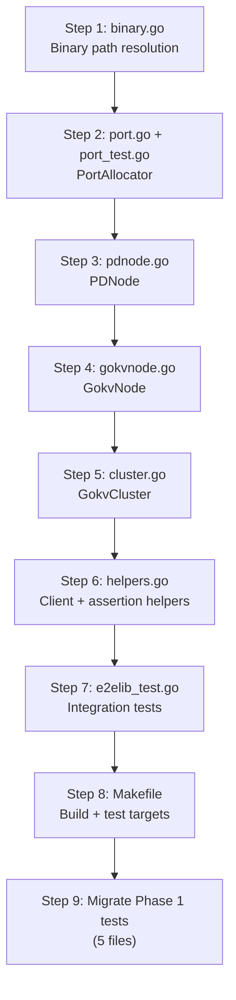
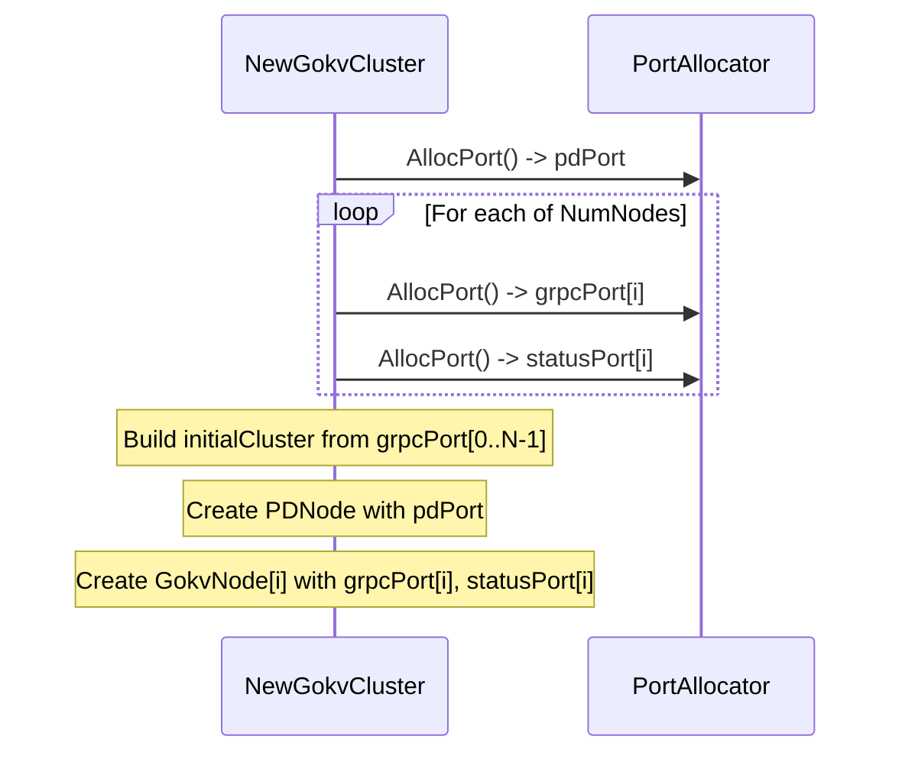
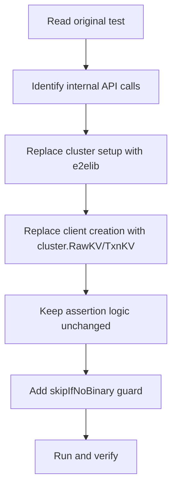

# E2E Test Library for gookv: Implementation Plan

This document provides a step-by-step implementation plan for a coding agent. Each step includes the files to create/modify, the key implementation details, and verification criteria.

---

## 1. Package Structure

```
pkg/e2elib/
    port.go          # PortAllocator
    pdnode.go        # PDNode
    gokvnode.go      # GokvNode
    cluster.go       # GokvCluster
    helpers.go       # Client/assertion helpers
    binary.go        # Binary path resolution
    port_test.go     # Unit tests for PortAllocator
    e2elib_test.go   # Integration test (starts real cluster)
```

---

## 2. Dependencies

| Package | Import Path | Purpose |
|---------|-------------|---------|
| `testing` | `testing` | Go test framework |
| `os/exec` | `os/exec` | Child process management |
| `net` | `net` | Port availability checking |
| `syscall` | `syscall` | File locking (flock) |
| `os` | `os` | File operations, environment variables |
| `path/filepath` | `path/filepath` | Path manipulation |
| `fmt` | `fmt` | Formatting |
| `time` | `time` | Timeouts and polling |
| `strings` | `strings` | String manipulation |
| `strconv` | `strconv` | Number formatting |
| `context` | `context` | Context for client operations |
| `sync` | `sync` | Mutex for port allocator |
| `pkg/client` | `github.com/ryogrid/gookv/pkg/client` | RawKVClient, TxnKVClient |
| `pkg/pdclient` | `github.com/ryogrid/gookv/pkg/pdclient` | PD client for metadata |
| `testify/require` | `github.com/stretchr/testify/require` | Fatal assertions |
| `testify/assert` | `github.com/stretchr/testify/assert` | Non-fatal assertions |

**Critical**: No `internal/` packages may be imported.

---

## 3. Implementation Order



---

## 4. Step-by-Step Implementation

### Step 1: Binary Path Resolution (`binary.go`)

**File**: `pkg/e2elib/binary.go`

**Key implementation**:

```go
package e2elib

// resolveBinary finds the binary path.
// Resolution order: explicit path > env var > repo root > $PATH.
func resolveBinary(name, explicitPath, envVar string) (string, error)

// resolveServerBinary resolves the gookv-server binary.
// Env var: GOOKV_SERVER_BIN
func resolveServerBinary(explicitPath string) (string, error)

// resolvePDBinary resolves the gookv-pd binary.
// Env var: GOOKV_PD_BIN
func resolvePDBinary(explicitPath string) (string, error)

// repoRoot returns the repository root by walking up from the
// current file's directory looking for go.mod.
func repoRoot() (string, error)
```

**Implementation details**:
- Use `runtime.Caller(0)` to find the package source directory
- Walk up directory tree looking for `go.mod` containing `github.com/ryogrid/gookv`
- Check for binary at `<repoRoot>/gookv-server` and `<repoRoot>/gookv-pd`
- Fall back to `exec.LookPath(name)`

**Verification**: Unit test that checks binary resolution in order. Test with and without env vars set.

---

### Step 2: PortAllocator (`port.go` + `port_test.go`)

**File**: `pkg/e2elib/port.go`

**Key implementation**:

```go
const (
    DefaultBasePort = 10200
    DefaultMaxPort  = 32767
    DefaultLockDir  = "/tmp/gookv-e2e-ports"
)

type PortAllocator struct { ... }

func NewPortAllocator(basePort, maxPort int) *PortAllocator
func (pa *PortAllocator) AllocPort() (int, error)
func (pa *PortAllocator) Release(port int)
func (pa *PortAllocator) ReleaseAll()
```

**Implementation details**:
- Create lock directory with `os.MkdirAll` if it does not exist
- Use `syscall.Flock(fd, syscall.LOCK_EX|syscall.LOCK_NB)` for non-blocking exclusive lock
- After acquiring lock, verify port is bindable with `net.Listen("tcp", addr)`
- Close the listener immediately (the flock prevents other processes from using the port)
- Store open file handles in `held` map for later release
- `Release()` calls `syscall.Flock(fd, syscall.LOCK_UN)`, closes the file, and removes the lock file
- Start scanning from a random offset to reduce collision probability

**File**: `pkg/e2elib/port_test.go`

**Tests**:
1. `TestPortAllocator_Basic`: Allocate 5 ports, verify all different, release all
2. `TestPortAllocator_NoDoubleAlloc`: Allocate a port, try to allocate again from separate allocator, should get different port
3. `TestPortAllocator_ReleaseAndReuse`: Allocate, release, allocate again -- should be able to get the released port
4. `TestPortAllocator_PortIsBindable`: Allocate a port, verify `net.Listen` succeeds on it

---

### Step 3: PDNode (`pdnode.go`)

**File**: `pkg/e2elib/pdnode.go`

**Key implementation**:

```go
type PDNodeConfig struct { ... }
type PDNode struct { ... }

func NewPDNode(t *testing.T, alloc *PortAllocator, cfg PDNodeConfig) *PDNode
func (n *PDNode) Start() error
func (n *PDNode) Stop() error
func (n *PDNode) Addr() string
func (n *PDNode) Client() pdclient.Client
func (n *PDNode) LogFile() string
func (n *PDNode) DataDir() string
```

**Implementation details**:

`Start()` implementation:
1. Resolve binary path via `resolvePDBinary(n.cfg.BinaryPath)`
2. Build args: `["--addr", addr, "--cluster-id", clusterID, "--data-dir", dataDir]`
3. If `LogLevel` is set, add `["--log-level", logLevel]`
4. Create `exec.Cmd` with args
5. Open log file at `<dataDir>/pd.log`
6. Set `cmd.Stdout` and `cmd.Stderr` to the log file
7. Call `cmd.Start()`
8. Register `t.Cleanup(func() { n.Stop() })`
9. Poll `net.DialTimeout("tcp", addr, 1*time.Second)` every 100ms for up to 30s
10. On timeout, read last 50 lines of log file and return error with log tail

`Stop()` implementation:
1. If not running, return nil
2. Send `SIGTERM` via `cmd.Process.Signal(syscall.SIGTERM)`
3. Wait for process exit with 10s timeout (use goroutine + channel)
4. If timeout, send `SIGKILL` via `cmd.Process.Kill()`
5. Wait for process exit
6. Set `running = false`
7. Release port via `alloc.Release(port)`

`Client()` implementation:
1. If `pdClient` is already set, return it
2. Create `pdclient.NewClient(ctx, pdclient.Config{Endpoints: []string{addr}})`
3. Register `t.Cleanup(func() { client.Close() })`
4. Cache and return

---

### Step 4: GokvNode (`gokvnode.go`)

**File**: `pkg/e2elib/gokvnode.go`

**Key implementation**:

```go
type GokvNodeConfig struct { ... }
type GokvNode struct { ... }

func NewGokvNode(t *testing.T, alloc *PortAllocator, cfg GokvNodeConfig) *GokvNode
func (n *GokvNode) Start() error
func (n *GokvNode) Stop() error
func (n *GokvNode) Restart() error
// ... etc.
```

**Implementation details**:

`NewGokvNode()`:
1. Allocate 2 ports: grpcPort, statusPort
2. Create `t.TempDir()` for data directory
3. Store config

`Start()` implementation:
1. Resolve binary path via `resolveServerBinary(n.cfg.BinaryPath)`
2. Build args:
   ```
   --store-id <storeID>
   --addr 127.0.0.1:<grpcPort>
   --status-addr 127.0.0.1:<statusPort>
   --data-dir <dataDir>
   --pd-endpoints <comma-separated>
   --initial-cluster <initialCluster>    # omit if empty (join mode)
   --config <configPath>                 # omit if not set
   --log-level <logLevel>                # omit if not set
   ```
3. Append `cfg.ExtraFlags`
4. Create `exec.Cmd`, redirect stdout/stderr to `<dataDir>/server.log`
5. Call `cmd.Start()`
6. Register `t.Cleanup(func() { n.Stop() })`
7. `WaitForReady(30 * time.Second)`

`WaitForReady()` implementation:
- Poll `net.DialTimeout("tcp", grpcAddr, 1s)` every 100ms
- On success, close connection and return nil
- On timeout, read log tail and return error

`WriteConfig()` implementation:
- Write content to `<dataDir>/config.toml`
- Set `n.configPath`

`RawKV()` / `TxnKV()` implementation:
- Create `client.NewClient(ctx, client.Config{PDAddrs: n.cfg.PDEndpoints})`
- Cache the top-level client
- Return `topClient.RawKV()` or `topClient.TxnKV()`

---

### Step 5: GokvCluster (`cluster.go`)

**File**: `pkg/e2elib/cluster.go`

**Key implementation**:

```go
type GokvClusterConfig struct { ... }
type GokvCluster struct { ... }

func NewGokvCluster(t *testing.T, cfg GokvClusterConfig) *GokvCluster
func (c *GokvCluster) Start() error
func (c *GokvCluster) Stop() error
// ... etc.
```

**Implementation details**:

`NewGokvCluster()`:
1. Create `PortAllocator` with configured or default base port
2. Create `PDNode` via `NewPDNode(t, alloc, cfg.PDConfig)`
3. Build `initialCluster` string: allocate grpc ports for all nodes first, then format as `"1=127.0.0.1:port1,2=127.0.0.1:port2,..."`
4. For each node i (0..NumNodes-1):
   - Merge `cfg.NodeConfigs[i]` overrides if provided
   - Set `StoreID = i+1`
   - Set `PDEndpoints = []string{pd.Addr()}`
   - Set `InitialCluster` to the built string
   - Create `GokvNode` via `NewGokvNode(t, alloc, nodeCfg)`
5. If `SplitSize` or `SplitCheckInterval` is set, generate TOML config and call `WriteConfig()` on each node

**Port allocation strategy**: Since `GokvCluster.NewGokvCluster` must know grpc ports of all nodes BEFORE creating any node (for the `initialCluster` string), ports for ALL nodes are allocated upfront in `NewGokvCluster`.



`Start()`:
1. Start PD node
2. Start all server nodes (can be sequential or parallel)
3. Wait for all to be ready

`Stop()`:
1. Close cached client if any
2. Stop all server nodes in reverse order
3. Stop PD node
4. Release all ports via `alloc.ReleaseAll()`

`AddNode()`:
1. Allocate 2 new ports
2. Determine next store ID (`len(c.nodes) + 1`)
3. Create GokvNode with:
   - `StoreID = nextID`
   - `PDEndpoints = []string{pd.Addr()}`
   - `InitialCluster = ""` (join mode -- no initial cluster)
4. Start the node
5. Append to `c.nodes`
6. Return the node

`StopNode(idx)`:
1. Call `c.nodes[idx].Stop()`

`RestartNode(idx)`:
1. Call `c.nodes[idx].Restart()`

---

### Step 6: Client and Assertion Helpers (`helpers.go`)

**File**: `pkg/e2elib/helpers.go`

**Key implementation**:

```go
// PutAndVerify writes a key and reads it back to verify.
func PutAndVerify(t *testing.T, rawKV *client.RawKVClient, key, value []byte) {
    t.Helper()
    ctx := context.Background()
    err := rawKV.Put(ctx, key, value)
    require.NoError(t, err, "PutAndVerify: Put failed for key %s", key)

    got, notFound, err := rawKV.Get(ctx, key)
    require.NoError(t, err, "PutAndVerify: Get failed for key %s", key)
    require.False(t, notFound, "PutAndVerify: key %s not found after Put", key)
    require.Equal(t, value, got, "PutAndVerify: value mismatch for key %s", key)
}

// WaitForCondition polls fn every 200ms until true or timeout.
func WaitForCondition(t *testing.T, timeout time.Duration, msg string, fn func() bool) {
    t.Helper()
    deadline := time.Now().Add(timeout)
    for time.Now().Before(deadline) {
        if fn() {
            return
        }
        time.Sleep(200 * time.Millisecond)
    }
    t.Fatalf("WaitForCondition timed out: %s", msg)
}

// WaitForRegionCount polls PD for region count.
func WaitForRegionCount(t *testing.T, pd pdclient.Client, minCount int, timeout time.Duration) int {
    t.Helper()
    var count int
    WaitForCondition(t, timeout, fmt.Sprintf("region count >= %d", minCount), func() bool {
        ctx := context.Background()
        // Scan regions by querying PD for keys at regular intervals.
        // Use a binary-search-like approach to count regions.
        regions := countRegions(ctx, pd)
        count = regions
        return regions >= minCount
    })
    return count
}

// countRegions counts regions by scanning PD's region map.
func countRegions(ctx context.Context, pd pdclient.Client) int {
    count := 0
    var key []byte
    for {
        region, _, err := pd.GetRegion(ctx, key)
        if err != nil || region == nil {
            break
        }
        count++
        endKey := region.GetEndKey()
        if len(endKey) == 0 {
            break // last region
        }
        key = endKey
    }
    return count
}

// SeedAccounts creates accounts using TxnKVClient.
func SeedAccounts(t *testing.T, txnKV *client.TxnKVClient, numAccounts, initialBalance int) {
    t.Helper()
    ctx := context.Background()
    txn, err := txnKV.Begin(ctx)
    require.NoError(t, err)

    for i := 0; i < numAccounts; i++ {
        key := []byte(fmt.Sprintf("acct-%05d", i))
        value := []byte(strconv.Itoa(initialBalance))
        err := txn.Set(ctx, key, value)
        require.NoError(t, err)
    }

    err = txn.Commit(ctx)
    require.NoError(t, err)
}

// readLastLines reads the last n lines from a file.
func readLastLines(path string, n int) string { ... }

// DumpLogs writes node logs to t.Log for diagnostics.
func (c *GokvCluster) DumpLogs() { ... }
```

**Additional helper**: `DialTikvClient` for tests that need raw gRPC access:

```go
// DialTikvClient creates a raw gRPC TikvClient to the given address.
// The connection is cleaned up when the test ends.
func DialTikvClient(t *testing.T, addr string) tikvpb.TikvClient {
    t.Helper()
    conn, err := grpc.Dial(addr,
        grpc.WithTransportCredentials(insecure.NewCredentials()),
    )
    require.NoError(t, err)
    t.Cleanup(func() { conn.Close() })
    return tikvpb.NewTikvClient(conn)
}
```

---

### Step 7: Integration Tests (`e2elib_test.go`)

**File**: `pkg/e2elib/e2elib_test.go`

**Tests** (run only when binaries are available):

```go
// TestIntegration_SingleNodeCluster verifies the library can start
// a 1-node cluster and perform basic operations.
func TestIntegration_SingleNodeCluster(t *testing.T) {
    if testing.Short() {
        t.Skip("skipping integration test in short mode")
    }
    cluster := NewGokvCluster(t, GokvClusterConfig{NumNodes: 1})
    defer cluster.Stop()
    require.NoError(t, cluster.Start())

    rawKV := cluster.RawKV()
    PutAndVerify(t, rawKV, []byte("test-key"), []byte("test-value"))
}

// TestIntegration_ThreeNodeCluster verifies a 3-node cluster.
func TestIntegration_ThreeNodeCluster(t *testing.T) { ... }

// TestIntegration_PDNode verifies standalone PDNode operations.
func TestIntegration_PDNode(t *testing.T) { ... }

// TestIntegration_StopAndRestart verifies node restart.
func TestIntegration_StopAndRestart(t *testing.T) { ... }
```

**Build guard**: Tests should check for binary existence and skip if not found:

```go
func init() {
    _, err := resolveServerBinary("")
    if err != nil {
        // Binary not available; tests will be skipped
    }
}

func skipIfNoBinary(t *testing.T) {
    t.Helper()
    if _, err := resolveServerBinary(""); err != nil {
        t.Skipf("gookv-server binary not found: %v (run 'make build' first)", err)
    }
    if _, err := resolvePDBinary(""); err != nil {
        t.Skipf("gookv-pd binary not found: %v (run 'make build' first)", err)
    }
}
```

---

### Step 8: Makefile Integration

**File**: `Makefile` (modify existing)

Add the following target:

```makefile
test-e2e-external: build
	go test ./pkg/e2elib/... -v -count=1 -timeout 300s
	go test ./e2e_external/... -v -count=1 -timeout 300s
```

The `build` dependency ensures binaries are compiled before tests run.

---

### Step 9: Migrate Phase 1 Tests

Create `e2e_external/` directory with migrated tests.

**File structure**:

```
e2e_external/
    helpers_test.go            # Shared test helpers (DialTikvClient, etc.)
    raw_kv_test.go             # Migrated from e2e/raw_kv_test.go
    raw_kv_extended_test.go    # Migrated from e2e/raw_kv_extended_test.go
    pd_server_test.go          # Migrated from e2e/pd_server_test.go
    txn_rpc_test.go            # Migrated from e2e/txn_rpc_test.go
    async_commit_test.go       # Migrated from e2e/async_commit_test.go
    client_lib_test.go         # Migrated from e2e/client_lib_test.go
```

**Migration pattern for each test**:



**Example migration** (`raw_kv_test.go`):

Before (current):
```go
func TestRawKVPutGetDelete(t *testing.T) {
    addr, _ := startStandaloneServer(t)    // INTERNAL
    _, client := dialTikvClient(t, addr)   // raw gRPC
    ctx := context.Background()

    putResp, err := client.RawPut(ctx, &kvrpcpb.RawPutRequest{...})
    // ...
}
```

After (migrated):
```go
func TestRawKVPutGetDelete(t *testing.T) {
    skipIfNoBinary(t)

    cluster := e2elib.NewGokvCluster(t, e2elib.GokvClusterConfig{NumNodes: 1})
    defer cluster.Stop()
    require.NoError(t, cluster.Start())

    rawKV := cluster.RawKV()
    ctx := context.Background()

    err := rawKV.Put(ctx, []byte("raw-key-1"), []byte("raw-value-1"))
    require.NoError(t, err)

    val, notFound, err := rawKV.Get(ctx, []byte("raw-key-1"))
    require.NoError(t, err)
    assert.False(t, notFound)
    assert.Equal(t, []byte("raw-value-1"), val)
    // ...
}
```

For tests needing raw gRPC (RawBatchScan, KvPrewrite, etc.):
```go
func TestRawBatchScan(t *testing.T) {
    skipIfNoBinary(t)

    cluster := e2elib.NewGokvCluster(t, e2elib.GokvClusterConfig{NumNodes: 1})
    defer cluster.Stop()
    require.NoError(t, cluster.Start())

    // Use raw gRPC for RPCs not in pkg/client
    client := e2elib.DialTikvClient(t, cluster.Node(0).Addr())
    ctx := context.Background()

    // ... same test logic using raw gRPC ...
}
```

---

## 5. Verification Checklist

After implementing each step, verify:

### Step 1 (binary.go)
- [ ] `resolveServerBinary("")` finds `gookv-server` in repo root after `make build`
- [ ] `resolvePDBinary("")` finds `gookv-pd` in repo root after `make build`
- [ ] Setting `GOOKV_SERVER_BIN=/some/path` overrides repo root detection
- [ ] Returns clear error when binary is not found

### Step 2 (port.go)
- [ ] `port_test.go` passes: `go test ./pkg/e2elib/ -run TestPortAllocator -v`
- [ ] Parallel allocations from different PortAllocator instances get different ports
- [ ] Released ports can be reused
- [ ] Lock files are created in `/tmp/gookv-e2e-ports/`

### Step 3 (pdnode.go)
- [ ] `PDNode.Start()` starts a real `gookv-pd` process
- [ ] `PDNode.Addr()` returns a reachable address
- [ ] `PDNode.Client()` returns a working `pdclient.Client`
- [ ] `PDNode.Stop()` terminates the process
- [ ] Log file exists at `PDNode.LogFile()`

### Step 4 (gokvnode.go)
- [ ] `GokvNode.Start()` starts a real `gookv-server` process
- [ ] `GokvNode.Addr()` returns a reachable gRPC address
- [ ] `GokvNode.Stop()` terminates the process
- [ ] `GokvNode.Restart()` stops then starts successfully
- [ ] `GokvNode.WriteConfig()` creates a valid TOML file

### Step 5 (cluster.go)
- [ ] `GokvCluster.Start()` starts PD + all nodes
- [ ] `GokvCluster.RawKV()` returns a working client
- [ ] `GokvCluster.TxnKV()` returns a working client
- [ ] `GokvCluster.Stop()` terminates all processes
- [ ] `GokvCluster.AddNode()` starts a new node in join mode
- [ ] `GokvCluster.StopNode(0)` stops node 0
- [ ] `GokvCluster.RestartNode(0)` restarts node 0

### Step 6 (helpers.go)
- [ ] `PutAndVerify` works end-to-end
- [ ] `WaitForCondition` times out correctly
- [ ] `readLastLines` returns correct tail of log file

### Step 7 (e2elib_test.go)
- [ ] `go test ./pkg/e2elib/ -v -count=1 -timeout 120s` passes (after `make build`)
- [ ] Tests skip gracefully when binaries are not built

### Step 8 (Makefile)
- [ ] `make test-e2e-external` builds binaries then runs tests
- [ ] CI can run `make test-e2e-external` successfully

### Step 9 (Phase 1 migration)
- [ ] All 22 migrated tests pass: `go test ./e2e_external/ -v -count=1 -timeout 300s`
- [ ] Original tests still pass: `go test ./e2e/ -v -count=1 -timeout 120s`
- [ ] No `internal/` imports in `e2e_external/` or `pkg/e2elib/`

---

## 6. Implementation Constraints

1. **No `internal/` imports**: The library and migrated tests must only import `pkg/` packages.

2. **Go test integration**: Use `*testing.T` throughout. Use `t.Helper()` for all helper functions. Use `t.Cleanup()` for resource cleanup. Use `t.Skip()` when binaries are not available.

3. **Timeout discipline**: All polling loops must have a configurable timeout. Default: 30s for WaitForReady, 60s for WaitForSplit.

4. **Error messages**: Include actionable information in errors (e.g., "run 'make build' first", log file path, port number).

5. **Process management**: Always kill child processes on cleanup. Never leave orphan processes. Handle both graceful (SIGTERM) and forced (SIGKILL) termination.

6. **Port range**: Default 10200-32767. Must not conflict with commonly used ports or the Makefile demo clusters (which use ports 20160-20499 and 2379-2419).

7. **Parallel safety**: Each test creates its own `GokvCluster` with unique ports. Tests can run in parallel via `go test -parallel`.

---

## 7. Estimated Effort

| Step | Estimated Lines | Complexity |
|------|----------------|------------|
| Step 1: binary.go | ~80 | Low |
| Step 2: port.go + port_test.go | ~200 | Medium |
| Step 3: pdnode.go | ~200 | Medium |
| Step 4: gokvnode.go | ~300 | Medium |
| Step 5: cluster.go | ~350 | High |
| Step 6: helpers.go | ~250 | Low |
| Step 7: e2elib_test.go | ~150 | Low |
| Step 8: Makefile | ~10 | Low |
| Step 9: Phase 1 migration (6 files) | ~600 | Medium |
| **Total** | **~2140** | |
