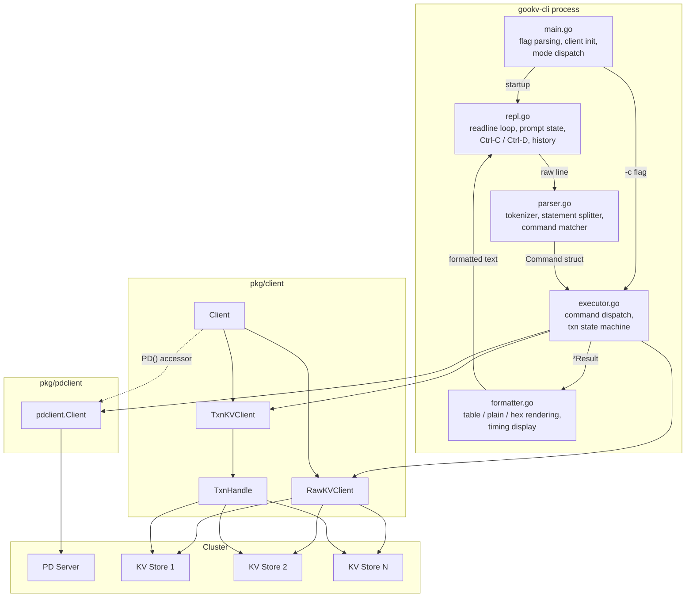
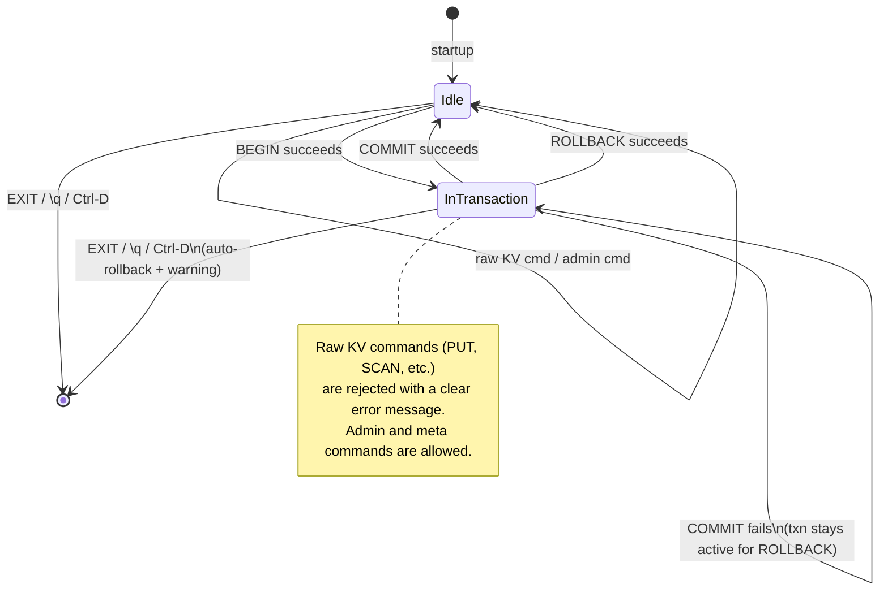

# gookv-cli Detailed Design

This document specifies the internal architecture, data types, and algorithms for
`gookv-cli`. It is the canonical reference for implementation. All cross-document
contradictions from the external spec (`01_overview.md`, `02_command_reference.md`,
`03_implementation_plan.md`) have been resolved per the addenda and
`review_notes.md`.

---

## 1. Architecture Overview



### Package layout

```
cmd/gookv-cli/
  main.go          # Entry point: flags, client init, mode dispatch
  parser.go        # Tokenizer, statement splitter, command parser
  executor.go      # Command dispatch, txn state, per-command ctx
  formatter.go     # Output rendering (table, plain, hex, timing)
  repl.go          # REPL loop, readline, prompt state machine
```

All files are `package main`. The CLI depends on:

| Import | Purpose |
|--------|---------|
| `pkg/client` | `Client`, `RawKVClient`, `TxnKVClient`, `TxnHandle`, `KvPair`, `TxnOption` |
| `pkg/pdclient` | `pdclient.Client` interface, `TimeStamp`, `TimeStampFromUint64` |
| `github.com/chzyer/readline` v1.5.1 | Line editing, history, Ctrl-C/Ctrl-D |
| `github.com/olekukonko/tablewriter` v0.0.5 | ASCII table rendering |

### Prerequisite change to `pkg/client`

`pkg/client.Client` stores `pdClient pdclient.Client` as an unexported field. The
CLI needs access for admin commands. Add:

```go
// PD returns the underlying PD client for administrative queries.
func (c *Client) PD() pdclient.Client {
    return c.pdClient
}
```

This is a one-line addition to `pkg/client/client.go`.

---

## 2. Parser Design

The parser converts raw user input into `Command` structs. It operates in three
stages: statement splitting, tokenization, and command matching.

### 2.1 Statement Splitter

```go
// SplitStatements splits input on semicolons, respecting quoted strings and
// hex literals. Returns complete statements and whether the trailing segment
// was terminated by a semicolon.
func SplitStatements(input string) (stmts []string, complete bool)
```

The splitter walks the input character-by-character, tracking:
- Inside double-quoted string (`"..."`) -- semicolons are literal
- Inside hex literal (`x'...'`) -- semicolons are literal
- Escape sequences (`\"`, `\\`) inside quoted strings

When a `;` is encountered outside any quoting context, the accumulated text is
trimmed and appended to `stmts`. If the final segment is non-empty and
unterminated, `complete` is false; the REPL stores it as a continuation buffer.

**Multi-line accumulation:** The REPL appends each readline result to a buffer
separated by a space. After each append, `SplitStatements` is called on the full
buffer. Complete statements are extracted and executed; if `complete` is false,
the REPL switches to the continuation prompt and reads more input.

### 2.2 Tokenizer

```go
// Tokenize splits a single statement into tokens. Whitespace-delimited,
// respecting double-quoted strings and hex literals (0x... and x'...').
// Quoted strings are returned with quotes stripped and escape sequences
// resolved. Hex literals (0x... and x'...') are returned as-is for later
// decoding.
func Tokenize(stmt string) ([]Token, error)

// Token represents a parsed token with its original form and decoded bytes.
type Token struct {
    Raw   string // original text for error messages
    Bytes []byte // decoded value: UTF-8 for strings, binary for hex
    IsHex bool   // true if the token was a hex literal
}
```

**Tokenization rules:**

1. Whitespace (space, tab, `\r`, `\n`) separates tokens.
2. `"..."` is a quoted string. Supports escapes: `\\`, `\"`, `\n`, `\t`.
   Quotes are stripped; the inner content becomes UTF-8 bytes.
3. `0x[0-9a-fA-F]+` is a hex literal. Decoded to raw bytes.
4. `x'[0-9a-fA-F]+'` is an alternate hex literal (MySQL-style). Decoded to raw
   bytes.
5. Everything else is an unquoted token (cannot contain whitespace, `;`, `"`).
   Treated as UTF-8 bytes.

**ASCII art example:**

```
Input:  PUT "hello world" x'CAFE';

        ┌───┐ ┌─────────────┐ ┌──────┐
Tokens: │PUT│ │"hello world" │ │x'CAFE│
        └───┘ └─────────────┘ └──────┘
          │         │              │
          ▼         ▼              ▼
    Bytes: "PUT"  "hello world"  [0xCA, 0xFE]
    IsHex: false  false          true
```

### 2.3 Command Parser

```go
// ParseCommand parses a list of tokens into a Command.
// The first token (case-insensitive) determines the command type.
// Returns an error for unknown commands or wrong argument counts.
func ParseCommand(tokens []Token, inTransaction bool) (Command, error)
```

**Dispatch flowchart:**

```mermaid
flowchart TD
    A[tokens] --> B{first token?}

    B -->|GET| C{inTransaction?}
    C -->|yes| C1[CmdTxnGet: expect 1 arg]
    C -->|no| C2[CmdGet: expect 1 arg]

    B -->|PUT| D[CmdPut: expect 2 args + optional TTL]
    B -->|SET| E{inTransaction?}
    E -->|yes| E1[CmdTxnSet: expect 2 args]
    E -->|no| E2["ERROR: SET only valid in txn"]

    B -->|DELETE| F{second token == RANGE?}
    F -->|yes| F1[CmdDeleteRange: expect 2 key args]
    F -->|no| F2{inTransaction?}
    F2 -->|yes| F3[CmdTxnDelete: expect 1 arg]
    F2 -->|no| F4[CmdDelete: expect 1 arg]

    B -->|BGET| G{inTransaction?}
    G -->|yes| G1[CmdTxnBatchGet: expect 1+ args]
    G -->|no| G2[CmdBatchGet: expect 1+ args]

    B -->|SCAN| H[CmdScan: 2 args + optional LIMIT]
    B -->|BPUT| I[CmdBatchPut: expect even args >= 2]
    B -->|BDELETE| J[CmdBatchDelete: expect 1+ args]
    B -->|TTL| K[CmdTTL: expect 1 arg]
    B -->|CAS| L[CmdCAS: 3 args + optional NOT_EXIST]
    B -->|CHECKSUM| M[CmdChecksum: 0 or 2 args]

    B -->|BEGIN| N[CmdBegin: parse options]
    B -->|COMMIT| O[CmdCommit: no args]
    B -->|ROLLBACK| P[CmdRollback: no args]

    B -->|STORE| Q{second token?}
    Q -->|LIST| Q1[CmdStoreList]
    Q -->|STATUS| Q2[CmdStoreStatus: expect int arg]

    B -->|REGION| R{second token?}
    R -->|LIST| R1[CmdRegionList: optional LIMIT]
    R -->|ID| R2[CmdRegionByID: expect int arg]
    R -->|other| R3[CmdRegion: 1 key arg]

    B -->|CLUSTER| S{second token == INFO?}
    S -->|yes| S1[CmdClusterInfo]

    B -->|TSO| T[CmdTSO]
    B -->|GC| U{second == SAFEPOINT?}
    U -->|yes| U1[CmdGCSafePoint]
    B -->|STATUS| V[CmdStatus: optional addr arg]

    B -->|HELP| W[CmdHelp]
    B -->|EXIT / QUIT| X[CmdExit]

    B -->|unknown| Z["ERROR: unknown command"]
```



**Key disambiguation rules:**

- `DELETE` vs `DELETE RANGE`: peek at second token; if it is the keyword `RANGE`
  (case-insensitive), parse as `CmdDeleteRange` with the next two tokens as keys.
  Otherwise parse as a single-key delete.
- `STORE LIST` / `STORE STATUS` / `REGION LIST` / `REGION ID` / `GC SAFEPOINT` /
  `CLUSTER INFO`: two-word commands resolved by the second token.
- `GET` / `DELETE` / `BGET` context sensitivity: `inTransaction` flag determines
  whether the command dispatches to raw or transactional variants. The parser
  emits distinct `CommandType` values (`CmdGet` vs `CmdTxnGet`, etc.).
- `SET` is only valid inside a transaction. Outside a transaction, `SET` produces a
  helpful error: `SET is only valid inside a transaction (use PUT for raw KV writes)`.
- `CAS ... NOT_EXIST`: if the last token is the keyword `NOT_EXIST`
  (case-insensitive), set `NotExist: true` on the command and use the preceding
  token as a placeholder (ignored).

**Argument decoding:**

Integer arguments (LIMIT, TTL, LOCK_TTL, store ID, region ID) are parsed with
`strconv.ParseInt`. Keys and values are taken directly from `Token.Bytes`.
Empty-string keys (`""`) are allowed for range boundaries but rejected by the
executor for point operations (GET, PUT, DELETE, SET, TTL, CAS).

---

## 3. Executor Design

### 3.1 Core Types

```go
// CommandType identifies which operation a parsed statement represents.
type CommandType int

const (
    // Raw KV
    CmdGet         CommandType = iota
    CmdPut
    CmdPutTTL
    CmdDelete
    CmdTTL
    CmdScan
    CmdBatchGet
    CmdBatchPut
    CmdBatchDelete
    CmdDeleteRange
    CmdCAS
    CmdChecksum

    // Transactional (context-sensitive dispatch)
    CmdTxnGet
    CmdTxnBatchGet
    CmdTxnSet
    CmdTxnDelete
    CmdBegin
    CmdCommit
    CmdRollback

    // Admin
    CmdClusterInfo
    CmdStoreList
    CmdStoreStatus
    CmdRegion
    CmdRegionByID
    CmdRegionList
    CmdTSO
    CmdGCSafePoint
    CmdStatus

    // Meta (keyword forms)
    CmdHelp
    CmdExit
)

// Command represents a single parsed statement ready for execution.
type Command struct {
    Type     CommandType
    Keys     [][]byte        // positional key arguments
    Values   [][]byte        // positional value arguments
    IntArg   int64           // numeric argument (limit, TTL, store/region ID)
    TxnOpts  []client.TxnOption // BEGIN options
    NotExist bool            // CAS NOT_EXIST flag
    AddrArg  string          // STATUS <addr> argument
}
```

### 3.2 Handler Pattern

```go
// CommandHandler executes a single command and returns a result.
type CommandHandler func(ctx context.Context, cmd Command) (*Result, error)

// Executor holds client state, the transaction state machine, and dispatches
// commands to the appropriate handler.
type Executor struct {
    client   *client.Client
    rawkv    *client.RawKVClient
    txnkv    *client.TxnKVClient
    pdClient pdclient.Client

    // Transaction state
    activeTxn *client.TxnHandle // nil when not in a transaction

    // Handler registry
    handlers map[CommandType]CommandHandler

    // Session settings
    defaultScanLimit int // default: 100, changed by \pagesize
}

// NewExecutor creates an Executor from a connected client.
func NewExecutor(c *client.Client) *Executor {
    e := &Executor{
        client:           c,
        rawkv:            c.RawKV(),
        txnkv:            c.TxnKV(),
        pdClient:         c.PD(),    // requires the new PD() accessor
        defaultScanLimit: 100,
        handlers:         make(map[CommandType]CommandHandler),
    }
    e.registerHandlers()
    return e
}

// InTransaction returns true if a transaction is active.
func (e *Executor) InTransaction() bool {
    return e.activeTxn != nil
}

// Exec dispatches a command to the appropriate handler.
func (e *Executor) Exec(ctx context.Context, cmd Command) (*Result, error) {
    h, ok := e.handlers[cmd.Type]
    if !ok {
        return nil, fmt.Errorf("unhandled command type: %d", cmd.Type)
    }
    return h(ctx, cmd)
}
```

### 3.3 Context-Sensitive Dispatch

The parser resolves context sensitivity at parse time by consulting
`executor.InTransaction()`. This means the executor receives distinct command
types (`CmdGet` vs `CmdTxnGet`) and does not need its own dispatch logic for
ambiguous commands. The handler registry maps each type to exactly one function:

```go
func (e *Executor) registerHandlers() {
    // Raw KV
    e.handlers[CmdGet] = e.execRawGet
    e.handlers[CmdPut] = e.execRawPut
    e.handlers[CmdPutTTL] = e.execRawPutTTL
    e.handlers[CmdDelete] = e.execRawDelete
    e.handlers[CmdTTL] = e.execRawTTL
    e.handlers[CmdScan] = e.execRawScan
    e.handlers[CmdBatchGet] = e.execRawBatchGet
    e.handlers[CmdBatchPut] = e.execRawBatchPut
    e.handlers[CmdBatchDelete] = e.execRawBatchDelete
    e.handlers[CmdDeleteRange] = e.execRawDeleteRange
    e.handlers[CmdCAS] = e.execRawCAS
    e.handlers[CmdChecksum] = e.execRawChecksum

    // Transactional
    e.handlers[CmdTxnGet] = e.execTxnGet
    e.handlers[CmdTxnBatchGet] = e.execTxnBatchGet
    e.handlers[CmdTxnSet] = e.execTxnSet
    e.handlers[CmdTxnDelete] = e.execTxnDelete
    e.handlers[CmdBegin] = e.execBegin
    e.handlers[CmdCommit] = e.execCommit
    e.handlers[CmdRollback] = e.execRollback

    // Admin
    e.handlers[CmdClusterInfo] = e.execClusterInfo
    e.handlers[CmdStoreList] = e.execStoreList
    e.handlers[CmdStoreStatus] = e.execStoreStatus
    e.handlers[CmdRegion] = e.execRegion
    e.handlers[CmdRegionByID] = e.execRegionByID
    e.handlers[CmdRegionList] = e.execRegionList
    e.handlers[CmdTSO] = e.execTSO
    e.handlers[CmdGCSafePoint] = e.execGCSafePoint
    e.handlers[CmdStatus] = e.execStatus

    // Meta (keyword forms)
    e.handlers[CmdHelp] = e.execHelp
    e.handlers[CmdExit] = e.execExit
}
```

### 3.4 Not-Found Semantics

The two Get APIs differ in how they signal "not found":

| API | Signature | Not-Found Signal |
|-----|-----------|-----------------|
| `RawKVClient.Get` | `(ctx, key) ([]byte, bool, error)` | Second return `true` means not found |
| `TxnHandle.Get` | `(ctx, key) ([]byte, error)` | `nil` value with `nil` error means not found |

The executor must handle both:

```go
func (e *Executor) execRawGet(ctx context.Context, cmd Command) (*Result, error) {
    val, notFound, err := e.rawkv.Get(ctx, cmd.Keys[0])
    if err != nil {
        return nil, err
    }
    if notFound {
        return &Result{Type: ResultNotFound}, nil
    }
    return &Result{Type: ResultValue, Value: val}, nil
}

func (e *Executor) execTxnGet(ctx context.Context, cmd Command) (*Result, error) {
    val, err := e.activeTxn.Get(ctx, cmd.Keys[0])
    if err != nil {
        return nil, err
    }
    if val == nil {
        return &Result{Type: ResultNil}, nil  // "(nil)" for txn context
    }
    return &Result{Type: ResultValue, Value: val}, nil
}
```

### 3.5 Transaction State Machine



**State transitions:**

| Event | From | To | Action |
|-------|------|----|--------|
| `BEGIN` succeeds | Idle | InTransaction | `e.activeTxn = txn` |
| `BEGIN` when already in txn | InTransaction | InTransaction | Error: "transaction already in progress" |
| `COMMIT` succeeds | InTransaction | Idle | `e.activeTxn = nil` |
| `COMMIT` fails (write conflict, etc.) | InTransaction | InTransaction | Error displayed; txn stays active for ROLLBACK |
| `ROLLBACK` succeeds | InTransaction | Idle | `e.activeTxn = nil` |
| `EXIT` / Ctrl-D with active txn | InTransaction | Exit | Warning + auto-rollback |
| Raw KV cmd in txn | InTransaction | InTransaction | Error: "use GET/SET/DELETE inside a transaction" |

**Commit failure handling:** On commit failure, `e.activeTxn` is NOT set to nil
(unless the error is "already committed"). The user can issue `ROLLBACK` to clean
up locks. This matches the `02_command_reference.md` Section 3.5 spec.

```go
func (e *Executor) execCommit(ctx context.Context, cmd Command) (*Result, error) {
    if e.activeTxn == nil {
        return nil, fmt.Errorf("no active transaction")
    }
    err := e.activeTxn.Commit(ctx)
    if err != nil {
        // Keep txn active so user can ROLLBACK, unless already committed
        if errors.Is(err, client.ErrTxnCommitted) {
            e.activeTxn = nil
        }
        return nil, err
    }
    e.activeTxn = nil
    return &Result{Type: ResultOK, Message: "committed"}, nil
}
```

### 3.6 Per-Command Context for Ctrl-C

The main context (`signal.NotifyContext`) must NOT be passed directly to
`Exec()`. If it were, Ctrl-C during a long SCAN would cancel the context and
terminate the entire CLI. Instead, the REPL creates a per-command child context:

```go
// In the REPL loop, for each command execution:
cmdCtx, cmdCancel := context.WithCancel(ctx)

// Set up a goroutine that cancels cmdCtx on readline interrupt.
// (Implementation detail: use a channel or signal handler.)
result, err := exec.Exec(cmdCtx, cmd)
cmdCancel() // always clean up
```

This way, Ctrl-C during a long-running RPC cancels only the in-flight operation.
The REPL continues running. The session-level context is only cancelled by
`SIGTERM`, `SIGINT` (second press), or graceful exit.

---

## 4. Formatter Design

### 4.1 Result Types

```go
// ResultType determines how the formatter renders the output.
type ResultType int

const (
    ResultOK       ResultType = iota // "OK" (PUT, DELETE, COMMIT, SET, etc.)
    ResultValue                      // single value display (raw GET)
    ResultNotFound                   // "(not found)" (raw GET miss)
    ResultNil                        // "(nil)" (txn GET miss)
    ResultRows                       // key-value table (SCAN, BGET, TBGET)
    ResultTable                      // arbitrary-column table (STORE LIST, CLUSTER INFO)
    ResultScalar                     // single named scalar (TTL, GC SAFEPOINT)
    ResultCAS                        // CAS result (swapped flag + previous value)
    ResultChecksum                   // checksum + totalKvs + totalBytes
    ResultMessage                    // free-form text (HELP, BEGIN output, TSO, REGION)
)

// Result holds the output of a command execution.
type Result struct {
    Type       ResultType
    Value      []byte            // ResultValue
    Rows       []client.KvPair   // ResultRows
    Columns    []string          // ResultTable headers
    TableRows  [][]string        // ResultTable data
    Scalar     string            // ResultScalar (pre-formatted string)
    Swapped    bool              // ResultCAS
    PrevVal    []byte            // ResultCAS
    Checksum   uint64            // ResultChecksum
    TotalKvs   uint64            // ResultChecksum
    TotalBytes uint64            // ResultChecksum
    Message    string            // ResultMessage / ResultOK detail
    NotFound   int               // count of not-found keys (BGET)
}
```

### 4.2 Formatter Struct

```go
// DisplayMode controls how binary data is rendered.
type DisplayMode int

const (
    DisplayAuto   DisplayMode = iota // string if all printable ASCII, hex otherwise
    DisplayHex                       // always hex
    DisplayString                    // always string (non-printable as \xNN)
)

// OutputFormat controls the structural format of multi-row results.
type OutputFormat int

const (
    FormatTable OutputFormat = iota // ASCII box tables (default)
    FormatPlain                     // tab-separated, one pair per line
    FormatHexPlain                  // tab-separated, always hex-encoded
)

// Formatter renders Results to the terminal.
type Formatter struct {
    out          io.Writer     // typically os.Stdout
    errOut       io.Writer     // typically os.Stderr
    displayMode  DisplayMode
    outputFormat OutputFormat
    showTiming   bool          // default: true
}

// NewFormatter creates a Formatter with default settings.
func NewFormatter(out, errOut io.Writer) *Formatter {
    return &Formatter{
        out:          out,
        errOut:       errOut,
        displayMode:  DisplayAuto,
        outputFormat: FormatTable,
        showTiming:   true,
    }
}

// Format writes the rendered result and optional timing to the output.
func (f *Formatter) Format(result *Result, elapsed time.Duration)

// FormatError writes an error message to stderr.
func (f *Formatter) FormatError(err error)

// SetDisplayMode changes the display mode (auto/hex/string).
func (f *Formatter) SetDisplayMode(m DisplayMode)

// SetOutputFormat changes the output format (table/plain/hex).
func (f *Formatter) SetOutputFormat(fmt OutputFormat)

// SetTiming enables or disables timing display.
func (f *Formatter) SetTiming(on bool)
```

### 4.3 Display Helpers

```go
// formatBytes renders a byte slice according to the current DisplayMode.
func (f *Formatter) formatBytes(data []byte) string {
    switch f.displayMode {
    case DisplayHex:
        return hex.EncodeToString(data)
    case DisplayString:
        return formatAsString(data) // non-printable bytes as \xNN
    default: // DisplayAuto
        if isPrintableASCII(data) {
            return string(data)
        }
        return hex.EncodeToString(data)
    }
}

// isPrintableASCII returns true if all bytes are in [0x20, 0x7E].
func isPrintableASCII(data []byte) bool
```

### 4.4 Output Mockups

**TABLE format -- Single value (GET):**

```
gookv> GET mykey;
"myvalue"
(0.3ms)
```

Single values use a compact quoted-string format (per `02_command_reference.md`
addendum). If the value contains non-printable bytes in auto mode:

```
gookv> GET binkey;
"48656c6c6f00776f726c64" (hex)
(0.4ms)
```

**TABLE format -- Key-value table (SCAN):**

```
gookv> SCAN a z LIMIT 5;
+------+--------+
| Key  | Value  |
+------+--------+
| a    | 1      |
| b    | 2      |
| c    | 3      |
+------+--------+
(3 rows, 1.2ms)
```

**TABLE format -- Not found:**

```
gookv> GET nokey;
(not found)
(0.2ms)
```

**TABLE format -- Nil (txn context):**

```
gookv(txn)> GET nokey;
(nil)
(0.3ms)
```

**TABLE format -- OK:**

```
gookv> PUT k1 v1;
OK
(0.8ms)
```

**TABLE format -- BGET with missing keys:**

```
gookv> BGET user:001 user:002 user:999;
+----------+-------+
| Key      | Value |
+----------+-------+
| user:001 | alice |
| user:002 | bob   |
+----------+-------+
(2 rows, 1 not found, 1.3ms)
```

**TABLE format -- Admin table (STORE LIST):**

```
gookv> STORE LIST;
+---------+---------------------+-------+
| StoreID | Address             | State |
+---------+---------------------+-------+
|       1 | 127.0.0.1:20160     | Up    |
|       2 | 127.0.0.1:20161     | Up    |
|       3 | 127.0.0.1:20162     | Up    |
+---------+---------------------+-------+
(3 stores)
```

**TABLE format -- CAS success:**

```
gookv> CAS counter "2" "1";
OK (swapped)
  previous: "1"
(1.0ms)
```

**TABLE format -- CAS failure:**

```
gookv> CAS counter "2" "1";
FAILED (not swapped)
  previous: "5"
(0.9ms)
```

**TABLE format -- CHECKSUM:**

```
gookv> CHECKSUM "user:" "user:~";
Checksum:    0xa3f7e2b104c8d91e
Total keys:  1,247
Total bytes: 89,412
(45.3ms)
```

**PLAIN format -- SCAN:**

```
a	1
b	2
c	3
(3 rows, 1.2ms)
```

**HEX format -- SCAN:**

```
61	31
62	32
63	33
(3 rows, 1.2ms)
```

**Timing line format:**

```
(N.Nms)         # single result
(N rows, N.Nms) # multi-row
(N stores)      # admin count
```

No space before `ms` (per review resolution [S-3]).

### 4.5 Table Rendering

For `ResultRows` and `ResultTable`, use `olekukonko/tablewriter`:

```go
func (f *Formatter) renderTable(columns []string, rows [][]string) {
    tw := tablewriter.NewWriter(f.out)
    tw.SetHeader(columns)
    tw.SetBorders(tablewriter.Border{Left: true, Top: true, Right: true, Bottom: true})
    tw.SetCenterSeparator("+")
    tw.SetColumnSeparator("|")
    tw.SetRowSeparator("-")
    tw.AppendBulk(rows)
    tw.Render()
}
```

For `FormatPlain` and `FormatHexPlain`, write tab-separated output directly
without the tablewriter library.

---

## 5. REPL Design

### 5.1 readline Integration

```go
func runREPL(ctx context.Context, exec *Executor, fmtr *Formatter) int {
    rl, err := readline.NewEx(&readline.Config{
        Prompt:            "gookv> ",
        HistoryFile:       filepath.Join(os.Getenv("HOME"), ".gookv_history"),
        HistorySearchFold: true,
        InterruptPrompt:   "^C",
        EOFPrompt:         "",
    })
    if err != nil {
        fmt.Fprintf(os.Stderr, "ERROR: init readline: %v\n", err)
        return 1
    }
    defer rl.Close()

    fmt.Fprintf(os.Stdout, "Connected to gookv cluster (PD: %s)\n", pdAddr)

    var buf strings.Builder
    for {
        rl.SetPrompt(promptFor(exec.InTransaction(), buf.Len() > 0))

        line, err := rl.Readline()
        if err == readline.ErrInterrupt {
            buf.Reset()
            continue
        }
        if err == io.EOF {
            return handleEOF(ctx, exec)
        }

        trimmed := strings.TrimSpace(line)

        // Meta commands (backslash-prefixed) execute immediately, no semicolon.
        if strings.HasPrefix(trimmed, "\\") {
            handleMetaCommand(trimmed, exec, fmtr)
            continue
        }

        buf.WriteString(line)
        buf.WriteString(" ")

        stmts, complete := SplitStatements(buf.String())
        for _, s := range stmts {
            executeStatement(ctx, s, exec, fmtr)
        }
        if complete {
            buf.Reset()
        }
    }
}
```

### 5.2 Prompt States

| State | Condition | Prompt | Width |
|-------|-----------|--------|-------|
| Normal | `!inTxn && bufLen == 0` | `gookv> ` | 7 chars |
| Continuation | `!inTxn && bufLen > 0` | `     > ` | 7 chars |
| Transaction | `inTxn && bufLen == 0` | `gookv(txn)> ` | 13 chars |
| Txn continuation | `inTxn && bufLen > 0` | `           > ` | 13 chars |

The continuation prompt is right-padded so that `> ` aligns vertically with the
base prompt:

```go
func promptFor(inTxn bool, hasBuffer bool) string {
    if inTxn {
        if hasBuffer {
            return "           > "  // 13 chars, aligns with gookv(txn)>
        }
        return "gookv(txn)> "
    }
    if hasBuffer {
        return "     > "  // 7 chars, aligns with gookv>
    }
    return "gookv> "
}
```

**Visual alignment:**

```
gookv> PUT mykey
     >   a-very-long-value;

gookv(txn)> SET account:alice
           >   "900";
```

### 5.3 Stdin Pipe Detection

When stdin is not a TTY, the CLI enters non-interactive batch mode automatically:

```go
func isTerminal() bool {
    fi, err := os.Stdin.Stat()
    if err != nil {
        return true // default to interactive
    }
    return (fi.Mode() & os.ModeCharDevice) != 0
}
```

In non-interactive mode:
- No readline is initialized (use `bufio.Scanner` instead).
- No prompt is displayed.
- Statements are read line-by-line, accumulated until semicolons complete them.
- Errors are printed to stderr. The process exits with code 1 on the first error.
- Exit code 0 if all commands succeed.

### 5.4 Batch Mode (`-c` flag)

```go
func runBatch(ctx context.Context, exec *Executor, fmtr *Formatter, input string) int {
    stmts, _ := SplitStatements(input)
    for _, s := range stmts {
        tokens, err := Tokenize(strings.TrimSpace(s))
        if err != nil {
            fmt.Fprintf(os.Stderr, "ERROR: %v\n", err)
            return 1
        }
        if len(tokens) == 0 {
            continue
        }
        cmd, err := ParseCommand(tokens, exec.InTransaction())
        if err != nil {
            fmt.Fprintf(os.Stderr, "ERROR: %v\n", err)
            return 1
        }
        start := time.Now()
        result, err := exec.Exec(ctx, cmd)
        elapsed := time.Since(start)
        if err != nil {
            fmt.Fprintf(os.Stderr, "ERROR: %v\n", err)
            return 1
        }
        fmtr.Format(result, elapsed)
    }
    return 0
}
```

On error, remaining statements are skipped and the process exits with code 1.

### 5.5 Backslash Meta Command Handling

Meta commands are intercepted in the REPL loop before statement accumulation.
They do not require semicolons and execute immediately:

```go
func handleMetaCommand(input string, exec *Executor, fmtr *Formatter) {
    parts := strings.Fields(input)
    if len(parts) == 0 {
        return
    }
    switch strings.ToLower(parts[0]) {
    case `\help`, `\h`, `\?`:
        printHelp(fmtr.out)
    case `\quit`, `\q`:
        handleQuit(exec)
    case `\timing`:
        if len(parts) >= 2 {
            switch strings.ToLower(parts[1]) {
            case "on":
                fmtr.SetTiming(true)
                fmt.Fprintln(fmtr.out, "Timing: ON")
            case "off":
                fmtr.SetTiming(false)
                fmt.Fprintln(fmtr.out, "Timing: OFF")
            default:
                fmt.Fprintf(fmtr.errOut, "ERROR: usage: \\timing on|off\n")
            }
        } else {
            // Toggle
            on := !fmtr.showTiming
            fmtr.SetTiming(on)
            if on {
                fmt.Fprintln(fmtr.out, "Timing: ON")
            } else {
                fmt.Fprintln(fmtr.out, "Timing: OFF")
            }
        }
    case `\format`:
        if len(parts) < 2 {
            fmt.Fprintf(fmtr.errOut, "ERROR: usage: \\format table|plain|hex\n")
            return
        }
        switch strings.ToLower(parts[1]) {
        case "table":
            fmtr.SetOutputFormat(FormatTable)
            fmt.Fprintln(fmtr.out, "Format: TABLE")
        case "plain":
            fmtr.SetOutputFormat(FormatPlain)
            fmt.Fprintln(fmtr.out, "Format: PLAIN")
        case "hex":
            fmtr.SetOutputFormat(FormatHexPlain)
            fmt.Fprintln(fmtr.out, "Format: HEX")
        default:
            fmt.Fprintf(fmtr.errOut, "ERROR: unknown format %q\n", parts[1])
        }
    case `\pagesize`:
        if len(parts) < 2 {
            fmt.Fprintf(fmtr.out, "Page size: %d\n", exec.defaultScanLimit)
            return
        }
        n, err := strconv.Atoi(parts[1])
        if err != nil || n <= 0 {
            fmt.Fprintf(fmtr.errOut, "ERROR: pagesize must be a positive integer\n")
            return
        }
        exec.defaultScanLimit = n
        fmt.Fprintf(fmtr.out, "Page size: %d\n", n)
    default:
        fmt.Fprintf(fmtr.errOut, "ERROR: unknown meta command %q (try \\help)\n", parts[0])
    }
}
```

### 5.6 Entry Point (`main.go`)

```go
func main() {
    pd := flag.String("pd", "127.0.0.1:2379", "PD server address(es), comma-separated")
    batch := flag.String("c", "", "Execute statement(s) and exit")
    hexMode := flag.Bool("hex", false, "Start in hex display mode")
    version := flag.Bool("version", false, "Print version and exit")
    flag.Parse()

    if *version {
        fmt.Printf("gookv-cli %s (%s, %s/%s)\n", Version, runtime.Version(),
            runtime.GOOS, runtime.GOARCH)
        os.Exit(0)
    }

    ctx, cancel := signal.NotifyContext(context.Background(),
        os.Interrupt, syscall.SIGTERM)
    defer cancel()

    c, err := client.NewClient(ctx, client.Config{
        PDAddrs: splitEndpoints(*pd),
    })
    if err != nil {
        fmt.Fprintf(os.Stderr, "ERROR: connect to PD: %v\n", err)
        os.Exit(1)
    }
    defer func() { _ = c.Close() }()

    exec := NewExecutor(c)
    fmtr := NewFormatter(os.Stdout, os.Stderr)
    if *hexMode {
        fmtr.SetDisplayMode(DisplayHex)
    }

    if *batch != "" {
        os.Exit(runBatch(ctx, exec, fmtr, *batch))
    }

    if !isTerminal() {
        os.Exit(runPipe(ctx, exec, fmtr))
    }

    os.Exit(runREPL(ctx, exec, fmtr))
}
```

---

## 6. Error Handling

### 6.1 Error Categories

| Category | Behavior | Example |
|----------|----------|---------|
| **Connection failure at startup** | Fatal: print error, exit code 1 | `ERROR: connect to PD: dial tcp 127.0.0.1:2379: connection refused` |
| **Connection failure mid-session** | Display error, continue REPL | `ERROR: rpc error: connection refused` |
| **Parse error** | Display error, continue REPL | `ERROR: unknown command "FROBNICATE"` |
| **Argument error** | Display error, continue REPL | `ERROR: GET requires exactly 1 argument` |
| **Validation error** | Display error, continue REPL | `ERROR: key must not be empty` |
| **Command execution error** | Display error, continue REPL | `ERROR: region error: not leader` |
| **Transaction error** | Display error, keep txn active | `ERROR: txn: write conflict` |
| **Write conflict** | Specific message, txn stays active | `ERROR: txn: write conflict` |
| **Deadlock** | Specific message, txn stays active | `ERROR: txn: deadlock` |

### 6.2 Error Display

All errors go to stderr with an `ERROR:` prefix:

```go
func (f *Formatter) FormatError(err error) {
    fmt.Fprintf(f.errOut, "ERROR: %v\n", err)
}
```

### 6.3 Transaction Error Handling

When inside a transaction and a command fails:

1. The error is displayed to the user.
2. The transaction remains active (`e.activeTxn` is NOT nil-ed).
3. The user can issue `ROLLBACK` to clean up, or attempt `COMMIT` (which may
   fail again if the underlying error is unrecoverable).

The only exception is `COMMIT` returning `ErrTxnCommitted` -- in that case the
transaction is considered finalized and `e.activeTxn` is set to nil.

### 6.4 Ctrl-C During Execution

When the user presses Ctrl-C while a command is executing (e.g., a slow SCAN
across many regions):

1. The per-command context is cancelled (see Section 3.6).
2. The in-flight gRPC call returns with a `context.Canceled` error.
3. The REPL displays `ERROR: context canceled` and continues.
4. If inside a transaction, the transaction remains active (the user should
   `ROLLBACK` if the cancelled operation left the transaction in an uncertain
   state).

### 6.5 Exit with Active Transaction

When the user exits (via `\q`, `EXIT;`, or Ctrl-D) while a transaction is active:

```
gookv(txn)> \q
WARNING: Active transaction will be rolled back.
Rolling back...
Goodbye.
```

The REPL automatically calls `e.activeTxn.Rollback(ctx)` before exiting. If the
rollback fails, the error is logged but the CLI exits anyway (locks will expire
via TTL).

### 6.6 Connection Recovery

`pkg/client` has internal retry logic for transient connection failures and region
errors (not-leader, stale epoch). The CLI does not need its own reconnection
mechanism. If PD becomes permanently unreachable, commands will fail with
connection errors; the REPL keeps running and the user can retry when PD recovers.

---

## Appendix A: Complete Command-Type-to-Handler Summary

| CommandType | Handler | Client Method | Result Type |
|-------------|---------|---------------|-------------|
| `CmdGet` | `execRawGet` | `RawKVClient.Get(ctx, key)` | `ResultValue` / `ResultNotFound` |
| `CmdPut` | `execRawPut` | `RawKVClient.Put(ctx, key, val)` | `ResultOK` |
| `CmdPutTTL` | `execRawPutTTL` | `RawKVClient.PutWithTTL(ctx, key, val, ttl)` | `ResultOK` |
| `CmdDelete` | `execRawDelete` | `RawKVClient.Delete(ctx, key)` | `ResultOK` |
| `CmdTTL` | `execRawTTL` | `RawKVClient.GetKeyTTL(ctx, key)` | `ResultScalar` |
| `CmdScan` | `execRawScan` | `RawKVClient.Scan(ctx, start, end, limit)` | `ResultRows` |
| `CmdBatchGet` | `execRawBatchGet` | `RawKVClient.BatchGet(ctx, keys)` | `ResultRows` |
| `CmdBatchPut` | `execRawBatchPut` | `RawKVClient.BatchPut(ctx, pairs)` | `ResultOK` |
| `CmdBatchDelete` | `execRawBatchDelete` | `RawKVClient.BatchDelete(ctx, keys)` | `ResultOK` |
| `CmdDeleteRange` | `execRawDeleteRange` | `RawKVClient.DeleteRange(ctx, start, end)` | `ResultOK` |
| `CmdCAS` | `execRawCAS` | `RawKVClient.CompareAndSwap(ctx, key, val, prev, notExist)` | `ResultCAS` |
| `CmdChecksum` | `execRawChecksum` | `RawKVClient.Checksum(ctx, start, end)` | `ResultChecksum` |
| `CmdTxnGet` | `execTxnGet` | `TxnHandle.Get(ctx, key)` | `ResultValue` / `ResultNil` |
| `CmdTxnBatchGet` | `execTxnBatchGet` | `TxnHandle.BatchGet(ctx, keys)` | `ResultRows` |
| `CmdTxnSet` | `execTxnSet` | `TxnHandle.Set(ctx, key, val)` | `ResultOK` |
| `CmdTxnDelete` | `execTxnDelete` | `TxnHandle.Delete(ctx, key)` | `ResultOK` |
| `CmdBegin` | `execBegin` | `TxnKVClient.Begin(ctx, opts...)` | `ResultMessage` |
| `CmdCommit` | `execCommit` | `TxnHandle.Commit(ctx)` | `ResultOK` |
| `CmdRollback` | `execRollback` | `TxnHandle.Rollback(ctx)` | `ResultOK` |
| `CmdClusterInfo` | `execClusterInfo` | `GetClusterID` + `GetAllStores` + region walk | `ResultMessage` |
| `CmdStoreList` | `execStoreList` | `pdclient.GetAllStores(ctx)` | `ResultTable` |
| `CmdStoreStatus` | `execStoreStatus` | `pdclient.GetStore(ctx, id)` | `ResultMessage` |
| `CmdRegion` | `execRegion` | `pdclient.GetRegion(ctx, key)` | `ResultMessage` |
| `CmdRegionByID` | `execRegionByID` | `pdclient.GetRegionByID(ctx, id)` | `ResultMessage` |
| `CmdRegionList` | `execRegionList` | Iterated `GetRegion` calls | `ResultTable` |
| `CmdTSO` | `execTSO` | `pdclient.GetTS(ctx)` | `ResultMessage` |
| `CmdGCSafePoint` | `execGCSafePoint` | `pdclient.GetGCSafePoint(ctx)` | `ResultMessage` |
| `CmdStatus` | `execStatus` | HTTP GET `/status` | `ResultMessage` |
| `CmdHelp` | `execHelp` | (local) | `ResultMessage` |
| `CmdExit` | `execExit` | (signal REPL to exit) | -- |

## Appendix B: TSO Decomposition

The `TSO` and `GC SAFEPOINT` commands display timestamps decomposed into
physical and logical components. Use `pdclient.TimeStampFromUint64()`:

```go
func formatTimestamp(raw uint64) string {
    ts := pdclient.TimeStampFromUint64(raw)
    t := time.UnixMilli(ts.Physical).UTC()
    return fmt.Sprintf("%d\n  physical: %d (%s)\n  logical:  %d",
        raw, ts.Physical, t.Format(time.RFC3339), ts.Logical)
}
```

For `BEGIN` output, `TxnHandle.StartTS()` returns `txntypes.TimeStamp`
(`type TimeStamp uint64`), which can be converted with `uint64(txn.StartTS())`.

## Appendix C: DELETE RANGE Confirmation

In interactive mode, `DELETE RANGE "" ""` (full keyspace delete) prompts for
confirmation:

```go
func (e *Executor) execRawDeleteRange(ctx context.Context, cmd Command) (*Result, error) {
    start, end := cmd.Keys[0], cmd.Keys[1]

    // Full-keyspace safety check (interactive mode only)
    if len(start) == 0 && len(end) == 0 && e.isInteractive {
        fmt.Fprint(e.confirmOut, "WARNING: This will delete ALL keys. Proceed? [y/N] ")
        // Read confirmation from stdin
        if !readConfirmation() {
            return &Result{Type: ResultMessage, Message: "Cancelled."}, nil
        }
    }

    err := e.rawkv.DeleteRange(ctx, start, end)
    if err != nil {
        return nil, err
    }
    return &Result{Type: ResultOK}, nil
}
```

In non-interactive mode (pipe or `-c` flag), the confirmation is skipped.

---

## Addendum: Review Feedback Incorporated

Resolutions for review findings from `review_notes.md` (2026-03-28). This document
(`01_detailed_design.md`) is the canonical reference; `02_implementation_steps.md`
must be updated to match the types and signatures defined here.

### A1. `handleMetaCommand` missing `\x` and `\t` case arms (R-6)

The `handleMetaCommand` switch in Section 5.5 (line 981) is missing two case arms
that are listed in the help text and `ParseMetaCommand`. Add the following cases
to the switch statement, between the `\pagesize` case and the `default` case:

```go
    case `\x`:
        // Cycle display mode: Auto -> Hex -> String -> Auto
        switch fmtr.displayMode {
        case DisplayAuto:
            fmtr.SetDisplayMode(DisplayHex)
            fmt.Fprintln(fmtr.out, "Display mode: HEX")
        case DisplayHex:
            fmtr.SetDisplayMode(DisplayString)
            fmt.Fprintln(fmtr.out, "Display mode: STRING")
        case DisplayString:
            fmtr.SetDisplayMode(DisplayAuto)
            fmt.Fprintln(fmtr.out, "Display mode: AUTO")
        }
    case `\t`:
        // Short form for \timing toggle (no argument)
        on := !fmtr.showTiming
        fmtr.SetTiming(on)
        if on {
            fmt.Fprintln(fmtr.out, "Timing: ON")
        } else {
            fmt.Fprintln(fmtr.out, "Timing: OFF")
        }
```

### A2. `ResultType` enum alignment with `02_implementation_steps.md` (R-8)

Section 4.1 defines `ResultMessage` for free-form text (HELP, BEGIN output, TSO,
REGION). `02_implementation_steps.md` Step 4 adds `ResultBegin` and `ResultCommit`
as dedicated result types. The canonical set merges both:

The `ResultType` enum in Section 4.1 should include all of the following values:

```go
const (
    ResultOK       ResultType = iota // "OK" (PUT, DELETE, SET, ROLLBACK, etc.)
    ResultValue                      // single value display (raw GET)
    ResultNotFound                   // "(not found)" (raw GET miss)
    ResultNil                        // "(nil)" (txn GET miss)
    ResultRows                       // key-value table (SCAN, BGET)
    ResultTable                      // arbitrary-column table (STORE LIST, CLUSTER INFO)
    ResultScalar                     // single named scalar (TTL, GC SAFEPOINT)
    ResultCAS                        // CAS result (swapped flag + previous value)
    ResultChecksum                   // checksum + totalKvs + totalBytes
    ResultMessage                    // free-form text (HELP, TSO, REGION, STORE STATUS)
    ResultBegin                      // BEGIN output (startTS, mode description)
    ResultCommit                     // COMMIT output (committed confirmation)
)
```

`ResultBegin` is used by `execBegin` (instead of `ResultMessage`) to provide
structured output with the start timestamp and transaction mode. `ResultCommit`
is used by `execCommit`. The Appendix A handler summary is updated accordingly:
`CmdBegin` returns `ResultBegin` (not `ResultMessage`), and `CmdCommit` returns
`ResultCommit` (not `ResultOK`).

### A3. `DecodeValue` usage context (review notes 3c)

`DecodeValue` is listed in `02_implementation_steps.md` Step 2 as a public API
but is not referenced by `ParseCommand` or the executor. Its intended use case
is the `\x` display mode toggle in the formatter: when the user switches between
hex and string display, the formatter may need to re-interpret stored byte values
for display. Additionally, it can be used by future interactive features (e.g.,
a `DECODE <hex>` utility command). If no such features are planned, `DecodeValue`
may be removed from the public API surface and kept as an internal helper in the
tokenizer, or omitted entirely since `Tokenize` already handles decoding.

### A4. `CmdGCSafePoint` canonical spelling (R-7)

This document uses `CmdGCSafePoint` (capital P in "Point") consistently. This is
the canonical spelling. `02_implementation_steps.md` uses `CmdGCSafepoint`
(lowercase p) and must be updated to `CmdGCSafePoint`.
