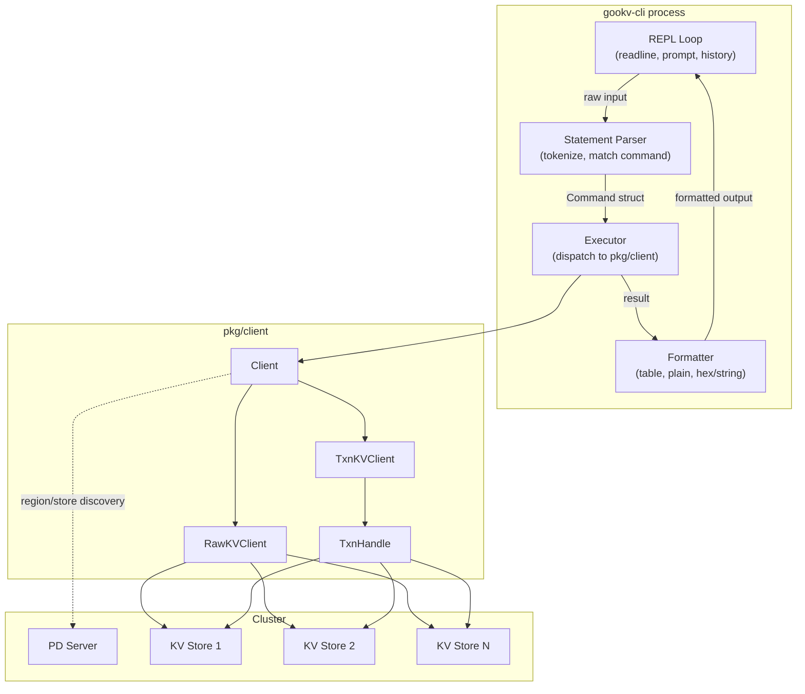

# gookv-cli: Interactive CLI for gookv

## 1. Motivation

Every major database ships an interactive client:

| Database | CLI Tool | Key Features |
|----------|----------|-------------|
| PostgreSQL | `psql` | REPL, `\` meta-commands, tab completion, history |
| MySQL | `mysql` | REPL, multi-statement, batch mode |
| Redis | `redis-cli` | REPL, inline commands, pipeline mode |
| TiKV | `tikv-ctl` | Offline admin + limited online commands |

gookv currently has `gookv-ctl`, which provides:
- **Offline commands**: `scan`, `get`, `mvcc`, `dump`, `size`, `compact`, `region` -- these read directly from a data directory on disk and do not require a running cluster.
- **Online commands**: `store list`, `store status` -- these communicate with PD but cannot perform KV reads or writes.

There is no way to interactively read, write, scan, or transact against a running gookv cluster from the command line. A developer must write Go code using `pkg/client` for every ad-hoc operation.

`gookv-cli` fills this gap: a PostgreSQL-style interactive REPL that connects to a running cluster via PD and exposes the full Raw KV, Transactional KV, and Administrative APIs through a human-friendly command syntax.

## 2. Architecture



The REPL loop reads user input (with line editing and history), feeds it to the parser, the parser produces a `Command` struct, the executor dispatches it to the appropriate `pkg/client` method, and the formatter renders the result to stdout.

## 3. Connection Lifecycle

```
                  ┌──────────────────────┐
 startup          │  Parse --pd flag     │
                  │  (default 127.0.0.1: │
                  │   2379)              │
                  └──────────┬───────────┘
                             │
                             ▼
                  ┌──────────────────────┐
                  │  client.NewClient()  │
                  │  - connect to PD     │
                  │  - init RegionCache  │
                  │  - init Sender pool  │
                  └──────────┬───────────┘
                             │
                             ▼
                  ┌──────────────────────┐
                  │  Enter REPL loop     │◄──┐
                  │  (or execute -c)     │   │
                  └──────────┬───────────┘   │
                             │               │
                             ▼               │
                  ┌──────────────────────┐   │
                  │  Process statement   │───┘
                  └──────────┬───────────┘
                             │ (on \q, exit, Ctrl-D)
                             ▼
                  ┌──────────────────────┐
                  │  client.Close()      │
                  │  - close gRPC conns  │
                  │  - close PD client   │
                  └──────────────────────┘
```

The `pkg/client.Client` manages gRPC connection pooling and region cache internally. `gookv-cli` creates one `Client` at startup and reuses it for the entire session. On exit (`\q`, `exit`, or `Ctrl-D`), `Client.Close()` tears down all connections.

## 4. Modes

### 4.1 REPL Mode (default)

When invoked with no `-c` flag, `gookv-cli` enters an interactive REPL:

```bash
$ gookv-cli --pd 127.0.0.1:2379
Connected to gookv cluster (PD: 127.0.0.1:2379)
gookv> PUT mykey myvalue;
OK (0.8 ms)
gookv> GET mykey;
+-----------+
| value     |
+-----------+
| myvalue   |
+-----------+
(0.3 ms)
```

Features:
- Line editing (arrow keys, Ctrl-A/E, etc.) via readline
- Persistent history (`~/.gookv_history`)
- Ctrl-C cancels the current input (does not exit)
- Ctrl-D on an empty line exits

### 4.2 Batch Mode (`-c` flag)

Execute one or more statements non-interactively:

```bash
$ gookv-cli --pd 127.0.0.1:2379 -c "PUT k1 v1; PUT k2 v2; SCAN k1 k3 10;"
```

Each statement is executed in order. On error, the remaining statements are skipped and the process exits with code 1. On success, exit code 0.

## 5. Statement Termination

Statements are terminated by semicolons, consistent with SQL conventions.

### 5.1 Multi-line Input

If the user presses Enter without a trailing semicolon, the prompt changes to a continuation prompt and the input continues on the next line:

```
gookv> PUT mykey
     >   a-very-long-value;
OK (0.9 ms)
```

### 5.2 Multi-statement

Multiple statements on a single line are supported:

```
gookv> PUT k1 v1; PUT k2 v2; GET k1;
```

They execute sequentially, left to right. Each produces its own output block.

## 6. Command Categories

### 6.1 Raw KV Commands

| Command | Syntax | Maps to |
|---------|--------|---------|
| `GET` | `GET <key>;` | `RawKVClient.Get` |
| `PUT` | `PUT <key> <value>;` | `RawKVClient.Put` |
| `PUT ... TTL` | `PUT <key> <value> TTL <seconds>;` | `RawKVClient.PutWithTTL` |
| `DELETE` | `DELETE <key>;` | `RawKVClient.Delete` |
| `TTL` | `TTL <key>;` | `RawKVClient.GetKeyTTL` |
| `SCAN` | `SCAN <start> <end> [limit];` | `RawKVClient.Scan` |
| `BGET` | `BGET <key1> <key2> ...;` | `RawKVClient.BatchGet` |
| `BPUT` | `BPUT <k1> <v1> <k2> <v2> ...;` | `RawKVClient.BatchPut` |
| `BDEL` | `BDEL <key1> <key2> ...;` | `RawKVClient.BatchDelete` |
| `DELRANGE` | `DELRANGE <start> <end>;` | `RawKVClient.DeleteRange` |
| `CAS` | `CAS <key> <new> <expected>;` | `RawKVClient.CompareAndSwap` |
| `CHECKSUM` | `CHECKSUM <start> <end>;` | `RawKVClient.Checksum` |

### 6.2 Transactional Commands

| Command | Syntax | Maps to |
|---------|--------|---------|
| `BEGIN` | `BEGIN [PESSIMISTIC] [ASYNC] [1PC] [LOCKTTL <n>];` | `TxnKVClient.Begin` with options |
| `TGET` | `TGET <key>;` | `TxnHandle.Get` |
| `TBGET` | `TBGET <key1> <key2> ...;` | `TxnHandle.BatchGet` |
| `TSET` | `TSET <key> <value>;` | `TxnHandle.Set` |
| `TDEL` | `TDEL <key>;` | `TxnHandle.Delete` |
| `COMMIT` | `COMMIT;` | `TxnHandle.Commit` |
| `ROLLBACK` | `ROLLBACK;` | `TxnHandle.Rollback` |

### 6.3 Administrative Commands

| Command | Syntax | Maps to |
|---------|--------|---------|
| `CLUSTER INFO` | `CLUSTER INFO;` | `pdclient.GetAllStores` + `pdclient.GetClusterID` |
| `STORE LIST` | `STORE LIST;` | `pdclient.GetAllStores` |
| `STORE STATUS` | `STORE STATUS <id>;` | `pdclient.GetStore` |
| `REGION` | `REGION <key>;` | `pdclient.GetRegion` |
| `REGION ID` | `REGION ID <id>;` | `pdclient.GetRegionByID` |
| `GC SAFEPOINT` | `GC SAFEPOINT;` | `pdclient.GetGCSafePoint` |

### 6.4 Meta Commands

| Command | Syntax | Description |
|---------|--------|-------------|
| `\h`, `HELP` | `\h` or `HELP;` | Print command reference |
| `\q`, `EXIT` | `\q` or `EXIT;` | Exit the CLI |
| `\x` | `\x` | Toggle hex display mode |
| `\t` | `\t` | Toggle timing display |
| `\?` | `\?` | Same as `\h` |

Meta commands (prefixed with `\`) do not require a semicolon terminator. They execute immediately on Enter.

## 7. Prompt Behavior

The prompt changes based on the current state:

| State | Prompt | Description |
|-------|--------|-------------|
| Normal | `gookv> ` | Ready for a new statement |
| Continuation | `     > ` | Waiting for semicolon to complete a multi-line statement |
| Transaction | `gookv(txn)> ` | Inside an active transaction (`BEGIN` issued, not yet `COMMIT`/`ROLLBACK`) |
| Transaction + continuation | `         > ` | Multi-line inside a transaction |

The continuation prompt is right-aligned to the `> ` of the normal prompt for visual consistency.

## 8. Output Formatting

### 8.1 Single-Value Results

For `GET` and `TGET`, display the value in a minimal table:

```
gookv> GET mykey;
+-----------+
| value     |
+-----------+
| myvalue   |
+-----------+
(0.3 ms)
```

If the key is not found:
```
gookv> GET nokey;
(not found)
(0.2 ms)
```

### 8.2 Multi-Row Results

For `SCAN`, `BGET`, `TBGET`, display a key-value table:

```
gookv> SCAN a z 5;
+------+--------+
| key  | value  |
+------+--------+
| a    | 1      |
| b    | 2      |
| c    | 3      |
+------+--------+
(3 rows, 1.2 ms)
```

### 8.3 Hex/String Toggle

By default, keys and values are displayed as UTF-8 strings if all bytes are printable ASCII (0x20-0x7E). Otherwise, they are displayed as hex (`\x` prefix). The `\x` meta-command toggles between:
- **auto** (default): string if printable, hex otherwise
- **hex**: always display as hex
- **string**: always display as string (non-printable bytes shown as `\xNN`)

### 8.4 Timing

By default, execution time is shown after each result. The `\t` meta-command toggles timing display on/off.

### 8.5 Key Input Encoding

Keys and values in commands are interpreted as UTF-8 strings by default. To input binary data, use hex literals with the `0x` prefix:

```
gookv> PUT 0x68656c6c6f 0x776f726c64;
OK (0.5 ms)
gookv> GET 0x68656c6c6f;
+-----------+
| value     |
+-----------+
| world     |
+-----------+
```

### 8.6 Administrative Output

Store and region information is displayed in tabular format:

```
gookv> STORE LIST;
+----------+---------------------+-------+
| store_id | address             | state |
+----------+---------------------+-------+
| 1        | 127.0.0.1:20160     | Up    |
| 2        | 127.0.0.1:20161     | Up    |
| 3        | 127.0.0.1:20162     | Up    |
+----------+---------------------+-------+
(3 stores)
```

### 8.7 Error Display

Errors are printed to stderr with an `ERROR:` prefix:

```
gookv> TSET k1 v1;
ERROR: no active transaction (use BEGIN first)
```

---

## Addendum: Review Feedback Incorporated

This addendum resolves all blocking and should-fix issues identified in `review_notes.md`. The original text above is preserved unchanged; the corrections below supersede any conflicting content.

### A1. Transaction Commands: Context-Sensitive GET/SET/DELETE (replaces Section 6.2)

**Resolution of [U-1]:** `02_command_reference.md` is canonical. Inside a transaction, users type plain `GET`, `SET`, and `DELETE` -- the REPL dispatches to `TxnHandle.Get`, `TxnHandle.Set`, and `TxnHandle.Delete` based on transaction context. The `TGET`/`TSET`/`TDEL` names listed in Section 6.2 above are **removed**; they are not part of the command language.

The corrected Section 6.2 table is:

| Command | Syntax | Maps to |
|---------|--------|---------|
| `BEGIN` | `BEGIN [PESSIMISTIC] [ASYNC_COMMIT] [ONE_PC] [LOCK_TTL <ms>];` | `TxnKVClient.Begin` with options |
| `GET` | `GET <key>;` | `TxnHandle.Get` (context-sensitive: inside txn) |
| `BGET` | `BGET <key1> <key2> ...;` | `TxnHandle.BatchGet` (context-sensitive: inside txn) |
| `SET` | `SET <key> <value>;` | `TxnHandle.Set` (only valid inside a transaction) |
| `DELETE` | `DELETE <key>;` | `TxnHandle.Delete` (context-sensitive: inside txn) |
| `COMMIT` | `COMMIT;` | `TxnHandle.Commit` |
| `ROLLBACK` | `ROLLBACK;` | `TxnHandle.Rollback` |

`SET` is **only** valid inside a transaction. Outside a transaction, `SET` produces: `ERROR: SET is only valid inside a transaction (use PUT for raw KV writes)`.

### A2. BEGIN Options Standardized (replaces Section 6.2 BEGIN syntax)

**Resolution of [S-1]:** The canonical option names match `02_command_reference.md` and the Go function signatures:

| Option | Go Function | Description |
|--------|-------------|-------------|
| `PESSIMISTIC` | `WithPessimistic()` | Pessimistic locking mode |
| `ASYNC_COMMIT` | `WithAsyncCommit()` | Async commit protocol |
| `ONE_PC` | `With1PC()` | Single-phase commit for single-region txns |
| `LOCK_TTL <ms>` | `WithLockTTL(ms)` | Lock TTL in milliseconds (default: 3000) |

The short forms `ASYNC`, `1PC`, and `LOCKTTL` listed in the original Section 6.2 are superseded.

### A3. Batch Delete and Delete Range Naming (replaces Section 6.1 entries)

**Resolution of [U-3] and [U-4]:** Canonical command names match `02_command_reference.md`:

- **Batch delete**: `BDELETE` (not `BDEL`)
- **Delete range**: `DELETE RANGE <start> <end>` (not `DELRANGE`)

The corrected entries in the Section 6.1 table:

| Command | Syntax | Maps to |
|---------|--------|---------|
| `BDELETE` | `BDELETE <key1> <key2> ...;` | `RawKVClient.BatchDelete` |
| `DELETE RANGE` | `DELETE RANGE <start> <end>;` | `RawKVClient.DeleteRange` |

### A4. SCAN Uses LIMIT Keyword (replaces Section 6.1 SCAN entry)

**Resolution of [U-2]:** The canonical SCAN syntax uses the `LIMIT` keyword, matching `02_command_reference.md`:

```
SCAN <start> <end> [LIMIT <n>];
```

The bare positional form `SCAN <start> <end> <limit>` shown in Section 4.2 and Section 6.1 is superseded. Default limit: 100 (see A8).

### A5. Missing Administrative Commands (resolves [C-4])

The following commands were present in `02_command_reference.md` but missing from the Section 6.3 table. They are added here:

| Command | Syntax | Maps to |
|---------|--------|---------|
| `REGION LIST` | `REGION LIST [LIMIT <n>];` | Iterated `pdclient.GetRegion` calls |
| `REGION ID` | `REGION ID <id>;` | `pdclient.GetRegionByID` |
| `TSO` | `TSO;` | `pdclient.GetTS` |
| `STATUS` | `STATUS [<addr>];` | HTTP GET `/status` |
| `GC SAFEPOINT` | `GC SAFEPOINT;` | `pdclient.GetGCSafePoint` |

### A6. Meta Commands Use Backslash Prefix (resolves [Impl-1] SET keyword collision)

**Resolution of [Impl-1] and [S-5]:** The `SET` keyword is reserved exclusively for transactional writes (`TxnHandle.Set`). All meta/configuration commands use psql-style backslash prefixes and do **not** require a semicolon terminator:

| Command | Syntax | Description |
|---------|--------|-------------|
| `\help`, `\h`, `\?` | `\help` | Print command reference |
| `\quit`, `\q` | `\quit` | Exit the CLI |
| `\timing` | `\timing on` / `\timing off` | Toggle timing display |
| `\format` | `\format hex` / `\format table` / `\format plain` | Set output format |
| `\pagesize` | `\pagesize <n>` | Set default SCAN display limit (default: 100) |

The keyword forms `HELP;`, `EXIT;`, `QUIT;` remain as aliases that require semicolons. The `SET TIMING` and `SET FORMAT` meta commands from `02_command_reference.md` are **replaced** by `\timing` and `\format` to eliminate the `SET` keyword collision.

The corrected Section 6.4 table replaces the original.

### A7. Large Scan Pagination (resolves [E-3])

The default SCAN display limit is 100 rows. This applies when no explicit `LIMIT` clause is given:

```
gookv> SCAN "" "";         -- returns at most 100 rows (default)
gookv> SCAN "" "" LIMIT 5; -- returns at most 5 rows
```

The `\pagesize <n>` meta command changes the default limit for the session:

```
gookv> \pagesize 50
Page size: 50
gookv> SCAN "" "";         -- now returns at most 50 rows
```

### A8. --version Flag and Stdin Pipe Detection (resolves [M-1] and [M-6])

**--version flag:** `gookv-cli --version` prints the version string and exits:

```
$ gookv-cli --version
gookv-cli v0.1.0 (go1.25, linux/amd64)
```

**Stdin pipe detection (batch mode):** When stdin is not a TTY (e.g., piped input from a file), the CLI automatically enters non-interactive batch mode:

```bash
$ echo "PUT k1 v1; GET k1;" | gookv-cli --pd 127.0.0.1:2379
$ gookv-cli --pd 127.0.0.1:2379 < commands.txt
```

In non-interactive mode: no prompt is displayed, no readline is initialized, and commands are read line-by-line from stdin. Errors are printed to stderr. The process exits with code 1 on the first error, or code 0 if all commands succeed.
