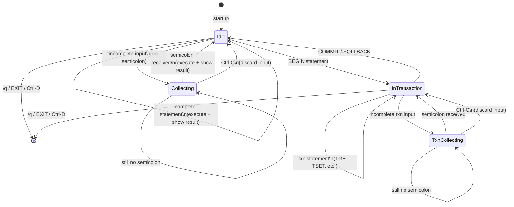
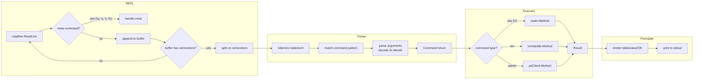

# gookv-cli: Implementation Plan

## 1. Package Structure

```
cmd/gookv-cli/
  main.go          # Entry point: flag parsing, client init, mode dispatch
  parser.go        # Statement splitting, tokenization, command matching
  executor.go      # Command dispatch to pkg/client methods
  formatter.go     # Output rendering (table, plain, hex)
  repl.go          # REPL loop with readline, prompt management, state machine
```

All code lives in `package main` under `cmd/gookv-cli/`. The CLI depends on `pkg/client` (which provides `RawKVClient`, `TxnKVClient`, `TxnHandle`) and `pkg/pdclient` (for administrative operations).

## 2. Key Go Interfaces and Types

### 2.1 Command (parsed statement)

```go
// CommandType identifies which operation a parsed statement represents.
type CommandType int

const (
    CmdGet CommandType = iota
    CmdPut
    CmdPutTTL
    CmdDelete
    CmdTTL
    CmdScan
    CmdBatchGet
    CmdBatchPut
    CmdBatchDelete
    CmdDeleteRange
    CmdCAS
    CmdChecksum

    CmdBegin
    CmdTGet
    CmdTBatchGet
    CmdTSet
    CmdTDelete
    CmdCommit
    CmdRollback

    CmdClusterInfo
    CmdStoreList
    CmdStoreStatus
    CmdRegion
    CmdRegionByID
    CmdGCSafePoint

    CmdHelp
    CmdExit
    CmdToggleHex
    CmdToggleTiming
)

// Command represents a single parsed statement ready for execution.
type Command struct {
    Type   CommandType
    Args   [][]byte  // positional arguments (keys, values) as raw bytes
    IntArg int64     // numeric argument (limit, TTL, store ID, region ID)
    TxnOpts []client.TxnOption // BEGIN options (pessimistic, async, 1pc, lockttl)
}
```

### 2.2 Executor

```go
// Executor holds client state and dispatches commands.
type Executor struct {
    client   *client.Client
    rawkv    *client.RawKVClient
    txnkv    *client.TxnKVClient
    pdClient pdclient.Client

    // Transaction state
    activeTxn *client.TxnHandle // nil when not in a transaction
}

// Exec runs a command and returns the result for formatting.
func (e *Executor) Exec(ctx context.Context, cmd Command) (*Result, error)

// InTransaction returns true if a transaction is active.
func (e *Executor) InTransaction() bool
```

### 2.3 Result

```go
// ResultType determines how the formatter renders the result.
type ResultType int

const (
    ResultOK       ResultType = iota // simple "OK" (PUT, DELETE, COMMIT, etc.)
    ResultValue                      // single value (GET)
    ResultNotFound                   // key not found
    ResultRows                       // multi-row key-value table (SCAN, BGET)
    ResultTable                      // arbitrary column table (STORE LIST, CLUSTER INFO)
    ResultScalar                     // single scalar value (TTL, GC SAFEPOINT)
    ResultCAS                        // CAS result (swapped, previous value)
    ResultChecksum                   // checksum result (crc, kvs, bytes)
)

// Result holds the output of a command execution.
type Result struct {
    Type     ResultType
    Value    []byte          // for ResultValue
    Rows     []client.KvPair // for ResultRows
    Columns  []string        // for ResultTable
    TableRows [][]string     // for ResultTable
    Scalar   string          // for ResultScalar
    Swapped  bool            // for ResultCAS
    PrevVal  []byte          // for ResultCAS
    Checksum uint64          // for ResultChecksum
    TotalKvs uint64          // for ResultChecksum
    TotalBytes uint64        // for ResultChecksum
}
```

### 2.4 Formatter

```go
// DisplayMode controls how binary data is rendered.
type DisplayMode int

const (
    DisplayAuto   DisplayMode = iota // string if printable, hex otherwise
    DisplayHex                       // always hex
    DisplayString                    // always string (non-printable as \xNN)
)

// Formatter renders Results to the terminal.
type Formatter struct {
    out         io.Writer
    displayMode DisplayMode
    showTiming  bool
}

// Format writes the formatted result to the output writer.
func (f *Formatter) Format(result *Result, elapsed time.Duration)

// ToggleHex cycles through display modes: auto -> hex -> string -> auto.
func (f *Formatter) ToggleHex()

// ToggleTiming flips timing display on/off.
func (f *Formatter) ToggleTiming()
```

## 3. External Dependencies

| Package | Version | Purpose |
|---------|---------|---------|
| `github.com/chzyer/readline` | v1.5.1 | REPL line editing, history file, Ctrl-C/Ctrl-D handling, custom prompt |
| `github.com/olekukonko/tablewriter` | v0.0.5 | Tabular output formatting (ASCII box tables, column alignment) |

Both are pure-Go with no CGo dependencies, consistent with gookv's existing dependency strategy.

### Why these libraries

**readline**: The standard `bufio.Scanner` does not support arrow-key navigation, history recall, or Ctrl-C handling. `chzyer/readline` is the most widely used Go readline library (used by `cockroach sql`, `tiup`, etc.) and provides:
- Arrow key navigation, Home/End, Ctrl-A/E
- History search (Ctrl-R)
- Persistent history file
- Custom prompt per-line
- Interrupt (Ctrl-C) returns `readline.ErrInterrupt` instead of killing the process
- EOF (Ctrl-D) returns `io.EOF`

**tablewriter**: Provides PostgreSQL-style ASCII box drawing for tabular output. Handles column width calculation, alignment, and border rendering. More maintainable than hand-rolled formatting.

## 4. REPL State Machine



### State descriptions

| State | Prompt | Buffer | Notes |
|-------|--------|--------|-------|
| **Idle** | `gookv> ` | empty | Ready for a new statement. Complete statements execute immediately. |
| **Collecting** | `     > ` | accumulating | User typed a partial statement without a semicolon. Continuation lines are appended until `;` is seen or Ctrl-C discards. |
| **InTransaction** | `gookv(txn)> ` | empty | A `BEGIN` was issued. Only transaction commands (`TGET`, `TSET`, `TDEL`, `TBGET`, `COMMIT`, `ROLLBACK`) and meta commands are valid. Raw KV commands produce an error. |
| **TxnCollecting** | `         > ` | accumulating | Multi-line input within a transaction. |

### Ctrl-C behavior

- In **Idle**: no-op (readline absorbs it).
- In **Collecting** / **TxnCollecting**: discard the accumulated buffer and return to the previous non-collecting state.
- Does **not** rollback an active transaction or exit the CLI.

### Ctrl-D behavior

- On an empty line: exit the CLI. If a transaction is active, print a warning and auto-rollback before exiting.
- On a non-empty line: ignored (readline default behavior).

## 5. Data Flow



## 6. Implementation Steps

Each step produces a testable, buildable artifact. Steps 1-3 can be verified with unit tests alone. Steps 4-6 require a `pkg/client` mock or a running cluster. Steps 7-9 are integration and polish.

### Step 1: Create `cmd/gookv-cli/main.go` with flags and client init

Create the entry point with:
- `--pd` flag (string, default `"127.0.0.1:2379"`) for PD address
- `-c` flag (string, default `""`) for batch mode
- `--hex` flag (bool) to start in hex display mode
- Client initialization via `client.NewClient(ctx, client.Config{PDAddrs: splitEndpoints(pd)})`
- Mode dispatch: if `-c` is set, execute statements and exit; otherwise enter REPL
- Graceful cleanup via `defer client.Close()`

```go
func main() {
    pd := flag.String("pd", "127.0.0.1:2379", "PD server address(es), comma-separated")
    batch := flag.String("c", "", "Execute statement(s) and exit")
    hexMode := flag.Bool("hex", false, "Start in hex display mode")
    flag.Parse()

    ctx, cancel := signal.NotifyContext(context.Background(), os.Interrupt, syscall.SIGTERM)
    defer cancel()

    c, err := client.NewClient(ctx, client.Config{
        PDAddrs: splitEndpoints(*pd),
    })
    if err != nil {
        fmt.Fprintf(os.Stderr, "ERROR: connect to PD: %v\n", err)
        os.Exit(1)
    }
    defer c.Close()

    exec := NewExecutor(c)
    fmtr := NewFormatter(os.Stdout, *hexMode)

    if *batch != "" {
        os.Exit(runBatch(ctx, exec, fmtr, *batch))
    }
    os.Exit(runREPL(ctx, exec, fmtr))
}
```

### Step 2: Implement statement parser -- semicolon splitting and multi-line

In `parser.go`:
- `SplitStatements(input string) (stmts []string, complete bool)`: splits on `;`, returns whether the last segment was terminated. Handles quoted strings (single and double quotes) to avoid splitting inside values.
- Buffer accumulation in the REPL: if `complete` is false, append to a line buffer and prompt for continuation.

```go
// SplitStatements splits input on semicolons, respecting quoted strings.
// Returns the list of complete statements and whether the input was fully terminated.
// Example: `PUT k1 "hello; world"; GET k2` -> (["PUT k1 \"hello; world\""], false)
func SplitStatements(input string) ([]string, bool) {
    // ...
}
```

### Step 3: Implement command parser -- tokenization and command matching

In `parser.go`:
- `Tokenize(stmt string) []string`: splits a statement into whitespace-delimited tokens, handling quoted strings and `0x` hex literals.
- `ParseCommand(tokens []string) (Command, error)`: matches the first token(s) against known command patterns and extracts arguments.
- Hex literal decoding: tokens starting with `0x` are decoded from hex to `[]byte`. All other tokens are treated as UTF-8 `[]byte`.

```go
// ParseCommand parses a tokenized statement into a Command.
// Returns an error for unrecognized commands or invalid argument counts.
func ParseCommand(tokens []string) (Command, error) {
    if len(tokens) == 0 {
        return Command{}, fmt.Errorf("empty statement")
    }
    switch strings.ToUpper(tokens[0]) {
    case "GET":
        // expect exactly 1 argument
    case "PUT":
        // expect 2 arguments, optional TTL <n> suffix
    case "BEGIN":
        // parse optional PESSIMISTIC, ASYNC, 1PC, LOCKTTL <n>
    case "SCAN":
        // expect 2-3 arguments (start, end, optional limit)
    case "STORE":
        // expect sub-command: LIST or STATUS <id>
    // ... etc
    }
}
```

### Step 4: Implement executor for each command category

In `executor.go`:
- Raw KV commands: delegate to `e.rawkv` methods, translate results into `Result` structs.
- Transaction commands: `BEGIN` creates `e.activeTxn` via `e.txnkv.Begin(ctx, opts...)`. `TGET`/`TSET`/`TDEL`/`TBGET` operate on `e.activeTxn`. `COMMIT`/`ROLLBACK` finalize and nil out `e.activeTxn`.
- Admin commands: use `e.pdClient` directly for store/region/cluster queries.
- Validate state: transaction commands error if `e.activeTxn == nil`; raw KV commands error if `e.activeTxn != nil` (suggest using `TSET`/`TGET` instead).

```go
func (e *Executor) Exec(ctx context.Context, cmd Command) (*Result, error) {
    switch cmd.Type {
    case CmdGet:
        val, notFound, err := e.rawkv.Get(ctx, cmd.Args[0])
        if err != nil {
            return nil, err
        }
        if notFound {
            return &Result{Type: ResultNotFound}, nil
        }
        return &Result{Type: ResultValue, Value: val}, nil

    case CmdBegin:
        if e.activeTxn != nil {
            return nil, fmt.Errorf("transaction already active (COMMIT or ROLLBACK first)")
        }
        txn, err := e.txnkv.Begin(ctx, cmd.TxnOpts...)
        if err != nil {
            return nil, err
        }
        e.activeTxn = txn
        return &Result{Type: ResultOK}, nil

    case CmdCommit:
        if e.activeTxn == nil {
            return nil, fmt.Errorf("no active transaction")
        }
        err := e.activeTxn.Commit(ctx)
        e.activeTxn = nil
        if err != nil {
            return nil, err
        }
        return &Result{Type: ResultOK}, nil

    // ... remaining commands
    }
}
```

### Step 5: Implement output formatter

In `formatter.go`:
- `Format(result *Result, elapsed time.Duration)`: dispatch by `ResultType`.
- Use `tablewriter` for `ResultRows` and `ResultTable`.
- Apply `DisplayMode` when rendering `[]byte` keys/values.
- Timing line: `(N.N ms)` or `(N rows, N.N ms)`.

```go
func (f *Formatter) Format(result *Result, elapsed time.Duration) {
    switch result.Type {
    case ResultOK:
        fmt.Fprintln(f.out, "OK")
    case ResultNotFound:
        fmt.Fprintln(f.out, "(not found)")
    case ResultValue:
        table := tablewriter.NewWriter(f.out)
        table.SetHeader([]string{"value"})
        table.Append([]string{f.formatBytes(result.Value)})
        table.Render()
    case ResultRows:
        table := tablewriter.NewWriter(f.out)
        table.SetHeader([]string{"key", "value"})
        for _, kv := range result.Rows {
            table.Append([]string{f.formatBytes(kv.Key), f.formatBytes(kv.Value)})
        }
        table.Render()
        fmt.Fprintf(f.out, "(%d rows", len(result.Rows))
    // ...
    }
    if f.showTiming {
        fmt.Fprintf(f.out, " (%.1f ms)\n", float64(elapsed.Microseconds())/1000.0)
    }
}
```

### Step 6: Wire REPL loop with readline

In `repl.go`:
- Configure `readline.Config` with prompt, history file, interrupt handling.
- Main loop: read line, check for meta commands (`\q`, `\x`, `\t`, `\h`), accumulate buffer, split statements, parse and execute each.
- Prompt selection based on state (idle vs. collecting vs. in-transaction).

```go
func runREPL(ctx context.Context, exec *Executor, fmtr *Formatter) int {
    rl, err := readline.NewEx(&readline.Config{
        Prompt:          "gookv> ",
        HistoryFile:     filepath.Join(os.Getenv("HOME"), ".gookv_history"),
        InterruptPrompt: "^C",
        EOFPrompt:       "exit",
    })
    if err != nil {
        fmt.Fprintf(os.Stderr, "ERROR: init readline: %v\n", err)
        return 1
    }
    defer rl.Close()

    var buf strings.Builder
    for {
        // Set prompt based on state
        if buf.Len() > 0 {
            if exec.InTransaction() {
                rl.SetPrompt("         > ")
            } else {
                rl.SetPrompt("     > ")
            }
        } else if exec.InTransaction() {
            rl.SetPrompt("gookv(txn)> ")
        } else {
            rl.SetPrompt("gookv> ")
        }

        line, err := rl.Readline()
        if err == readline.ErrInterrupt {
            buf.Reset()
            continue
        }
        if err == io.EOF {
            if exec.InTransaction() {
                fmt.Fprintln(os.Stderr, "WARNING: auto-rollback of active transaction")
                exec.Exec(ctx, Command{Type: CmdRollback})
            }
            return 0
        }

        // Check for meta commands (no semicolon needed)
        trimmed := strings.TrimSpace(line)
        if handleMeta(trimmed, exec, fmtr) {
            continue
        }

        buf.WriteString(line)
        buf.WriteString(" ")

        stmts, complete := SplitStatements(buf.String())
        for _, s := range stmts {
            tokens := Tokenize(s)
            if len(tokens) == 0 {
                continue
            }
            cmd, err := ParseCommand(tokens)
            if err != nil {
                fmt.Fprintf(os.Stderr, "ERROR: %v\n", err)
                continue
            }
            start := time.Now()
            result, err := exec.Exec(ctx, cmd)
            elapsed := time.Since(start)
            if err != nil {
                fmt.Fprintf(os.Stderr, "ERROR: %v\n", err)
                continue
            }
            fmtr.Format(result, elapsed)
        }
        if complete {
            buf.Reset()
        }
    }
}
```

### Step 7: Add transaction state management

Ensure the REPL and executor cooperate on transaction boundaries:
- `BEGIN` transitions the REPL prompt to `gookv(txn)> `.
- Raw KV commands (`GET`, `PUT`, etc.) are rejected inside a transaction with a clear error message suggesting the `T`-prefixed variant.
- `COMMIT` / `ROLLBACK` transition back to `gookv> `.
- On REPL exit (Ctrl-D, `\q`) with an active transaction: print a warning, auto-rollback, then exit.
- On error during `COMMIT`: the transaction is invalidated (set `activeTxn = nil`). The user must start a new transaction.

### Step 8: Add help command

The `\h` / `HELP` command prints a categorized command reference:

```
Raw KV Commands:
  GET <key>                          Get a key's value
  PUT <key> <value> [TTL <secs>]     Set a key-value pair
  DELETE <key>                       Delete a key
  SCAN <start> <end> [limit]         Scan a key range
  ...

Transaction Commands:
  BEGIN [PESSIMISTIC] [ASYNC] [1PC]  Start a transaction
  TGET <key>                         Read within transaction
  TSET <key> <value>                 Write within transaction
  COMMIT                             Commit the transaction
  ROLLBACK                           Rollback the transaction
  ...

Administrative Commands:
  STORE LIST                         List all stores
  REGION <key>                       Show region for a key
  ...

Meta Commands:
  \h, \?      Show this help
  \q          Exit
  \x          Toggle hex display (auto/hex/string)
  \t          Toggle timing display

Use 0x prefix for hex key/value literals: PUT 0x68656c6c6f 0x776f726c64
Statements are terminated with semicolons. Multiple statements per line are OK.
```

### Step 9: Add Makefile target

Add to the project `Makefile`:

```makefile
gookv-cli: $(GO_SRC) go.mod go.sum
	go build -o gookv-cli ./cmd/gookv-cli

build: gookv-server gookv-ctl gookv-pd gookv-cli
```

Also add a `clean` entry if one exists:
```makefile
clean:
	rm -f gookv-server gookv-ctl gookv-pd gookv-cli
```

## 7. Test Plan

### 7.1 Parser Unit Tests (`parser_test.go`)

Test the parser in isolation with no network dependencies.

| Test | Input | Expected |
|------|-------|----------|
| Single statement | `"GET mykey"` | `Command{Type: CmdGet, Args: [[]byte("mykey")]}` |
| Multi-statement split | `"PUT k v; GET k"` | Two commands, `complete=true` |
| Incomplete statement | `"PUT k"` | One partial, `complete=false` |
| Hex literal | `"GET 0x68656c6c6f"` | `Args: [[]byte("hello")]` |
| Quoted value | `"PUT k \"hello world\""` | `Args: [[]byte("k"), []byte("hello world")]` |
| BEGIN with options | `"BEGIN PESSIMISTIC ASYNC LOCKTTL 5000"` | `TxnOpts` includes `WithPessimistic`, `WithAsyncCommit`, `WithLockTTL(5000)` |
| SCAN with limit | `"SCAN a z 100"` | `Args: [a, z], IntArg: 100` |
| SCAN without limit | `"SCAN a z"` | `Args: [a, z], IntArg: 0 (default)` |
| Unknown command | `"FROBNICATE k"` | Error: `unknown command "FROBNICATE"` |
| Empty statement | `""` | Error: `empty statement` |
| Case insensitivity | `"get MyKey"` | `Command{Type: CmdGet, Args: [[]byte("MyKey")]}` |
| Multi-word command | `"STORE LIST"` | `Command{Type: CmdStoreList}` |
| Semicolon in quotes | `"PUT k \"a;b\""` | Single command, value is `a;b` |

### 7.2 Executor Mock Tests (`executor_test.go`)

Use a mock `RawKVClient` and `TxnKVClient` (or `pdclient.MockClient`) to test executor logic without a running cluster.

| Test | Scenario | Assertion |
|------|----------|-----------|
| GET found | Mock returns value | `Result{Type: ResultValue, Value: ...}` |
| GET not found | Mock returns notFound=true | `Result{Type: ResultNotFound}` |
| PUT | Execute CmdPut | Mock received correct key/value |
| Transaction lifecycle | BEGIN, TSET, TGET, COMMIT | `InTransaction()` transitions correctly |
| Double BEGIN | BEGIN twice | Error: "transaction already active" |
| TSET without BEGIN | TSET outside txn | Error: "no active transaction" |
| GET inside txn | GET while txn active | Error: "use TGET inside a transaction" |
| ROLLBACK clears state | BEGIN, TSET, ROLLBACK | `InTransaction() == false` |
| SCAN with limit | Execute CmdScan | Mock called with correct start/end/limit |
| STORE LIST | Execute CmdStoreList | `Result{Type: ResultTable}` with store data |
| CAS success | Mock returns swapped=true | `Result{Type: ResultCAS, Swapped: true}` |
| CAS failure | Mock returns swapped=false | `Result{Type: ResultCAS, Swapped: false, PrevVal: ...}` |

### 7.3 Formatter Unit Tests (`formatter_test.go`)

Capture output to a `bytes.Buffer` and verify formatting.

| Test | Input | Expected substring |
|------|-------|--------------------|
| OK result | `ResultOK` | `"OK"` |
| Not found | `ResultNotFound` | `"(not found)"` |
| Value table | `ResultValue{Value: []byte("hi")}` | Contains `"hi"` in table |
| Rows table | 3 KvPairs | Contains all 3 keys, `"(3 rows"` |
| Hex mode | Binary value in hex mode | `\x` prefix in output |
| Timing on | Any result with 5ms elapsed | `"(5.0 ms)"` |
| Timing off | Any result, timing disabled | No `"ms"` in output |

### 7.4 Integration Tests (`integration_test.go`)

Use `pkg/e2elib` to spin up a real PD + KV cluster and exercise `gookv-cli` end-to-end.

| Test | Steps | Assertion |
|------|-------|-----------|
| PUT/GET roundtrip | PUT k v, GET k | Output contains `v` |
| SCAN range | PUT a/b/c, SCAN a d 10 | Output contains all 3 rows |
| Transaction commit | BEGIN, TSET k1 v1, TSET k2 v2, COMMIT, then GET both | Both values present |
| Transaction rollback | BEGIN, TSET k v, ROLLBACK, GET k | Not found |
| Batch mode | `-c "PUT k v; GET k"` | stdout contains `v`, exit code 0 |
| Batch mode error | `-c "FROBNICATE"` | stderr contains error, exit code 1 |
| STORE LIST | After cluster boot | Lists all stores |
| CAS | PUT k old, CAS k new old | Swapped=true, GET returns new |

Integration tests invoke the CLI binary (built via `go build`) as a subprocess or call `runBatch`/`runREPL` directly with a test harness, similar to how `gookv-ctl` exposes `RunCommand` for testability.

---

## Addendum: Review Feedback Incorporated

This addendum resolves all blocking and should-fix issues identified in `review_notes.md`. The original text above is preserved unchanged; the corrections below supersede any conflicting content.

### A1. Context-Sensitive GET/SET/DELETE (replaces T-prefixed commands)

**Resolution of [U-1]:** `02_command_reference.md` is canonical. Inside a transaction, `GET`, `SET`, `DELETE`, and `BGET` dispatch to `TxnHandle` methods. Outside a transaction, `GET`, `DELETE`, and `BGET` dispatch to `RawKVClient` methods. `SET` is only valid inside a transaction.

The `CmdTGet`, `CmdTSet`, `CmdTDelete`, `CmdTBatchGet` command types in Section 2.1 are **removed**. The parser produces the same `CmdGet`, `CmdSet`, `CmdDelete`, `CmdBatchGet` command types regardless of context. The **executor** dispatches based on whether `e.activeTxn` is non-nil:

```go
const (
    CmdGet CommandType = iota
    CmdPut
    CmdPutTTL
    CmdSet       // Only valid inside a transaction (TxnHandle.Set)
    CmdDelete
    CmdTTL
    CmdScan
    CmdBatchGet
    CmdBatchPut
    CmdBatchDelete
    CmdDeleteRange
    CmdCAS
    CmdChecksum

    CmdBegin
    CmdCommit
    CmdRollback

    CmdClusterInfo
    CmdStoreList
    CmdStoreStatus
    CmdRegion
    CmdRegionByID
    CmdRegionList
    CmdGCSafePoint
    CmdTSO
    CmdStatus

    CmdHelp
    CmdExit
)
```

Executor dispatch for context-sensitive commands:

```go
case CmdGet:
    if e.activeTxn != nil {
        // Transactional GET: TxnHandle.Get returns ([]byte, error)
        val, err := e.activeTxn.Get(ctx, cmd.Args[0])
        if err != nil {
            return nil, err
        }
        if val == nil {
            // (nil, nil) means not-found in TxnHandle.Get
            return &Result{Type: ResultNil}, nil
        }
        return &Result{Type: ResultValue, Value: val}, nil
    }
    // Raw GET: RawKVClient.Get returns ([]byte, bool, error)
    val, notFound, err := e.rawkv.Get(ctx, cmd.Args[0])
    if err != nil {
        return nil, err
    }
    if notFound {
        return &Result{Type: ResultNotFound}, nil
    }
    return &Result{Type: ResultValue, Value: val}, nil

case CmdSet:
    if e.activeTxn == nil {
        return nil, fmt.Errorf("SET is only valid inside a transaction (use PUT for raw KV writes)")
    }
    err := e.activeTxn.Set(ctx, cmd.Args[0], cmd.Args[1])
    if err != nil {
        return nil, err
    }
    return &Result{Type: ResultOK}, nil
```

### A2. TxnHandle.Get Not-Found Detection (resolves [Impl-3])

`RawKVClient.Get(ctx, key)` returns `([]byte, bool, error)` with an explicit not-found bool. `TxnHandle.Get(ctx, key)` returns `([]byte, error)` with no bool -- a nil `[]byte` with nil error means not-found.

Add a `ResultNil` type to distinguish from `ResultNotFound`:

```go
const (
    ResultOK       ResultType = iota
    ResultValue
    ResultNotFound  // Raw KV: displayed as "(not found)"
    ResultNil       // Txn KV: displayed as "(nil)"
    ResultRows
    ResultTable
    ResultScalar
    ResultCAS
    ResultChecksum
)
```

The formatter renders `ResultNil` as `(nil)` and `ResultNotFound` as `(not found)`.

### A3. pdClient Accessor (resolves [I-1], [Impl-2], [T-3])

Add a public accessor method to `pkg/client/client.go`:

```go
// PD returns the underlying pdclient.Client for administrative operations.
func (c *Client) PD() pdclient.Client {
    return c.pdClient
}
```

The executor initialization in `main.go` becomes:

```go
exec := NewExecutor(c, c.PD())
```

And the `NewExecutor` function:

```go
func NewExecutor(c *client.Client, pd pdclient.Client) *Executor {
    return &Executor{
        client:   c,
        rawkv:    c.RawKV(),
        txnkv:    c.TxnKV(),
        pdClient: pd,
    }
}
```

### A4. Meta Commands Use Backslash Prefix (resolves [Impl-1] SET keyword collision)

The `SET` keyword collision between `SET TIMING ON` (meta) and `SET key value` (txn write) is resolved by moving all configuration commands to backslash-prefixed meta commands, handled by the REPL layer **before** the parser:

```go
func handleMeta(trimmed string, exec *Executor, fmtr *Formatter) bool {
    lower := strings.ToLower(trimmed)
    switch {
    case lower == `\h` || lower == `\help` || lower == `\?`:
        printHelp(fmtr.out)
        return true
    case lower == `\q` || lower == `\quit`:
        // handled in REPL loop as exit signal
        return true
    case strings.HasPrefix(lower, `\timing`):
        arg := strings.TrimSpace(lower[len(`\timing`):])
        switch arg {
        case "on":
            fmtr.showTiming = true
            fmt.Fprintln(fmtr.out, "Timing: ON")
        case "off":
            fmtr.showTiming = false
            fmt.Fprintln(fmtr.out, "Timing: OFF")
        default:
            // Toggle
            fmtr.showTiming = !fmtr.showTiming
            if fmtr.showTiming {
                fmt.Fprintln(fmtr.out, "Timing: ON")
            } else {
                fmt.Fprintln(fmtr.out, "Timing: OFF")
            }
        }
        return true
    case strings.HasPrefix(lower, `\format`):
        arg := strings.TrimSpace(lower[len(`\format`):])
        switch arg {
        case "table":
            fmtr.displayMode = DisplayAuto
        case "hex":
            fmtr.displayMode = DisplayHex
        case "plain":
            fmtr.displayMode = DisplayString
        }
        return true
    case strings.HasPrefix(lower, `\pagesize`):
        // Parse integer argument, set default SCAN limit
        return true
    }
    return false
}
```

The `CmdToggleHex` and `CmdToggleTiming` command types from Section 2.1 are removed from the `CommandType` enum. These are no longer parser-level commands.

### A5. Ctrl-C Handling: Per-Command Context (resolves [E-5])

The `signal.NotifyContext` in `main.go` is used only for session-level shutdown (SIGTERM). For Ctrl-C during command execution, the REPL creates a per-command `context.WithCancel` and wires it to readline's interrupt:

```go
// In the REPL loop, for each command execution:
cmdCtx, cmdCancel := context.WithCancel(ctx)
// If readline detects Ctrl-C during execution, cancel the command context
go func() {
    // The readline library returns ErrInterrupt on Ctrl-C.
    // During command execution, we listen for this and cancel.
    // Implementation detail: use a channel to coordinate.
}()
start := time.Now()
result, err := exec.Exec(cmdCtx, cmd)
elapsed := time.Since(start)
cmdCancel() // always cancel to release resources
```

Ctrl-C cancels only the current in-flight RPC, not the entire REPL session. The REPL continues accepting input after cancellation.

### A6. --version Flag and Stdin Pipe Detection (resolves [M-1] and [M-6])

Add to `main.go` flag parsing:

```go
version := flag.Bool("version", false, "Print version and exit")
flag.Parse()

if *version {
    fmt.Printf("gookv-cli %s (%s, %s/%s)\n", Version, runtime.Version(), runtime.GOOS, runtime.GOARCH)
    os.Exit(0)
}

// Detect non-TTY stdin for batch mode
if !isTerminal(os.Stdin.Fd()) && *batch == "" {
    // Read from stdin line-by-line, no prompt, no readline
    os.Exit(runPipedInput(ctx, exec, fmtr, os.Stdin))
}
```

Where `isTerminal` uses `golang.org/x/term.IsTerminal()` or the equivalent `os.Stdin.Stat()` check:

```go
func isTerminal(fd uintptr) bool {
    fi, err := os.Stdin.Stat()
    if err != nil {
        return true // assume terminal on error
    }
    return fi.Mode()&os.ModeCharDevice != 0
}
```

### A7. BEGIN Option Names Standardized (resolves [S-1])

The canonical BEGIN option names in the parser match `02_command_reference.md`:

| Canonical | Superseded forms |
|-----------|-----------------|
| `PESSIMISTIC` | (unchanged) |
| `ASYNC_COMMIT` | `ASYNC` |
| `ONE_PC` | `1PC` |
| `LOCK_TTL <ms>` | `LOCKTTL <n>` |

The `ParseCommand` function for BEGIN:

```go
case "BEGIN":
    cmd := Command{Type: CmdBegin}
    for i := 1; i < len(tokens); i++ {
        switch strings.ToUpper(tokens[i]) {
        case "PESSIMISTIC":
            cmd.TxnOpts = append(cmd.TxnOpts, client.WithPessimistic())
        case "ASYNC_COMMIT":
            cmd.TxnOpts = append(cmd.TxnOpts, client.WithAsyncCommit())
        case "ONE_PC":
            cmd.TxnOpts = append(cmd.TxnOpts, client.With1PC())
        case "LOCK_TTL":
            i++
            if i >= len(tokens) {
                return Command{}, fmt.Errorf("LOCK_TTL requires a value in milliseconds")
            }
            ms, err := strconv.ParseUint(tokens[i], 10, 64)
            if err != nil {
                return Command{}, fmt.Errorf("LOCK_TTL value must be an integer: %v", err)
            }
            cmd.TxnOpts = append(cmd.TxnOpts, client.WithLockTTL(ms))
        default:
            return Command{}, fmt.Errorf("unknown BEGIN option: %s", tokens[i])
        }
    }
    return cmd, nil
```

### A8. Batch Delete and Delete Range Naming (resolves [U-3] and [U-4])

The canonical names are:

- **Batch delete**: `BDELETE` (the `BDEL` reference in the original Step 8 help text is superseded)
- **Delete range**: `DELETE RANGE` (the `DELRANGE` form is superseded)

### A9. SCAN Default Limit (resolves [U-2] and [E-3])

The canonical SCAN syntax uses the `LIMIT` keyword. The default limit when omitted is **100** (not unlimited). The integration test in Section 7.4 (`SCAN a d 10`) should use `SCAN a d LIMIT 10`.

### A10. Commit Failure Handling (resolves [I-3])

On commit failure, `activeTxn` is **not** unconditionally niled. The corrected executor logic:

```go
case CmdCommit:
    if e.activeTxn == nil {
        return nil, fmt.Errorf("no active transaction")
    }
    err := e.activeTxn.Commit(ctx)
    if err != nil {
        // Check if the error is "already committed" -- treat as success
        if strings.Contains(err.Error(), "already committed") {
            e.activeTxn = nil
            return &Result{Type: ResultOK}, nil
        }
        // Transaction remains active on other errors; user should ROLLBACK
        return nil, fmt.Errorf("commit failed (transaction still active, use ROLLBACK): %w", err)
    }
    e.activeTxn = nil
    return &Result{Type: ResultOK}, nil
```

This matches the spec in `02_command_reference.md` Section 3.5: "On commit failure (except 'already committed'), the transaction remains active."

### A11. State Machine Update (replaces Section 4)

The `InTransaction` state now uses context-sensitive commands (`GET`, `SET`, `DELETE`, `BGET`) instead of `TGET`, `TSET`, `TDEL`, `TBGET`:

| State | Prompt | Valid commands | Notes |
|-------|--------|---------------|-------|
| **Idle** | `gookv> ` | All raw KV, admin, meta, `BEGIN` | `SET` produces an error suggesting `PUT` |
| **InTransaction** | `gookv(txn)> ` | `GET`, `SET`, `DELETE`, `BGET`, `COMMIT`, `ROLLBACK`, meta | Raw-only commands (`PUT`, `SCAN`, `BPUT`, `BDELETE`, `DELETE RANGE`, `CAS`, `CHECKSUM`, `TTL`) produce an error |

### A12. Test Plan Updates

The integration test table in Section 7.4 is updated to use canonical command names:

| Test | Steps | Assertion |
|------|-------|-----------|
| Transaction commit | `BEGIN; SET k1 v1; SET k2 v2; COMMIT;` then `GET` both | Both values present |
| Transaction rollback | `BEGIN; SET k v; ROLLBACK;` then `GET k` | Not found |
| SCAN with LIMIT | `PUT a 1; PUT b 2; PUT c 3; SCAN a d LIMIT 10;` | 3 rows |
