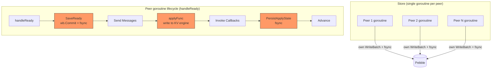
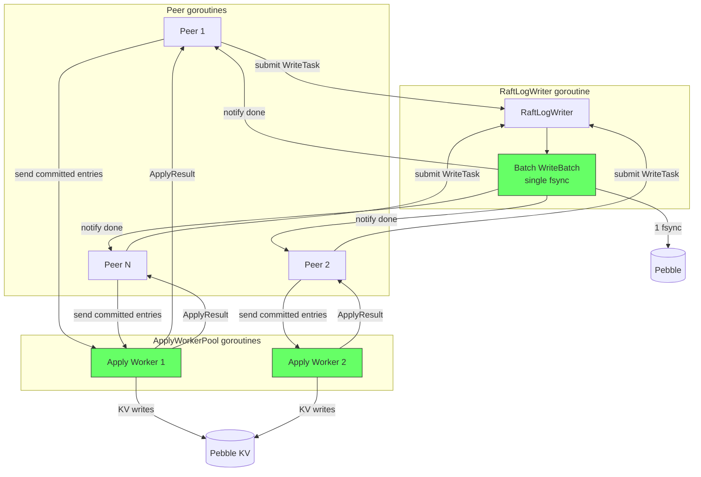
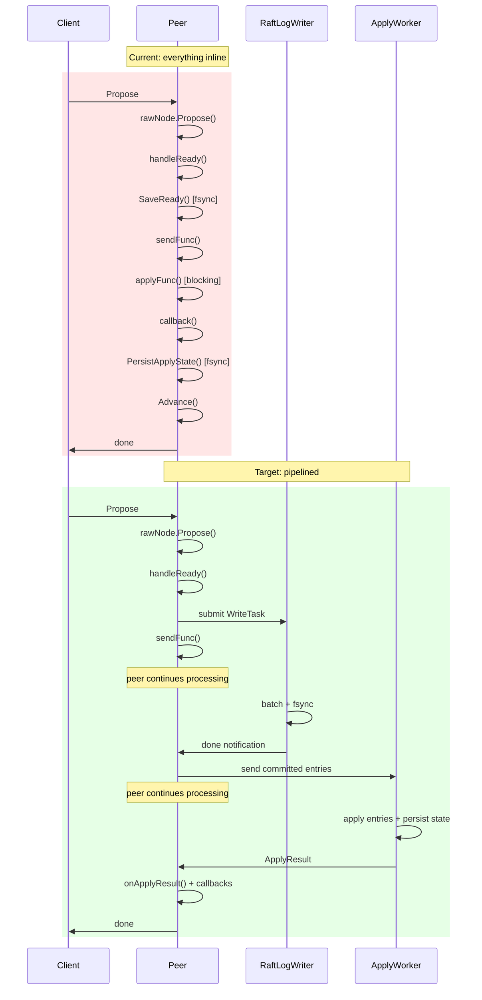
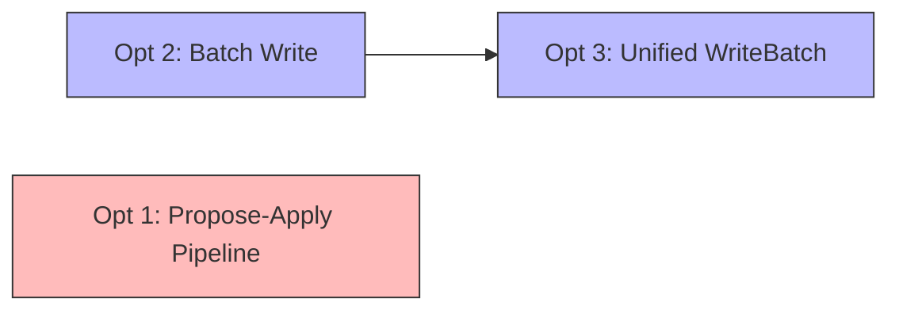

# Performance Optimization Phase 1: Overview

## Table of Contents

1. [Motivation](#1-motivation)
2. [Expected Performance Impact](#2-expected-performance-impact)
3. [Architecture Comparison](#3-architecture-comparison)
4. [The Three Optimizations](#4-the-three-optimizations)
5. [Dependencies and Ordering](#5-dependencies-and-ordering)

---

## 1. Motivation

gookv's raftstore currently has two structural bottlenecks that limit throughput
on multi-region workloads:

### Per-region fsync on every Ready

Each peer's `handleReady()` calls `PeerStorage.SaveReady()`, which creates its
own `WriteBatch` and calls `wb.Commit()` (which fsyncs). When a store hosts N
regions, a single tick cycle can produce up to N independent fsyncs to the same
underlying Pebble WAL. Modern NVMe SSDs can handle 50,000-100,000 IOPS, but
each fsync still has a latency floor of ~20-100us. Batching multiple regions'
raft log writes into a single fsync amortizes that cost across all active
regions.

**Current path** (`internal/raftstore/storage.go:215-258`):

```
SaveReady(rd) {
    wb := s.engine.NewWriteBatch()
    // write hard state + entries to wb
    wb.Commit()  // <-- fsync per region, per tick
}
```

### Inline apply blocks the peer goroutine

`handleReady()` applies committed entries synchronously on the peer goroutine
(lines 598-653 in `peer.go`). This means the peer cannot process new Raft
messages, heartbeat responses, or proposals while entries are being deserialized,
unmarshaled, and written to the KV engine via `applyFunc`. For write-heavy
workloads, this creates head-of-line blocking: one slow apply batch delays all
subsequent proposals for that region.

**Current path** (`internal/raftstore/peer.go:598-653`):

```
handleReady() {
    ...
    SaveReady(rd)              // fsync raft log
    sendFunc(rd.Messages)      // send raft msgs
    applyFunc(entries)         // BLOCKS: write to KV engine
    callbacks(entries)         // BLOCKS: invoke propose callbacks
    SetAppliedIndex()          // BLOCKS: update applied index
    PersistApplyState()        // BLOCKS: another fsync
    // ReadIndex check
    Advance(rd)
}
```

In TiKV, the Peer FSM sends committed entries to a separate Apply FSM via a
channel, freeing the Peer FSM to immediately process the next Ready. The Apply
FSM processes entries at its own pace and sends results back.

---

## 2. Expected Performance Impact

All impacts are qualitative. Exact numbers depend on region count, write
rate, and hardware.

| Optimization | Impact | Mechanism |
|---|---|---|
| Raft log batch write (2+3) | Fewer fsyncs per second | N regions' raft logs batched into 1 write + 1 fsync |
| Raft log batch write (2+3) | Lower p99 propose latency | Amortized fsync cost across concurrent regions |
| Propose-apply pipeline (1) | Higher propose throughput | Peer goroutine freed while entries are applied |
| Propose-apply pipeline (1) | Better heartbeat responsiveness | Peer goroutine not blocked by apply I/O |
| Combined | Near-linear scaling with region count | Both bottlenecks eliminated |

**When these optimizations matter most:**

- Multi-region stores (10+ active regions per store)
- Write-heavy workloads with concurrent proposals across regions
- Large entry batches (many entries per Ready)
- Stores on spinning disks where fsync latency is 1-10ms

**When they matter less:**

- Single-region setups (no batching opportunity)
- Read-heavy workloads (ReadIndex does not need raft log persistence)
- Already-idle stores with low write rates

---

## 3. Architecture Comparison

### Current Architecture



**Problems:**
- Each peer does its own `wb.Commit()` (fsync) -- N fsyncs per tick cycle
- `applyFunc` + `PersistApplyState` block the peer goroutine
- Peer cannot process next Ready until apply completes

### Target Architecture



**Improvements:**
- All peers submit `WriteTask` to a single `RaftLogWriter` -- 1 fsync per batch
- Committed entries sent to `ApplyWorkerPool` via channel -- peer goroutine freed
- Apply results sent back via `PeerMsgTypeApplyResult` -- peer updates state asynchronously

### Data Flow Comparison



---

## 4. The Three Optimizations

### Optimization 1: Propose-Apply Pipeline

**Goal:** Decouple entry application from the peer goroutine.

**Mechanism:**
- Create an `ApplyWorkerPool` (similar to `ReadPool` in `internal/server/flow/flow.go`)
- After `handleReady()` persists raft logs and sends messages, it sends
  committed entries to the apply pool via a channel instead of calling
  `applyFunc` inline
- The apply worker deserializes entries, calls `ApplyModifies`, invokes
  proposal callbacks, updates applied index, and persists apply state
- The apply worker sends an `ApplyResult` back to the peer via its Mailbox
  using the existing `PeerMsgTypeApplyResult` message type
- The peer processes the result in `onApplyResult()` (already exists at
  `peer.go:710`)

**Key changes:**
- `internal/raftstore/peer.go`: `handleReady()` sends entries to channel
  instead of inline apply
- `internal/server/coordinator.go`: Create `ApplyWorkerPool`, wire it up
- ReadIndex must wait for async applied index updates

**TiKV reference:**
- `tikv/components/raftstore/src/store/fsm/apply.rs`: `ApplyFsm` struct
  (line 4034) receives committed entries via channel, processes them
  independently from the Peer FSM

### Optimization 2: Raft Log Batch Write

**Goal:** Batch multiple regions' raft log writes into a single persistence call.

**Mechanism:**
- Create a `RaftLogWriter` goroutine that owns a shared `WriteBatch`
- Each peer's `handleReady()` submits a `WriteTask` (region ID, entries,
  hard state) to the writer via a channel, then waits on a done channel
- The writer drains the channel, merging all pending `WriteTask`s into one
  `WriteBatch`, then calls `wb.Commit()` once and notifies all waiting peers
- Uses adaptive batching: after receiving the first task, try to drain more
  tasks from the channel before committing

**Key changes:**
- New file: `internal/raftstore/raft_log_writer.go`
- `internal/raftstore/storage.go`: New `BuildWriteTask()` method (builds
  task without committing)
- `internal/raftstore/peer.go`: `handleReady()` submits task to writer
  instead of calling `SaveReady()`

**TiKV reference:**
- `tikv/components/raftstore/src/store/async_io/write.rs`: `Worker` struct
  (line 762) receives `WriteTask`s via channel, batches them into
  `WriteTaskBatch`, calls `write_to_db()` once for the batch

### Optimization 3: Unified WriteBatch

**Goal:** Eliminate redundant WriteBatch allocation and use a single batch for
the writer.

**Mechanism:**
- The `RaftLogWriter` reuses a single `WriteBatch` across batch cycles
  (clear + refill instead of allocate + discard)
- `PeerStorage.BuildWriteTask()` returns serialized key-value pairs instead
  of a `WriteBatch`, so the writer can merge them into its own batch
- This avoids creating N `WriteBatch` objects per tick cycle

**Key changes:**
- `internal/raftstore/storage.go`: `BuildWriteTask()` returns `[]WriteOp`
  (cf, key, value tuples) instead of a WriteBatch
- `internal/raftstore/raft_log_writer.go`: Writer owns and reuses one
  WriteBatch, appends WriteOps from all tasks

This optimization is tightly coupled with optimization 2 and should be
implemented together.

---

## 5. Dependencies and Ordering

### Dependency Graph



- **Optimizations 2+3 are tightly coupled.** The `RaftLogWriter` (opt 2) needs
  `BuildWriteTask` to produce write operations instead of committing directly
  (opt 3). They should be implemented together as a single unit of work.

- **Optimization 1 is independent.** The propose-apply pipeline does not
  depend on batched writes and can be implemented and tested separately.

### Recommended Implementation Order

**Phase 1: Raft Log Batch Writer (optimizations 2+3)**

Rationale:
- Simpler change: no new concurrency model for apply, just moving where
  persistence happens
- Immediate measurable benefit: fsync count drops from N to 1 per batch
- Lower risk: the peer goroutine still processes everything sequentially;
  only the persistence call is moved to a shared writer
- Easier to verify: same observable behavior (callbacks fire in same order),
  just faster persistence

**Phase 2: Propose-Apply Pipeline (optimization 1)**

Rationale:
- More complex: introduces async apply with callback coordination
- Requires careful handling of applied index (ReadIndex depends on it)
- Requires careful handling of proposal callbacks (must fire in apply order)
- Benefits are additive on top of Phase 1
- Can be feature-flagged independently

### Risk Assessment

| Risk | Mitigation |
|---|---|
| Batched write failure affects all regions | Clear batch and retry individually; notify all waiters with error |
| Apply worker falls behind | Backpressure via bounded channel; `CheckBusy` pattern from ReadPool |
| ReadIndex sees stale applied index | Apply worker updates applied index atomically; ReadIndex polls or waits |
| Proposal callbacks fire out of order | Apply worker processes entries sequentially per region |
| Writer goroutine becomes bottleneck | Monitor batch size; split into multiple writers if needed (TiKV has `StoreWriters`) |
