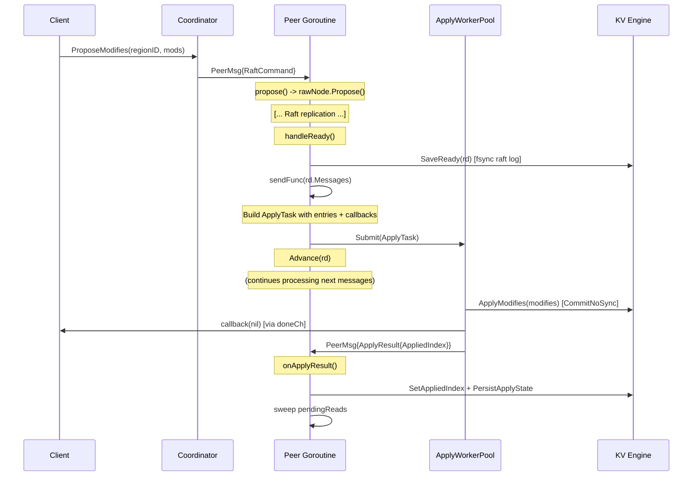

# Propose-Apply Pipeline: Asynchronous Entry Application

## Table of Contents

1. [Problem Statement](#1-problem-statement)
2. [Current Code Path](#2-current-code-path)
3. [TiKV Reference Design](#3-tikv-reference-design)
4. [Proposed Design](#4-proposed-design)
5. [Data Structures](#5-data-structures)
6. [Channel Protocol](#6-channel-protocol)
7. [Applied Index Coordination](#7-applied-index-coordination)
8. [ReadIndex Interaction](#8-readindex-interaction)
9. [Error Handling](#9-error-handling)
10. [Sequence Diagram](#10-sequence-diagram)
11. [Implementation Steps](#11-implementation-steps)
12. [Test Plan](#12-test-plan)
13. [Files to Change](#13-files-to-change)

---

## 1. Problem Statement

In the current gookv architecture, `handleReady()` performs entry application
**synchronously** within the peer's event loop. This means the peer goroutine is
blocked while `applyFunc` writes modifications to the KV engine (via
`ApplyModifies` -> `CommitNoSync`), invokes proposal callbacks, persists
`ApplyState`, and sweeps pending reads. During this window, the peer cannot:

- Process new Raft messages (heartbeats, votes, append entries)
- Handle new client proposals
- Respond to ticks

For a leader handling high write throughput, this creates a bottleneck: every
batch of committed entries must be fully applied before the next `handleReady()`
cycle can begin. The apply step is I/O-bound (engine writes), while the Raft
protocol processing is mostly CPU-bound (message handling, state machine
transitions). Pipelining these two phases allows the peer to overlap Raft
protocol work with entry application.

### Quantified Impact

Each `handleReady()` cycle that contains committed entries performs:
1. `SaveReady()` -- one fsync (raft log persist)
2. `applyFunc()` -- one `CommitNoSync` per batch (KV engine write)
3. `PersistApplyState()` -- one engine write (apply state)

Steps 2 and 3 are serialized with the entire event loop. If apply takes T_apply
milliseconds, the peer's effective proposal throughput is bounded by
`1 / (T_raft + T_apply)` instead of the achievable `1 / T_raft`.

## 2. Current Code Path

The synchronous apply path proceeds as follows:

### 2.1 Peer.handleReady() -- `internal/raftstore/peer.go:542-688`

```
line 542: func (p *Peer) handleReady()
line 547:   rd := p.rawNode.Ready()
line 579:   p.storage.SaveReady(rd)          // fsync raft log
line 593:   p.sendFunc(rd.Messages)           // send raft messages
line 598:   if len(rd.CommittedEntries) > 0:
line 613:     if p.applyFunc != nil:          // <-- BLOCKING APPLY
line 621:       p.applyFunc(p.regionID, dataEntries)  // writes to KV engine
line 626:     // invoke proposal callbacks
line 646:     p.storage.SetAppliedIndex(lastEntry.Index)
line 650:     p.storage.PersistApplyState()   // persist apply state
line 662:   // ReadStates / pendingReads sweep
line 687:   p.rawNode.Advance(rd)
```

### 2.2 applyFunc wiring -- `internal/server/coordinator.go:147-150`

```go
peer.SetApplyFunc(func(_ uint64, entries []raftpb.Entry) {
    sc.applyEntriesForPeer(peer, entries)
})
```

### 2.3 applyEntriesForPeer() -- `internal/server/coordinator.go:202-242`

For each entry:
1. Strip 8-byte proposal ID prefix (line 212)
2. Unmarshal `RaftCmdRequest` (line 213)
3. Convert to `[]mvcc.Modify` via `RequestsToModifies` (line 231)
4. Call `sc.storage.ApplyModifies(modifies)` (line 237)

### 2.4 ApplyModifies() -- `internal/server/storage.go:75-97`

Builds a `WriteBatch`, populates with Put/Delete/DeleteRange, calls
`wb.CommitNoSync()` (line 96). This is a non-sync write but still involves
pebble's write path (memtable insertion, WAL append without fsync).

### 2.5 Proposal callback invocation -- `internal/raftstore/peer.go:626-644`

After apply, the peer matches proposal IDs from the committed entries to
`pendingProposals` and invokes callbacks. The callback (defined in
`coordinator.go:343-348`) sends `nil` or an error on the caller's `doneCh`.

### Key Observation

The entire sequence from line 613 to line 652 (apply entries, invoke callbacks,
set applied index, persist apply state) runs synchronously in the peer
goroutine. This is the bottleneck we need to break.

## 3. TiKV Reference Design

TiKV (raftstore-v2) separates apply into a dedicated `ApplyFsm`:

- **`CommittedEntries`** struct (`operation/command/mod.rs:102-106`): pairs
  entries with their proposal response channels.
- **`ApplyFsm`** (`fsm/apply.rs:70`): runs in its own thread, receives
  `ApplyTask::CommittedEntries`, applies entries to the tablet (KV engine),
  and sends back `ApplyRes` with `applied_index`, `applied_term`, and
  `admin_result`.
- **`ApplyScheduler`** (`fsm/apply.rs:58`): channel-based sender used by the
  peer to dispatch apply tasks.
- **`on_apply_res()`** (`operation/command/mod.rs:394`): peer handles the result
  asynchronously, updating its state and processing admin results.

The key insight: TiKV's peer does **not** wait for apply to complete before
advancing Raft. The apply result is delivered asynchronously via a message.

## 4. Proposed Design

### 4.1 Overview

Introduce an **ApplyWorkerPool** (shared across all regions) that processes
apply tasks in background goroutines. The peer sends an `ApplyTask` containing
committed entries and a reference to the apply function, then continues
processing the next Ready without waiting. When the worker finishes, it sends
an `ApplyResult` back to the peer's mailbox.

### 4.2 Architecture

```
                      ┌──────────────────────────────┐
                      │    Peer Goroutine (Region)    │
                      │                               │
                      │  handleReady():               │
                      │    1. SaveReady (fsync)        │
                      │    2. Send messages            │
                      │    3. Build ApplyTask ────────►│───► ApplyWorkerPool
                      │    4. Invoke callbacks*        │         │
                      │    5. Advance                  │         │  (background)
                      │                               │         │
                      │  onApplyResult():              │         │
                      │    ◄── ApplyResult ◄──────────│─────────┘
                      │    1. Update appliedIndex      │
                      │    2. PersistApplyState        │
                      │    3. Sweep pendingReads       │
                      └──────────────────────────────┘
```

*Callback invocation timing is discussed in section 4.3.

### 4.3 Callback Invocation: In the Apply Worker

In the current code, proposal callbacks are invoked in the peer goroutine
**after** `applyFunc` returns (peer.go:626-644). For correctness, the callback
must fire only after the data is written to the engine. There are two options:

1. **Invoke callbacks in the peer after apply result** -- safer but adds
   latency (one extra message round-trip through the mailbox).
2. **Invoke callbacks in the apply worker after engine write** -- lower latency,
   callbacks fire as soon as data is durable.

We choose **option 2**: the apply worker invokes callbacks after the engine
write succeeds. This requires the `ApplyTask` to carry the `pendingProposals`
map entries that correspond to the committed entries, so the worker can match
proposal IDs and invoke callbacks directly. The peer removes these entries from
its local `pendingProposals` map when building the `ApplyTask`.

### 4.4 Why Not Per-Region Apply Goroutines?

TiKV uses one `ApplyFsm` per region. For gookv, a shared worker pool is
simpler and more efficient:
- Go goroutines are lightweight, but one-per-region still wastes resources
  when most regions are idle.
- A shared pool (reusing the `ReadPool` pattern from `flow.go`) naturally
  load-balances across regions.
- Per-region ordering is preserved by submitting all entries for a region
  as a single `ApplyTask` (not individual entries).

## 5. Data Structures

### 5.1 ApplyTask

```go
// ApplyTask is a unit of work sent from a peer to the apply worker pool.
// It contains all committed data entries from a single handleReady cycle
// for one region, along with the information needed to invoke callbacks
// and report the result back to the peer.
type ApplyTask struct {
    // RegionID identifies the region these entries belong to.
    RegionID uint64

    // Entries are the committed data entries to apply.
    // Each entry carries an 8-byte proposal ID prefix before the protobuf payload.
    Entries []raftpb.Entry

    // ProposalCallbacks maps proposal ID -> callback for entries in this batch.
    // The worker invokes these after successful engine write.
    // Callbacks for term-mismatched entries are pre-filtered by the peer.
    ProposalCallbacks map[uint64]proposalCallback

    // ApplyFunc is the function that applies entries to the KV engine.
    // This is the same function currently wired via SetApplyFunc.
    ApplyFunc func(regionID uint64, entries []raftpb.Entry)

    // ResultCh is the peer's mailbox for sending back ApplyResult.
    // Using the mailbox directly avoids creating a new channel per task.
    ResultMailbox chan<- PeerMsg
}

// proposalCallback holds the callback and term for proposal matching.
type proposalCallback struct {
    Callback func(*raft_cmdpb.RaftCmdResponse)
    Term     uint64
}
```

### 5.2 ApplyResult (updated)

The existing `ApplyResult` struct (`internal/raftstore/msg.go:75-78`) is
extended with an `AppliedIndex` field:

```go
// ApplyResult contains the outcome of applying committed entries.
type ApplyResult struct {
    RegionID     uint64
    AppliedIndex uint64 // Last applied entry index from this batch.
    Errors       []error // Non-fatal errors encountered during apply.
    Results      []ExecResult
}
```

### 5.3 ApplyWorkerPool

```go
// ApplyWorkerPool processes ApplyTasks in background goroutines.
// Modeled after flow.ReadPool with EWMA tracking for backpressure.
type ApplyWorkerPool struct {
    workers    int
    taskCh     chan ApplyTask
    ewmaSlice  atomic.Int64 // EWMA of task execution time (nanoseconds)
    queueDepth atomic.Int64 // current tasks queued
    alpha      float64
    stopCh     chan struct{}
    wg         sync.WaitGroup
}

// NewApplyWorkerPool creates an apply worker pool.
// workers should be tuned to the number of CPU cores available for apply work.
// Recommended: 2-4 workers for most deployments.
func NewApplyWorkerPool(workers int) *ApplyWorkerPool {
    if workers <= 0 {
        workers = 2
    }
    pool := &ApplyWorkerPool{
        workers: workers,
        taskCh:  make(chan ApplyTask, workers*16),
        alpha:   0.3,
        stopCh:  make(chan struct{}),
    }
    pool.wg.Add(workers)
    for i := 0; i < workers; i++ {
        go func() {
            defer pool.wg.Done()
            pool.worker()
        }()
    }
    return pool
}

// Submit sends an ApplyTask for background execution.
func (p *ApplyWorkerPool) Submit(task ApplyTask) {
    p.queueDepth.Add(1)
    p.taskCh <- task
}

// Stop signals all workers to drain and exit.
func (p *ApplyWorkerPool) Stop() {
    close(p.stopCh)
    p.wg.Wait()
}

func (p *ApplyWorkerPool) worker() {
    for {
        select {
        case task := <-p.taskCh:
            start := time.Now()
            p.processTask(task)
            elapsed := time.Since(start).Nanoseconds()
            p.updateEWMA(elapsed)
            p.queueDepth.Add(-1)
        case <-p.stopCh:
            // Drain remaining tasks before exiting.
            for {
                select {
                case task := <-p.taskCh:
                    p.processTask(task)
                    p.queueDepth.Add(-1)
                default:
                    return
                }
            }
        }
    }
}

func (p *ApplyWorkerPool) processTask(task ApplyTask) {
    // 1. Apply entries to KV engine.
    task.ApplyFunc(task.RegionID, task.Entries)

    // 2. Invoke proposal callbacks.
    for _, e := range task.Entries {
        if e.Type != raftpb.EntryNormal || len(e.Data) < 8 {
            continue
        }
        proposalID := binary.BigEndian.Uint64(e.Data[:8])
        if proposalID == 0 {
            continue
        }
        if cb, ok := task.ProposalCallbacks[proposalID]; ok {
            if e.Term == cb.Term {
                cb.Callback(nil) // success
            } else {
                cb.Callback(errorResponse(
                    fmt.Errorf("term mismatch: proposed in %d, committed in %d",
                        cb.Term, e.Term)))
            }
        }
    }

    // 3. Compute applied index and send result back to peer.
    var appliedIndex uint64
    if len(task.Entries) > 0 {
        appliedIndex = task.Entries[len(task.Entries)-1].Index
    }

    result := &ApplyResult{
        RegionID:     task.RegionID,
        AppliedIndex: appliedIndex,
    }
    task.ResultMailbox <- PeerMsg{
        Type: PeerMsgTypeApplyResult,
        Data: result,
    }
}

func (p *ApplyWorkerPool) updateEWMA(elapsedNs int64) {
    for {
        old := p.ewmaSlice.Load()
        var newVal int64
        if old == 0 {
            newVal = elapsedNs
        } else {
            newVal = int64(p.alpha*float64(elapsedNs) + (1-p.alpha)*float64(old))
        }
        if p.ewmaSlice.CompareAndSwap(old, newVal) {
            return
        }
    }
}
```

## 6. Channel Protocol

### 6.1 Task Submission (Peer -> Worker)

When `handleReady()` finds committed data entries:

1. Peer extracts matching `pendingProposals` entries and builds a
   `ProposalCallbacks` map.
2. Peer removes those entries from its local `pendingProposals`.
3. Peer builds an `ApplyTask` with the entries, callbacks, apply function,
   and its own `Mailbox` as the result channel.
4. Peer calls `applyWorkerPool.Submit(task)`.
5. Peer continues to process ReadStates, then calls `Advance()`.

### 6.2 Result Delivery (Worker -> Peer)

The worker sends an `ApplyResult` message to the peer's `Mailbox`:

```go
task.ResultMailbox <- PeerMsg{
    Type: PeerMsgTypeApplyResult,
    Data: result,
}
```

The peer receives this in its event loop via `handleMessage()` ->
`case PeerMsgTypeApplyResult` (peer.go:422-424).

### 6.3 Ordering Guarantees

- **Within a region**: Only one `ApplyTask` is outstanding at a time per region.
  The peer tracks whether an apply is in-flight and defers submitting the next
  batch until `onApplyResult()` is called. This preserves entry application
  order.
- **Across regions**: No ordering guarantee is needed. Different regions'
  entries may be applied in any order.

## 7. Applied Index Coordination

### 7.1 Current Behavior

Currently (peer.go:646-652):
```go
lastEntry := rd.CommittedEntries[len(rd.CommittedEntries)-1]
p.storage.SetAppliedIndex(lastEntry.Index)
p.storage.PersistApplyState()
```

The applied index is updated immediately because apply is synchronous.

### 7.2 New Behavior

With async apply, the peer cannot update `appliedIndex` until the worker
confirms the entries have been written. The flow becomes:

**In handleReady() -- peer goroutine:**
- The peer records the "pending apply index" (the last committed entry index
  from this batch) in a field `pendingApplyIndex uint64`.
- The peer does NOT call `SetAppliedIndex()` or `PersistApplyState()`.

**In onApplyResult() -- peer goroutine (after receiving result):**
- The peer calls `p.storage.SetAppliedIndex(result.AppliedIndex)`.
- The peer calls `p.storage.PersistApplyState()`.
- The peer clears `applyInFlight` to allow the next batch to be submitted.

```go
func (p *Peer) onApplyResult(result *ApplyResult) {
    if result == nil {
        return
    }

    // Update applied index with the actual value from the worker.
    if result.AppliedIndex > 0 {
        p.storage.SetAppliedIndex(result.AppliedIndex)
        if err := p.storage.PersistApplyState(); err != nil {
            slog.Error("APPLY-STATE-PERSIST failed",
                "error", err, "region", p.regionID)
        }
    }

    // Clear in-flight flag so next batch can be submitted.
    p.applyInFlight = false

    // Sweep pending reads that may now be satisfiable.
    if len(p.pendingReads) > 0 {
        appliedIdx := p.storage.AppliedIndex()
        for key, pr := range p.pendingReads {
            if pr.readIndex > 0 && appliedIdx >= pr.readIndex {
                pr.callback(nil)
                delete(p.pendingReads, key)
            }
        }
    }

    // Process ExecResults (e.g., CompactLog).
    for _, r := range result.Results {
        switch r.Type {
        case ExecResultTypeCompactLog:
            if clr, ok := r.Data.(*CompactLogResult); ok {
                p.onReadyCompactLog(*clr)
            }
        }
    }
}
```

## 8. ReadIndex Interaction

### 8.1 Current ReadIndex Check

ReadIndex works by checking `appliedIdx >= rs.Index` (peer.go:662-684). In
the current synchronous model, `appliedIdx` is always up-to-date when this
check runs because apply completed before the check.

### 8.2 New ReadIndex Check

With async apply, when `handleReady()` processes `rd.ReadStates`, the applied
index may not yet reflect the just-committed entries (they are still being
applied in the worker). Two sub-cases:

1. **ReadState readIndex <= current appliedIndex**: The read can be served
   immediately. The committed entries being applied are irrelevant because the
   data the read needs was already applied in a previous batch.

2. **ReadState readIndex > current appliedIndex**: The read must wait. The peer
   stores the `readIndex` in `pendingReads` (this already happens at
   peer.go:665). When `onApplyResult()` fires and updates `appliedIndex`, the
   pending reads sweep (added to `onApplyResult`) will resolve it.

This means the existing `pendingReads` mechanism works correctly without
modification -- we just need to add a sweep in `onApplyResult()`, which is
already shown in section 7.2.

### 8.3 Safety Argument

The applied index only moves forward. Once `onApplyResult()` updates it, any
pending read whose `readIndex` is now satisfied will be resolved. No read can
be served with stale data because:
- The read was assigned a `readIndex` by the Raft leader (confirmed by quorum).
- The callback fires only when `appliedIndex >= readIndex`.
- The engine write happens-before the `ApplyResult` is sent (single-goroutine
  worker processes task fully before sending result).

## 9. Error Handling

### 9.1 Apply Failure

If `ApplyFunc` encounters an error (e.g., engine write fails):
- The worker logs the error.
- The worker does NOT update `AppliedIndex` in the result.
- The worker sends `ApplyResult` with `AppliedIndex = 0` and the error in
  `Errors`.
- The peer's `onApplyResult()` sees `AppliedIndex == 0`, does not call
  `SetAppliedIndex()` or `PersistApplyState()`.
- Proposal callbacks for that batch are NOT invoked (the callers time out).
- On the next `handleReady()`, if more committed entries arrive, the peer
  re-submits. But since the engine is likely in a bad state, the operator
  should investigate.

### 9.2 Worker Pool Full (Backpressure)

If the `taskCh` channel is full, `Submit()` blocks. This naturally
back-pressures the peer goroutine, which is acceptable: if apply cannot keep
up, the peer should slow down accepting new proposals. This matches TiKV's
behavior where the apply FSM's mailbox can fill up.

### 9.3 Peer Destruction During Apply

If a peer receives `PeerMsgTypeDestroy` while an apply is in-flight:
- The peer sets `stopped = true` and exits its event loop.
- The worker eventually completes the task and sends `ApplyResult` to the
  mailbox. Since no one is reading the mailbox, the message is dropped
  (channel eventually GC'd).
- The proposal callbacks were already moved to the `ApplyTask`, so they
  fire normally in the worker (or not, if the peer was destroyed due to
  region merge/split -- in which case callers get stale epoch errors from
  retries).

## 10. Sequence Diagram



## 11. Implementation Steps

### Step 1: Define ApplyTask and Update ApplyResult

**File:** `internal/raftstore/msg.go`

1. Add `ApplyTask` struct with fields: `RegionID`, `Entries`, `ProposalCallbacks`,
   `ApplyFunc`, `ResultMailbox`.
2. Add `proposalCallback` struct.
3. Add `AppliedIndex` field to existing `ApplyResult` struct.

### Step 2: Implement ApplyWorkerPool

**New file:** `internal/raftstore/apply_worker.go`

1. Implement `ApplyWorkerPool` struct with `NewApplyWorkerPool()`, `Submit()`,
   `Stop()`, `worker()`, `processTask()`, `updateEWMA()`.
2. The `processTask` method calls `ApplyFunc`, invokes callbacks, builds
   `ApplyResult`, and sends it to the peer mailbox.

### Step 3: Add ApplyWorkerPool to StoreCoordinator

**File:** `internal/server/coordinator.go`

1. Add `applyPool *raftstore.ApplyWorkerPool` field to `StoreCoordinator`.
2. Initialize the pool in `NewStoreCoordinator()` (or equivalent init path).
3. Stop the pool in the coordinator's shutdown path.
4. Pass the pool to each peer or make it available for the new `applyFunc`.

### Step 4: Modify Peer to Support Async Apply

**File:** `internal/raftstore/peer.go`

1. Add fields to `Peer`:
   - `applyPool *ApplyWorkerPool`
   - `applyInFlight bool` (prevents overlapping apply tasks for same region)
2. Add `SetApplyPool(pool *ApplyWorkerPool)` setter.
3. Modify `handleReady()` (lines 597-653):
   - Instead of calling `p.applyFunc(regionID, dataEntries)` synchronously,
     build an `ApplyTask`.
   - Extract matching entries from `pendingProposals` into `ProposalCallbacks`.
   - Remove those entries from `pendingProposals`.
   - Submit the task to the pool.
   - Do NOT call `SetAppliedIndex()` or `PersistApplyState()` here.
   - Set `p.applyInFlight = true`.
4. Modify `onApplyResult()` (line 710):
   - Call `SetAppliedIndex(result.AppliedIndex)`.
   - Call `PersistApplyState()`.
   - Set `p.applyInFlight = false`.
   - Sweep `pendingReads`.
5. If `applyInFlight` is true when new committed entries arrive, queue them
   locally and submit when the current apply completes. This ensures
   per-region ordering.

### Step 5: Wire ApplyFunc in the ApplyTask

**File:** `internal/server/coordinator.go`

1. Change `SetApplyFunc` wiring (lines 147-150) to instead set the apply pool
   and pass a closure as the `ApplyFunc` field of `ApplyTask`:
   ```go
   peer.SetApplyPool(sc.applyPool)
   // The ApplyFunc used inside ApplyTask:
   // func(regionID uint64, entries []raftpb.Entry) {
   //     sc.applyEntriesForPeer(peer, entries)
   // }
   ```
2. Same change for `CreatePeer()` (lines 531-533).

### Step 6: Handle Edge Cases

**File:** `internal/raftstore/peer.go`

1. **Empty committed entries**: Skip apply task submission (already handled by
   the `len(dataEntries) > 0` check).
2. **Snapshot Ready**: If `rd.Snapshot` is non-empty, apply the snapshot
   synchronously (as today) before submitting any apply task. Snapshot
   application changes the region state and must complete before data entries
   are applied.
3. **Peer destruction**: Log a warning if `applyInFlight` is true at
   destruction time. The in-flight apply will complete and send a result to
   a dead mailbox (harmless).

### Step 7: Backward Compatibility

Preserve the old synchronous path behind a config flag:

**File:** `internal/raftstore/peer.go`

If `applyPool` is nil (not configured), fall back to the current synchronous
apply path. This allows incremental rollout and easy rollback.

## 12. Test Plan

### 12.1 Unit Tests

**File:** `internal/raftstore/apply_worker_test.go`

1. **TestApplyWorkerPoolBasic**: Submit a single task, verify the apply function
   is called and the result is received on the mailbox.
2. **TestApplyWorkerPoolCallbackInvocation**: Submit a task with proposal
   callbacks, verify callbacks are invoked with correct nil/error based on
   term matching.
3. **TestApplyWorkerPoolOrdering**: Submit multiple tasks for the same region
   sequentially, verify entries are applied in order.
4. **TestApplyWorkerPoolConcurrent**: Submit tasks for multiple regions
   concurrently, verify all results are received.
5. **TestApplyWorkerPoolStop**: Submit tasks, call Stop(), verify all pending
   tasks are drained before Stop returns.
6. **TestApplyWorkerPoolBackpressure**: Fill the channel, verify Submit blocks
   until workers drain tasks.

### 12.2 Integration Tests

**File:** `internal/raftstore/peer_test.go` (extend existing)

1. **TestAsyncApplyUpdatesAppliedIndex**: Propose entries, verify that
   `AppliedIndex` is updated only after `ApplyResult` is received (not
   immediately after `handleReady()`).
2. **TestAsyncApplyReadIndexWaits**: Start a ReadIndex, propose entries,
   verify the ReadIndex callback fires only after the apply result updates
   the applied index past the read index.
3. **TestAsyncApplyFallback**: Set `applyPool = nil`, verify the synchronous
   path still works correctly (backward compatibility).

### 12.3 End-to-End Tests

1. **Restart safety**: Start a cluster, write data, kill a node, restart it,
   verify all data is present. The apply state must be correctly recovered from
   the persisted `ApplyState`.
2. **Leader transfer during apply**: Propose entries, trigger leader transfer
   while apply is in-flight, verify the old leader's pending proposals time
   out and the new leader can serve reads after re-applying.

### 12.4 Benchmarks

**File:** `internal/raftstore/apply_worker_bench_test.go`

1. **BenchmarkSyncApply**: Baseline benchmark using the current synchronous
   apply path (single goroutine).
2. **BenchmarkAsyncApply**: Same workload using the async apply pool.
3. Measure: proposals/sec, p50/p99 latency, CPU utilization.

## 13. Files to Change

| File | Lines | Change |
|------|-------|--------|
| `internal/raftstore/msg.go` | 74-78 | Add `AppliedIndex` to `ApplyResult`; add `ApplyTask`, `proposalCallback` |
| `internal/raftstore/apply_worker.go` | (new) | `ApplyWorkerPool` implementation |
| `internal/raftstore/peer.go` | 78-147 | Add `applyPool`, `applyInFlight` fields |
| `internal/raftstore/peer.go` | 252 | Add `SetApplyPool()` setter |
| `internal/raftstore/peer.go` | 597-653 | Rewrite committed entries handling to build/submit `ApplyTask` |
| `internal/raftstore/peer.go` | 710-725 | Rewrite `onApplyResult()` to update applied index and sweep reads |
| `internal/raftstore/peer.go` | 662-684 | ReadStates processing unchanged; pending reads sweep moved to `onApplyResult` |
| `internal/server/coordinator.go` | 29-56 | Add `applyPool` field to `StoreCoordinator` |
| `internal/server/coordinator.go` | 135-150 | Wire `applyPool` to peer instead of `applyFunc` |
| `internal/server/coordinator.go` | 516-533 | Same wiring change in `CreatePeer()` |
| `internal/raftstore/apply_worker_test.go` | (new) | Unit tests for `ApplyWorkerPool` |
| `internal/raftstore/apply_worker_bench_test.go` | (new) | Benchmarks |

---

## Addendum: Review Feedback Incorporated

This section addresses findings from the design review (2026-03-28 v2) that
affect this document. Existing content above is unchanged; the corrections
and clarifications below take precedence where they conflict.

### A1. Applied Index Stalls on Admin-Only Batches (Finding 1 -- HIGH)

**Problem:** `processTask` (section 5.3) computes `appliedIndex` from
`task.Entries[len(task.Entries)-1].Index`, but `task.Entries` contains only
data entries (admin entries are filtered out). If the last committed entry in
a Ready cycle is a CompactLog or SplitAdmin, the `ApplyResult.AppliedIndex`
will be the index of the last *data* entry, not the last *committed* entry.
This causes the applied index to stall, which breaks ReadIndex (reads wait
for an applied index that never arrives).

**Fix:** Add a `LastCommittedIndex uint64` field to `ApplyTask`. Set it in
`handleReady()` from the full `rd.CommittedEntries` slice *before* filtering:

```go
type ApplyTask struct {
    // ... existing fields ...

    // LastCommittedIndex is the Index of the last entry in
    // rd.CommittedEntries (including admin entries). The apply worker
    // uses this as the AppliedIndex in the result, ensuring the
    // applied index advances even when the batch ends with admin entries.
    LastCommittedIndex uint64
}
```

In `handleReady()`, before filtering:

```go
lastCommittedIndex := rd.CommittedEntries[len(rd.CommittedEntries)-1].Index
```

In `processTask`, replace the applied index computation:

```go
// Use LastCommittedIndex instead of deriving from data entries.
appliedIndex := task.LastCommittedIndex
```

When a batch contains *only* admin entries (no data entries to apply), the
peer must update `appliedIndex` inline rather than submitting an empty apply
task:

```go
if len(dataEntries) > 0 {
    task := buildApplyTask(dataEntries, lastCommittedIndex, ...)
    applyWorkerPool.Submit(task)
} else {
    // Admin-only batch: update applied index inline.
    p.storage.SetAppliedIndex(lastCommittedIndex)
    p.storage.PersistApplyState()
}
```

In `onApplyResult`, use `max(result.AppliedIndex, currentAppliedIndex)` as a
monotonicity guard -- this prevents stale results from older Ready cycles from
regressing the applied index.

### A2. Buffering When Apply Is In-Flight (Finding 2 -- HIGH)

**Problem:** Section 6.3 states only one `ApplyTask` is outstanding per region,
gated by `applyInFlight bool`. However, the design does not specify what happens
when `handleReady()` fires again with new committed entries while the previous
apply is still in-flight. The peer calls `rawNode.Ready()` which consumes the
Ready from the RawNode -- once consumed, the entries cannot be "put back."

**Fix:** Add a per-region pending apply buffer to the `Peer`:

```go
type Peer struct {
    // ... existing fields ...
    applyInFlight          bool
    pendingApplyTasks      []ApplyTask // queued tasks waiting for in-flight to clear
}
```

When `handleReady()` produces new committed entries while `applyInFlight` is
true, the peer builds the `ApplyTask` as usual but appends it to
`pendingApplyTasks` instead of submitting it:

```go
if p.applyInFlight {
    p.pendingApplyTasks = append(p.pendingApplyTasks, task)
} else {
    p.applyInFlight = true
    p.applyWorkerPool.Submit(task)
}
```

When `onApplyResult` fires:

```go
func (p *Peer) onApplyResult(result *ApplyResult) {
    // ... update applied index, persist, sweep reads ...

    p.applyInFlight = false

    // Submit the next queued task, if any.
    if len(p.pendingApplyTasks) > 0 {
        next := p.pendingApplyTasks[0]
        p.pendingApplyTasks = p.pendingApplyTasks[1:]
        p.applyInFlight = true
        p.applyWorkerPool.Submit(next)
    }
}
```

This preserves per-region FIFO ordering and ensures no committed entries are
lost when a Ready is consumed while an apply is in-flight.

### A3. Snapshot During In-Flight Apply (Finding 3 -- HIGH)

**Problem:** If the apply pool has an in-flight task when a snapshot Ready
arrives, the snapshot replaces all data in the region's key range via
`ApplySnapshotData` (DeleteRange + Put). An apply worker simultaneously
writing to the same key range produces undefined results.

**Fix:** Before applying a snapshot in `handleReady()`, wait for any in-flight
apply to complete. Add the following guard at the beginning of the snapshot
handling block:

```go
// In handleReady(), before snapshot application:
if !raft.IsEmptySnap(rd.Snapshot) {
    // Wait for any in-flight apply to complete before applying snapshot.
    // The snapshot replaces the entire key range, so concurrent apply
    // workers writing to the same range would cause data corruption.
    if p.applyInFlight {
        slog.Warn("snapshot-wait: waiting for in-flight apply to complete",
            "region", p.regionID)
        // Block until the apply result arrives. The peer's event loop
        // processes only one message at a time, so we must drain the
        // mailbox until we get the ApplyResult.
        for p.applyInFlight {
            msg := <-p.Mailbox
            if msg.Type == PeerMsgTypeApplyResult {
                p.onApplyResult(msg.Data.(*ApplyResult))
                // onApplyResult sets applyInFlight = false
            } else {
                // Re-queue non-apply messages for later processing.
                p.deferredMessages = append(p.deferredMessages, msg)
            }
        }
    }

    // Also drain any pending apply tasks -- they contain entries that
    // the snapshot supersedes.
    p.pendingApplyTasks = nil

    // Now safe to apply the snapshot.
    p.storage.ApplySnapshotData(rd.Snapshot)
}
```

This adds a `deferredMessages []PeerMsg` field to `Peer` for messages received
while waiting for the apply result. These are re-injected into the event loop
after snapshot application completes.

### A4. proposalCallback vs proposalEntry (Finding 4 -- MEDIUM)

**Problem:** Section 5.1 defines a new `proposalCallback` struct. The codebase
already has `proposalEntry` (`msg.go:192-196`) with the same fields plus a
`proposed time.Time` field. Doc 04 correctly uses `proposalEntry`.

**Fix:** Use `proposalEntry` throughout. The `proposalCallback` type defined in
section 5.1 is superseded. All references to `proposalCallback` in this document
should be read as `proposalEntry`. Specifically:

- `ApplyTask.ProposalCallbacks` type becomes `map[uint64]proposalEntry`
- The standalone `proposalCallback` struct definition in section 5.1 is removed

### A5. CompactLog Handling Clarification (Finding 5 -- MEDIUM)

**Problem:** The `onApplyResult` code in section 7.2 shows handling for
`ExecResultTypeCompactLog`, but nothing in the current apply path constructs
such results.

**Clarification:** CompactLog is handled out-of-band by the GC tick timer
(`onRaftLogGCTick` -> `scheduleRaftLogGC`). It is correctly excluded from both
the data apply path and the admin inline path. The `ExecResultTypeCompactLog`
handler in `onApplyResult` is a forward-compatible hook for future use and is
harmless as-is. No code change needed.

### A6. Callback Thread-Safety Contract (Finding 6 -- MEDIUM)

**Problem:** Section 4.3 moves callback invocation to the apply worker goroutine.
The callback captures the `peer` pointer. If `applyEntriesForPeer` is ever
extended to read peer fields, it would need synchronization.

**Contract (new):** `ApplyFunc` must not read or write any `Peer` fields.
The `ApplyFunc` closure receives only the `regionID` and `entries` parameters.
All peer state needed inside the apply path must be passed by value in the
`ApplyTask` struct. Implementors extending the apply logic must not add peer
field access to `ApplyFunc` without introducing explicit synchronization.

### A7. Architecture Diagram Inconsistency (Finding 7 -- LOW)

**Correction:** The section 4.2 diagram (line 144) shows
"4. Invoke callbacks\*" on the peer side. Per section 4.3, callbacks are
invoked in the apply worker, not the peer. The correct peer-side step 4 should
read "4. Advance" (callbacks happen in the worker). The asterisk note on
line 155 partially addresses this but the diagram itself is misleading. Treat
the section 4.3 text as authoritative.

### A8. Aligned Field Names with Doc 04 (Finding 17 -- MEDIUM)

**Correction:** Section 5.1 uses `ResultMailbox chan<- PeerMsg` in the
`ApplyTask` struct. Doc 04 uses `ResultCh chan<- PeerMsg`. The canonical
field name is `ResultCh`. All references to `ResultMailbox` in this document
should be read as `ResultCh`.

### A9. Shutdown Ordering (Finding 13 -- HIGH, cross-doc)

The correct shutdown sequence for the `StoreCoordinator` is:

```
1. Cancel all peer contexts
2. Wait for all peer goroutines to exit (<-dones[regionID])
3. raftLogWriter.Stop()       // drains remaining write tasks
4. applyWorkerPool.Stop()     // drains remaining apply tasks
5. Cleanup (router unregistration, etc.)
```

Stopping the writer or pool before peers exit causes deadlock: peers
mid-`handleReady` will call `Submit()` which blocks on a stopped channel.
The writer/pool must outlive all peer goroutines.

Additionally, `ApplyWorkerPool.Submit()` should check a stopped flag to
prevent post-shutdown blocking:

```go
func (p *ApplyWorkerPool) Submit(task ApplyTask) error {
    if p.stopped.Load() {
        return fmt.Errorf("apply worker pool is stopped")
    }
    p.queueDepth.Add(1)
    p.taskCh <- task
    return nil
}
```
