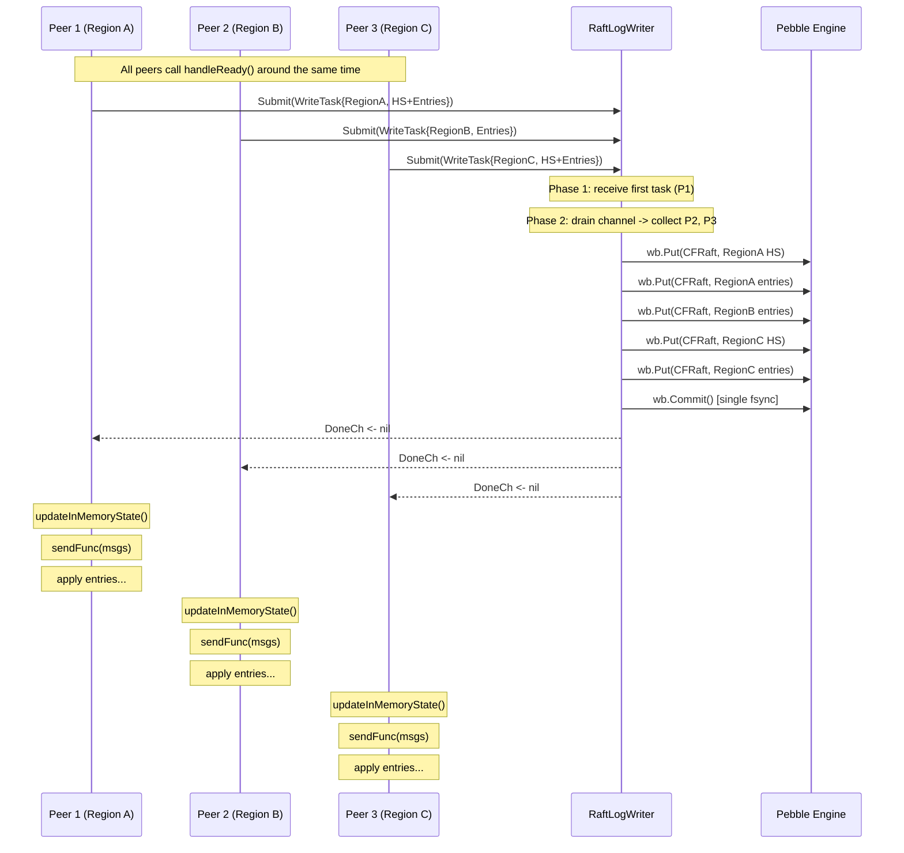

# Raft Log Batch Writer: Cross-Region Write Coalescing

## Table of Contents

1. [Problem Statement](#1-problem-statement)
2. [Current Code Path](#2-current-code-path)
3. [TiKV Reference Design](#3-tikv-reference-design)
4. [Proposed Design](#4-proposed-design)
5. [Data Structures](#5-data-structures)
6. [Coalescing Logic](#6-coalescing-logic)
7. [Peer Flow Changes](#7-peer-flow-changes)
8. [Edge Cases](#8-edge-cases)
9. [Interaction with SaveReady](#9-interaction-with-saveready)
10. [Sequence Diagram](#10-sequence-diagram)
11. [Implementation Steps](#11-implementation-steps)
12. [Test Plan](#12-test-plan)
13. [Files to Change](#13-files-to-change)

---

## 1. Problem Statement

In the current gookv architecture, each peer goroutine calls
`p.storage.SaveReady(rd)` independently in its own `handleReady()` cycle. This
call creates a `WriteBatch`, puts the hard state and new entries into `CF_RAFT`,
and calls `wb.Commit()` which maps to `pebble.Sync` -- a full WAL fsync.

When a store hosts N regions, each tick cycle can produce up to N independent
fsyncs. On Linux, each fsync forces the kernel to flush the disk write cache,
which typically takes 1-10ms on SSD and 5-20ms on HDD. With 100 regions, this
means 100 fsyncs per tick -- up to 1 second of pure fsync overhead per 100ms
tick interval.

The fundamental insight is that **all regions share the same pebble engine**.
Multiple `WriteBatch.Commit(pebble.Sync)` calls that happen close in time could
be coalesced into a single `WriteBatch` with one fsync, amortizing the disk
flush cost across all regions.

### Expected Improvement

- **Single region**: No overhead (one write task, one fsync, same as today).
- **N regions**: N writes coalesced into ~1 fsync per coalescing window. At
  100 regions, this is a ~100x reduction in fsync count.
- **Latency**: Individual peer's `handleReady()` latency changes from
  `T_build + T_fsync` to `T_build + T_submit + T_wait`, where `T_wait` is
  bounded by the coalescing window (typically < 1ms under load).

## 2. Current Code Path

### 2.1 SaveReady() -- `internal/raftstore/storage.go:214-258`

```
line 214: func (s *PeerStorage) SaveReady(rd raft.Ready) error {
line 216:   s.mu.Lock()
line 219:   wb := s.engine.NewWriteBatch()
line 222:   if !raft.IsEmptyHardState(rd.HardState):
line 224:     data, _ := s.hardState.Marshal()
line 228:     wb.Put(cfnames.CFRaft, keys.RaftStateKey(s.regionID), data)
line 234:   for i := range rd.Entries:
line 235:     data, _ := rd.Entries[i].Marshal()
line 239:     wb.Put(cfnames.CFRaft, keys.RaftLogKey(s.regionID, rd.Entries[i].Index), data)
line 244:   wb.Commit()   // <-- pebble.Sync (fsync)
line 249:   // Update in-memory cache
line 250:   s.appendToCache(rd.Entries)
line 252:   if lastEntry.Index > s.persistedLastIndex:
line 253:     s.persistedLastIndex = lastEntry.Index
```

### 2.2 WriteBatch.Commit() -- `internal/engine/rocks/engine.go:443-444`

```go
func (wb *writeBatch) Commit() error {
    return wb.batch.Commit(pebble.Sync)  // fsync WAL
}
```

### 2.3 Call Site in handleReady() -- `internal/raftstore/peer.go:578-583`

```
line 578: // Persist entries and hard state.
line 579: if err := p.storage.SaveReady(rd); err != nil {
line 582:     return
line 583: }
```

The peer blocks here until the fsync completes. Only after `SaveReady` returns
does the peer send Raft messages (line 593) and process committed entries
(line 598). This is correct for safety: messages must not be sent before
the log entries they reference are persisted.

### 2.4 Engine Architecture

gookv uses a single pebble instance (one `traits.KvEngine`) shared by all
regions on the store:

- `StoreCoordinator.engine` (`internal/server/coordinator.go:32`)
- Passed to `NewPeer()` and stored as `Peer.engine` (`internal/raftstore/peer.go:87`)
- Also used in `PeerStorage` (`internal/raftstore/storage.go:30`)

Since all regions write to the same pebble instance, their WriteBatches can
be merged before the single commit.

## 3. TiKV Reference Design

TiKV (raftstore v1/v2) uses a dedicated write worker for batching:

### 3.1 WriteTask (`raftstore/src/store/async_io/write.rs:216-236`)

```rust
pub struct WriteTask<EK, ER> {
    region_id: u64,
    peer_id: u64,
    ready_number: u64,
    pub raft_wb: Option<ER::LogBatch>,
    pub persisted_cbs: Vec<Box<dyn FnOnce() + Send>>,
    entries: Vec<Entry>,
    pub raft_state: Option<RaftLocalState>,
    pub messages: Vec<RaftMessage>,
    pub has_snapshot: bool,
    // ...
}
```

### 3.2 WriteRouter / WriteSenders (`write_router.rs:61, 309`)

- `WriteRouter` per peer dispatches `WriteTask` to a pool of write workers.
- Multiple write workers, each with a dedicated receiver, handle tasks.

### 3.3 write_to_db() (`write.rs:1097`)

The write worker collects tasks from its queue, merges them into a single raft
engine write batch, then calls `consume_and_shrink()` with `sync=true` --
one fsync for all coalesced tasks.

### 3.4 Persisted Notification

After the write completes, the worker notifies each peer via
`PersistedNotifier`. The peer's `on_persisted()` then sends Raft messages
and advances the Raft state machine.

### Key Difference from gookv

TiKV separates the raft engine from the KV engine. gookv uses a single pebble
engine with column family prefixes. This simplifies our design: we only need
to batch writes to one engine, not coordinate across two.

## 4. Proposed Design

### 4.1 Overview

Introduce a **`RaftLogWriter`** -- a single goroutine that receives `WriteTask`
structs from peer goroutines, coalesces them into a single `WriteBatch`, and
performs one `Commit(pebble.Sync)` for the entire batch. Each submitting peer
blocks on a `doneCh` until its data is persisted.

```
  Peer 1 ──► WriteTask ──┐
  Peer 2 ──► WriteTask ──┤
  Peer 3 ──► WriteTask ──┼──► RaftLogWriter ──► [single WriteBatch.Commit()]
  Peer 4 ──► WriteTask ──┤                            │
  Peer 5 ──► WriteTask ──┘                            │
                                                       ▼
                                              signal all doneChs
```

### 4.2 Coalescing Strategy

The writer goroutine uses a **drain-then-write** approach:

1. **Blocking receive**: Wait for the first `WriteTask` on the submission
   channel. This avoids busy-spinning when there's no work.
2. **Non-blocking drain**: After receiving the first task, drain all additional
   pending tasks from the channel (up to a configurable max batch size).
3. **Merge**: Combine all tasks into a single `WriteBatch`.
4. **Commit**: One `wb.Commit()` (pebble.Sync).
5. **Signal**: Close or send on each task's `doneCh` to unblock the submitters.
6. **Repeat**.

This naturally batches: under high load, many tasks accumulate while the
previous batch is being fsynced, and are all picked up in the next drain.
Under low load (single region), the first task is picked up immediately with
no extra latency.

### 4.3 Why a Single Goroutine?

- **Simplicity**: No concurrency issues in the coalescing logic.
- **Correctness**: One goroutine means one `WriteBatch` at a time, no
  interleaving.
- **Performance**: The bottleneck is fsync, not CPU. A single goroutine
  can saturate the disk's sync bandwidth.
- **TiKV precedent**: TiKV uses a small number of write workers (typically 1-2)
  per raft engine.

If profiling later shows the single goroutine is a bottleneck (unlikely given
fsync dominance), it can be extended to a small pool with per-worker channels
and round-robin assignment.

## 5. Data Structures

### 5.1 WriteTask

```go
// WriteTask encapsulates one region's Raft log data to be persisted.
// The peer builds this from a raft.Ready and submits it to the RaftLogWriter.
type WriteTask struct {
    // RegionID identifies the region.
    RegionID uint64

    // HardStateData is the marshaled raftpb.HardState, or nil if unchanged.
    HardStateData []byte

    // Entries are the new Raft log entries to persist.
    // Each entry is pre-marshaled to avoid marshaling under the writer's lock.
    Entries []WriteTaskEntry

    // DoneCh is signaled (closed) when the data has been persisted.
    // The peer blocks on this channel after submitting the task.
    DoneCh chan error
}

// WriteTaskEntry holds a pre-marshaled Raft log entry.
type WriteTaskEntry struct {
    RegionID uint64 // needed for key construction
    Index    uint64
    Data     []byte // marshaled raftpb.Entry
}
```

### 5.2 RaftLogWriter

```go
// RaftLogWriter batches Raft log writes from multiple regions into single
// fsync'd commits. It runs as a single goroutine, receiving WriteTasks
// from peer goroutines and coalescing them.
type RaftLogWriter struct {
    engine       traits.KvEngine
    submissionCh chan WriteTask
    stopCh       chan struct{}
    done         chan struct{} // closed when goroutine exits

    // Metrics
    batchCount   atomic.Int64 // total batches committed
    taskCount    atomic.Int64 // total tasks processed
    totalSyncNs  atomic.Int64 // cumulative fsync time in nanoseconds
}

// NewRaftLogWriter creates and starts a RaftLogWriter.
// channelSize controls the submission channel capacity; recommended: 256.
func NewRaftLogWriter(engine traits.KvEngine, channelSize int) *RaftLogWriter {
    if channelSize <= 0 {
        channelSize = 256
    }
    w := &RaftLogWriter{
        engine:       engine,
        submissionCh: make(chan WriteTask, channelSize),
        stopCh:       make(chan struct{}),
        done:         make(chan struct{}),
    }
    go w.run()
    return w
}

// Submit sends a WriteTask for batched persistence.
// The caller should block on task.DoneCh after calling Submit.
func (w *RaftLogWriter) Submit(task WriteTask) {
    w.submissionCh <- task
}

// Stop signals the writer to drain pending tasks and exit.
// Blocks until the writer goroutine has exited.
func (w *RaftLogWriter) Stop() {
    close(w.stopCh)
    <-w.done
}

func (w *RaftLogWriter) run() {
    defer close(w.done)
    for {
        // Phase 1: blocking wait for first task (or stop signal).
        var tasks []WriteTask
        select {
        case task := <-w.submissionCh:
            tasks = append(tasks, task)
        case <-w.stopCh:
            // Drain remaining tasks before exiting.
            w.drainAndCommit()
            return
        }

        // Phase 2: non-blocking drain of additional pending tasks.
        const maxBatchSize = 256
        for len(tasks) < maxBatchSize {
            select {
            case task := <-w.submissionCh:
                tasks = append(tasks, task)
            default:
                goto commit
            }
        }
    commit:

        // Phase 3: coalesce and commit.
        w.coalescedCommit(tasks)
    }
}

func (w *RaftLogWriter) drainAndCommit() {
    var tasks []WriteTask
    for {
        select {
        case task := <-w.submissionCh:
            tasks = append(tasks, task)
        default:
            if len(tasks) > 0 {
                w.coalescedCommit(tasks)
            }
            return
        }
    }
}
```

## 6. Coalescing Logic

The core coalescing method builds a single `WriteBatch` from all collected
tasks and commits once:

```go
func (w *RaftLogWriter) coalescedCommit(tasks []WriteTask) {
    wb := w.engine.NewWriteBatch()

    for i := range tasks {
        task := &tasks[i]

        // Write hard state if present.
        if task.HardStateData != nil {
            if err := wb.Put(
                cfnames.CFRaft,
                keys.RaftStateKey(task.RegionID),
                task.HardStateData,
            ); err != nil {
                // Signal this task's doneCh with the error.
                task.DoneCh <- fmt.Errorf("raftlogwriter: put hard state: %w", err)
                continue
            }
        }

        // Write entries.
        for j := range task.Entries {
            entry := &task.Entries[j]
            if err := wb.Put(
                cfnames.CFRaft,
                keys.RaftLogKey(entry.RegionID, entry.Index),
                entry.Data,
            ); err != nil {
                task.DoneCh <- fmt.Errorf("raftlogwriter: put entry: %w", err)
                break
            }
        }
    }

    // Single fsync for all regions.
    syncStart := time.Now()
    commitErr := wb.Commit() // pebble.Sync
    syncElapsed := time.Since(syncStart)
    w.totalSyncNs.Add(syncElapsed.Nanoseconds())
    w.batchCount.Add(1)
    w.taskCount.Add(int64(len(tasks)))

    // Signal all tasks.
    for i := range tasks {
        select {
        case tasks[i].DoneCh <- commitErr:
        default:
            // DoneCh already has an error from the put phase; skip.
        }
    }
}
```

### 6.1 Error Semantics

- If a `wb.Put()` fails for a specific task (e.g., encoding error), that
  task's `DoneCh` receives the error immediately. Other tasks in the batch
  are unaffected.
- If `wb.Commit()` fails, ALL tasks in the batch receive the same error.
  This is correct: a commit failure means none of the data was persisted.
- The `DoneCh` is a buffered channel of size 1. If a put-phase error already
  sent to it, the commit-phase error is skipped (the `default` case).

### 6.2 Performance Characteristics

| Scenario | Tasks per batch | Fsyncs per tick |
|----------|----------------|-----------------|
| 1 region, idle | 1 | 1 |
| 1 region, active | 1 | 1 |
| 10 regions, active | ~10 | 1 |
| 100 regions, active | ~100 | 1-2 |
| 100 regions, bursty | up to 256 (max batch) | 1 |

The max batch size of 256 prevents a single commit from taking too long.
If more than 256 tasks are pending, they spill into the next batch.

## 7. Peer Flow Changes

### 7.1 Current Flow (`internal/raftstore/peer.go:542-688`)

```
handleReady():
  rd = rawNode.Ready()
  SoftState processing
  SaveReady(rd)              // [1] fsync, blocks
  ApplySnapshot(rd.Snapshot) // if present
  sendFunc(rd.Messages)      // [2] send after persist
  apply committed entries     // [3] blocking
  callbacks + applied index
  ReadStates + pendingReads
  Advance(rd)
```

### 7.2 New Flow

```
handleReady():
  rd = rawNode.Ready()
  SoftState processing

  // Build WriteTask (pre-marshal in peer goroutine).
  writeTask = buildWriteTask(rd)
  raftLogWriter.Submit(writeTask)
  <-writeTask.DoneCh          // [1] blocks until coalesced fsync

  // Update in-memory state (moved from SaveReady).
  updateInMemoryState(rd)

  ApplySnapshot(rd.Snapshot) // if present
  sendFunc(rd.Messages)      // [2] send after persist (same as before)
  apply committed entries     // [3] same as before (or async, per doc 02)
  callbacks + applied index
  ReadStates + pendingReads
  Advance(rd)
```

### 7.3 buildWriteTask Helper

This is a new method on `Peer` (or a free function) that extracts the
persistence data from a `raft.Ready`:

```go
func (p *Peer) buildWriteTask(rd raft.Ready) WriteTask {
    task := WriteTask{
        RegionID: p.regionID,
        DoneCh:   make(chan error, 1),
    }

    // Marshal hard state if changed.
    if !raft.IsEmptyHardState(rd.HardState) {
        data, err := rd.HardState.Marshal()
        if err != nil {
            // This should never happen; hard state is a simple protobuf.
            task.DoneCh <- fmt.Errorf("marshal hard state: %w", err)
            return task
        }
        task.HardStateData = data
        // Update in-memory hard state immediately (read-only optimization).
        p.storage.setHardStateNoLock(rd.HardState)
    }

    // Pre-marshal entries.
    task.Entries = make([]WriteTaskEntry, len(rd.Entries))
    for i := range rd.Entries {
        data, err := rd.Entries[i].Marshal()
        if err != nil {
            task.DoneCh <- fmt.Errorf("marshal entry %d: %w", rd.Entries[i].Index, err)
            return task
        }
        task.Entries[i] = WriteTaskEntry{
            RegionID: p.regionID,
            Index:    rd.Entries[i].Index,
            Data:     data,
        }
    }

    return task
}
```

### 7.4 updateInMemoryState Helper

After the `DoneCh` signals success, the peer updates in-memory caches that
were previously updated inside `SaveReady()`:

```go
func (p *Peer) updateInMemoryState(rd raft.Ready) {
    if len(rd.Entries) > 0 {
        p.storage.AppendToCache(rd.Entries)
        lastEntry := rd.Entries[len(rd.Entries)-1]
        p.storage.UpdatePersistedLastIndex(lastEntry.Index)
    }
}
```

This requires exposing two methods on `PeerStorage`:

- `AppendToCache(entries []raftpb.Entry)` -- already exists as the private
  `appendToCache` (storage.go); needs to be exported or called via a public
  method.
- `UpdatePersistedLastIndex(index uint64)` -- wraps the update with a lock.

## 8. Edge Cases

### 8.1 Single Region (No Batching Penalty)

When only one region is active, the writer receives one task, drains nothing
in the non-blocking phase, and commits immediately. The overhead vs. the
current direct-write path is:
- One channel send/receive pair (~50ns)
- One `DoneCh` signal (~50ns)

Total overhead: ~100ns per Ready cycle. Negligible compared to the ~1ms
fsync.

### 8.2 Snapshot Ready

When `rd.Snapshot` is non-empty, the peer must apply the snapshot before
sending messages or applying entries. The snapshot data itself is applied
via `p.storage.ApplySnapshot()` (peer.go:587-589), which writes to the KV
engine, not the raft log.

The WriteTask for a snapshot Ready may contain new entries and hard state
(from the snapshot's metadata). These are handled normally by the writer.
The snapshot application happens AFTER the `DoneCh` returns, which is
correct: the raft log entries are persisted before the snapshot is applied.

### 8.3 Empty Ready (No Entries, No HardState Change)

If `rd.Entries` is empty and `rd.HardState` is empty, `SaveReady()` currently
still creates and commits an empty WriteBatch (which is a no-op). With the
new design, `buildWriteTask()` produces a task with nil `HardStateData` and
empty `Entries`. The peer should skip submission entirely:

```go
if task.HardStateData == nil && len(task.Entries) == 0 {
    // Nothing to persist; skip writer submission.
} else {
    w.Submit(task)
    if err := <-task.DoneCh; err != nil {
        return // persistence failure
    }
}
```

### 8.4 Writer Goroutine Crash

If the writer goroutine panics, all peers will block on their `DoneCh`
forever. To prevent this:
1. The `run()` method uses `defer` with a recovery handler that signals
   all pending tasks with an error.
2. The recovery handler restarts the goroutine (or the store shuts down).

### 8.5 Channel Full (Backpressure)

If the submission channel is full (256 tasks pending), `Submit()` blocks.
This back-pressures the peer's `handleReady()`, which prevents it from
accepting new proposals. This is acceptable: if the writer cannot keep up,
slowing down the peers is the correct response.

### 8.6 Term Change / Hard State Update Without Entries

A follower may receive heartbeats that update the commit index (reflected
in HardState) without appending new entries. The WriteTask will have
`HardStateData != nil` and empty `Entries`. This is handled correctly by
the coalescing logic -- the hard state is written as part of the batch.

## 9. Interaction with SaveReady

### 9.1 Replacing SaveReady

The `RaftLogWriter` replaces the direct `p.storage.SaveReady(rd)` call. The
existing `SaveReady()` method is NOT deleted -- it remains available as a
fallback for:
- Tests that create peers without a writer.
- The backward-compatible path when `raftLogWriter` is nil.

### 9.2 PeerStorage Changes

`PeerStorage.SaveReady()` currently does three things:
1. Persist hard state and entries to engine (lines 219-246).
2. Update in-memory entry cache (line 250).
3. Update `persistedLastIndex` (lines 252-254).

With the writer, step 1 moves to the `RaftLogWriter`. Steps 2 and 3 are
performed by the peer after `DoneCh` returns (see section 7.4). This means
`PeerStorage` needs to expose:

- `AppendToCache(entries []raftpb.Entry)` -- public wrapper around the
  private `appendToCache()`.
- `UpdatePersistedLastIndex(index uint64)` -- public setter with mutex.

These are additive changes; `SaveReady()` remains unchanged.

### 9.3 Hard State In-Memory Update Timing

In the current code, `SaveReady()` updates `s.hardState` (line 223) inside
the lock before persisting. With the writer, the peer calls
`p.storage.setHardStateNoLock()` during `buildWriteTask()` (before
submission). This is safe because:
- The peer goroutine is the only writer of hard state.
- Raft reads hard state via `InitialState()` which is called only during
  peer creation (before the goroutine starts).
- `currentTerm` is updated separately from `rd.HardState.Term` (peer.go:575).

However, to be safe, we use the existing `SetHardState()` with a lock rather
than a lockless path.

## 10. Sequence Diagram



## 11. Implementation Steps

### Step 1: Define WriteTask and WriteTaskEntry

**File:** `internal/raftstore/msg.go`

1. Add `WriteTask` struct with fields: `RegionID`, `HardStateData`, `Entries`,
   `DoneCh`.
2. Add `WriteTaskEntry` struct with fields: `RegionID`, `Index`, `Data`.

### Step 2: Implement RaftLogWriter

**New file:** `internal/raftstore/raft_log_writer.go`

1. Implement `RaftLogWriter` struct.
2. Implement `NewRaftLogWriter(engine, channelSize)`.
3. Implement `Submit(task)`.
4. Implement `Stop()`.
5. Implement `run()` with the drain-then-write loop.
6. Implement `coalescedCommit(tasks)`.
7. Implement `drainAndCommit()` for graceful shutdown.
8. Add metrics accessors: `BatchCount()`, `TaskCount()`, `AvgSyncNs()`.

### Step 3: Add Public Methods to PeerStorage

**File:** `internal/raftstore/storage.go`

1. Add `AppendToCache(entries []raftpb.Entry)` -- public wrapper:
   ```go
   func (s *PeerStorage) AppendToCache(entries []raftpb.Entry) {
       s.mu.Lock()
       defer s.mu.Unlock()
       s.appendToCache(entries)
   }
   ```
2. Add `UpdatePersistedLastIndex(index uint64)`:
   ```go
   func (s *PeerStorage) UpdatePersistedLastIndex(index uint64) {
       s.mu.Lock()
       defer s.mu.Unlock()
       if index > s.persistedLastIndex {
           s.persistedLastIndex = index
       }
   }
   ```

### Step 4: Add RaftLogWriter to Peer

**File:** `internal/raftstore/peer.go`

1. Add field: `raftLogWriter *RaftLogWriter` (line ~115, after `logGCWorkerCh`).
2. Add setter: `SetRaftLogWriter(w *RaftLogWriter)`.
3. Add helper: `buildWriteTask(rd raft.Ready) WriteTask`.
4. Add helper: `updateInMemoryState(rd raft.Ready)`.

### Step 5: Modify handleReady() to Use Writer

**File:** `internal/raftstore/peer.go` lines 578-583

Replace:
```go
if err := p.storage.SaveReady(rd); err != nil {
    return
}
```

With:
```go
if p.raftLogWriter != nil {
    task := p.buildWriteTask(rd)
    if task.HardStateData != nil || len(task.Entries) > 0 {
        p.raftLogWriter.Submit(task)
        if err := <-task.DoneCh; err != nil {
            slog.Error("raftlogwriter: persist failed",
                "region", p.regionID, "err", err)
            return
        }
    }
    p.updateInMemoryState(rd)
} else {
    // Fallback: direct write (backward compatible).
    if err := p.storage.SaveReady(rd); err != nil {
        return
    }
}
```

### Step 6: Wire RaftLogWriter in StoreCoordinator

**File:** `internal/server/coordinator.go`

1. Add field: `raftLogWriter *raftstore.RaftLogWriter` to `StoreCoordinator`
   (line ~46).
2. Initialize in `NewStoreCoordinator()` (after line 96):
   ```go
   sc.raftLogWriter = raftstore.NewRaftLogWriter(cfg.Engine, 256)
   ```
3. Wire to peers in `BootstrapRegion()` (after line 150):
   ```go
   peer.SetRaftLogWriter(sc.raftLogWriter)
   ```
4. Wire to peers in `CreatePeer()` (after line 533):
   ```go
   peer.SetRaftLogWriter(sc.raftLogWriter)
   ```
5. Stop the writer in the coordinator's shutdown path:
   ```go
   sc.raftLogWriter.Stop()
   ```

### Step 7: Add Panic Recovery to Writer

**File:** `internal/raftstore/raft_log_writer.go`

Add recovery handler in `run()`:
```go
func (w *RaftLogWriter) run() {
    defer close(w.done)
    defer func() {
        if r := recover(); r != nil {
            slog.Error("raftlogwriter: panic in writer goroutine",
                "panic", r)
            // Drain and signal all pending tasks with error.
            for {
                select {
                case task := <-w.submissionCh:
                    task.DoneCh <- fmt.Errorf("raftlogwriter: writer panicked: %v", r)
                default:
                    return
                }
            }
        }
    }()
    // ... main loop ...
}
```

## 12. Test Plan

### 12.1 Unit Tests

**File:** `internal/raftstore/raft_log_writer_test.go`

1. **TestRaftLogWriterSingleTask**: Submit one task, verify DoneCh returns nil,
   verify data is persisted in the engine.
2. **TestRaftLogWriterCoalescing**: Submit 10 tasks rapidly, verify they are
   coalesced into fewer batches than tasks (check `BatchCount()` < 10).
3. **TestRaftLogWriterHardStateOnly**: Submit a task with only HardStateData
   (no entries), verify it is persisted correctly.
4. **TestRaftLogWriterEntriesOnly**: Submit a task with only entries (no hard
   state change), verify entries are persisted.
5. **TestRaftLogWriterEmptyTask**: Verify that the peer skips submission for
   empty tasks (no data to persist).
6. **TestRaftLogWriterCommitError**: Inject a commit failure (e.g., closed
   engine), verify all tasks in the batch receive the error.
7. **TestRaftLogWriterStop**: Submit tasks, call Stop(), verify all pending
   tasks are committed before Stop returns.
8. **TestRaftLogWriterConcurrent**: Submit tasks from multiple goroutines
   simultaneously, verify all tasks complete without data corruption.
9. **TestRaftLogWriterMultiRegionIsolation**: Submit tasks for regions A and B
   in the same batch, verify each region's data is under its own key prefix
   and retrievable independently.

### 12.2 Integration Tests

**File:** `internal/raftstore/peer_test.go` (extend existing)

1. **TestHandleReadyWithWriter**: Create a peer with a `RaftLogWriter`,
   propose entries, trigger `handleReady()`, verify entries are persisted
   and in-memory state is updated.
2. **TestWriterFallback**: Create a peer WITHOUT a `RaftLogWriter`, verify
   the fallback `SaveReady()` path works as before (backward compatibility).

### 12.3 Benchmarks

**File:** `internal/raftstore/raft_log_writer_bench_test.go`

1. **BenchmarkDirectSaveReady**: Baseline -- N goroutines each calling
   `SaveReady()` directly (current behavior). Measure total time for 1000
   ready cycles across N=1,10,50,100 regions.
2. **BenchmarkBatchedRaftLogWriter**: Same workload routed through
   `RaftLogWriter`. Measure total time for same parameters.
3. Compare: total fsyncs, wall-clock time, per-region latency (p50, p99).

Expected results:
- N=1: ~same performance (within noise).
- N=10: ~5-8x improvement in total fsync time.
- N=100: ~50-90x improvement in total fsync time.

## 13. Files to Change

| File | Lines | Change |
|------|-------|--------|
| `internal/raftstore/msg.go` | (append) | Add `WriteTask`, `WriteTaskEntry` structs |
| `internal/raftstore/raft_log_writer.go` | (new) | `RaftLogWriter` implementation |
| `internal/raftstore/storage.go` | after 258 | Add `AppendToCache()`, `UpdatePersistedLastIndex()` public methods |
| `internal/raftstore/peer.go` | 78-147 | Add `raftLogWriter` field |
| `internal/raftstore/peer.go` | ~260 | Add `SetRaftLogWriter()` setter |
| `internal/raftstore/peer.go` | 578-583 | Replace `SaveReady()` call with writer submission |
| `internal/raftstore/peer.go` | (new methods) | `buildWriteTask()`, `updateInMemoryState()` |
| `internal/server/coordinator.go` | 29-56 | Add `raftLogWriter` field to `StoreCoordinator` |
| `internal/server/coordinator.go` | 72-109 | Initialize `RaftLogWriter` in `NewStoreCoordinator()` |
| `internal/server/coordinator.go` | 135-150 | Wire writer to peer in `BootstrapRegion()` |
| `internal/server/coordinator.go` | 516-533 | Wire writer to peer in `CreatePeer()` |
| `internal/raftstore/raft_log_writer_test.go` | (new) | Unit tests |
| `internal/raftstore/raft_log_writer_bench_test.go` | (new) | Benchmarks |

---

## Addendum: Review Feedback Incorporated

This section addresses findings from the design review (2026-03-28 v2) that
affect this document. Existing content above is unchanged; the corrections
and clarifications below take precedence where they conflict.

### A1. Per-Task Error on coalescedCommit -- Fail Entire Batch (Finding 9 -- MEDIUM)

**Problem:** In the `coalescedCommit` implementation (section 6), if `wb.Put()`
fails for task i, the code sends an error on that task's `DoneCh` and
`continue`s. But the failed task's entries that were already Put (e.g., the
hard state succeeded but an entry failed) remain in the WriteBatch. The batch
commits with partial data for that region -- some entries persisted, some not.
On restart, the raft log for that region would have gaps.

**Fix:** On any `Put` error, fail ALL tasks in the batch and return without
committing. A single bad task poisons the entire batch. This matches doc 04's
approach and is the safest strategy (no partial writes):

```go
func (w *RaftLogWriter) coalescedCommit(tasks []WriteTask) {
    wb := w.engine.NewWriteBatch()

    for i := range tasks {
        task := &tasks[i]

        if task.HardStateData != nil {
            if err := wb.Put(
                cfnames.CFRaft,
                keys.RaftStateKey(task.RegionID),
                task.HardStateData,
            ); err != nil {
                // Fail ALL tasks in this batch -- partial commit is unsafe.
                putErr := fmt.Errorf("raftlogwriter: put hard state region %d: %w",
                    task.RegionID, err)
                for j := range tasks {
                    tasks[j].DoneCh <- putErr
                }
                return
            }
        }

        for j := range task.Entries {
            entry := &task.Entries[j]
            if err := wb.Put(
                cfnames.CFRaft,
                keys.RaftLogKey(entry.RegionID, entry.Index),
                entry.Data,
            ); err != nil {
                putErr := fmt.Errorf("raftlogwriter: put entry region %d index %d: %w",
                    entry.RegionID, entry.Index, err)
                for k := range tasks {
                    tasks[k].DoneCh <- putErr
                }
                return
            }
        }
    }

    // Single fsync for all regions.
    syncStart := time.Now()
    commitErr := wb.Commit()
    syncElapsed := time.Since(syncStart)
    w.totalSyncNs.Add(syncElapsed.Nanoseconds())
    w.batchCount.Add(1)
    w.taskCount.Add(int64(len(tasks)))

    // Signal all tasks with the commit result.
    for i := range tasks {
        tasks[i].DoneCh <- commitErr
    }
}
```

This supersedes the `coalescedCommit` implementation in section 6. The
section 6.1 error semantics paragraph about per-task Put errors sending only
to the affected task's `DoneCh` is no longer applicable. The `DoneCh` channel
should remain buffered with size 1; only one error is ever sent.

As a future refinement, `WriteBatch.SetSavePoint()` /
`RollbackToSavePoint()` (traits.go:94-101) could be used to isolate
per-task failures, but the all-or-nothing approach is simpler and sufficient
given that `Put` failures in practice indicate a systemic engine problem.

### A2. Writer Panic Recovery (Finding from section 8.4 -- expanded)

**Problem:** Section 8.4 mentions panic recovery but does not provide the full
implementation. If the writer goroutine panics, all peers block on `DoneCh`
forever.

**Fix:** The `run()` method must include `recover()` that fails all pending
tasks with an error. The implementation in section 11, Step 7 is canonical.
For completeness, the recovery handler must drain the submission channel and
signal all pending tasks:

```go
func (w *RaftLogWriter) run() {
    defer close(w.done)
    defer func() {
        if r := recover(); r != nil {
            slog.Error("raftlogwriter: panic in writer goroutine",
                "panic", r, "stack", string(debug.Stack()))
            // Fail all pending tasks so peers do not block forever.
            panicErr := fmt.Errorf("raftlogwriter: writer panicked: %v", r)
            for {
                select {
                case task := <-w.submissionCh:
                    task.DoneCh <- panicErr
                default:
                    return
                }
            }
        }
    }()
    // ... main loop (unchanged) ...
}
```

After a panic, the writer goroutine exits. Subsequent `Submit()` calls will
block on the channel indefinitely. To handle this, `Submit()` should check a
stopped/panicked flag (see A4 below) or the store should initiate shutdown
on writer failure.

### A3. Hard State In-Memory Update Timing (Finding 8 -- MEDIUM)

**Problem:** Section 7.3 (`buildWriteTask`) calls
`p.storage.setHardStateNoLock(rd.HardState)` during task construction -- before
the data is persisted. Section 9.3 acknowledges this but claims safety. However,
if the peer crashes after `buildWriteTask()` but before `DoneCh` returns, the
in-memory hard state reflects a value that was never persisted.

Doc 04's `ApplyWriteTaskPostPersist` correctly updates the hard state AFTER
persistence confirmation. This is the safer approach.

**Fix:** Remove the `p.storage.setHardStateNoLock(rd.HardState)` call from
`buildWriteTask()` (section 7.3, line 466). Instead, update the hard state in
`updateInMemoryState()` (section 7.4) which runs after `DoneCh` confirms
persistence:

```go
func (p *Peer) updateInMemoryState(rd raft.Ready) {
    if !raft.IsEmptyHardState(rd.HardState) {
        p.storage.SetHardState(rd.HardState)
    }
    if len(rd.Entries) > 0 {
        p.storage.AppendToCache(rd.Entries)
        lastEntry := rd.Entries[len(rd.Entries)-1]
        p.storage.UpdatePersistedLastIndex(lastEntry.Index)
    }
}
```

Doc 04's `ApplyWriteTaskPostPersist` approach is canonical. The section 9.3
claim that early hard state update is safe is withdrawn.

### A4. WriteTask Struct Reconciliation with Doc 04 (Finding 16 -- MEDIUM)

**Problem:** This document's section 5.1 defines `WriteTask` with
`HardStateData []byte` and `Entries []WriteTaskEntry`. Doc 04 section 1.1
redefines it with `Ops []WriteOp`, `Entries []raftpb.Entry`, and
`HardState *raftpb.HardState`. These are incompatible.

**Resolution:** Doc 04's `WriteTask` definition is canonical. It pre-serializes
entries into `[]WriteOp` for the writer while carrying the original
`[]raftpb.Entry` and `*raftpb.HardState` for post-persist in-memory updates.
The `WriteTask` and `WriteTaskEntry` structs in section 5.1 of this document
are superseded. Refer to doc 04 section 1.1 for the final structure.

### A5. SaveReady Line Reference (Finding 10 -- LOW)

Section 2.1 heading says `storage.go:214-258`. The actual function starts at
line 215. Correct heading: `storage.go:215-258`.
