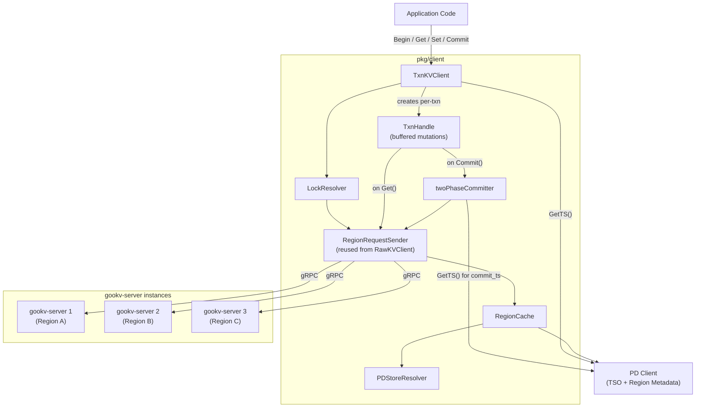

# Cross-Region Transactional Client (TxnClient) -- Overview

## 1. Problem Statement

gookv currently provides `RawKVClient` (`pkg/client/rawkv.go`) with full multi-region
routing (via `RegionCache` and `RegionRequestSender`), but lacks a transactional client.
The `impl_docs/08_not_yet_implemented.md` item #2 lists "TxnClient (2PC cross-region)"
as not yet implemented.

All transactional RPCs are fully implemented server-side:

- `KvPrewrite` -- write tentative values to CF_DEFAULT and locks to CF_LOCK
- `KvCommit` -- move locks to commit records in CF_WRITE
- `KvBatchRollback` -- clean up locks and write rollback markers
- `KvCheckTxnStatus` -- inspect the primary key to determine transaction fate
- `KvResolveLock` -- batch-resolve all locks belonging to a given transaction
- `KvPessimisticLock` -- acquire pessimistic locks eagerly
- `KvPessimisticRollback` -- release pessimistic locks without committing

The missing piece is a client-side orchestrator that drives the Percolator 2PC protocol
across multiple regions.

## 2. Goals

| Goal | Description |
|------|-------------|
| **Optimistic 2PC** | Client-driven Percolator protocol. Buffer mutations, prewrite all regions, commit all regions. No server-side coordinator. |
| **Pessimistic mode** | `KvPessimisticLock` for eager conflict detection. Locks are acquired at mutation time rather than at commit time. Abort-on-deadlock semantics. |
| **Async commit** | Commit without a separate `commit_ts` from PD. The `min_commit_ts` across all keys determines the final commit timestamp. Reduces latency by eliminating one PD round-trip. |
| **1PC optimization** | Single-region transactions skip CF_LOCK entirely. The server writes directly to CF_WRITE during prewrite. No separate commit phase needed. |
| **Lock resolution** | Percolator-style: when a transaction encounters a lock left by another transaction, it checks the primary key's status and either waits, commits, or rolls back the stale lock. |

## 3. Non-Goals

| Non-Goal | Rationale |
|----------|-----------|
| Server-side transaction coordinator | The client orchestrates everything, matching TiKV's design. |
| TLS/mTLS | Out of scope per `design_docs/08_priority_and_scope.md`. |
| Batched TSO | Single TSO requests from PD suffice for now. Can be added later as a performance optimization. |
| Distributed deadlock detection | Pessimistic mode uses abort-on-deadlock: if a lock cannot be acquired within a timeout, the transaction aborts. No cross-node deadlock detection graph. |
| Large transaction support | Transactions that exceed memory limits (e.g., millions of mutations) are not supported in the initial implementation. |

## 4. Glossary

| Term | Definition |
|------|------------|
| `start_ts` | Snapshot version obtained from PD TSO at `Begin()`. Determines the MVCC read snapshot and identifies the transaction. All locks and writes reference this timestamp. |
| `commit_ts` | Commit version obtained from PD TSO at `Commit()`. Marks when the transaction's writes become visible to subsequent readers. Must be strictly greater than `start_ts`. |
| `primary key` | The single key whose CF_WRITE commit record is the authoritative source of truth for the transaction's fate. Selected deterministically (first key after sorting mutations by byte order). |
| `secondary key` | All keys in the transaction except the primary. Their locks contain a `Lock.Primary` field pointing back to the primary key. |
| `lock TTL` | Time-to-live for locks in milliseconds. If a lock's TTL has expired (based on physical time), other transactions may resolve (rollback) it. Prevents abandoned locks from blocking the system indefinitely. |
| `min_commit_ts` | Lower bound on `commit_ts` for async commit. Each key's prewrite response may push this value higher (e.g., due to concurrent reads). Final `commit_ts = max(min_commit_ts across all keys)`. |
| `for_update_ts` | Timestamp used in pessimistic mode for conflict detection. Obtained from PD TSO when acquiring pessimistic locks. Used instead of `start_ts` for write-write conflict checks, allowing pessimistic transactions to "see" newer writes. |

## 5. TiKV Comparison Table

| Aspect | gookv TxnClient | TiKV client-go txnkv |
|--------|-----------------|----------------------|
| Protocol | Percolator 2PC | Percolator 2PC |
| Language | Go | Go |
| TSO Source | PD `GetTS()` | PD `GetTS()` |
| Region Routing | `RegionCache` + `GroupKeysByRegion` | `RegionCache` + `GroupKeysByRegion` |
| RPC Transport | gRPC (`tikvpb.TikvClient`) | gRPC (`tikvpb.TikvClient`) |
| Lock Resolution | Client-side `LockResolver` | Client-side `LockResolver` |
| Async Commit | Supported | Supported |
| 1PC | Supported | Supported |
| Pessimistic | Supported | Supported |
| Batched TSO | Not supported | Supported |
| Large Txn | Not supported (future) | Supported |
| Retry / Backoff | Simple fixed-count retry | Exponential backoff with jitter |
| Connection Pool | Shared `RegionRequestSender` conn map | Dedicated connection pool per store |

## 6. High-Level Architecture

### Component Responsibilities

- **TxnKVClient**: Entry point. Creates `TxnHandle` instances via `Begin()`. Holds shared
  infrastructure (`RegionRequestSender`, `LockResolver`, PD client reference).
- **TxnHandle**: Per-transaction object. Buffers `Set`/`Delete` mutations in an in-memory
  map. Serves `Get` requests by checking the local buffer first, then issuing `KvGet` RPCs.
  On `Commit()`, hands off to `twoPhaseCommitter`.
- **twoPhaseCommitter**: Orchestrates the two-phase commit. Groups mutations by region,
  sends `KvPrewrite` to all regions (primary first), obtains `commit_ts`, sends `KvCommit`
  to all regions (primary first). Handles async commit and 1PC paths.
- **LockResolver**: When a `Get` or `Prewrite` encounters a lock from another transaction,
  the resolver checks the lock's primary key status via `KvCheckTxnStatus` and either waits
  for the lock to expire or resolves it (commit or rollback).
- **RegionRequestSender**: Reused as-is from `RawKVClient`. Handles key-to-region routing,
  gRPC connection pooling, and region error retries.
- **RegionCache**: Reused as-is. Caches region metadata with PD fallback.
- **PDStoreResolver**: Reused as-is. Resolves store IDs to gRPC addresses.
