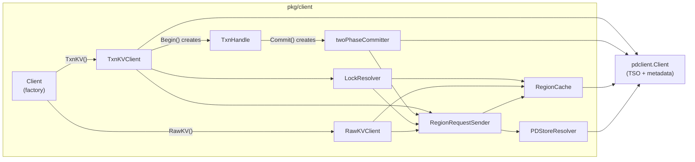
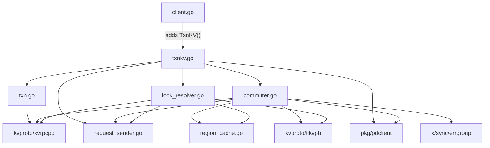

# Cross-Region Transactional Client -- Architecture

## 1. Package Placement

All new code lives in `pkg/client/`, alongside the existing `RawKVClient`:

| File | Purpose |
|------|---------|
| `txnkv.go` | `TxnKVClient` struct and factory. Entry point for transactional operations. |
| `txn.go` | `TxnHandle` -- per-transaction object with buffered mutations and snapshot reads. |
| `lock_resolver.go` | `LockResolver` -- Percolator lock resolution (check primary, resolve secondaries). |
| `committer.go` | `twoPhaseCommitter` -- prewrite/commit/rollback orchestration across regions. |

No new packages are introduced. The transactional client reuses the same infrastructure
that `RawKVClient` depends on.

## 2. Reuse Matrix

| Component | File | Reuse | Changes Required |
|-----------|------|-------|------------------|
| `RegionCache` | `pkg/client/region_cache.go` | As-is | None |
| `RegionRequestSender` | `pkg/client/request_sender.go` | As-is | None |
| `PDStoreResolver` | `pkg/client/store_resolver.go` | As-is | None |
| `RPCFunc` | `pkg/client/request_sender.go` | As-is | None |
| `KeyGroup` | `pkg/client/region_cache.go` | As-is | None |
| `RegionInfo` | `pkg/client/region_cache.go` | As-is | None |
| `buildContext()` | `pkg/client/client.go` | As-is | None |
| `errFromString()` | `pkg/client/rawkv.go` | As-is | None |
| `Client` | `pkg/client/client.go` | Minor extension | Add `TxnKV() *TxnKVClient` method |
| `RawKVClient` | `pkg/client/rawkv.go` | Reference pattern | `BatchGet`/errgroup pattern reused in committer |
| **New:** `TxnKVClient` | `pkg/client/txnkv.go` | New | -- |
| **New:** `TxnHandle` | `pkg/client/txn.go` | New | -- |
| **New:** `LockResolver` | `pkg/client/lock_resolver.go` | New | -- |
| **New:** `twoPhaseCommitter` | `pkg/client/committer.go` | New | -- |

### Key Reuse Details

- **RegionRequestSender.SendToRegion**: The committer uses this for `KvPrewrite`, `KvCommit`,
  `KvBatchRollback`, and `KvCheckTxnStatus` RPCs. The existing retry-on-region-error logic
  handles `NotLeader`, `EpochNotMatch`, and `RegionNotFound` transparently.

- **RegionCache.GroupKeysByRegion**: The committer uses this to partition mutations by region
  before sending parallel prewrite/commit RPCs, exactly as `RawKVClient.BatchPut` does.

- **errgroup pattern**: The committer adopts the same `errgroup.WithContext` + per-region
  goroutine pattern from `RawKVClient.BatchGet`/`BatchPut`.

## 3. Component Diagram



## 4. Dependency Graph

Import dependencies between new files and existing infrastructure:



### Notes on Dependency Discipline

- `txn.go` has minimal dependencies -- only `kvproto/kvrpcpb` for mutation types.
  It does not import `request_sender` or `region_cache` directly; the `TxnKVClient`
  injects the sender when the handle needs to perform reads.
- `committer.go` is the heaviest new file, importing region routing, PD client, and
  errgroup for parallel RPC dispatch.
- No circular dependencies exist. The graph is a clean DAG.

## 5. Data Flow

A complete transaction lifecycle flows through the components as follows:

### 5.1. Begin

```
Application
    |
    v
Client.TxnKV()  -->  returns TxnKVClient (cached singleton)
    |
    v
TxnKVClient.Begin(ctx)
    |
    +--> pdclient.GetTS(ctx)  -->  returns (physical, logical) timestamps
    |                              start_ts = compose(physical, logical)
    |
    +--> creates TxnHandle{
             startTS:    start_ts,
             mutations:  map[string]Mutation{},  // empty buffer
             txnClient:  &TxnKVClient,           // back-reference
         }
    |
    v
returns *TxnHandle
```

### 5.2. Buffered Writes

```
TxnHandle.Set(key, value)
    |
    +--> mutations[string(key)] = Mutation{Op: Put, Key: key, Value: value}
    |
    v
returns nil  (no RPC, purely in-memory)

TxnHandle.Delete(key)
    |
    +--> mutations[string(key)] = Mutation{Op: Del, Key: key}
    |
    v
returns nil  (no RPC, purely in-memory)
```

### 5.3. Snapshot Read

```
TxnHandle.Get(ctx, key)
    |
    +--> check mutations buffer first (return buffered value if present)
    |
    +--> RegionRequestSender.SendToRegion(ctx, key, func(...) {
    |        KvGet(ctx, &kvrpcpb.GetRequest{
    |            Key:     key,
    |            Version: start_ts,    // MVCC snapshot read
    |        })
    |    })
    |
    +--> if response contains KeyError with Lock:
    |        LockResolver.ResolveLocks(ctx, start_ts, [lock])
    |        retry the Get
    |
    v
returns (value, error)
```

### 5.4. Commit

```
TxnHandle.Commit(ctx)
    |
    +--> collect all mutations from buffer
    |
    +--> sort mutations by key (byte order)
    |
    +--> primary = mutations[0].Key
    |    secondaries = mutations[1:]
    |
    +--> create twoPhaseCommitter{
    |        startTS:     start_ts,
    |        primary:     primary,
    |        mutations:   allMutations,
    |        sender:      txnClient.sender,
    |        cache:       txnClient.cache,
    |        pdClient:    txnClient.pdClient,
    |        lockResolver: txnClient.lockResolver,
    |    }
    |
    +--> committer.execute(ctx)
             |
             +--> Phase 1: Prewrite
             |    |
             |    +--> cache.GroupKeysByRegion(ctx, allKeys)
             |    |
             |    +--> prewrite primary region FIRST (synchronously)
             |    |    KvPrewrite(mutations=[primary+colocated], primary, start_ts, lock_ttl)
             |    |
             |    +--> prewrite secondary regions IN PARALLEL (errgroup)
             |    |    KvPrewrite(mutations=[region_keys], primary, start_ts, lock_ttl)
             |    |
             |    +--> if any prewrite fails with WriteConflict:
             |         rollback all locks, return ErrWriteConflict
             |
             +--> Phase 2: Commit
                  |
                  +--> pdclient.GetTS(ctx)  -->  commit_ts
                  |
                  +--> commit primary region FIRST (synchronously)
                  |    KvCommit(keys=[primary+colocated], start_ts, commit_ts)
                  |    --> SUCCESS: transaction is now committed (point of no return)
                  |    --> FAILURE: rollback, return error
                  |
                  +--> commit secondary regions IN PARALLEL (best-effort)
                       KvCommit(keys=[region_keys], start_ts, commit_ts)
                       --> failures are logged but not fatal
                       --> LockResolver will clean up eventually
```

### 5.5. Rollback

```
TxnHandle.Rollback(ctx)
    |
    +--> if no mutations: return nil
    |
    +--> cache.GroupKeysByRegion(ctx, allKeys)
    |
    +--> for each region (parallel):
    |        KvBatchRollback(keys=[region_keys], start_ts)
    |
    v
returns error (best-effort, logs failures)
```

## 6. Error Handling Strategy

| Error Type | Source | Handling |
|------------|--------|----------|
| Region error (NotLeader, EpochNotMatch, etc.) | `RegionRequestSender` | Automatic retry with cache invalidation (existing logic) |
| `WriteConflict` | `KvPrewrite` response | Abort transaction, rollback all locks, return `ErrWriteConflict` to caller |
| `KeyIsLocked` | `KvGet` or `KvPrewrite` response | Delegate to `LockResolver`, retry after resolution |
| `TxnNotFound` | `KvCheckTxnStatus` response | Lock's transaction was rolled back; safe to resolve (rollback) the lock |
| `CommitTsExpired` | `KvCommit` response | Fatal for the transaction; rollback |
| gRPC transport error | `RegionRequestSender` | Retry with connection reset (existing logic) |
| PD unavailable | `pdclient.GetTS()` | Return error to caller (no automatic retry for TSO failures) |

## 7. Thread Safety

- `TxnHandle` is **not** goroutine-safe. A single transaction should be used from one
  goroutine at a time. This matches TiKV client-go's `Transaction` semantics.
- `TxnKVClient` is goroutine-safe. Multiple goroutines can call `Begin()` concurrently.
- `LockResolver` is goroutine-safe. Multiple transactions may resolve locks concurrently.
- `twoPhaseCommitter` is used within a single `Commit()` call and uses `errgroup` for
  internal parallelism, but is not shared across goroutines externally.
