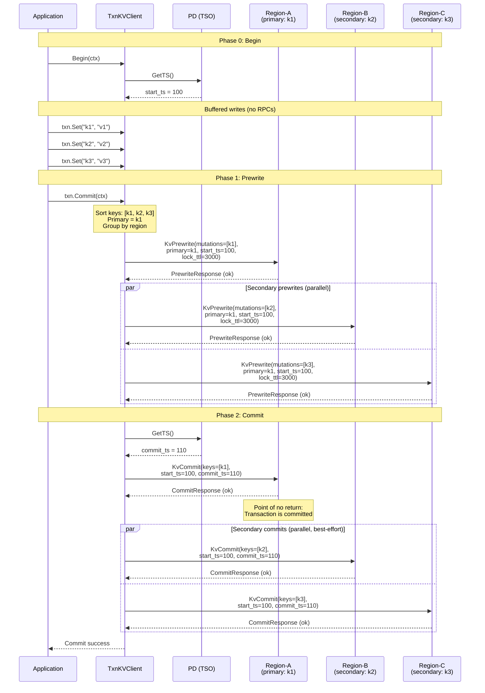
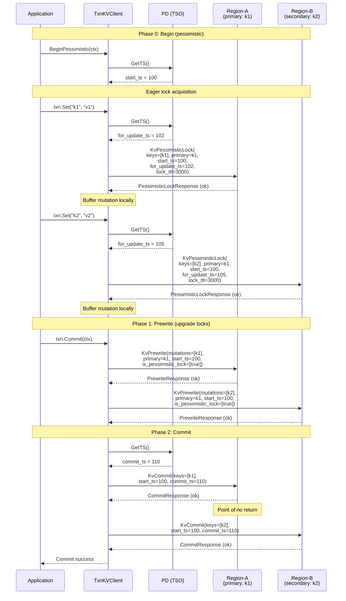
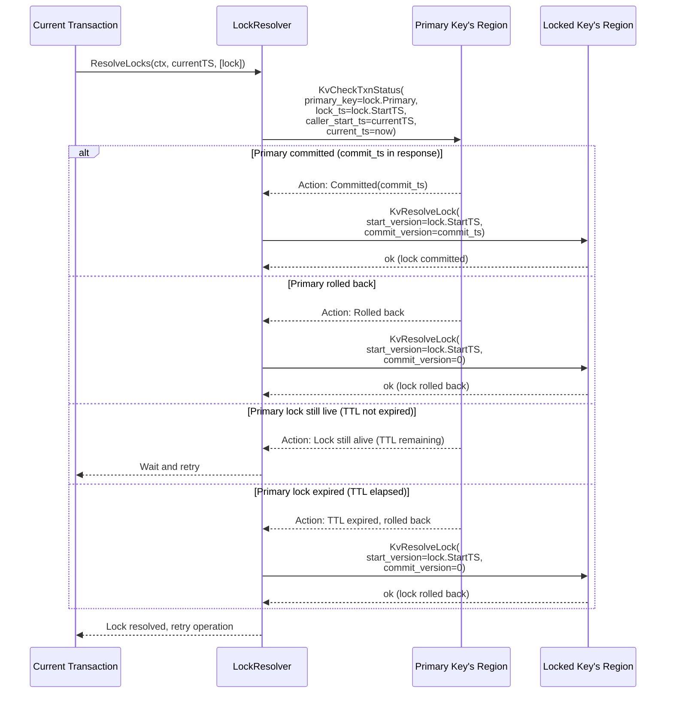

# Cross-Region Transactional Client -- Transaction Lifecycle

## 1. Percolator Protocol Overview

The Percolator protocol is a client-driven two-phase commit (2PC) scheme originally designed
by Google for incremental processing on top of Bigtable. TiKV (and gookv) adopt this protocol
for distributed transactions across multiple regions.

**Key principles:**

- **Client-driven**: There is no server-side transaction coordinator. The client orchestrates
  the entire 2PC: buffering mutations, sending prewrites, obtaining a commit timestamp, and
  sending commits. This eliminates a single point of failure for transaction coordination.

- **Primary key = point of no return**: The transaction's fate is determined by the commit
  record of a single designated key (the primary). Once the primary key's commit record is
  written to CF_WRITE, the transaction is logically committed -- even if the client crashes
  before committing secondary keys.

- **Secondary key commits are best-effort**: If a secondary commit fails (e.g., client
  crashes), the lock remains in CF_LOCK. When another transaction encounters this lock, it
  checks the primary key's status. If the primary is committed, the resolver commits the
  secondary lock on behalf of the original transaction. If the primary is rolled back (or
  the lock TTL has expired), the resolver rolls back the secondary lock.

- **Deterministic primary selection**: The primary key is chosen deterministically by sorting
  all mutation keys in byte order and selecting the first one. This ensures that any observer
  can independently determine which key is the primary.

## 2. MVCC via Three Column Families

gookv stores transactional data across three column families in the underlying engine:

### CF_LOCK (Column Family: "lock")

Active locks indicating in-progress transactions.

| Field | Description |
|-------|-------------|
| **Key** | Raw user key (no timestamp encoding) |
| **Value** | Serialized `Lock` struct |

Lock struct fields:
- `Primary` (`[]byte`): The primary key of the owning transaction
- `StartTS` (`uint64`): The transaction's `start_ts`
- `TTL` (`uint64`): Lock time-to-live in milliseconds
- `LockType` (`Op`): `Put`, `Delete`, `Lock` (pessimistic), or `Rollback`
- `ShortValue` (`[]byte`): If the value is <= 255 bytes, it is stored inline
- `ForUpdateTS` (`uint64`): Non-zero for pessimistic locks
- `MinCommitTS` (`uint64`): Lower bound on commit timestamp (for async commit)
- `Secondaries` (`[][]byte`): List of secondary keys (only on primary, for async commit)
- `UseAsyncCommit` (`bool`): Whether this lock participates in async commit

### CF_WRITE (Column Family: "write")

Commit records that make writes visible.

| Field | Description |
|-------|-------------|
| **Key** | `(user_key, commit_ts)` -- the user key encoded with the commit timestamp |
| **Value** | Serialized `Write` struct |

Write struct fields:
- `WriteType` (`byte`): `Put`, `Delete`, `Rollback`, or `Lock`
- `StartTS` (`uint64`): The `start_ts` of the transaction that wrote this record
- `ShortValue` (`[]byte`): If the value is <= 255 bytes and `WriteType == Put`

### CF_DEFAULT (Column Family: "default")

Large values that do not fit in CF_WRITE's short value field.

| Field | Description |
|-------|-------------|
| **Key** | `(user_key, start_ts)` -- the user key encoded with the transaction's start timestamp |
| **Value** | Raw bytes of the value |

### Read Path (MVCC Get)

To read key `K` at snapshot `start_ts`:

1. Scan CF_LOCK for key `K`. If a lock exists with `lock.start_ts != my_start_ts`, the key
   is locked by another transaction -- return `KeyIsLocked` error (caller invokes LockResolver).
2. Scan CF_WRITE for key `K` in reverse timestamp order, finding the latest `commit_ts <= start_ts`.
3. If the write record has `WriteType == Put`:
   - If `ShortValue` is present, return it directly.
   - Otherwise, read CF_DEFAULT at `(K, write.start_ts)` to get the full value.
4. If the write record has `WriteType == Delete`, the key does not exist at this snapshot.
5. If no write record is found, the key has never been written.

## 3. Timestamp Semantics

All timestamps are 64-bit values composed of a physical component (milliseconds since epoch,
upper 46 bits) and a logical component (lower 18 bits). PD's TSO guarantees monotonically
increasing timestamps across the cluster.

### start_ts

- **Obtained**: From `pdclient.GetTS()` at `TxnKVClient.Begin()`.
- **Purpose**: Identifies the transaction. Determines the MVCC read snapshot (reads see all
  writes with `commit_ts <= start_ts`). Used as the key suffix in CF_DEFAULT and referenced
  in CF_LOCK and CF_WRITE records.
- **Lifetime**: From `Begin()` until the transaction is committed or rolled back.

### commit_ts

- **Obtained**: From `pdclient.GetTS()` at the start of the commit phase (after all prewrites
  succeed).
- **Purpose**: Determines when the transaction's writes become visible. Used as the key suffix
  in CF_WRITE. Must satisfy `commit_ts > start_ts`.
- **Invariant**: No other transaction can have a `start_ts` that falls between this
  transaction's `start_ts` and `commit_ts` and conflict on the same keys (enforced by the
  prewrite write-conflict check).

### for_update_ts

- **Obtained**: From `pdclient.GetTS()` when acquiring pessimistic locks.
- **Purpose**: In pessimistic mode, `for_update_ts` replaces `start_ts` for write-write
  conflict detection during `KvPessimisticLock`. This allows the pessimistic transaction to
  "see past" its own `start_ts` for conflict purposes -- if another transaction committed
  between `start_ts` and `for_update_ts`, the pessimistic lock detects this.
- **Retry**: If a pessimistic lock fails due to `WriteConflict`, the client obtains a new
  (higher) `for_update_ts` and retries.

### min_commit_ts

- **Computed**: During prewrite, by the server. Set to
  `max(start_ts + 1, max_read_ts_on_key + 1)` where `max_read_ts_on_key` is the highest
  timestamp of any concurrent reader on that key.
- **Purpose**: Ensures that async commit does not violate snapshot isolation. The final
  `commit_ts` for an async-commit transaction is `max(min_commit_ts across all keys)`.

## 4. Optimistic 2PC Sequence Diagram



### Failure Scenarios in Optimistic 2PC

**Prewrite conflict**: If any `KvPrewrite` returns `WriteConflict` (another committed
transaction wrote to the same key with `commit_ts > start_ts`), the committer:
1. Sends `KvBatchRollback` for all successfully prewritten keys
2. Returns `ErrWriteConflict` to the application

**Primary commit failure**: If `KvCommit` for the primary key fails (e.g., lock was resolved
by another transaction's LockResolver due to TTL expiry), the transaction has been rolled
back. The committer returns an error.

**Secondary commit failure**: If a secondary `KvCommit` fails, the committer logs the error
but returns success to the application. The primary is committed, so the transaction is
logically committed. Other transactions' LockResolvers will eventually commit these
secondary locks when they encounter them.

**Client crash after primary commit**: The transaction is committed. Other transactions will
resolve the remaining secondary locks via the LockResolver.

**Client crash before primary commit**: The transaction is not committed. Lock TTLs will
expire, and other transactions' LockResolvers will roll back all locks.

## 5. Pessimistic Mode Sequence Diagram



### Pessimistic Mode vs Optimistic Mode

| Aspect | Optimistic | Pessimistic |
|--------|-----------|-------------|
| Conflict detection | At prewrite time (late) | At lock acquisition time (early) |
| Lock acquisition | During prewrite phase | During mutation calls (Set/Delete) |
| Write conflict response | Abort + retry entire transaction | Retry lock acquisition with new `for_update_ts` |
| Best for | Low-contention workloads | High-contention workloads |
| Extra PD round-trips | None | One `GetTS()` per lock acquisition |
| Deadlock handling | N/A (no eager locks) | Abort-on-timeout (no deadlock detection) |

### Pessimistic Lock Upgrade

During prewrite, pessimistic locks are "upgraded" to normal prewrite locks:
- The `KvPrewrite` request includes `IsPessimisticLock: []bool{true}` for each mutation
  that was previously pessimistically locked.
- The server verifies that the pessimistic lock exists and replaces it with a standard
  prewrite lock (writing the value to CF_DEFAULT if needed).
- If the pessimistic lock was resolved by another transaction in the meantime, the prewrite
  fails and the transaction must be retried.

### Pessimistic Rollback

If a pessimistic transaction is aborted before commit:
1. Send `KvPessimisticRollback` for all pessimistically locked keys to release the
   pessimistic locks from CF_LOCK.
2. No `KvBatchRollback` is needed because no prewrite locks or CF_DEFAULT entries were
   written yet.

## 6. Async Commit Sequence

Async commit eliminates the `GetTS()` round-trip for `commit_ts` by computing it from the
`min_commit_ts` values returned during prewrite. This reduces commit latency by one PD
round-trip.

### Eligibility

- The total size of all secondary keys must fit in the prewrite request (the primary's lock
  must contain the full list of secondary keys for crash recovery).
- Not eligible for pessimistic transactions that have already acquired pessimistic locks
  (implementation simplification -- can be relaxed later).

### Flow

```
1. Prewrite primary with:
   - UseAsyncCommit = true
   - Secondaries = [k2, k3, ...]    (full list of secondary keys)
   - MinCommitTs = start_ts + 1      (initial lower bound)

   Server returns: min_commit_ts for primary (may be pushed higher
   by concurrent readers on k1)

2. Prewrite secondaries (parallel) with:
   - UseAsyncCommit = true

   Each server returns: min_commit_ts for that key

3. Final commit_ts = max(min_commit_ts across ALL keys)

4. Transaction is considered committed once ALL prewrites succeed.
   No separate KvCommit for the primary is needed for correctness --
   the async commit protocol guarantees that any resolver can
   reconstruct the commit_ts by reading all locks.

5. Background: send KvCommit for all keys to clean up locks.
   This is best-effort and improves read performance (avoids
   lock resolution on every read).
```

### Crash Recovery for Async Commit

If the client crashes after all prewrites succeed but before background commits:

1. Another transaction encounters a lock on key `k2` with `UseAsyncCommit = true`.
2. The resolver reads the primary lock on `k1`, which contains `Secondaries = [k2, k3]`.
3. The resolver reads all secondary locks to collect their `min_commit_ts` values.
4. If all locks are present: `commit_ts = max(min_commit_ts across all keys)`.
   The resolver commits all keys with this `commit_ts`.
5. If any lock is missing (already committed or rolled back): check CF_WRITE to determine
   the transaction's fate and act accordingly.

## 7. 1PC Optimization

The one-phase commit optimization eliminates both the separate commit phase and the lock
phase entirely, reducing a transaction to a single round of RPCs.

### Eligibility

- **All mutations must reside in a single region.** If `GroupKeysByRegion` returns more than
  one region group, 1PC is not eligible.
- The transaction must use optimistic mode (not pessimistic).

### Flow

```
1. Client determines all mutations fall in one region.

2. Send KvPrewrite with:
   - TryOnePc = true
   - All mutations in a single request

3. Server-side behavior:
   - Skip writing to CF_LOCK entirely
   - Write commit records directly to CF_WRITE
   - Write values to CF_DEFAULT (if not short values)
   - Return OnePcCommitTs in PrewriteResponse

4. Client receives OnePcCommitTs:
   - Transaction is fully committed
   - No separate KvCommit phase needed
   - commit_ts = response.OnePcCommitTs

5. If server returns OnePcCommitTs == 0:
   - 1PC was not applied (server-side rejection)
   - Fall back to normal 2PC: obtain commit_ts, send KvCommit
```

### Why 1PC is Safe

Since all keys are in a single region, there is no distributed coordination problem.
The server can atomically write all commit records in a single Raft proposal. There are
no locks to resolve because no locks are ever written. The atomicity guarantee comes from
the Raft log -- either the entire batch of writes is applied or none of them are.

## 8. Lock Resolution

When a transaction encounters a lock from another transaction (during `KvGet` or
`KvPrewrite`), it must resolve the lock before proceeding.

### Resolution Flow



### KvCheckTxnStatus Details

`KvCheckTxnStatus` inspects the primary key to determine the transaction's status:

1. **Check CF_WRITE for a commit or rollback record** at `(primary_key, lock.StartTS)`.
   - If a commit record exists: return `Action::Committed(commit_ts)`.
   - If a rollback record exists: return `Action::RolledBack`.

2. **Check CF_LOCK for the primary lock.**
   - If the lock exists and its TTL has not expired: return `Action::LockNotExpired(ttl_remaining)`.
   - If the lock exists and its TTL has expired: rollback the lock (write a rollback record
     to CF_WRITE, delete the lock from CF_LOCK), return `Action::TTLExpiredRolledBack`.
   - If no lock exists and no write record exists: the transaction was lost (possibly rolled
     back by another resolver). Write a rollback record to prevent future commits, return
     `Action::LockNotExistRolledBack`.

### LockResolver Caching

The `LockResolver` caches resolved transaction statuses to avoid redundant `KvCheckTxnStatus`
RPCs when multiple keys are locked by the same transaction:

```go
type LockResolver struct {
    sender   *RegionRequestSender
    cache    *RegionCache

    mu       sync.Mutex
    resolved map[uint64]resolvedStatus  // start_ts -> status
}

type resolvedStatus struct {
    committed bool
    commitTS  uint64
}
```

When resolving a lock:
1. Check the cache for `lock.StartTS`.
2. If cached, use the cached status (commit or rollback).
3. If not cached, call `KvCheckTxnStatus`, cache the result, then resolve.

This is particularly effective when a crashed transaction left locks on many keys --
the first resolution determines the status, and subsequent resolutions use the cache.
