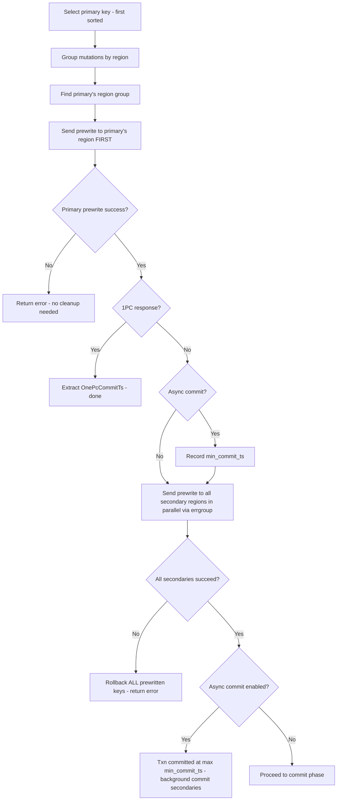
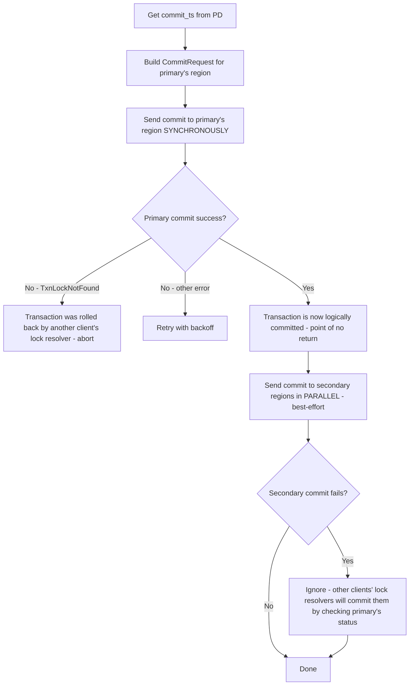

# Two-Phase Commit Implementation

## 1. Primary Key Selection
- Collect all mutations from TxnHandle.membuf
- Sort by key (lexicographic, deterministic)
- First key = primary
- All other keys = secondaries
- The primary key is critical: its CF_WRITE commit record is the single source of truth for transaction fate

## 2. Prewrite Flow

### 2.1 Grouping Mutations by Region
```go
// Group mutations by region using existing RegionCache
groups, err := cache.GroupKeysByRegion(ctx, allKeys)
// groups: map[uint64]*KeyGroup where KeyGroup has Info *RegionInfo and Keys [][]byte
```

### 2.2 Building PrewriteRequest
For each region group, build:
```go
req := &kvrpcpb.PrewriteRequest{
    Mutations:    regionMutations,  // []*kvrpcpb.Mutation for this region's keys
    PrimaryLock:  primaryKey,       // same for ALL regions — every lock points to primary
    StartVersion: uint64(startTS),
    LockTtl:      lockTTL,
    TxnSize:      uint64(len(allMutations)),
}
// For async commit (primary region only):
req.UseAsyncCommit = true
req.Secondaries = allSecondaryKeys
// For 1PC (single region only):
req.TryOnePc = true
```

### 2.3 Prewrite Flowchart



### 2.4 Prewrite Error Handling
- WriteConflict (KeyError.Conflict): Abort transaction, caller retries from Begin()
- KeyIsLocked (KeyError.Locked): Resolve lock via LockResolver, retry prewrite for that region
- AlreadyExist (KeyError.AlreadyExist): Duplicate key, abort

## 3. Commit Flow

### 3.1 Get Commit Timestamp
```go
commitTS, err := pdClient.GetTS(ctx)
```

### 3.2 Building CommitRequest
```go
req := &kvrpcpb.CommitRequest{
    StartVersion:  uint64(startTS),
    Keys:          regionKeys,        // keys for this region
    CommitVersion: uint64(commitTS),
}
```

### 3.3 Commit Flowchart



## 4. Rollback Flow
```go
req := &kvrpcpb.BatchRollbackRequest{
    StartVersion: uint64(startTS),
    Keys:         regionKeys,
}
```
- Group all prewritten keys by region
- Send KvBatchRollback to each region in parallel
- This writes rollback records to CF_WRITE and removes locks from CF_LOCK

## 5. Proto Field Reference Table

| Field | PrewriteRequest | CommitRequest | BatchRollbackRequest |
|-------|----------------|---------------|---------------------|
| Context | Y | Y | Y |
| StartVersion | Y (start_ts) | Y (start_ts) | Y (start_ts) |
| CommitVersion | - | Y (commit_ts) | - |
| Keys | - | Y | Y |
| Mutations | Y | - | - |
| PrimaryLock | Y | - | - |
| LockTtl | Y | - | - |
| TxnSize | Y | - | - |
| UseAsyncCommit | Y | - | - |
| Secondaries | Y | - | - |
| TryOnePc | Y | - | - |
| MaxCommitTs | Y | - | - |
| PessimisticActions | Y | - | - |
| ForUpdateTs | Y | - | - |
