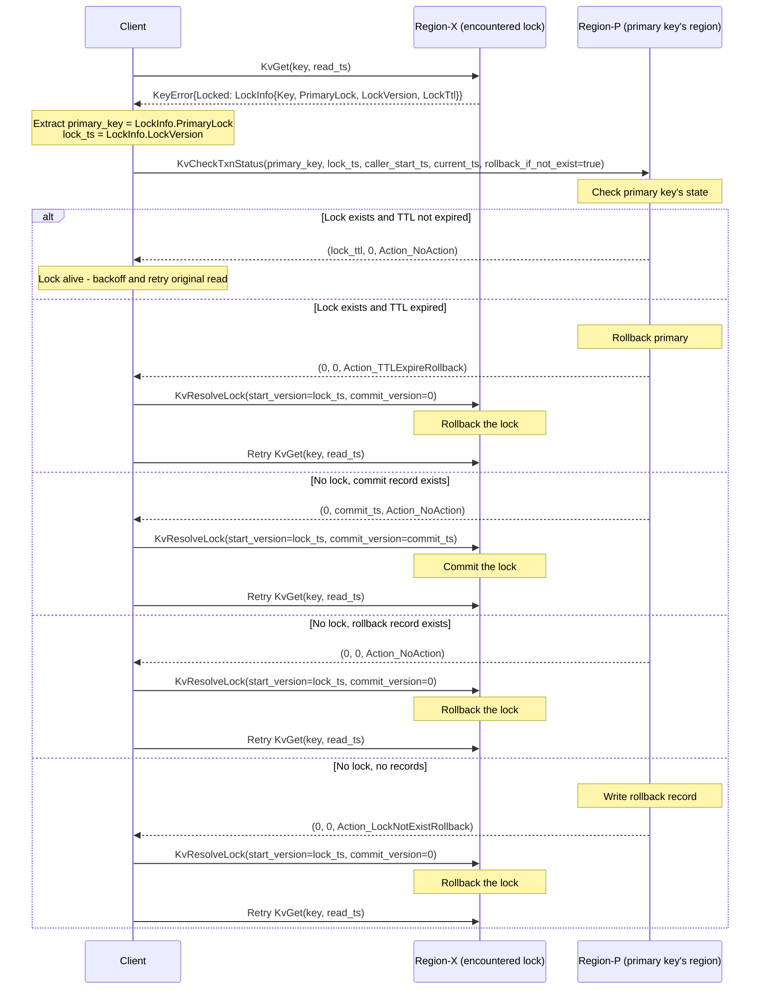
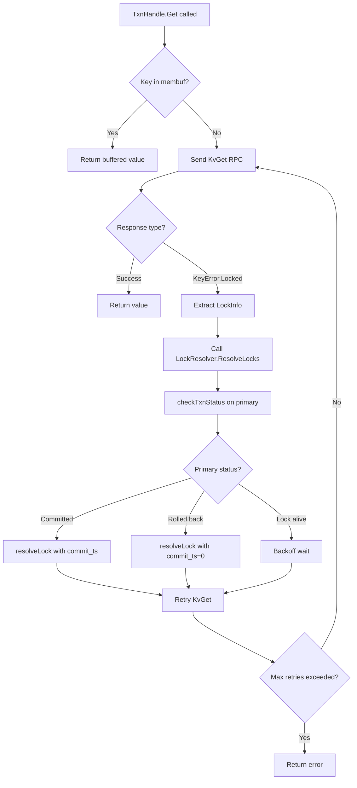

# Lock Resolution

## 1. When Locks Are Encountered
During Get/BatchGet/Scan RPCs, the server may return `KeyError.Locked` containing `LockInfo`. This happens when the read encounters another transaction's lock in CF_LOCK at a version <= the read's snapshot (start_ts).

Required LockInfo fields (see 06_server_side_changes.md for the fix):
- `Key`: the key that was locked
- `PrimaryLock`: primary key of the locking transaction (from Lock.Primary)
- `LockVersion`: start_ts of the locking transaction (from Lock.StartTS)
- `LockTtl`: TTL in milliseconds (from Lock.TTL)
- `LockType`: type of lock (Put, Del, Lock, PessimisticLock)
- `UseAsyncCommit`: whether the locking txn uses async commit
- `MinCommitTs`: for async commit resolution
- `Secondaries`: for async commit resolution (on primary key's lock)

## 2. Percolator Lock Resolution Protocol

### 2.1 Resolution Sequence Diagram



### 2.2 Why This Works
The primary key's commit record in CF_WRITE is the single source of truth for transaction fate. Every secondary lock stores Lock.Primary pointing to the primary key. By checking the primary's status, any client can determine whether to commit or rollback a secondary lock. This is the core insight of the Percolator protocol.

## 3. Async Commit Lock Resolution
For locks with UseAsyncCommit=true:
1. Read the primary lock's Secondaries list
2. Send KvCheckSecondaryLocks to check all secondary keys
3. If all secondary locks exist: compute commit_ts = max(min_commit_ts across all keys)
4. If any secondary is missing (already resolved): the primary's status has been determined -- check CF_WRITE
5. Resolve all locks with the computed commit_ts

## 4. Integration Flowchart



## 5. LockResolver Deduplication
Use sync.Mutex + map to avoid concurrent resolutions for the same (primary, start_ts):
```go
type lockKey struct {
    primary string
    startTS uint64
}
// Before resolving, check if already in progress
// After resolving, record in resolved map
```

## 6. Backoff Strategy for Lock Waits
When lock is alive (TTL not expired):
- Initial backoff: 20ms
- Max backoff: 2000ms (2s)
- Multiplier: 2x
- Jitter: +/-25%
- Max retries: configurable (default: 20, covering ~40s of lock waits)
