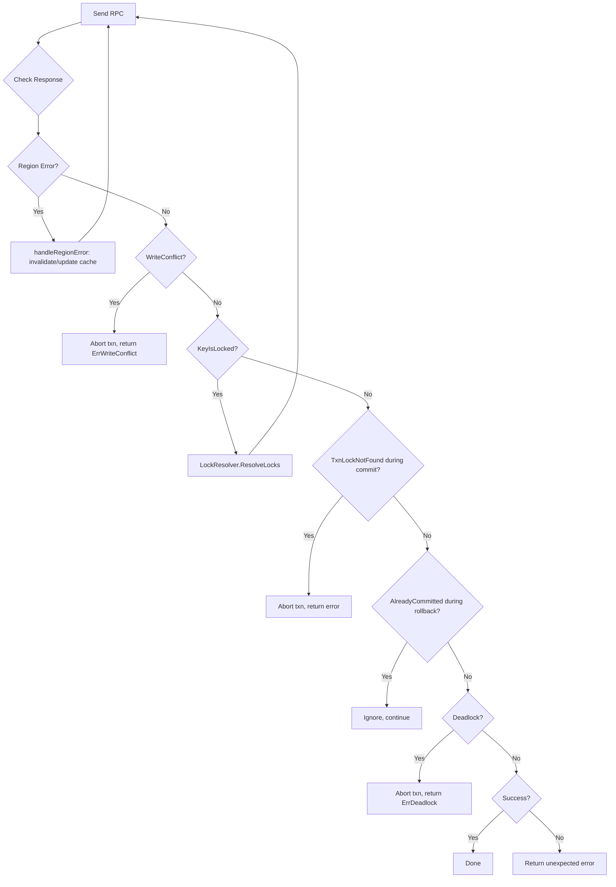

# Error Handling

## 1. Error Taxonomy

### 1.1 Region Errors (from errorpb)
These indicate the request was sent to the wrong region or the region's state changed.

| Error | Cause | Action |
|-------|-------|--------|
| NotLeader | Region leader moved | Update leader from error info, retry |
| EpochNotMatch | Region split/merge changed epoch | Invalidate cache, re-locate key, retry |
| RegionNotFound | Region no longer exists | Invalidate cache, re-locate key, retry |
| KeyNotInRegion | Key routed to wrong region | Invalidate cache, re-locate key, retry |
| StoreNotMatch | Store ID changed | Invalidate store + region, retry |

These are already handled by RegionRequestSender.handleRegionError() (request_sender.go:L92-123).

### 1.2 Transaction Errors (from kvrpcpb.KeyError)

| Error | Field | Cause | Action |
|-------|-------|-------|--------|
| WriteConflict | KeyError.Conflict | Another committed txn wrote to the same key after start_ts | Abort txn, caller retries from Begin() |
| KeyIsLocked | KeyError.Locked | Another txn holds a lock on the key | Resolve lock via LockResolver, retry |
| AlreadyCommitted | KeyError.AlreadyCommitted | Txn was already committed (during rollback) | Ignore (idempotent) |
| TxnLockNotFound | KeyError.TxnNotFound | Lock was cleaned up by lock resolver (during commit) | Abort — txn was rolled back by another client |
| Deadlock | KeyError.Deadlock | Pessimistic lock cycle detected | Abort txn, caller retries |
| CommitTsExpired | KeyError.CommitTsExpired | commit_ts fell behind safe point | Get new commit_ts, retry commit |
| AlreadyExist | KeyError.AlreadyExist | Insert constraint violation | Abort with user-facing error |

## 2. Retry Strategy Flowchart (mermaid)



## 3. Backoff Configuration

```go
type BackoffConfig struct {
    InitialInterval time.Duration // 20ms
    MaxInterval     time.Duration // 2000ms (2s)
    Multiplier      float64       // 2.0
    JitterFraction  float64       // 0.25
    MaxRetries      int           // 20
}
```

Backoff is applied for:
- Lock waits (lock TTL not expired)
- Region errors (NotLeader, EpochNotMatch)

Not applied for (immediate abort):
- WriteConflict
- Deadlock
- TxnLockNotFound during commit

## 4. Error Wrapping
All errors returned to the user should be wrapped with context:
```go
fmt.Errorf("txn commit: prewrite primary region %d: %w", regionID, err)
```
