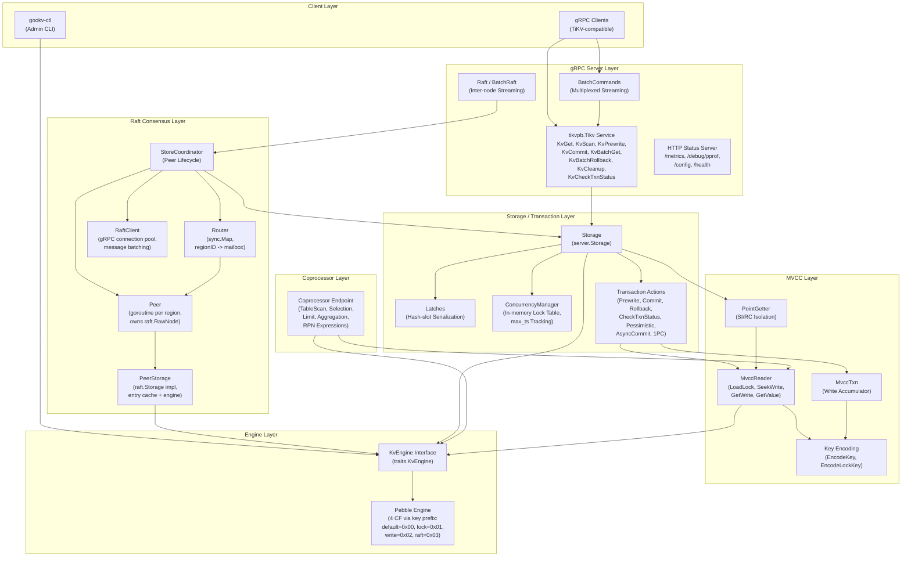
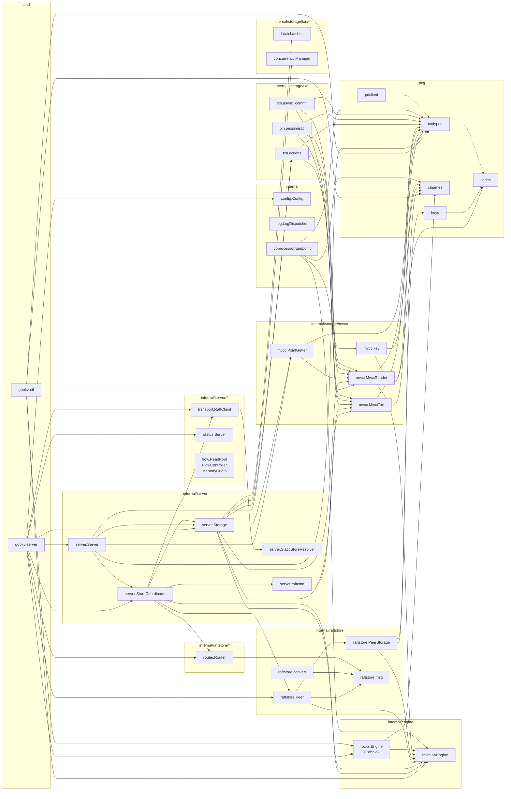

# gookv Architecture Overview

## 1. Project Identity

| Field | Value |
|---|---|
| Module | `github.com/ryogrid/gookv` |
| Go version | 1.22.2 |
| License | See `LICENSE` |

### Key Dependencies

| Dependency | Role |
|---|---|
| `github.com/cockroachdb/pebble` v1.1.5 | Storage engine (pure Go, RocksDB-compatible) |
| `go.etcd.io/etcd/raft/v3` v3.5.17 | Raft consensus (RawNode API) |
| `github.com/pingcap/kvproto` | TiKV-compatible protobuf definitions (tikvpb, kvrpcpb, raft_serverpb, raft_cmdpb, eraftpb, metapb, pdpb) |
| `google.golang.org/grpc` v1.59.0 | RPC framework for client-server and inter-node communication |
| `github.com/prometheus/client_golang` v1.15.0 | Metrics exposition (Prometheus /metrics endpoint) |
| `github.com/stretchr/testify` v1.11.1 | Test assertions |
| `github.com/BurntSushi/toml` v1.6.0 | TOML config file parsing |
| `gopkg.in/natefinch/lumberjack.v2` v2.2.1 | Log file rotation |

---

## 2. Package Inventory

### Public Packages (`pkg/`)

| Package | Description |
|---|---|
| `pkg/codec` | Memcomparable byte encoding (`EncodeBytes`/`DecodeBytes`) and number encoding (`EncodeUint64Desc`, `EncodeInt64`, `EncodeFloat64`, varint). Wire-compatible with TiKV. |
| `pkg/keys` | Internal key construction for Raft logs, hard state, apply state, region metadata. Defines `DataPrefix` (0x7A) and `LocalPrefix` (0x01) key namespaces. |
| `pkg/cfnames` | Column family name constants: `default`, `lock`, `write`, `raft`. Defines `DataCFs` and `AllCFs` slices. |
| `pkg/txntypes` | Transaction type definitions: `TimeStamp` (hybrid logical clock, physical<<18 \| logical), `Lock` (with TiKV-compatible binary serialization), `Write` (commit/rollback records), `Mutation`, `LockType`, `WriteType`. |
| `pkg/pdclient` | PD (Placement Driver) gRPC client interface: TSO allocation (`GetTS`), region lookup, store management, heartbeats, split requests, cluster bootstrap. Provides `Client` interface and `grpcClient` implementation. |

### Private Packages (`internal/`)

| Package | Description |
|---|---|
| `internal/engine/traits` | Storage engine interface abstractions: `KvEngine` (multi-CF get/put/delete/snapshot/iterator/write-batch), `Snapshot`, `WriteBatch`, `Iterator`, `IterOptions`. Analogous to TiKV's `engine_traits` crate. |
| `internal/engine/rocks` | `KvEngine` implementation using Pebble. Column families emulated via single-byte key prefixing (default=0x00, lock=0x01, write=0x02, raft=0x03). Implements `Engine`, `snapshot`, `writeBatch`, `iterator`. |
| `internal/raftstore` | Raft consensus and region management. Contains `Peer` (one goroutine per region replica, owns `raft.RawNode`), `PeerStorage` (implements `raft.Storage` with engine-backed persistence and in-memory entry cache), message types (`PeerMsg`, `StoreMsg`, `RaftCommand`, `ApplyResult`), and `eraftpb`/`raftpb` protobuf conversion. |
| `internal/raftstore/router` | `sync.Map`-based message routing: maps region ID to peer mailbox channels. Non-blocking send with backpressure (`ErrMailboxFull`). Supports broadcast. |
| `internal/raftstore/snap` | Snapshot management (directory exists, not yet implemented). |
| `internal/raftstore/split` | Region split logic (directory exists, not yet implemented). |
| `internal/storage/mvcc` | MVCC layer: `MvccTxn` (write accumulator collecting `Modify` operations across CFs), `MvccReader` (snapshot-based reads for locks, writes, values), `PointGetter` (optimized single-key MVCC read with SI/RC isolation and lock bypass), key encoding (`EncodeKey`, `EncodeLockKey`, `DecodeKey`). |
| `internal/storage/txn` | Percolator 2PC transaction actions: `Prewrite`, `Commit`, `Rollback`, `CheckTxnStatus`. Also `AcquirePessimisticLock`, `PrewritePessimistic`, `PessimisticRollback`, `PrewriteAsyncCommit`, `CheckAsyncCommitStatus`, `PrewriteAndCommit1PC`. Defines `Mutation`, `PrewriteProps`, `TxnStatus`. |
| `internal/storage/txn/latch` | Deadlock-free key serialization using hash-based slots. Keys are hashed to sorted slot indices; commands acquire slots in order. `Latches.GenLock` / `Acquire` / `Release`. |
| `internal/storage/txn/concurrency` | `ConcurrencyManager`: in-memory lock table (`sync.Map`) and atomic `max_ts` tracking for async commit correctness. `LockKey`/`IsKeyLocked`/`UpdateMaxTS`/`GlobalMinLock`. |
| `internal/storage/gc` | GC (garbage collection) for old MVCC versions (directory exists, not yet implemented). |
| `internal/server` | gRPC server (`tikvpb.Tikv` service): `Server` (gRPC lifecycle), `tikvService` (implements KvGet, KvScan, KvPrewrite, KvCommit, KvBatchGet, KvBatchRollback, KvCleanup, KvCheckTxnStatus, BatchCommands, Raft, BatchRaft), `Storage` (transaction-aware bridge between engine/MVCC/txn layers with latch-based serialization), `StoreCoordinator` (Raft peer lifecycle management, proposal routing, entry application), `StaticStoreResolver` (storeID-to-address mapping), `ModifiesToRequests`/`RequestsToModifies` (MVCC modify <-> raft_cmdpb conversion). |
| `internal/server/transport` | Inter-node Raft message transport over gRPC: `RaftClient` (connection pooling, `Send`/`BatchSend`/`SendSnapshot`), `MessageBatcher` (batch accumulation), `StoreResolver` interface. |
| `internal/server/status` | HTTP diagnostics server: `/debug/pprof/*`, `/metrics` (Prometheus), `/config`, `/status`, `/health`. |
| `internal/server/flow` | Flow control and backpressure: `ReadPool` (EWMA-based busy detection, worker pool), `FlowController` (probabilistic request dropping based on compaction pressure), `MemoryQuota` (lock-free scheduler memory enforcement). |
| `internal/config` | TOML-based configuration system: `Config` (root), `ServerConfig`, `StorageConfig`, `PDConfig`, `RaftStoreConfig`, `CoprocessorConfig`, `PessimisticTxnConfig`. Supports `LoadFromFile`, `Validate`, `SaveToFile`, `Clone`, `Diff`. Custom types `Duration` and `ReadableSize`. |
| `internal/log` | Structured logging using `log/slog`: `LogDispatcher` (routes records to normal/slow/rocksdb/raft handlers), `SlowLogHandler` (threshold-based filtering), `LevelFilter` (runtime log level changes), `RotatingFileWriter` (lumberjack integration). |
| `internal/coprocessor` | Push-down query execution framework: `TableScanExecutor` (MVCC-aware range scan), `SelectionExecutor` (RPN predicate filtering), `LimitExecutor`, `SimpleAggrExecutor` (COUNT/SUM/MIN/MAX/AVG), `HashAggrExecutor` (GROUP BY), `RPNExpression` (stack-based expression evaluator with comparison/logic/arithmetic ops), `ExecutorsRunner`, `Endpoint`. |

### Command Packages (`cmd/`)

| Package | Description |
|---|---|
| `cmd/gookv-server` | Main server entry point. Parses CLI flags, loads TOML config, opens Pebble engine, creates Storage and gRPC Server, optionally bootstraps Raft cluster mode, starts HTTP status server, handles graceful shutdown on SIGINT/SIGTERM. |
| `cmd/gookv-ctl` | Admin CLI. Subcommands: `scan` (range scan by CF), `get` (point read), `mvcc` (MVCC info as JSON), `dump` (raw hex dump), `size` (per-CF key count and size), `compact` (trigger WAL flush). Opens Pebble engine directly. |

---

## 3. Layer Architecture



---

## 4. Cluster Mode vs Standalone Mode

The server operates in one of two modes, determined by the `--store-id` and `--initial-cluster` CLI flags.

### Standalone Mode (default)

When `--store-id` is not provided, the server runs without Raft consensus. All writes go directly to the local Pebble engine via `Storage.Prewrite()` / `Storage.Commit()`:

1. gRPC handler calls `Storage.Prewrite(mutations, ...)`.
2. `Storage` acquires latches, takes an engine snapshot, creates `MvccTxn` + `MvccReader`.
3. Transaction actions (`txn.Prewrite`) compute MVCC modifications (lock writes, value writes).
4. If all succeed, `Storage.ApplyModifies()` writes a single atomic `WriteBatch` to Pebble.

The `StoreCoordinator` is nil, so no Raft proposal path is taken.

### Cluster Mode

When `--store-id N --initial-cluster "1=addr1,2=addr2,..."` is provided:

1. A `StaticStoreResolver` maps store IDs to addresses.
2. A `RaftClient` manages gRPC connections to peer stores.
3. A `Router` maps region IDs to peer mailbox channels.
4. A `StoreCoordinator` is created and attached to the `Server`.
5. A single region (region 1) is bootstrapped spanning all stores. Each store gets one `Peer` goroutine.

**Write path in cluster mode:**
1. gRPC handler calls `Storage.PrewriteModifies(mutations, ...)` to compute MVCC modifications without applying them.
2. The handler calls `StoreCoordinator.ProposeModifies(regionID, modifies, timeout)`.
3. `ProposeModifies` serializes modifications as `raft_cmdpb.RaftCmdRequest`, sends via the peer's mailbox.
4. The `Peer` goroutine proposes the data through `raft.RawNode.Propose()`.
5. After Raft consensus, all nodes (including the leader) apply committed entries via `StoreCoordinator.applyEntries()`, which calls `Storage.ApplyModifies()`.

**Inter-node communication:**
- Raft messages are sent via `RaftClient.Send()` (gRPC streaming using `tikvpb.Tikv/Raft`).
- Incoming Raft messages arrive at `tikvService.Raft()` / `tikvService.BatchRaft()`, which dispatch to `StoreCoordinator.HandleRaftMessage()` -> `Router.Send()` -> peer mailbox.

---

## 5. Server Startup Sequence

The startup flow in `cmd/gookv-server/main.go`:

```
main()
  |
  +-- 1. Parse CLI flags
  |     --config, --addr, --status-addr, --data-dir, --pd-endpoints,
  |     --store-id, --initial-cluster
  |
  +-- 2. Load configuration
  |     config.LoadFromFile(path) or config.DefaultConfig()
  |     Apply CLI overrides for addr, status-addr, data-dir, pd-endpoints
  |     config.Validate()
  |
  +-- 3. Open Pebble engine
  |     rocks.Open(cfg.Storage.DataDir)
  |     -> Creates/opens Pebble DB at the data directory
  |
  +-- 4. Create Storage
  |     server.NewStorage(engine)
  |     -> Initializes Latches (2048 slots), ConcurrencyManager
  |
  +-- 5. Create gRPC Server
  |     server.NewServer(cfg, storage)
  |     -> Creates grpc.Server with max message size 16MB
  |     -> Registers tikvpb.TikvServer (all KV + Raft RPCs)
  |     -> Enables gRPC server reflection
  |
  +-- 6. [Cluster mode only] Create Raft infrastructure
  |     if --store-id > 0 && --initial-cluster != "":
  |       a. Parse initial-cluster map (storeID=addr,...)
  |       b. StaticStoreResolver(clusterMap)
  |       c. transport.NewRaftClient(resolver, config)
  |       d. router.New(256)
  |       e. StoreCoordinator(storeID, engine, storage, router, client, peerCfg)
  |       f. srv.SetCoordinator(coord)
  |       g. Bootstrap region 1 with all peers
  |          coord.BootstrapRegion(region, raftPeers)
  |          -> NewPeer (creates raft.RawNode, PeerStorage)
  |          -> SetSendFunc (wired to RaftClient)
  |          -> SetApplyFunc (wired to StoreCoordinator.applyEntries)
  |          -> Router.Register(regionID, mailbox)
  |          -> go peer.Run(ctx) -- starts event loop goroutine
  |
  +-- 7. Start gRPC server
  |     srv.Start()
  |     -> net.Listen("tcp", addr)
  |     -> go grpcServer.Serve(listener)
  |
  +-- 8. Start HTTP status server
  |     statusserver.New(config).Start()
  |     -> Registers /debug/pprof/*, /metrics, /config, /status, /health
  |     -> go httpServer.Serve(listener)
  |
  +-- 9. Signal handling
  |     Wait for SIGINT or SIGTERM
  |
  +-- 10. Graceful shutdown
        coord.Stop()        -- cancels all peer contexts, waits for goroutines
        statusSrv.Stop()    -- HTTP graceful shutdown (5s timeout)
        srv.Stop()          -- gRPC GracefulStop()
        engine.Close()      -- (deferred) closes Pebble
```

---

## 6. Component Dependency Diagram



### Key Architectural Notes

- **Column family emulation**: Pebble is a single-keyspace LSM. gookv emulates TiKV's 4 column families (`default`, `lock`, `write`, `raft`) by prepending a one-byte prefix (0x00-0x03) to every key. Iterator bounds are scoped per-CF.

- **MVCC three-CF scheme**: Following TiKV's Percolator model:
  - `CF_LOCK` stores active transaction locks (keyed by encoded user key, no timestamp).
  - `CF_WRITE` stores commit/rollback records (keyed by encoded user key + descending commit timestamp).
  - `CF_DEFAULT` stores large values (keyed by encoded user key + descending start timestamp). Values under 255 bytes are inlined in the `CF_WRITE` record as `ShortValue`.

- **One goroutine per peer**: Each Raft region replica runs in its own goroutine with a ticker-driven event loop (`Peer.Run`). Messages arrive via a buffered channel mailbox. This replaces TiKV's thread pool + batch system.

- **Latch-based command serialization**: Before any transactional operation, the `Storage` layer acquires latches on the affected keys. Latches use FNV-1a hashing to map keys to sorted slot indices, ensuring deadlock-free acquisition.

- **Dual write path**: In standalone mode, MVCC modifications are applied directly via `WriteBatch`. In cluster mode, modifications are serialized as `raft_cmdpb.Request` entries, proposed through Raft, and applied on all replicas after consensus.

- **Binary compatibility**: Lock and Write serialization formats use the same tag-based binary encoding as TiKV, ensuring wire compatibility. Key encodings (memcomparable bytes, descending uint64) are also byte-identical.
