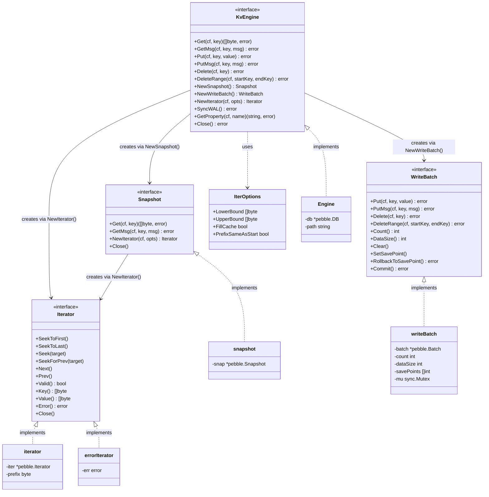
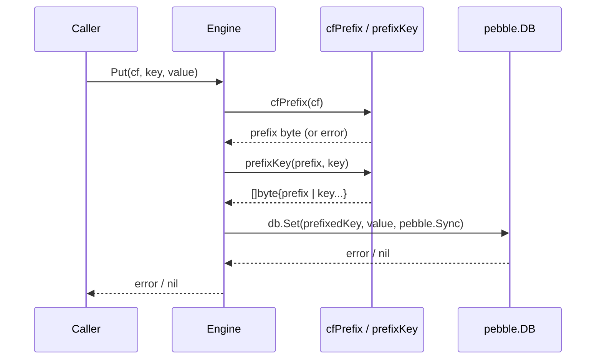
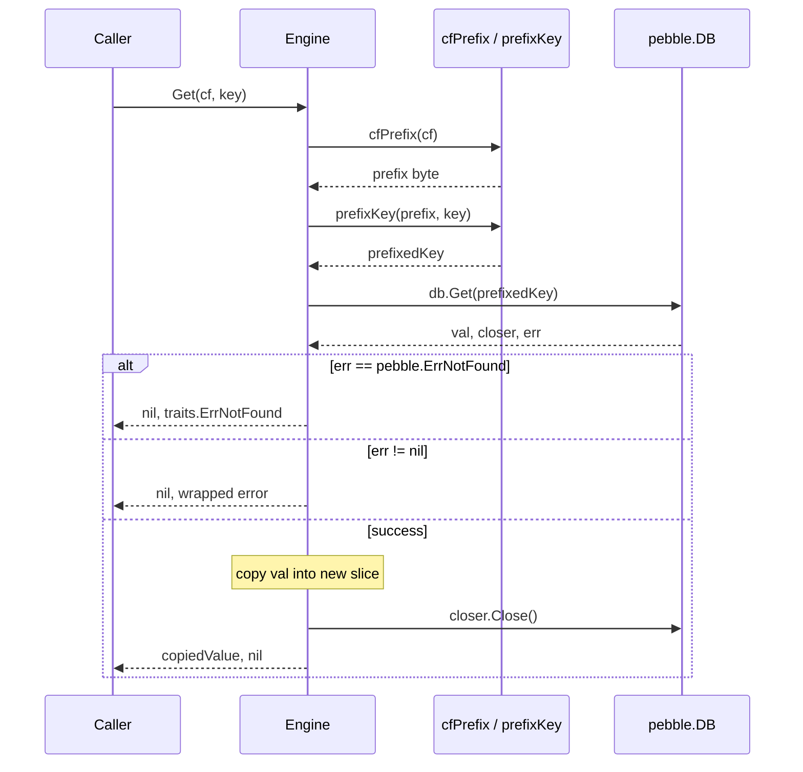
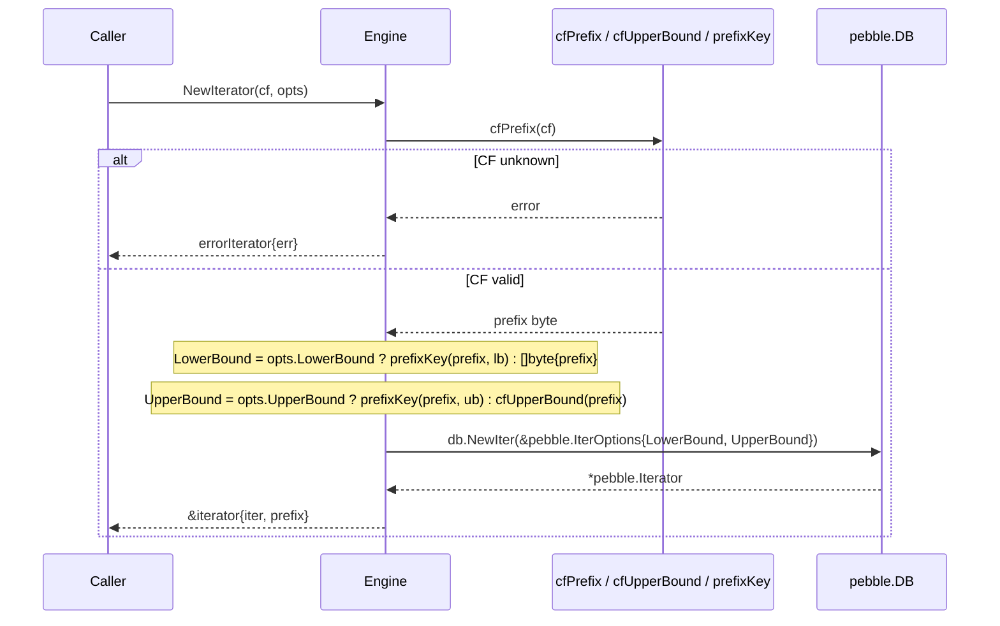
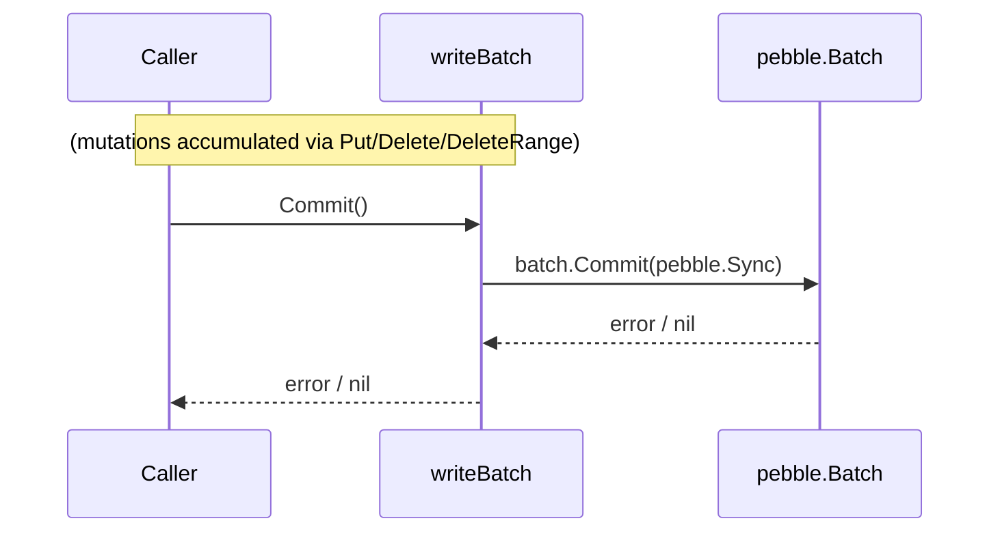

# Storage Engine Layer

## 1. Overview

The storage engine layer provides the `KvEngine` abstraction that sits at the bottom of the gookv stack. It wraps Pebble -- a pure-Go, RocksDB-compatible embedded key-value store developed by CockroachDB -- so that gookv avoids any CGo build dependencies while retaining RocksDB-like semantics.

TiKV natively relies on RocksDB column families (CFs) to separate different categories of data. Pebble does not expose column families, so gookv emulates them by reserving a single-byte key prefix for each of the four logical CFs:

| Column Family | Constant (`pkg/cfnames`) | Prefix Byte |
|---------------|--------------------------|-------------|
| default       | `CFDefault`              | `0x00`      |
| lock          | `CFLock`                 | `0x01`      |
| write         | `CFWrite`                | `0x02`      |
| raft          | `CFRaft`                 | `0x03`      |

The interface definitions live in `internal/engine/traits/traits.go`; the Pebble-backed implementation lives in `internal/engine/rocks/engine.go` (the package is named `rocks` for structural consistency with TiKV, even though the underlying engine is Pebble).

## 2. Key Types and Interfaces

### 2.1 Error Variables

```go
var ErrNotFound   = errors.New("engine: key not found")
var ErrCFNotFound = errors.New("engine: column family not found")
```

`ErrNotFound` is returned when a key lookup finds nothing. `ErrCFNotFound` is returned when a caller passes an unrecognised column-family name.

### 2.2 KvEngine Interface

The primary interface for all storage operations.

```go
type KvEngine interface {
    Get(cf string, key []byte) ([]byte, error)
    GetMsg(cf string, key []byte, msg interface{ Unmarshal([]byte) error }) error
    Put(cf string, key, value []byte) error
    PutMsg(cf string, key []byte, msg interface{ Marshal() ([]byte, error) }) error
    Delete(cf string, key []byte) error
    DeleteRange(cf string, startKey, endKey []byte) error
    NewSnapshot() Snapshot
    NewWriteBatch() WriteBatch
    NewIterator(cf string, opts IterOptions) Iterator
    SyncWAL() error
    GetProperty(cf string, name string) (string, error)
    Close() error
}
```

| Method | Description |
|--------|-------------|
| `Get` | Retrieves the value for a key in the given CF. Returns `ErrNotFound` if absent. |
| `GetMsg` | Retrieves a value and unmarshals it into a protobuf message. |
| `Put` | Stores a key-value pair in the given CF (synchronous write). |
| `PutMsg` | Marshals a protobuf message and stores it. |
| `Delete` | Removes a single key from the given CF (synchronous write). |
| `DeleteRange` | Removes all keys in `[startKey, endKey)` from the given CF. |
| `NewSnapshot` | Creates a consistent, read-only point-in-time snapshot. |
| `NewWriteBatch` | Creates a new atomic write batch for batching mutations. |
| `NewIterator` | Creates a new iterator over the given CF, bounded by `IterOptions`. |
| `SyncWAL` | Flushes the write-ahead log to stable storage. |
| `GetProperty` | Returns an engine-level property (metrics string in the Pebble impl). |
| `Close` | Shuts down the engine and releases all resources. |

### 2.3 Snapshot Interface

```go
type Snapshot interface {
    Get(cf string, key []byte) ([]byte, error)
    GetMsg(cf string, key []byte, msg interface{ Unmarshal([]byte) error }) error
    NewIterator(cf string, opts IterOptions) Iterator
    Close()
}
```

A `Snapshot` is a frozen, read-only view. It supports `Get`, `GetMsg`, and iteration but no writes. The caller must call `Close()` when finished.

### 2.4 WriteBatch Interface

```go
type WriteBatch interface {
    Put(cf string, key, value []byte) error
    PutMsg(cf string, key []byte, msg interface{ Marshal() ([]byte, error) }) error
    Delete(cf string, key []byte) error
    DeleteRange(cf string, startKey, endKey []byte) error
    Count() int
    DataSize() int
    Clear()
    SetSavePoint()
    RollbackToSavePoint() error
    Commit() error
}
```

| Method | Description |
|--------|-------------|
| `Put` / `PutMsg` | Buffer a set operation. |
| `Delete` | Buffer a single-key delete. |
| `DeleteRange` | Buffer a range delete `[start, end)`. |
| `Count` | Number of buffered operations. |
| `DataSize` | Approximate total bytes of buffered data. |
| `Clear` | Reset the batch to empty. |
| `SetSavePoint` | Record the current operation count as a restore point. |
| `RollbackToSavePoint` | Roll back to the last save point (see limitation in Section 3). |
| `Commit` | Atomically apply all buffered mutations (synchronous). |

### 2.5 Iterator Interface

```go
type Iterator interface {
    SeekToFirst()
    SeekToLast()
    Seek(target []byte)
    SeekForPrev(target []byte)
    Next()
    Prev()
    Valid() bool
    Key() []byte
    Value() []byte
    Error() error
    Close()
}
```

The iterator provides forward and reverse sequential access within a column family. `Key()` and `Value()` are only valid when `Valid()` returns `true`. `SeekForPrev` positions the iterator at the last key <= `target`.

### 2.6 IterOptions Struct

```go
type IterOptions struct {
    LowerBound         []byte // inclusive lower bound (nil = start of CF)
    UpperBound         []byte // exclusive upper bound (nil = end of CF)
    FillCache          bool   // whether reads populate block cache
    PrefixSameAsStart  bool   // prefix-based iteration mode
}
```

### 2.7 Interface Relationship Diagram



## 3. Pebble Implementation

Source: `internal/engine/rocks/engine.go`

### 3.1 Engine Struct

```go
type Engine struct {
    db   *pebble.DB
    path string
}
```

Created via `Open(path)` or `OpenWithOptions(path, opts)`. `Open` uses default Pebble options. A compile-time assertion (`var _ traits.KvEngine = (*Engine)(nil)`) guarantees the struct satisfies the interface.

### 3.2 Column Family Emulation

Since Pebble provides a single flat keyspace, CFs are emulated with a one-byte prefix scheme:

```go
var cfPrefixMap = map[string]byte{
    cfnames.CFDefault: 0x00,
    cfnames.CFLock:    0x01,
    cfnames.CFWrite:   0x02,
    cfnames.CFRaft:    0x03,
}
```

Three helper functions implement the mapping:

- **`cfPrefix(cf string) (byte, error)`** -- Looks up the prefix byte for a CF name. Returns `ErrCFNotFound` (wrapped) if the name is unknown.
- **`prefixKey(prefix byte, key []byte) []byte`** -- Allocates a new slice of length `1 + len(key)`, writes the prefix byte at index 0, and copies the user key into the remaining bytes.
- **`stripPrefix(key []byte) []byte`** -- Removes the first byte (the CF prefix) and returns a copy of the remaining user key. Returns `nil` for keys of length <= 1.
- **`cfUpperBound(prefix byte) []byte`** -- Returns `[]byte{prefix + 1}`, used as the exclusive upper bound when creating iterators so they stay within one CF's keyspace.

### 3.3 Snapshot Implementation

```go
type snapshot struct {
    snap *pebble.Snapshot
}
```

Wraps `*pebble.Snapshot`. `Get` follows the same pattern as `Engine.Get` (prefix the key, call `snap.Get`, copy the value before closing the closer). `NewIterator` creates a Pebble iterator bounded to the requested CF, identical to the engine-level iterator logic. `Close` delegates to `snap.Close()`.

### 3.4 WriteBatch Implementation

```go
type writeBatch struct {
    batch      *pebble.Batch
    count      int
    dataSize   int
    savePoints []int
    mu         sync.Mutex
}
```

- All mutation methods (`Put`, `Delete`, `DeleteRange`) acquire `mu`, delegate to the underlying `pebble.Batch` with prefixed keys, and increment `count` / `dataSize`.
- `Clear()` calls `batch.Reset()` and zeroes the counters.
- `SetSavePoint()` pushes the current `count` onto the `savePoints` slice.
- **`RollbackToSavePoint()` limitation**: Pebble batches do not support native save-point rollback. The current implementation merely pops the last save point from the slice and returns `nil`. It does **not** undo any operations added since the save point was set. This is a known limitation documented in the source.
- `Commit()` calls `batch.Commit(pebble.Sync)` for durable, synchronous application of all buffered mutations.

### 3.5 Iterator Implementation

```go
type iterator struct {
    iter   *pebble.Iterator
    prefix byte
}
```

When `NewIterator` is called:

1. The CF prefix byte is resolved. If invalid, an `errorIterator` (always-invalid, stores the error) is returned instead.
2. `LowerBound` defaults to `[]byte{prefix}` (start of the CF's key range) if not specified, otherwise it is set to `prefixKey(prefix, opts.LowerBound)`.
3. `UpperBound` defaults to `cfUpperBound(prefix)` (i.e. `prefix + 1`, the start of the next CF) if not specified, otherwise `prefixKey(prefix, opts.UpperBound)`.
4. A Pebble iterator is opened with these bounds and wrapped.

Key behavioural notes:

- `Key()` calls `stripPrefix` on the internal Pebble key, so callers always see user keys without the CF prefix byte.
- `Value()` copies the Pebble value into a new slice before returning, protecting callers from Pebble's internal buffer reuse.
- `Seek(target)` maps to `iter.SeekGE(prefixKey(prefix, target))`.
- **`SeekForPrev(target)` workaround**: Pebble exposes `SeekLT` (strictly less than) but not a direct "seek to last key <= target". The implementation uses `SeekGE` to find the first key >= target, then checks whether it lands exactly on the target. If yes, it stays. If not (or if `SeekGE` is invalid), it calls `Prev()` (or `Last()` if past the end) to reach the last key <= target.

### 3.6 errorIterator

```go
type errorIterator struct {
    err error
}
```

A sentinel iterator returned when iterator creation fails (e.g., unknown CF). `Valid()` always returns `false`, `Error()` returns the stored error, and all positioning methods are no-ops.

## 4. Processing Flows

### 4.1 Put Operation



The write is synchronous (`pebble.Sync`), meaning it is durable on return.

### 4.2 Get Operation



The value is copied before `closer.Close()` is called, because Pebble may reuse the underlying buffer.

### 4.3 NewIterator



### 4.4 WriteBatch Commit



All individual mutations in the batch are applied atomically. The commit is synchronous (`pebble.Sync`).

## 5. Dependencies

### Depends On

| Dependency | Purpose |
|-----------|---------|
| `github.com/cockroachdb/pebble` | Underlying embedded KV storage engine |
| `pkg/cfnames` | Column family name constants (`CFDefault`, `CFLock`, `CFWrite`, `CFRaft`) |

### Used By

| Consumer Package | Usage |
|-----------------|-------|
| `internal/raftstore` | Stores Raft log entries and state in the `CFRaft` CF; reads/writes via `KvEngine` and `WriteBatch` |
| `internal/storage` | MVCC reader and transaction actions use `KvEngine`, `Snapshot`, and `Iterator` for multi-version data access |
| `internal/server` | Creates and manages the `Engine` instance; passes it to raftstore and storage layers |
| `internal/coprocessor` | Reads data through the engine interface for coprocessor request handling |
| `cmd/gookv-server` | Entry point that opens the engine |
| `cmd/gookv-ctl` | Admin CLI that opens the engine for inspection |
| `e2e` (test) | End-to-end tests that spin up servers with real engines |

## 6. Implementation Status

### Fully Implemented

| Method / Feature | Notes |
|-----------------|-------|
| `Open` / `OpenWithOptions` | Engine creation with default or custom Pebble options |
| `Get` / `GetMsg` | Point reads with value copying and protobuf unmarshaling |
| `Put` / `PutMsg` | Synchronous writes with `pebble.Sync` durability |
| `Delete` | Synchronous single-key deletion |
| `DeleteRange` | Synchronous range deletion `[start, end)` |
| `NewSnapshot` | Point-in-time consistent read view via `pebble.Snapshot` |
| `NewWriteBatch` | Atomic batch with thread-safe mutation counting |
| `WriteBatch.Commit` | Synchronous atomic commit |
| `NewIterator` | CF-bounded iteration with configurable lower/upper bounds |
| `Iterator.SeekForPrev` | Workaround using `SeekGE` + `Prev` to emulate "last key <= target" |
| `GetProperty` | Returns Pebble metrics as a formatted string |
| `Close` | Delegates to `pebble.DB.Close()` |

### Limited / Non-Functional

| Method | Status | Reason |
|--------|--------|--------|
| `WriteBatch.RollbackToSavePoint` | **Non-functional** | Pebble batches do not support native save-point rollback. The implementation pops the save point from the stack but does not undo any operations added since the save point was set. |

### Notable Implementation Details

- **`SyncWAL`** calls `db.Flush()` rather than a true WAL sync. `Flush()` forces a memtable flush to SST files, which is a stronger (and more expensive) durability guarantee than WAL-only sync. This means `SyncWAL` is not semantically identical to RocksDB's `SyncWAL` -- it writes data to L0 SSTs rather than just ensuring the WAL is fsync'd.
- **`GetProperty`** ignores the `cf` and `name` parameters and always returns the full Pebble metrics string. This is a simplified implementation compared to RocksDB's per-CF property queries.
- **Value copying**: Both `Engine.Get` and `iterator.Value` allocate new slices and copy data before returning, preventing callers from holding references to Pebble's internal buffers.
