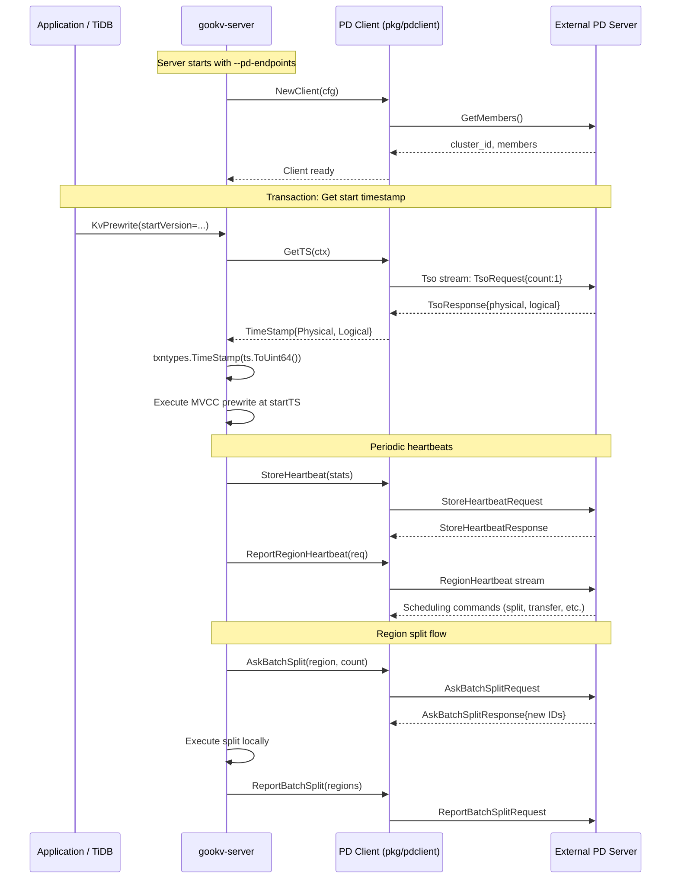
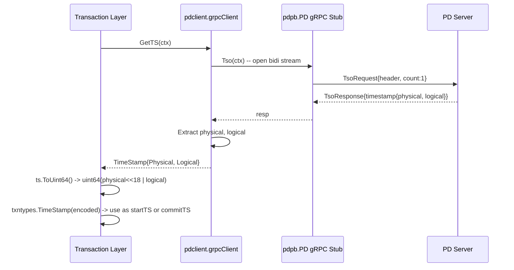
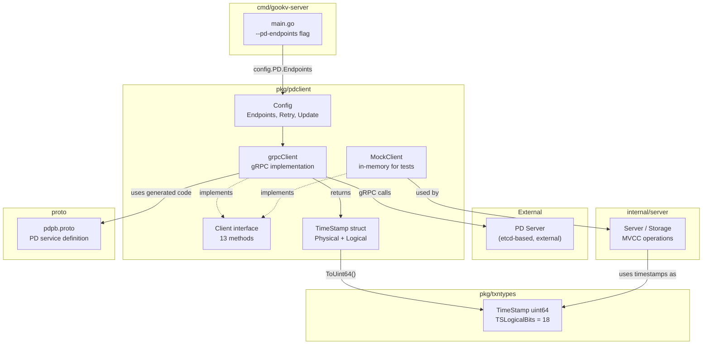

# Placement Driver (PD) Client

## 1. Overview

gookv includes a Placement Driver (PD) client package (`pkg/pdclient`) for interacting with an external PD server. PD is the cluster-level metadata and coordination service responsible for:

- **TSO (Timestamp Oracle) allocation** -- providing globally unique, monotonically increasing timestamps used by the MVCC transaction layer.
- **Cluster bootstrap and metadata management** -- registering stores and the initial region so PD can begin scheduling.
- **Region/store heartbeat and discovery** -- receiving periodic heartbeats that report region status (leader, size, traffic) and store health, and returning scheduling commands (peer changes, leader transfers, splits, merges).
- **Region split coordination** -- allocating new region/peer IDs when a store needs to split a region, and recording the result after the split completes.
- **Unique ID allocation** -- providing a globally unique monotonic ID generator for stores and regions.

The PD client speaks the kvproto `pdpb.PD` gRPC service, which means gookv can connect to a real TiKV PD server without modification.

## 2. Client Interface

### `Client` interface

Defined in `pkg/pdclient/client.go`. Every method takes a `context.Context` as its first argument.

| Method | Signature | Purpose |
|--------|-----------|---------|
| `GetTS` | `(ctx) -> (TimeStamp, error)` | Allocate a globally unique timestamp from PD's TSO. |
| `GetRegion` | `(ctx, key []byte) -> (*metapb.Region, *metapb.Peer, error)` | Look up the region that contains the given key, plus its current leader. |
| `GetRegionByID` | `(ctx, regionID uint64) -> (*metapb.Region, *metapb.Peer, error)` | Look up a region by its numeric ID, plus its current leader. |
| `GetStore` | `(ctx, storeID uint64) -> (*metapb.Store, error)` | Retrieve store metadata by store ID. |
| `Bootstrap` | `(ctx, *metapb.Store, *metapb.Region) -> (*pdpb.BootstrapResponse, error)` | Bootstrap the cluster with the first store and region. |
| `IsBootstrapped` | `(ctx) -> (bool, error)` | Check whether the cluster has already been bootstrapped. |
| `PutStore` | `(ctx, *metapb.Store) -> error` | Register or update a store in PD. |
| `ReportRegionHeartbeat` | `(ctx, *pdpb.RegionHeartbeatRequest) -> error` | Send a region heartbeat; PD may return scheduling commands. |
| `StoreHeartbeat` | `(ctx, *pdpb.StoreStats) -> error` | Send a store-level heartbeat reporting capacity, region count, etc. |
| `AskBatchSplit` | `(ctx, *metapb.Region, count uint32) -> (*pdpb.AskBatchSplitResponse, error)` | Request `count` new region/peer ID sets for a split operation. |
| `ReportBatchSplit` | `(ctx, []*metapb.Region) -> error` | Notify PD that splits have been completed. |
| `AllocID` | `(ctx) -> (uint64, error)` | Allocate a globally unique ID. |
| `GetClusterID` | `(ctx) -> uint64` | Return the cluster ID (cached from initial connection). |
| `Close` | `()` | Shut down the client and release the gRPC connection. |

### `grpcClient` implementation struct

```go
type grpcClient struct {
    cfg       Config
    clusterID uint64

    mu     sync.RWMutex
    conn   *grpc.ClientConn
    client pdpb.PDClient      // auto-generated gRPC stub

    tsoBatchSize int           // default: 64 (reserved for future batched TSO)

    closed atomic.Bool
}
```

Key fields:
- `conn` / `client` -- the live gRPC connection to PD and the generated stub.
- `clusterID` -- discovered at connection time via `GetMembers` and attached to every subsequent request header.
- `closed` -- atomic flag to ensure `Close()` is idempotent.

### `Config` and connection management

```go
type Config struct {
    Endpoints      []string      // PD server addresses (e.g., ["127.0.0.1:2379"])
    RetryInterval  time.Duration // retry interval for failed requests (default 300ms)
    RetryMaxCount  int           // max retries, -1 = infinite (default 10)
    UpdateInterval time.Duration // interval for refreshing PD leader info (default 10min)
}
```

`NewClient` iterates through `Endpoints` and connects to the first one that succeeds using `grpc.DialContext` with insecure credentials. After connecting, it calls `GetMembers` to discover the cluster ID.

Note: `RetryInterval`, `RetryMaxCount`, and `UpdateInterval` are defined in the config but are not yet consumed by the implementation -- they are reserved for future leader failover and periodic refresh logic.

## 3. TSO (Timestamp Oracle)

### Encoding

A PD timestamp has two components:

| Component | Width | Meaning |
|-----------|-------|---------|
| Physical | 46 bits | Milliseconds since Unix epoch |
| Logical | 18 bits | Sequence number within the same millisecond |

The combined 64-bit encoding is:

```
uint64 = Physical << 18 | Logical
```

This is implemented in `pkg/pdclient`:

```go
func (ts TimeStamp) ToUint64() uint64 {
    return uint64(ts.Physical)<<18 | uint64(ts.Logical)
}

func TimeStampFromUint64(v uint64) TimeStamp {
    return TimeStamp{
        Physical: int64(v >> 18),
        Logical:  int64(v & ((1 << 18) - 1)),
    }
}
```

### `GetTS` implementation

`grpcClient.GetTS` opens a bidirectional streaming RPC (`Tso`), sends a `TsoRequest{Count: 1}`, receives the response, and extracts `Physical` + `Logical` from the `Timestamp` proto message.

### Relationship with `txntypes.TimeStamp`

The `pkg/txntypes` package defines a separate `TimeStamp` type as a plain `uint64` with the same 18-bit logical encoding:

```go
type TimeStamp uint64

const TSLogicalBits = 18

func ComposeTS(physical int64, logical int64) TimeStamp {
    return TimeStamp(uint64(physical)<<TSLogicalBits | uint64(logical))
}
```

In the server layer (`internal/server/server.go`), values from the wire protocol (e.g., `req.GetStartVersion()`) are cast directly to `txntypes.TimeStamp`. To bridge between the PD client's `pdclient.TimeStamp` struct and the transaction layer's `txntypes.TimeStamp` scalar, callers use `ToUint64()`:

```go
pdTS, _ := pdClient.GetTS(ctx)
txnTS := txntypes.TimeStamp(pdTS.ToUint64())
```

## 4. Proto Service Definition

The `proto/pdpb.proto` file defines the `PD` gRPC service with the following RPCs (subset relevant to gookv):

| RPC | Request/Response Style | Used by gookv |
|-----|----------------------|----------------|
| `GetClusterInfo` | Unary | No |
| `GetMembers` | Unary | Yes (connection init) |
| `Tso` | Bidirectional stream | Yes (`GetTS`) |
| `Bootstrap` | Unary | Yes |
| `IsBootstrapped` | Unary | Yes |
| `AllocID` | Unary | Yes |
| `GetStore` | Unary | Yes |
| `PutStore` | Unary | Yes |
| `GetAllStores` | Unary | No |
| `StoreHeartbeat` | Unary | Yes |
| `RegionHeartbeat` | Bidirectional stream | Yes |
| `GetRegion` | Unary | Yes |
| `GetRegionByID` | Unary | Yes |
| `ScanRegions` | Unary | No |
| `AskBatchSplit` | Unary | Yes |
| `ReportBatchSplit` | Unary | Yes |
| `GetGCSafePoint` | Unary | No (not yet) |
| `UpdateGCSafePoint` | Unary | No (not yet) |

Key proto messages:

- **`TsoRequest`** -- `header`, `count` (number of timestamps to allocate), `dc_location`.
- **`TsoResponse`** -- `header`, `count`, `timestamp` (with `physical`, `logical`, `suffix_bits`).
- **`RegionHeartbeatRequest`** -- carries `region`, `leader`, `down_peers`, `pending_peers`, traffic stats (`bytes_written`, `keys_read`, etc.), `approximate_size`, `approximate_keys`, Raft `term`.
- **`RegionHeartbeatResponse`** -- scheduling commands: `change_peer`, `transfer_leader`, `merge`, `split_region`, `change_peer_v2`.
- **`AskBatchSplitRequest`** -- `region` to split, `split_count`.
- **`AskBatchSplitResponse`** -- list of `SplitID` (each with `new_region_id` + `new_peer_ids`).

## 5. PD in gookv Architecture



### Current integration status

- **PD is external to gookv.** gookv does not embed a PD server; it relies on a separately deployed PD (the same PD used by TiKV/TiDB).
- **`--pd-endpoints` flag** is accepted by `cmd/gookv-server/main.go` and stored in `config.PDConfig.Endpoints`. The default is `127.0.0.1:2379`.
- **PD client is not yet instantiated in `main.go`.** The current server startup code reads the PD endpoints into config but does not call `pdclient.NewClient`. The cluster mode uses `--initial-cluster` with a static store resolver instead.
- **TSO usage pattern.** The `internal/server` layer accepts timestamps from client requests as `uint64` values (cast to `txntypes.TimeStamp`). In a full deployment, a TiDB-compatible SQL layer would call `GetTS` before issuing prewrite/commit RPCs, providing the timestamp in the request.
- **Heartbeats.** `ReportRegionHeartbeat` and `StoreHeartbeat` are fully implemented in the gRPC client and the mock. They are not yet called from the raftstore or server coordinator.

## 6. Internal PD Package

There is no `internal/pd/` directory. All PD-related code lives in the public `pkg/pdclient/` package, which contains three files:

| File | Purpose |
|------|---------|
| `client.go` | `Client` interface, `Config`, `grpcClient` (real gRPC implementation), `TimeStamp` type |
| `mock.go` | `MockClient` -- in-memory implementation for unit testing |
| `client_test.go` | Tests for timestamp encoding, mock client operations, and concurrency |

The `MockClient` is a fully functional in-memory PD substitute that:
- Generates monotonically increasing timestamps with proper logical-counter rollover at 2^18.
- Maintains registries for stores (`map[uint64]*metapb.Store`) and regions (`map[uint64]*metapb.Region`).
- Tracks region leaders and supports bootstrap, heartbeat, split ID allocation, and split reporting.
- Starts IDs at 1000 to avoid conflicts with pre-assigned IDs.
- Is verified by 14 test cases covering timestamp encoding, monotonicity, concurrency (10 goroutines x 100 timestamps), bootstrap, store/region CRUD, heartbeats, split operations, and key containment.

## 7. Diagrams

### TSO Allocation Flow



### Component Relationships



## 8. Implementation Status

### Fully implemented

- PD `Client` interface with all 13 methods.
- `grpcClient` -- complete gRPC implementation for all 13 methods, including bidirectional streaming for `Tso` and `RegionHeartbeat`.
- `MockClient` -- full in-memory implementation with 14 test cases.
- `TimeStamp` encoding/decoding (compatible with TiKV's physical<<18|logical format).
- `Config` with `DefaultConfig()` providing sensible defaults.
- Connection setup: endpoint iteration, `GetMembers`-based cluster ID discovery.
- `txntypes.TimeStamp` type with `ComposeTS`, `Physical()`, `Logical()`, `Prev()`, `Next()`, `IsZero()`.

### Not yet connected

- **PD client instantiation in `main.go`.** The server reads `--pd-endpoints` into config but does not create a `pdclient.Client`. The cluster mode currently uses static peer resolution (`--initial-cluster`) instead of PD-based discovery.
- **Heartbeat loop.** Neither `StoreHeartbeat` nor `ReportRegionHeartbeat` are called periodically from the raftstore or server coordinator. The methods are implemented but not wired.
- **TSO integration.** Timestamps arrive in client requests as pre-allocated `uint64` values. The server does not call `GetTS` itself; that responsibility belongs to the upstream SQL layer (TiDB).
- **Leader failover / retry logic.** `Config.RetryInterval`, `RetryMaxCount`, and `UpdateInterval` are defined but not consumed -- the client connects to the first available endpoint and does not retry or refresh the PD leader.
- **Split coordination in raftstore.** `AskBatchSplit` and `ReportBatchSplit` are implemented at the client level but not invoked from the raftstore split path.
- **GC safe point RPCs.** `GetGCSafePoint` and `UpdateGCSafePoint` are defined in the proto but not exposed in the `Client` interface.
