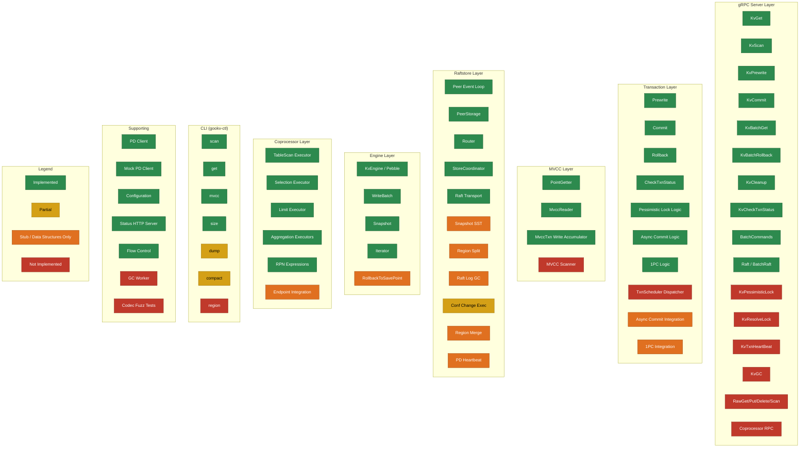

# Unimplemented, Stubbed, and Incomplete Features in gookv

## 1. Overview

This document provides a comprehensive inventory of features defined in the gookv codebase that are not yet fully implemented. Each item is verified against the Go source code and cross-referenced with `tasks/no-implement.md`.

## 2. Methodology

- Searched all `.go` files for `TODO`, `FIXME`, `not implemented`, `panic("not implemented")`, and `placeholder` patterns
- Searched for empty function bodies and no-op implementations
- Cross-referenced with `tasks/no-implement.md` (6 not-implemented, 3 partially-implemented items)
- Verified PRD claims against actual code
- Checked for defined-but-unused constants, types, and tick handlers
- Examined `tikvpb.UnimplementedTikvServer` embedding to identify unhandled RPCs

## 3. Categories

### 3.1 Raftstore -- Snapshot (SST Export/Ingest)

- **Feature**: Raft snapshot transfer via SST export and ingest
- **Location**: `internal/raftstore/storage.go` (lines 157-166)
- **Status**: Stub
- **What's Missing**: `PeerStorage.Snapshot()` returns a minimal empty snapshot containing only `TruncatedIndex` and `TruncatedTerm` metadata. There is no SST file export, no snapshot data serialization, no snapshot sending/receiving over transport, and no ingest (ApplySnapshot) logic.
- **Evidence**: The `Snapshot()` method body:
  ```go
  // Snapshot returns the most recent snapshot.
  // In the initial implementation, we return an empty snapshot.
  func (s *PeerStorage) Snapshot() (raftpb.Snapshot, error) {
      ...
      return raftpb.Snapshot{
          Metadata: raftpb.SnapshotMetadata{
              Index: s.applyState.TruncatedIndex,
              Term:  s.applyState.TruncatedTerm,
          },
      }, nil
  }
  ```

### 3.2 Raftstore -- Region Split

- **Feature**: Region split on size threshold
- **Location**: `internal/raftstore/msg.go` (lines 48-49, 83, 88-91)
- **Status**: Data structures only
- **What's Missing**: The tick type `PeerTickSplitRegionCheck`, the exec result type `ExecResultTypeSplitRegion`, and the `SplitRegionResult` struct are all defined, but there is no handler for the split check tick in `peer.go`, no region size estimation, no split key calculation, no split execution logic, and no split proposal path. The peer event loop (`handleMessage`) does not handle `PeerTickSplitRegionCheck`.
- **Evidence**: `PeerTickSplitRegionCheck` is defined in `msg.go` but never referenced in `peer.go`. No split-related directory exists under `internal/raftstore/`.

### 3.3 Raftstore -- Log Compaction (Raft Log GC)

- **Feature**: Raft log truncation and garbage collection
- **Location**: `internal/raftstore/msg.go` (lines 46-47, 84)
- **Status**: Data structures only
- **What's Missing**: `PeerTickRaftLogGC` tick type and `ExecResultTypeCompactLog` result type are defined, but there is no handler for the log GC tick, no log size/count threshold check, no CompactLog proposal, and no actual log entry deletion from the engine. The `TruncatedIndex` in `ApplyState` is set at construction but never advanced.
- **Evidence**: `PeerTickRaftLogGC` is defined but never handled in `peer.go:handleMessage()`. No code path calls `DeleteRange` on raft log keys.

### 3.4 Raftstore -- Configuration Changes (Peer Add/Remove)

- **Feature**: Dynamic Raft membership changes (add/remove peers)
- **Location**: `internal/raftstore/peer.go` (lines 289-301)
- **Status**: Partial (parsed but not acted upon)
- **What's Missing**: In `handleReady()`, `ConfChange` and `ConfChangeV2` entries are parsed and applied to `RawNode` (so Raft's internal state updates), but there is no corresponding cluster-level action: no new peer creation on remote stores, no peer destruction, no region metadata update, and no PD notification. The `ExecResultTypeChangePeer` result type is defined but never produced. `StoreMsgTypeCreatePeer` and `StoreMsgTypeDestroyPeer` message types are defined but no store goroutine exists to handle them.
- **Evidence**: `handleReady()` in `peer.go` calls `p.rawNode.ApplyConfChange(cc)` but does not update `region.Peers`, does not create/destroy peers, and produces no `ExecResult`.

### 3.5 Raftstore -- Region Merge

- **Feature**: Region merge to combine small adjacent regions
- **Location**: `internal/raftstore/msg.go` (lines 52-53, 118)
- **Status**: Data structures only
- **What's Missing**: `PeerTickCheckMerge` tick type and `SignificantMsgTypeMergeResult` message type are defined. There is no merge proposal, no merge execution, no PrepareMerge/CommitMerge admin command handling, and no merge-related code beyond the type definitions.
- **Evidence**: `PeerTickCheckMerge` and `SignificantMsgTypeMergeResult` defined in `msg.go` but never referenced elsewhere in the codebase.

### 3.6 Raftstore -- PD Heartbeat Loop

- **Feature**: Periodic region heartbeat reporting to Placement Driver
- **Location**: `internal/raftstore/msg.go` (line 51)
- **Status**: Data structures only
- **What's Missing**: `PeerTickPdHeartbeat` tick type is defined but never handled. No periodic timer fires this tick. No code in the peer or coordinator calls `pdclient.ReportRegionHeartbeat()`. The PD client interface and gRPC client implementation exist (`pkg/pdclient/client.go`) but are not wired into the server startup path (`cmd/gookv-server/main.go` does not create a PD client).
- **Evidence**: `PeerTickPdHeartbeat` is only defined in `msg.go` line 51. The `main.go` for gookv-server accepts `--pd-endpoints` but never creates a `pdclient.Client` or starts a heartbeat loop.

### 3.7 Transaction -- TxnScheduler / Command Dispatcher

- **Feature**: TxnScheduler that dispatches transaction commands with concurrency control
- **Location**: `internal/storage/txn/actions.go` (package comment, line 2)
- **Status**: Not implemented
- **What's Missing**: The package comment references "TxnScheduler" but no `TxnScheduler` type, dispatcher, or command queue exists. Individual action functions (`Prewrite`, `Commit`, `Rollback`, `CheckTxnStatus`) are called directly from the server layer via `Storage` methods, using latch-based concurrency. The `config.go` defines `SchedulerConcurrency` (line 132) but it is not used.
- **Evidence**: No type or function named `TxnScheduler` or `Scheduler` exists in any `.go` file. The `SchedulerConcurrency` config field is defined but never consumed.

### 3.8 Transaction -- MVCC Scanner (Range Scanner)

- **Feature**: Dedicated MVCC range scanner (`Scanner` struct) for efficient range queries
- **Location**: `internal/storage/mvcc/key.go` (package comment, line 2)
- **Status**: Not implemented
- **What's Missing**: The `mvcc` package comment mentions "Scanner" as part of the package, but no `Scanner` struct or range-scanning type exists. Range scans are currently performed in `internal/server/storage.go:Scan()` using a manual iterator loop over `CF_WRITE` with `PointGetter` per key, which is functionally correct but not the dedicated `Scanner` abstraction that TiKV uses.
- **Evidence**: `key.go` line 2 mentions "Scanner" but no file in `internal/storage/mvcc/` defines a `Scanner` type. The `Scan()` method in `server/storage.go` uses ad-hoc iteration.

### 3.9 Transaction -- Pessimistic Lock / ResolveLock gRPC Endpoints

- **Feature**: gRPC endpoints for pessimistic locking and lock resolution
- **Location**: `internal/server/server.go`
- **Status**: Logic implemented but not exposed
- **What's Missing**: The transaction layer implements `AcquirePessimisticLock`, `PrewritePessimistic`, and `PessimisticRollback` in `internal/storage/txn/pessimistic.go`, but no gRPC endpoint methods (`KvPessimisticLock`, `KvResolveLock`, `KvTxnHeartBeat`) are implemented on `tikvService`. These RPCs fall through to the `UnimplementedTikvServer` embedded struct, returning "not implemented" errors.
- **Evidence**: No `func (svc *tikvService) KvPessimisticLock(...)` or `func (svc *tikvService) KvResolveLock(...)` exists in `server.go`. These RPC names are not found in any `.go` file.

### 3.10 Transaction -- Async Commit / 1PC gRPC Integration

- **Feature**: Async commit and 1PC paths exposed via gRPC
- **Location**: `internal/storage/txn/async_commit.go`
- **Status**: Logic implemented but not integrated
- **What's Missing**: `PrewriteAsyncCommit`, `CheckAsyncCommitStatus`, `PrewriteAndCommit1PC`, and `Is1PCEligible` are fully implemented in the `txn` package. However, the `KvPrewrite` gRPC handler in `server.go` does not check for async commit or 1PC eligibility and always uses the standard prewrite path. There is no `use_async_commit` or `try_one_pc` field handling in the request processing.
- **Evidence**: `server.go:KvPrewrite()` calls `txn.Prewrite()` directly without any conditional path for async commit or 1PC.

### 3.11 Engine -- WriteBatch.RollbackToSavePoint

- **Feature**: Write batch rollback to a save point
- **Location**: `internal/engine/rocks/engine.go` (lines 363-375)
- **Status**: Non-functional stub
- **What's Missing**: `RollbackToSavePoint()` pops the save point stack but does not actually roll back any operations. The comment explicitly states "Pebble batches don't support save points natively" and "we can't truly roll back." Operations added after `SetSavePoint()` persist in the batch.
- **Evidence**:
  ```go
  func (wb *writeBatch) RollbackToSavePoint() error {
      ...
      // Pebble batches don't support save points natively.
      // For now, we just pop the save point and return an error if operations
      // were added since the save point, as we can't truly roll back.
      wb.savePoints = wb.savePoints[:len(wb.savePoints)-1]
      return nil
  }
  ```

### 3.12 CLI -- `region` Command

- **Feature**: Region metadata inspection command
- **Location**: `cmd/gookv-ctl/main.go` (line 29, lines 48-67)
- **Status**: Not implemented
- **What's Missing**: The `region` command is listed in the usage string but there is no `cmdRegion()` function. The `main()` switch and `RunCommand()` switch do not have a case for "region". Attempting to use the command results in "Unknown command: region".
- **Evidence**: The usage string includes `region      Inspect region metadata` but neither `main()` nor `RunCommand()` handle this command. No `cmdRegion` function exists.

### 3.13 CLI -- `dump` (SST File Parsing)

- **Feature**: Dump SST file contents with structured parsing
- **Location**: `cmd/gookv-ctl/main.go` (lines 251-276)
- **Status**: Partial
- **What's Missing**: `cmdDump()` only iterates raw key-value pairs from a column family using a standard engine iterator, printing hex-encoded keys and values. It does not parse SST files directly, does not support SST-specific metadata, and does not decode MVCC key structure or write records.
- **Evidence**: `cmdDump()` uses `eng.NewIterator(*cf, traits.IterOptions{})` and outputs raw hex -- no SST file path argument, no SST parsing library usage.

### 3.14 CLI -- `compact` (Actual Compaction)

- **Feature**: Trigger manual Pebble/RocksDB compaction
- **Location**: `cmd/gookv-ctl/main.go` (lines 305-325)
- **Status**: Partial (misleading)
- **What's Missing**: `cmdCompact()` calls `eng.SyncWAL()` which maps to Pebble's `Flush()`. This only flushes the WAL/memtable, not a full compaction. No call to Pebble's `Compact()` or similar range compaction API. The success message "Compaction triggered successfully" is misleading.
- **Evidence**:
  ```go
  // Force a WAL sync as a compact-like operation.
  if err := eng.SyncWAL(); err != nil { ... }
  fmt.Println("Compaction triggered successfully.")
  ```

### 3.15 Coprocessor -- Distributed Push-Down Integration

- **Feature**: Distributed coprocessor query push-down
- **Location**: `internal/coprocessor/coprocessor.go`
- **Status**: Partial (local execution framework only)
- **What's Missing**: The coprocessor package has a fully working local executor pipeline (TableScan, Selection, Limit, SimpleAggr, HashAggr, RPN expressions, ExecutorsRunner). However, it is not exposed via any gRPC endpoint. No `Coprocessor` RPC method exists on `tikvService`. The `Endpoint` struct is defined but has no public methods to handle protobuf-encoded DAG requests. There is no integration with the Raft layer for distributed execution.
- **Evidence**: No `func (svc *tikvService) Coprocessor(...)` method exists. The `Endpoint` type in `coprocessor.go` (lines 945-951) has no methods beyond the constructor.

### 3.16 GC Worker

- **Feature**: Garbage collection worker for old MVCC versions
- **Location**: N/A (expected at `internal/storage/gc/`)
- **Status**: Not implemented
- **What's Missing**: The `internal/storage/gc/` directory does not exist. There is no GC worker, no safe-point tracking, no old version cleanup, and no `KvGC` gRPC endpoint.
- **Evidence**: `Glob("internal/storage/gc/**/*.go")` returns no files. No `KvGC` function exists in the server.

### 3.17 Raw KV API

- **Feature**: Raw (non-transactional) key-value operations
- **Location**: `internal/server/server.go`
- **Status**: Not implemented
- **What's Missing**: The kvproto defines `RawGet`, `RawPut`, `RawDelete`, `RawScan`, and `RawBatchGet` RPCs, but none of these are implemented on `tikvService`. They fall through to `UnimplementedTikvServer`. No raw KV path exists in `Storage` either.
- **Evidence**: No function matching `RawGet|RawPut|RawDelete|RawScan` exists in any `.go` file in the project.

### 3.18 Engine Traits -- Test Coverage

- **Feature**: Ported TiKV engine_traits tests
- **Location**: `internal/engine/traits/traits_test.go`
- **Status**: Partial
- **What's Missing**: Only 3 trivial tests exist (compile check, error messages, default values per `tasks/no-implement.md`). Substantive TiKV engine_traits tests (WriteBatch atomicity, Snapshot isolation, Iterator boundary conditions) have not been ported.
- **Evidence**: Referenced in `tasks/no-implement.md` as "Only 3 trivial tests exist."

### 3.19 Fuzz Tests for Codec

- **Feature**: Fuzz tests for codec round-trip correctness
- **Location**: `pkg/codec/`
- **Status**: Not implemented
- **What's Missing**: No fuzz tests using Go's `testing.F` framework. A `TestEncodeDecodeRoundTrip()` exists with randomized inputs but is not a proper fuzz test.
- **Evidence**: Referenced in `tasks/no-implement.md` for IMPL-002.

## 4. Summary Table

| # | Feature | Location | Status | What's Missing |
|---|---------|----------|--------|----------------|
| 3.1 | Raft Snapshot (SST) | `internal/raftstore/storage.go` | Stub | SST export, data serialization, ingest, transport |
| 3.2 | Region Split | `internal/raftstore/msg.go` | Data structures only | Size check, split key calc, split execution, handler |
| 3.3 | Raft Log GC | `internal/raftstore/msg.go` | Data structures only | Threshold check, truncation proposal, entry deletion |
| 3.4 | Conf Changes (Peer Add/Remove) | `internal/raftstore/peer.go` | Partial | Peer creation/destruction, region metadata update |
| 3.5 | Region Merge | `internal/raftstore/msg.go` | Data structures only | Entire merge flow |
| 3.6 | PD Heartbeat Loop | `internal/raftstore/msg.go` | Data structures only | Tick handler, heartbeat sending, PD client wiring |
| 3.7 | TxnScheduler | `internal/storage/txn/` | Not implemented | Dispatcher type, command queue, scheduling logic |
| 3.8 | MVCC Scanner | `internal/storage/mvcc/` | Not implemented | Scanner struct, efficient range iteration |
| 3.9 | Pessimistic Lock / ResolveLock RPCs | `internal/server/server.go` | Logic exists, not exposed | gRPC endpoint methods |
| 3.10 | Async Commit / 1PC RPCs | `internal/server/server.go` | Logic exists, not integrated | Prewrite path selection |
| 3.11 | WriteBatch.RollbackToSavePoint | `internal/engine/rocks/engine.go` | Non-functional stub | Actual rollback (Pebble limitation) |
| 3.12 | CLI `region` command | `cmd/gookv-ctl/main.go` | Not implemented | Entire command |
| 3.13 | CLI `dump` (SST parsing) | `cmd/gookv-ctl/main.go` | Partial | SST file parsing, MVCC key decoding |
| 3.14 | CLI `compact` | `cmd/gookv-ctl/main.go` | Partial (misleading) | Actual Pebble compaction call |
| 3.15 | Coprocessor RPC | `internal/coprocessor/coprocessor.go` | Local framework only | gRPC endpoint, proto decoding, Raft integration |
| 3.16 | GC Worker | N/A | Not implemented | Entire subsystem |
| 3.17 | Raw KV API | `internal/server/server.go` | Not implemented | All Raw* RPC endpoints |
| 3.18 | Engine Traits Tests | `internal/engine/traits/traits_test.go` | Partial | Substantive test cases from TiKV |
| 3.19 | Codec Fuzz Tests | `pkg/codec/` | Not implemented | Go fuzz tests |

## 5. Status Overview Diagram


